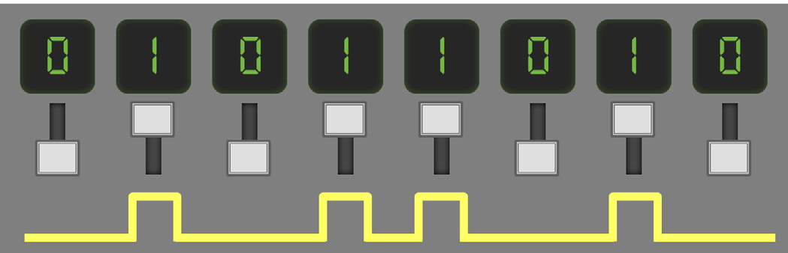
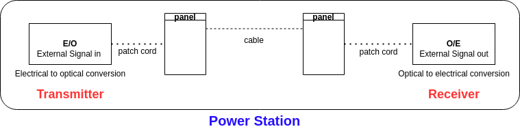
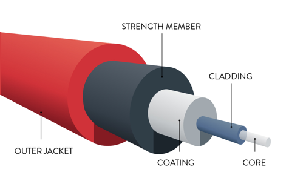
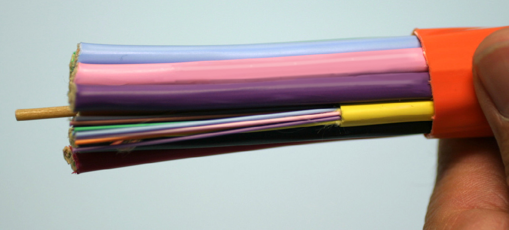
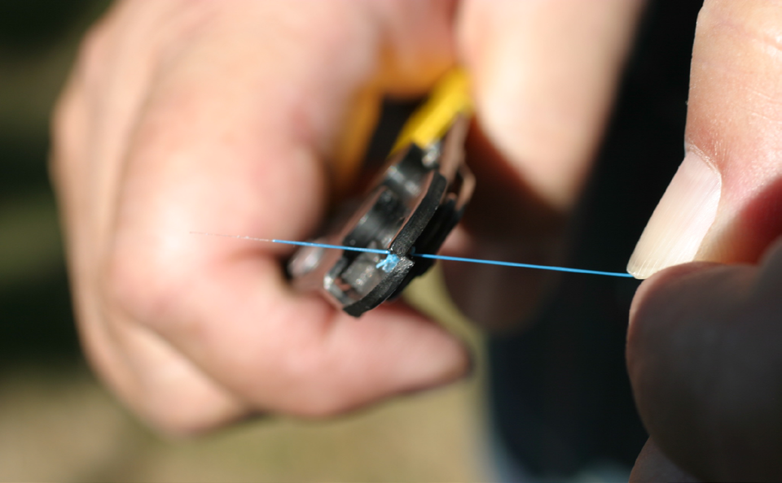
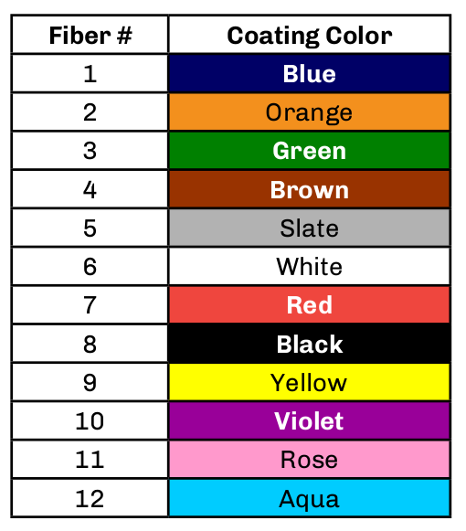
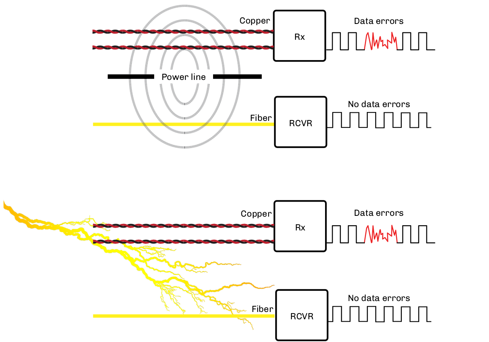
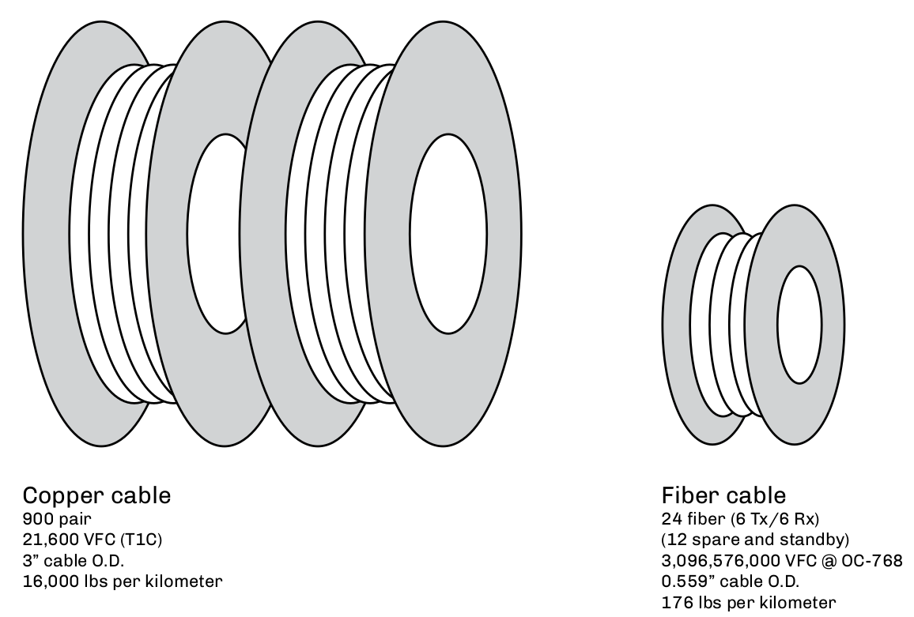
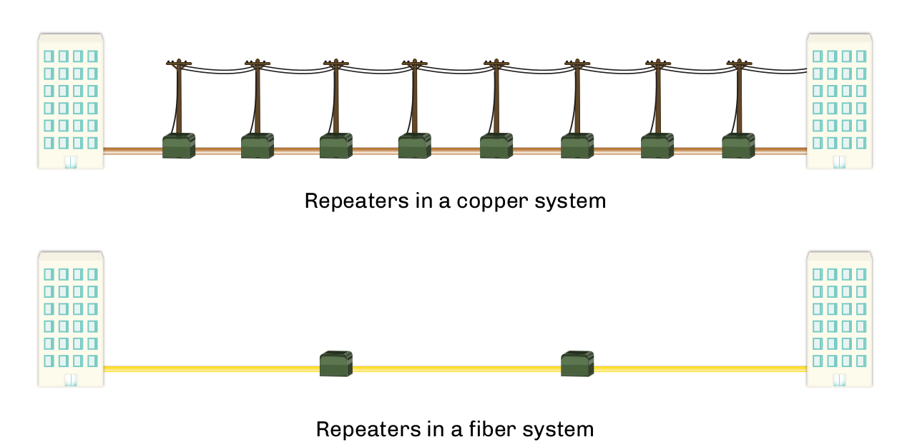

:doctype: book
:title-page-background-image: image:CongruexLogo.png[]

= Chapter 1 - *_Communications Basics_*

== Digital Communications

=== The Basic Binary System

Binary information can be transmitted serially — one after another—  by turning a single light on and off over time to form _words_. Fiber optic systems turn a transmitter on — _high_—  and off — _low_—  to send pulses of light down the fiber. Digital information is represented as a series of ones and zeros. Electronic devices use tiny switches to represent the ones and zeros.

.Binary System.

=== Using Light as a Communication Method

.Light as Communication.

* An electronic signal is converted through an optical light source to light pulses. 
* The light pulses propagate down the fiber through the core. 
* A receiver converts the light pulses back to an electronic signal.

[.lead]
An optical fiber transmission system consists of three parts:

. Transmitter.
.. Most often uses a laser diode as a light source.
. Physical Plant.
.. The physical infrastructure that makes up an entire fiber optic network
... `Fiber` —  Can be multimode or single-mode.
... `Cable` —  Protects the fibers. Designed for specific applications.
... `Connectors` —  Allow for temporary connections at equipment and panels.
... `Splices` —  Permanent joining of two fibers.
... `Panels` —  Allow for patching and splicing of fibers.
... `Cabinets` —  House panels and splices.
. Receiver.
.. Receivers have a dynamic range of power they can accept. Dynamic range is the difference between the minimum and maximum input power, while the minimum input power is considered the receiver's sensitivity.

== What is an Optical Fiber?

Most fibers used in fiber optic communications systems have a silica glass core surrounded by a silica glass cladding. This is covered by an acrylate plastic coating, which protects the glass during handling and cabling processes, and a thin outer coating to provide color identification. The characteristics of the fibers vary depending upon the materials used and the process of manufacturing.

.Fiber Composition.

The Core::

The core is where light is transmitted. It is glass or plastic inside the cladding with a higher index of refraction. Light travels in the in 9 µm, 50 µm, 62.5 µm sizes.

The Cladding::

The cladding surrounds the core. It contains and reflects light, isglass or plastic, of a lower index of refraction. Light reflects off the core within the cladding. The outside diameter is 125 µm.

The Coating::

The Coating protects and identifies the fiber. It is a 200 or 250-µmcoating for protection, able to be stripped —  which means it can beremoved —  with the outer surface of coating most often colored foridentification.

== Fiber Coatings

Most optical fiber receives an acrylate coating to a diameter of 250 microns, but different types and diameters of coating can be applied depending on the application of the fiber. 

.Wires.

The coating aids in fiber handling and provides protection against bending, damage to the glass surface, environmental effects, and mechanical stress. Stripping the coating off removes this protective layer. Coatings are applied as part of the fiber manufacturing process and are usually UV cured. Colors and additional buffer materials may be applied during the cabling process.

.Wire Stripping.

=== Optical Fiber Color Coding

In every optical cable, it is necessary to quickly and accurately
identify individual fibers. The https://en.wikipedia.org/wiki/TIA-598-C[TIA-598] standard specifies a twelve (12) color code to be used on fiber coatings as well as buffer tubes, or sub-units containing individual fibers.

Fibers 13-24 are the same color as fibers 1-12, with the exclusion of the black fiber. In https://en.wikipedia.org/wiki/TIA-598-C[TIA-598], fiber 20 is black with a white tracer.

With loose tube cables, fiber groups are separated with color-coded buffer tubes or threads that repeat the same color order. The first buffer tube or thread would be colored blue and would contain all twelve colors from fibers 1-12. The second buffer tube containing fibers 13-24 would be orange. Each fiber in the sequence would be either individually color-coded, or have one colored fiber and the rest would be identified by their position in relationship to the reference fiber.

The color coding sequence varies from region to region. Please consult your local standards and recommendations for the proper sequence in your area.

.Colors for Cables.

== Basic Units of Measure in Fiber Optics

As a universal technology, fiber optics uses the metric system as the standard form of measurement.

* Several of the more common terms are:

.. `Meter (m)` 39.37 inches, or just slightly larger than a yard (36inches).
.. `Kilometer (km)` 1,000 meters (3,281 feet), or approximately 0.62miles.
.. `Micrometer (µm)` One millionth of a meter. There are 25 microns toone thousandth of an inch (0.001). In fiber optics, it is referred to as_micron_ and is used in the dimensional measurement of fibers.
.. `Nanometer (nm)` One billionth of a meter. Used to express the wavelength (λ) of transmitted light.

=== Metric Conversion

.Metric Conversion.
[cols="3.3.3"]
[frame="top"]
|===
|Kilometers x 0.62 = Miles + 
Miles x 1.61 = Kilometers | Meters x 3.281 = Feet +
Feet x 0.3048 = Meters | Centimeters x 0.03281 = Feet +
Feet x 30.48 = Centimeters

|Meters x 39.37 = Inches +
Inches x 0.0254 = Meters | Centimeters x 0.3937 = Inches +
Inches x 2.54 = Centimeters | Millimeters x 0.03937 = Inches +
Inches x 25.4 = Millimeters
|===

=== International System of Units (SI) Common Prefixes

.(SI) unites.
|===
|Quantity |Power |Prefixes |Symbols
|1,000,000,000,000,000 |1015 |Peta |P
|1,000,000,000,000 |1012 |Tera |T
|1,000,000,000 |109 |Giga |G
|1,000,000 |106 |Mega |M
|1,000 |103 |Kilo |k
|100 |102 |Hecto |H
|10 |101 |Deca |dk
|0.1 |10-1 |deci |d
|0.01 |10-2 |centi |c
|0.001 |10-3 |milli |m
|0.000001 |10-6 |micro |µ
|0.000000001 |10-9 |nano |n
|0.000000000001 |10-12 |pico |p
|0.000000000000001 |10-15 |femto |f
|===

== Advantages of Fiber Optics

. *EMI immunity* +
Unlike systems using metallic conductors, which require shielding from electromagnetic radiation, Optical fibers are dielectric and, as such, unaffected by electromagnetic interference (EMI) or radio frequency interference (RFI).

. *Low Loss - Attenuation* +
Single-mode fibers have losses as low as 0.17 dB/km at 1550 nm. Multimode losses are as low as 0.6 dB/ km at 1300 nm. This allows for longer distances without costly repeaters.

. *High Bandwidth* +
Optical fiber has a theoretical bandwidth of more than 500 Tb/s (1012). It is operated at much lower speeds. However, transmission at multiple Terabits per second is not uncommon and fiber has been tested in the lab to support more 70 Tb/s. This is far faster than any metallic-based transmission method.

.Data loss in copper vs fiber.

[start=4]
. *Small Size* +
A half-inch 1/2” (24) fiber-optic cable operating at 40 Gb/s can handle 143,360 times the amount of voice channels as a 3” diameter (900) twisted pair cable. Smaller size provides better duct utilization.

. *Lightweight* +
The same half-inch 1/2” fiber-optic cable weighs approximately one-hundred and seventy-six (176) pounds per kilometer. The three-inch 3” twisted pair cable weighs in at sixteen thousand (16,000) pounds. This allows for longer pulls during installation.

.Copper vs Fiber.

[width="100%",cols="33%,67%",options="header",]
[grid="cols", frame="none"]
|===
|Copper |Fiber
|900 pair |24 fiber (6 Tx/6 Rx)
|21,600 VFC (T1C) |(12 spare and standby) 3,096,576,000 VFC @ OC-768
|3” cable O.D. |0.559” cable O.D.
|16,000 lbs per kilometer |176 lbs per kilometer
|===

[start=6]
. *Transmission Security* +
Because fiber is dielectric, it does not radiate electromagnetic pulses, radiation, or other energy that can be detected. This makes the optical cable difficult to locate. In addition, methods to tap into fiber create a substantial system signal loss.

. *Non-sparking for Hazardous Environments* +
Fiber is glass and provides a safe transmission medium. It does notcarry electrical current, and is non- sparking for applications in
dangerous or explosive environments.

. *Wide Temperature Range* +
Standard fibers and cables are manufactured to meet temperatures from minus (-) 40°F to plus (+) 160°F, or, in Celsius, -40°C to +70°C.

== Additional Benefit of Fiber Optics

. *Fewer Repeaters* +
Compared to metallic systems, fewer repeaters are required.

.Repeaters.

[start=2]
. *Stable Performance* +
Fiber optics is affected less by moisture and thermal conditions than copper. This means less corrosion and degradation. resulting in less maintenance is required for the physical plant.

. *Costs* +
Costs are decreasing due to increased competition, larger manufacturing volumes, higher yields with better quality, and standardization of common products.

. *Upgradeable* +
Very few installed fibers are operating anywhere near their maximum capacity. Existing cable can be opened up with techniques like wavelength division, multiplexing, and increased bit rates, providing an upgrade blueprint with existing infrastructure.

. *Material Availability* +
Glass optical fibers are manufactured from silica, the material that comprises sand. Unlike copper, silicais in abundance throughout the world and is readily available.

