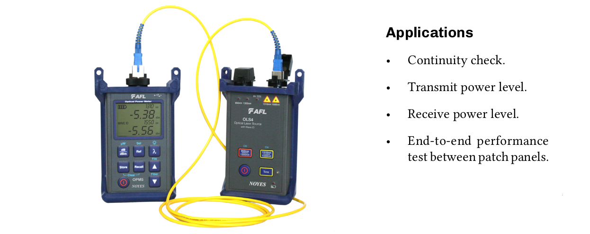
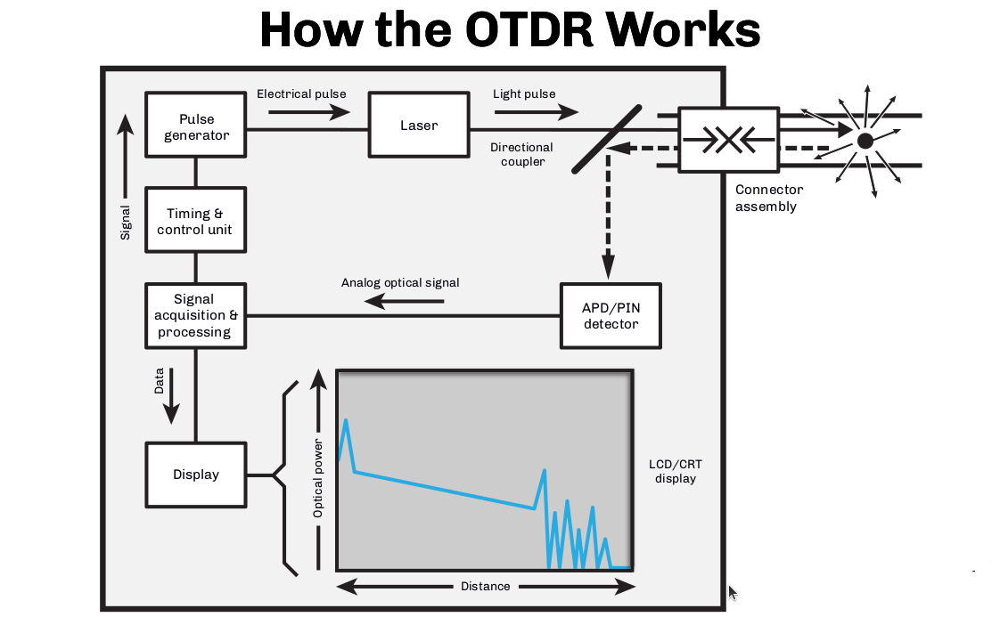
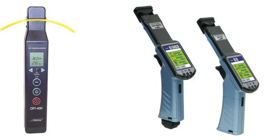
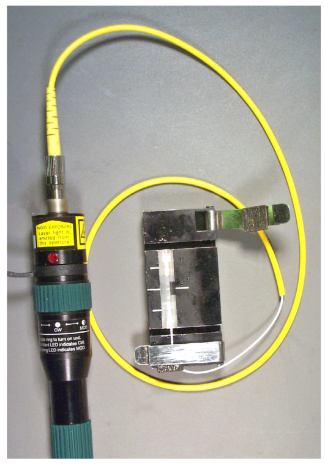
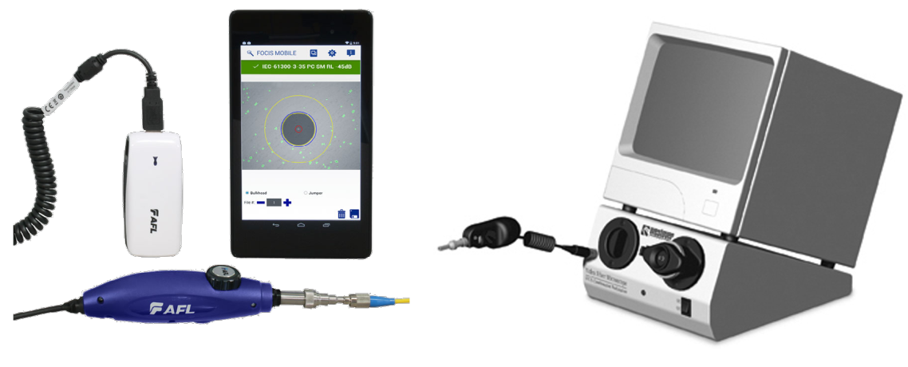
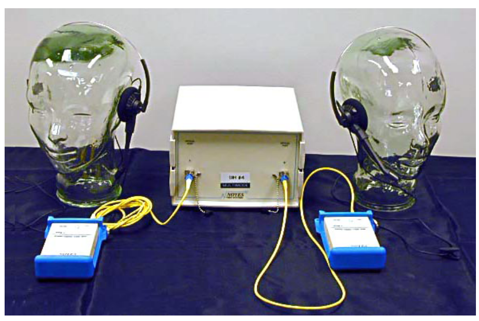
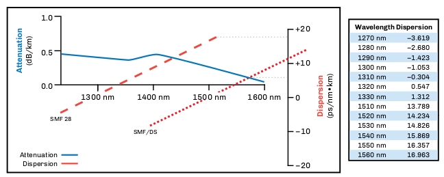
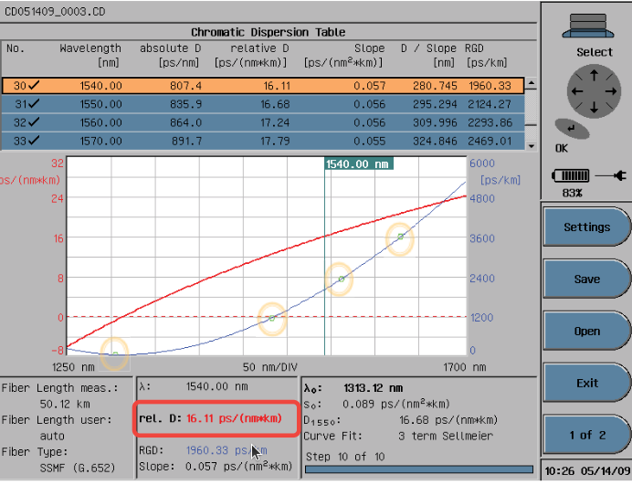
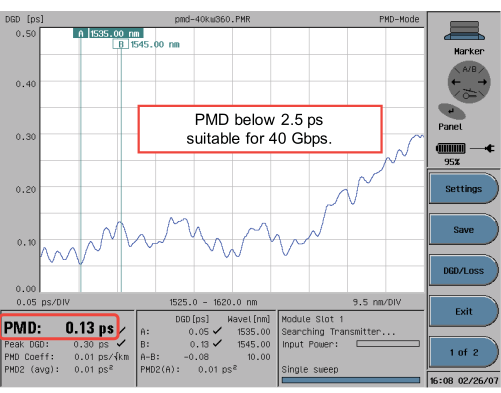

:doctype: book
:title-page-background-image: image:CongruexLogo.png[]

= Chapter 10 - *_Test Equipment_*

== Tests and Equipment

=== Physical Plant
|===
|*Test* | *Equipment*
|Cable acceptance test from manufacturer| OTDR (length and dB/km)
|Cable span continuity test after installation (prior to splicing)
|OTDR
|Splice attenuation| OTDR|
Fault location| OTDR/fiber break locator|
Cable span signatures| OTDR|
Optical return loss (span) | OTDR, terminator and deadzone box or ORL reflectometer|
Reflection testing (component)| OTDR deadzone box and terminator|
Receivable power of optical cable| Power meter|
Transmitter output power| Power meter|
Communications|Fiber optic talk set|
Faulty pigtail/splice| Visible laser|
Identifying live fibers|Fiber identifier|
|===

=== Network, Fiber and Components

|===
|*Test* | *Equipment*
|Polarization mode dispersion (PMD)|PMD test set|
Chromatic dispersion| CD test set|
System test (optical power margin)|Variable attenuator and bit error rate tester|
Ethernet/IP testing| Network analyzer|
Laser/LED/detector/WDM analysis
wavelength measurements
a|  
* Optical spectrum analyzer and multiwavelength meter
* Optical component analyzer
a|
Source/detector testing|O/E and E/O converter and optical spectrum analyzer|
|===

== Optical Loss Test Sets

Optical loss testing is required to provide accurate end-to-end loss measurements of a fiber optic span. The test equipment involved consists of an optical light source (OLS) and an optical power meter (OPM), which can function either as separate units that measure attenuation in one direction, or as one integrated unit called an optical loss test set (OLTS). While OLTS require two units, they provide bidirectional testing.

If the testing units are individual OLS and OPM devices, there must be a technician at one end of the span with the OLS and another at the opposite end with the OPM. These are linked via jumpers at patch panels, interconnecting the span to be tested. After all tests are performed, the two technicians must swap locations to measure the attenuation in the opposite direction. The longer the span the more complex this becomes, especially for service providers in wide and metropolitan area networks. In such cases, it is recommended to use an OLTS since it can operate bidirectionally and at the dual wavelengths required. This is normally 850 nm and 1300 nm for multimode applications, and 1310 and 1550 nm for single-mode applications.

.Optical Loss Testing Devices.

=== OLTS specifications.

[grid='none',frame='none']
|===
|*Power Meter* +
Features and options to consider:| *Light Source* + 
Select one with the following features:
a|
* Warranty and calibration interval
a|
* Warranty and calibration interval
a|
* Power measurements (dBm).
a|
* *Stabilized*, for accurate measurements.
a|
* Referencing (zeroing) capability.
a|
* Laser or LED wavelengths.
.. Multimode: 850 nm and 1300 nm.
.. Single-mode: 1310 nm and 1550 nm.
a|
* Resolution specification (min. 0.01 dB).
a|
* Connector type.
a|
* Selectable wavelengths.
a|
* Output power.
a|
* Standard batteries.
a|
* Standard batteries.
a|
* Size and weight.
a|
* Size and weight.
a|
* Operating temperature range.
a|
* Tone generation for use with fiber identifiers.
a|
* Dynamic range.
|===

== Optical Loss Test Equipment

. One light source (OLS) and one optical power meter (OPM).
.. Must use external communication systems (fiber talk set, radios,phones at end locations).
.. Tests in only one direction. This requires the two technicians to reverse and retest in the opposite direction.
.. Technician with power meter documents test results.

. Two sets of light sources and power meters.
.. Requires external communication systems.
.. Tests in both directions using different fibers. After testing all the fibers, the technicians must roll the sets to allow testing in the opposite direction.
.. Both technicians document test results.

. Optical loss test sets (consisting of units with built-in light sources and power meters).
.. May require external communication systems.
.. Optional talk set option.
.. Both technicians document test results from built-in power meters.

. Optical loss test sets with certification.
.. Optional built-in talk set.
.. Units handshake to calibrate for testing.
.. Units perform optical loss test and reflection tests.
.. Bidirectional test performed.
.. Dual-wavelength tests performed.
.. Results compared against standard for pass/fail indication.
.. 2-kHz detection option on single-mode units.
.. Automated menu testing options.
.. FTTx test sets must operate at 1310, 1490, 1550 nm and
.. incorporate in-line handshaking between the OLT and ONT.

== The OTDR

The optical time-domain reflectometer (OTDR) is a one-person bidirectional instrument that operates on the optical principle of Rayleigh backscatter and Fresnel reflections. It is used to measure the length and attenuation of optical fiber spans and to determine the distance to events and faults.

=== OTDR Applications

* Measuring fiber length.
* Measuring distance to faults, splices, connectors, and stresses placed on the fiber.
* Measuring reflectance of components.
* Measuring optical return loss of spans.
* Measuring loss as dB and dB/km.
* Measuring splice loss.
* Cable monitoring.
* Documentation.

.A block diagram of an ODTR.

An OTDR both transmits and receives optical energy, which is required in order for it to be able to measure the amount of backscattered light from the optical fiber. The timing and control unit sends a signal to the pulse generator, which in turn sends an electrical pulse to the laser, causing it to emit a pulse of light. This light pulse is directed through an optical coupler and sent to the optical fiber under test. Light pulses from optical fiber connections, impurities, damage, or from the end of the optical fiber itself are reflected through the optical coupler and directed to the detector. The optical signal is then amplified and converted to an electrical analog signal by the signal acquisition and processing unit. An analog-to-digital converter in the signal acquisition and processing unit changes the analog signal to a digital signal. This digital signal is stored in the data acquisition memory. This scanning process is repeated several times. The data is processed and transmitted to the OTDR’s LCD or CRT display.

== The OTDR Family of Products

=== Hand-held OTDR
Hand-held OTDRs are small, lightweight, and user-friendly. Most have touchscreens and simple functions, and can be used as a display for inspection probes. They allow problems to be easily identified with trace overlays. USB storage makes recording traces easy and the unit can be powered with both AC and DC.

* Small.
* Lightweight.
* User-friendly.
* USB storage.
* AC/DC power.

=== Fiber Break Locator

The least expensive and easiest to use, most fault locators have simplified the specialized features of the OTDR. A simple, lightweight, easy-to-use instrument for fault locating with an LCD display, disk storage and AC or DC operation, it is a nice fit for those who only need to locate network faults. 

=== Modular OTDR

In modular instruments, the OTDR function is just one of the many optional function modules available. Other modules include optical spectrum analyzer (OSA), chromatic dispersion (CD), polarization mode dispersion (PMD), optical switch, and an optical microscope for ferrule/fiber inspection. Many include a digital microscope with both male and female capabilities. The instruments can also store the pictures for
documentation purposes.

A modular OTDR is less prone to obsolescence and is easier to add features for future applications. As new tests and methods emerge, new modules become available to allow it to keep pace with changing technology.

* Optional function modules
.. OTDR
.. Optical spectrum analyzer
.. PMD and CD
* Optical switch

.Hand-held OTDR (left), Fiber break locator (middle) & Modular OTDR (right).
image::media/ODTRproducts.png[500,500,align='center']

== Key Considerations for All OTDRs

. What is the true dynamic range? This will be called out as backscatter (in dB) at a specified wavelength. The specifications for Fresnel reflection applies to spikes in the signature, which won’t help you if the cable is cut and the trace is below the noise floor of the instrument.
. What is the true deadzone? How close to the instrument (or between events) can I actually measure a nonreflective fault? This would be measured when operating the OTDR at its shortest pulse width. 
. What are the printing and storage options? Many instruments offer USB ports for flash drives, internal hard drive, Bluetooth, and cloud storage. Remember: 
.. Storage requires software that is compatible with your application. Not all OTDR manufacturers have software that meets Telcordia GR-196-CORE standards.
. Does the instrument default during start-up or can you program the instrument?
. Does the instrument have an easy recall feature? Overlay? Update?
. Can you switch functions quickly without having to go deep within the menu functions? For example, operating in real time for acceptance testing and then switch to averaging for dB/km and length measurements?
. Does the OTDR have the capability to test both optical return loss (ORL) and reflectance?
. Consider factory support, warranty and training options.

Buy the best instrument for your applications. Basic features are what you need. Forget all the enhanced features if they are not needed. Concentrate on evaluating the equipment for the functions you will use:

* Acceptance testing
* Span acceptance, splice loss
* Restoration
* Short distance, high resolution
* Long distance, high resolution (e.g., FTTx)
* Long range

== Fiber Identifiers

Optical fiber identifiers (OFIs) are used extensively when mid-entries or access to single-mode optical fibers is required. They detect live traffic signals or a modulated test signal on an individual optical fiber. An OFI does this with minimal attenuation by putting a controlled macrobend on the optical fiber that allows the escape and detection of light energy. The user can expect approximately a 0.2 dB loss at 1310 nm and a 2.0 dB loss at 1550 nm when using an OFI. The OFI can also detect from which direction the traffic is being received due to two detectors placed to detect the transmission of light and determine its direction of travel.

OFIs are designed for different fiber coatings such as 250-µm and 900-µm coatings, jacket sizes up to 3 mm (used in jumpers and pigtails), and have optional adapters for ribbon fibers.

. Applications.
.. Determines active or inactive fibers.
.. Allows troubleshooting of multiple fiber strands without disrupting the network.
.. Verification of color code charts.
.. Identifies direction of transmission path.
. Features.
.. Optional remote probe.
.. Optional clamp assembly.
.. Visible activity indicator.
.. 2-kHz modulation used for identification.
. Specifications.
.. Spectral range or detectable optical wavelengths is usually 800-1600 nm.
.. With CW operation, range is typically 0-35 dBm and 0-45 dBm using the 2-kHz modulation.
.. Detection range of +20 to –20 dBm.

[NOTE]
The accuracy of fiber identifiers with G.657 bend-insensitive fiber depends on the dynamic range of the detector, the distance, and G.657 fiber type and classification.

.Fiber Identifier.

== Visual Tracers

A low-cost, simple-to-use continuity tester, visual tracers give users of optical-fiber systems the capability to trace fiber routes for end-to-end continuity and, with the more powerful laser versions, to locate fiber faults in 3-mm cordage and 250-µm and 900-µm coated fibers.
White light sources can be used for end-to-end continuity testing up to 2 km, but don’t provide enough power to locate breaks and stresses. In these cases, a visible red laser is used.

* For spans up to 2 km (Class II) and up to 4 km (Class IIIA).
* Locates:
.. Breaks within an OTDR’s deadzone.
.. Bad splices.
.. Microbends and macrobends.
.. Potential fiber problems (imperfections).
* Can be used as a fiber identifier.
* Quick troubleshooting of connectors and short drop cables.
* Can operate on multimode or single-mode fibers.
* Operates independent of the transmission wavelength.
* Terminates with a jumper or pigtail.
* Class II (<1 mW) or Class IIIA (<5 mW) visible red laser operating at 630 to 670 nm.

Fault locators are very good instruments for locating faults and other anomalies where the pulse width of the laser used in OTDRs will not allow measurements to be made. However, some OTDRs use visual laser options.

Even though manufacturers have built-in key lock systems, beam guards, and other methods of preventing retina damage, the possibility exists of accidentally looking into the end of jumper and pigtails. It is best to wear semi-filtered helium neon goggles. The user needs to see the beam but the goggles will give protection from exposure.

== Visual Inspection

Although every fiber connector should be cleaned prior to use or testing, in the past, connector inspection was primarily performed to prevent surface debris from damaging the optical surfaces and to identify connector surface conditions during polishing processes.

The most critical part of the fiber is the core and the area that immediately surrounds it. Damage in the outer part of the cladding will normally not affect the transmission signal. Always clean a connector prior to inspection in order to differentiate contaminants versus damage.

It has been found that greater detail is required in dentifying contaminants with examples that are more realistic to today’s fiber optic manufacturers and users.The IEC 61300-3-35 document sets requirements for allowable surface defects that may affect optical performance including:

* `Scratches` – Permanent linear surface features derived from polishing or handling. +
* `Pits` – Permanent nonlinear features caused during polishing or handling. +
* `Cracks` – Permanent fracture lines that may extend to the surface of the fiber. +
* `Surface debris` – Nonpermanent features that can be removed by cleaning. +
* `Resolution` – 1 µm (micron).

=== Inspection Scopes

Microscopes are used to visual checking the surface quality of fiber optic connectors. These 200X microscopes generally have filters to protect against laser beams. However, caution should be taken. Live optical fibers should never be viewed and light sources should be turned off. New digital scopes are safer and images can be stored for future reference or comparison.

* Used to check connector and fiber endfaces.
* Connector and bare fiber adapters.
* 200x-400x magnification.
.. 200x recommended. 
* Built-in safety filter is required
* Always clean endfaces prior to inspection.

=== Digital Video Inspection Scopes

Digital video-based inspection scopes display a visual image of the fiber and their digital images can be stored for later comparison as a maintenance tool. Digital video scopes can examine the end faces of the ferrules used in the plugs, as well as to inspect the bulkhead connectors in patch panels or transmitter and receiver ports, and are safer to use than microscopes.

* LCD screen provides retina safe viewing.
* Stores and recalls digital images.
* Connector and bulkhead adapter tips available. 
* Automatic pass/fail analysis.
* Auto focus.
* Can connect to test equipment or have their own screens.

== CCD Array Camera With Monitor

Used in manufacturing plants or where incoming cable assembly inspections are performed, the bench top inspection station consists of an optical microscope and an CCD array camera that project an image of the ferrule/termini’s fibers end-face onto a video monitor. This technique allows for safe visual inspection of the surface quality of devices. Since the viewer sees the picture rather than the direct magnified image, this method works well in manufacturing locations where is it easier to view without looking into a microscope.

* The total (electronic) magnification is the total of the optical and video magnification.
* The optical magnification is defined as the power of the objective lens multiplied by any video lens incorporated between the objective
and CCD camera.
* Video magnification is defined as the ratio of the diagonal of the monitor divided by the camera chip size.

.Example of electronic Digital Visual inspection tools.

== Optical Talk Sets

The optical talk set is used for communications during installation, testing, and restoration programs. It uses the optical fiber as the communications media.

. Applications.

.. Optical loss test situations.
... Used between the light source (send) and the power meter (receive).
... Used for splicing and OTDR operators.

. Features.
.. Portable.
.. AC/DC.
.. Simplex or duplex designs.

. Options.
.. Cell phones.
.. Radios.

. Bidirectional voice over a single fiber
.. Easy to use
.. Restoration use

== Optical Dispersion Testers

Optical dispersion testers measure the dispersion loss in optical fiber. Used to test single-mode fibers, the instrument measures either chromatic dispersion (CD) or polarization mode dispersion (PMD). Characterizing a fiber’s dispersion is critical for verifying that an installed fiber can meet the stringent requirements of high speed and DWDM systems. An increase of a data rate of four times (e.g., 2.5 Gb/s to 10 Gb/s) creates an increase of 16 times the effect of the chromatic dispersion in a system. Both types of dispersion testing are different and require different test sets or modules to accomplish.

. Applications.
.. Measure capacity or bandwidth over fiber span.
.. Measure in the time or frequency domain.
. Features.
.. GPIB for computer control or data collection.
.. 1310/1550 nm single-mode laser.
.. Transmitter/receiver pair for end-to-end measurements.

The accurate measurement of dispersion characteristics is specified by the TIA-455-175-B (formerly FOTPs 168, 169 and 175A) Measurement methods and test procedures – chromatic dispersion.

.Optical Dispersion Tester.

* Fiber characterization testing.
.. Chromatic dispersion (CD).
.. Polarization mode dispersion (PMD).
* Measured to ensure operation at speeds greater than 2.5 Gb/s.

== Chromatic Dispersion

Different colors of light (wavelengths) travel at different speeds over the fiber span. In WDM, DWDM and CWDM systems, each wavelength transmitted has differing effects. Chromatic dispersion (CD) is a
single-mode issue caused by:

* Material dispersion, which occurs because the speed of light varies at different wavelengths due to the optical fiber and the spectral width of the light source.
* Waveguide dispersion, which is caused by differences in the speed of light between the core and cladding in the fiber’s mode field diameter.

=== Key Points

* Line number.
.. Pass or fail.
.. The default is set at 1000 ps/nm.
* Absolute D = total dispersion at given wavelength.
* Relative D = average per kilometer; absolute D divided by fiber length.
* Slope is the value given to DCM manufacturers to match curve fit.
* Wavelength.
.. Fiber length.
.. Fiber type.

|===
.2+^.^|*Bit rate* .2+^.^|*Tolerable time* +
*delay @ 1550 nm* 2+^|*Maximum fiber distance without compensation*
|G.652 SMF|G.655 SMF
|2.5 Gb/s|18.81 ns/nm|940 km|1,880 km
|10 Gb/s|1,175 ps/nm|60 km|120 km
|40 Gb/s|73.5 ps/nm|3.7 km|7.4 km|
|===

.Graphic shows chromatic dispersion table.

== Polarization Mode Dispersion

Polarization mode dispersion (PMD) affects systems with higher bit rates (10 Gb/s and above). Single-mode fibers carry two modes with different polarization. Fibers are not perfect and slight differences in symmetry along the fiber span cause one of the modes to propagate slower than the other, resulting in pulse spreading. They can be affected by vibration, temperature, and bending.

[cols=5,options="header"]
[grid='rows']
|===
|| 3+^|*Maximum Link Length*
|*Bit Rate* | *Maximum PMD*|*.08 ps/km2*|*0.02 ps/km2*|*1 ps/km2*
|2.5 Gb/s
|40 ps0
|250,000 km
|40,000 km
|1,600 km
|10 Gb/s
|10 ps
|15,000 km
|2,500 km
|100 km
|40 Gb/s
|2.5 ps
|1,000 km
|160 km
|6 km
|===

[NOTE]
The last three columns are Maximum Link Length.

* PMD is the average differential group delay (DGD) for the fiber span.
* Peak DGD is the worst case of group delay.
* Below 2.5 ps will work for 40 Gb/s.
* PMD coefficient = figure of merit.
* Second PMD is important if transmitting at speeds 40 Gb/s or greater.
* PMD can be caused by vibrations or thermal stresses.

.PMD.

== Testing Documentation

=== Acceptance Testing

When acceptance testing a cable reel, the cable should be compared to the purchasing and engineering requirements including fiber count, length, attenuation, cable structure, plus the condition of the cable after shipping.

=== Performance

Once the cable has been installed it should be tested to confirm the performance versus that specified. This should occur bidirectionally at two wavelengths to measure attenuation, distance, and any losses from splices, connections, and splitters. In the case of reflective components such as connectors, the ORL level of the span and individual reflectance level of any component should be documented and compared to system requirements.

=== Maintenance Records

Documenting the transmit and receive optical power levels and the outside plant or premises attenuation levels provides a quick reference to how these levels have changed when testing later. Additional tests can include reflection, ORL, dispersion, or bandwidth. As-built drawings and documentation is always beneficial if kept current.
=== Restoration Requirements

This information can be used to assist in restorations by using previously documented and recorded OTDR traces and power levels to identify changes in spans as well as using as-built documents to identify slack locations.

=== Key Elements of an Effective Effective Maintenance Posture
[grid='none',frame='none']
|=== 
a|
*On-site*

* Operational skill.
* Documentation (drawings and procedures).
* Elementary troubleshooting capability.
* Access to expert consultation via phone.
* Emergency restoration kit. a|
 
*On-call*

* Hotline.
* Standing maintenance contract.
* Experienced emergency restoration crews.
* Standby restoration equipment.
* A large inventory of restoration materials.
* Construction contracting.
|===