:doctype: book
:title-page-background-image: image:CongruexLogo.png[]

= Chapter 12 - *_Restoration_*

== Identify – Locate – Resolve

.Locate.
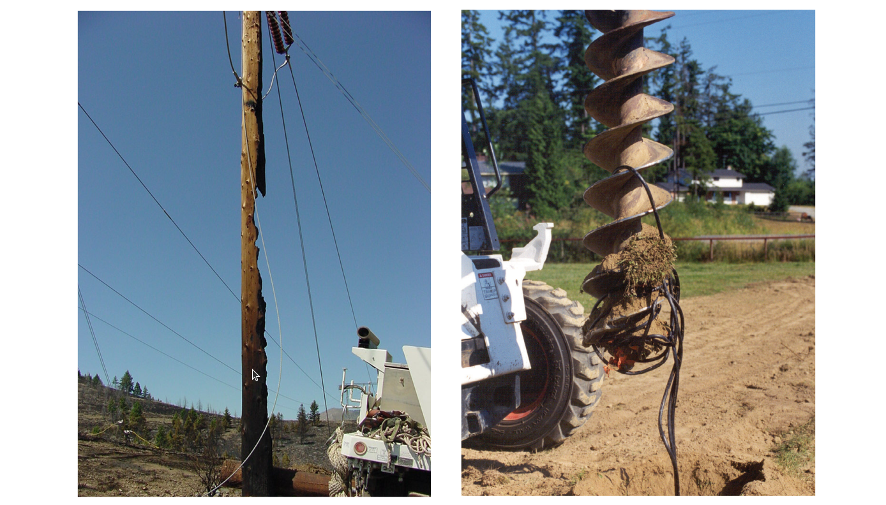

[TIP]
====
Murphy's Law on Cable Restoration Cable failure will happen at the worst possible time,at the worst conceivable location.Planning and preparation are key.
====

Planning for a fiber optic outage should be part of any design plan. Whether your fiber link is indoors, outdoors, or both, the potential for an outage exists. The primary design goal is to minimize disruptions and to develop a plan on how temporary and permanent repairs would take place in a logical sequence. The plan should take into consideration the physical location of the cable, safe access to the
cable, whether retrievable slack is available, and the staff and equipment requirements.

Communication cables that are damaged also have historical data available. It doesn't matt er if the cable is copper, coax, or fiber, many outages are caused by similar events, such as vehicles, weather, rodents, dig-ups, lightning, and flooding, to mention a few. Outages occur and the design, construction, repair, and maintenance staff need to have a plan as well as the skills and equipment to perform repairs.

== Typical Causes of Failure

=== System Related

Over or under-driving the optical transmission causes intermittent or total failure.

* Too little or too much loss.
* Transmission equipment failure.
* Power failure.

=== Patch Panel Related

These failures could be caused by improper dressing of jumpers or cables, improper connector keying, connection contamination, improper cable routing, or localized damage. Improper bend radius, cable clamping, and improper rolls of the transmit/receive fibers are other common problems. Installations near existing fiber networks can also cause failures due to lack of attention in dressing, termination, and cable routing.

* Broken fibers at connectors and patch panels.
* Damaged cables or broken jumpers at patch panels.
* Contaminated or damaged connections.
* Miskeyed connections.
* Improper fiber rolls.
* Macrobends or microbends.

=== Construction or Work Related

In buildings, cuts through walls and ceilings, improper cutting of abandoned cables, and improper clamping are examples of localized failures due to poor cable identification or lack of care by workers This also could apply to backhoes and other heavy construction equipment digging cables up.

* Cable cuts in ceilings and walls.
* Cables cut from outside construction.

=== Human Error and Vandalism

* Automobile crashes, gunshots, etc.

== Typical Cause of Failure - continued

=== Mother Nature

These failures can be catastrophic — landslides, earthquakes, floods, fires, storms, lightning, etc.— or smaller incidents such as falling branches. The best posture is to have a restoration plan current and in place to minimize the effects and severity.

.Typical Cable System Faults.
[cols=4,options="header"]
|===
|Fault | Cause | Equipment | Remedy |

Bad connector|
Dirt or damage|
Inspection scope|
Clean or replace|
Bad pigtail|
Pigtail kinked |
Visible laser|
Straighten kink|
Damaged pigtail|
Pigtail broken|
Visible laser|
Replace|
Localized cable attenuation|
Kinked cable, microbend, macrobend|
OTDR|
Straighten kink or remove cause of bend or stress|
Distributed increase in cable attenuation|
Defective cable or installation specifications exceeded|
OTDR|
Replace section|
Lossy splice|
Poor splice or improper stripping|
OTDR|
Resplice|
Fiber break|
Cable damage|
OTDR/fault finder|
Repair/replace|
Macro- or microbend at splice|
Fiber or buffer tube is stressed|
OTDR/visible laser|
Remove cause of stress|
|===

== Types of Fiber Optic Damage

=== Complete Cut

When the cable has been completely cut, restoring and/or rerouting the fi ber span can be critical. In such cases, the problem is easy to fi nd by most of the techniques presented in this section. Unless there is an alternate route, this situation will require immediate att ention, quick identifi cation of the location of the failure, and rapid restoration. The OTDR is used to locate the point of failure and how far in each direction the cable is damaged.

=== Partial Damage To Cable

This type of damage exists in the form of cuts, holes, or kinks. They can be located visually or by resistance if such damage extends to a metallic cable component. If not repaired, such areas can lead to subsequent problems with water ingress, mechanical damage, or electrical damage.

=== High Fiber Attenuation

The OTDR must be used to locate areas of high att enuation. They can be caused by severe macrobends in the cable (even aft er the cable has been straightened out) or microbends (point stresses), which are common problems in splice trays. Dual-wavelength testing (on single-mode fibers) using an OTDR with 1310 nm and 1550 nm modules is recommended for all single-mode installations. If the loss is greater at 1550 nm than at 1310 nm, the cause is either macro- or microbending.

=== Open Fiber

While rare, open fibers within an undamaged sheath are difficult to locate. They can evolve from installation or post-installation stresses, as well as from manufacturing defects. Finding such opens usually requires an OTDR to get a reasonably accurate distance measurement to the break. Once the sheath is opened and the fiber accessed, a fiber identifi er can be used to determine the direction of the break. Most open fibers occur near splices due to improper stripping techniques, splicer settings, or splice protection placement.

=== Frequently Encountered Problems

=== Aerial

Potential causes are gunshots, lightning, fallen tree or branch, fire or severe bending. Open sheaths can allow water ingress and subsequent freezing can create fiber problems.
=== Ducted

Fiber and cable problems (possibly distributed) can be created by dig up, rodents, ice crushing, collapsed or crushed duct. At vault and handhole locations, cables can be improperly stressed, kinked or bent. Other possible causes of loss include improper racking, high installation (tensions) and twisting.

=== Underground

Problems could be caused by improper backfi lling (rocks or residual bends), crushing forces, washouts, rodents, dig ups, plowing, and posthole digging. These types of problems may cause either 100% or partial failures.

=== Splice Closures

Problems at splice closure locations usually stem from internal fi ber bend-related disorders. Look for kinked or crushed tubes, open fibers in the splice tray or overtightened tie wraps. Continuity can be checked through the splice with a fiber identifier.

== Restoration Planning Questionnaire

Imagine a system failure and having to restore a damaged optical cable. Let's look at some of the issues that would need to be addressed.

. How would the problem be identified?
. Who is first advised of the outage?
. Is there a technical team on call to respond?
. Is this a dedicated route without backup or alternative routing? If yes, this requires emergency restoration.
. If not, this could be a planned restoration. Planned restorations allow for more flexibility providing better planning and quality in the restoration.
. Do you have records such as OTDR prints, optical power levels, and “as built” drawings on all segments?
. Do you have an emergency restoration program?
. Do you have emergency restoration kits?
. Have these been evaluated with your management, engineering, construction and maintenance staff?
. Are your circuits prioritized? Are there any contracts and/or services that could affect priorities? (e.g.,emergency services, government, military?)
. Do you have prioritized fibers?

.Pair and Signal Type.
[cols=2,options="header",width=35%,align=center,align='center']
[grid='cols',frame='none']
|===      
>|Pair | Signal Type 
>|1 and 2|
SCADA
>|3 and 4|
Protect
>|5 and 6|
10G/Ethernet
>|7 and 8|
Protect
>|9 and 10|
SONET/SDH
>|11 and 12|
Protect|
|===

[start=12]
. What is the time allowance for restoration?
. Is this a temporary restoration in which we will allow compromises on splice loss to bring the system up and will resplice later when better prepared?
. What is the maximum allowable splice loss for restorations?
. Are all necessary materials and equipment easily accessible by the team en-route to the outage?
.. Restoration kits
.. Extra splice closures and consumables
.. Splicing tents/trucks/trailers
.. Heaters
.. Generators
.. Portable lights
.. Folding workbenches
.. Safety equipment (barricades, flashers, warning devices), signage
.. Fuel for generators and vehicles
.. Spare cable
.. Material list with suppliers' phone numbers.

== Restoration Planning Questionnaire - continued

. Is there a vehicle available that can allow a team to work within it so that they can work in a well lit, dry environment with a power supply?
. How many splice and test sets do you have? 
. If using fusion splicer, do you know the specified fiber types and settings for the equipment?
. What is the OTDR with the highest resolution? What pulse width? Wavelength?
. Do you know the manufacturer of the fibers and the index of refraction for the cables in your system?
. What type of communications will be used between OTDR operators and splicers?
. What is the limitation of this equipment?
. Will equipment such as backhoes or bucket trucks be required?
. How do you determine the physical location of a cable cut?
. In the case of a single cut with retrievable slack, what equipment will be used?
. In the case of a cut without retrievable slack, what equipment will be used? Which team is quicker, Team A or Team B? Which team has the most experience?
. In the case of massive cable failure, how many cables can you repair simultaneously?
. Can this restoration be performed safely or will the restoration be delayed?
. Is there anything we can do about this?
. Where is spare cable stored and how is it identified?
. What else can go wrong?
. Have we missed anything?

== Equipment? Environment? Staff? Tools?

=== Miscellaneous Issues

. How do we keep the restoration plan and staff current?
. Have you graded your staff on fiber optic restoration abilities?
. Do you have annual/semi-annual procedures for testing and evaluating existing dark fibers?
. How and where are test reports filed?
. What about updates?
. Each cable segment should be evaluated for worst case failures.
. Do the emergency restoration kits include a bill of materials/check list of all tools and components and suppliers?
. Do you have adequate amount of inventory and consumables?
. Is any of the inventory date coded?
. Do you photograph or film your restorations? The use of film and/or pictures provides a good learning and review tool. In the case of litigation, the pictures can be invaluable.

== Pre-Emergency Planning Activities

=== Assemble an Emergency Response Team

The emergency response team should be made up of personnel who are aware of the implications of service interruptions in the telecommunications industry. In order to handle any emergency service interruptions you need to have a team in place before the event occurs. The team should include all those persons necessary to re-establish service in the shortest period of time. The team will need a service
restoration coordinator (SRC) who will be responsible for reestablishing the service connection. Supporting the SRC will be engineers and technicians as required. The engineering effort will include input from the telecommunications sector and the outside plant sector. The technicians will include the personnel to install the new cable required to reestablish the service and make the necessary splices and checks for continuity.

=== Determine Standby Cable and Hardware

The first item to be addressed is how much spare material should be kept on hand. Some things to consider when planning spare cable and hardware are:

* The anticipated magnitude of damage.
* The availability of replacement materials, i.e., how long it will take to order and receive replacement cable and hardware.
* The number and location of available storage facilities.
* The acceptable amount and costs of inventory.
* The time needed to make the initial and permanent repairs.

The magnitude of the damage is critical to determining the quantities of cable necessary. If major catastrophic damage (i.e., a tornado or hurricane) that affects a large portion of an aerial system is anticipated, a substantial amount of cable should be on hand. In most instances this will not exceed 5 kilometers.

=== Compile System Maps and Drawings

A complete set of the system maps and drawings should be kept in a predefi ned location. The complete set should include the design drawings and the “as-built” drawings. If new splices are required, the restoration team needs to know how the current fi ber is routed and how the restoration is to be routed.

=== Designate Locations of Splices

All splice locations should be designated on the fi ber route map(s). These documents should be maintained in a known area and should be reviewed periodically for changed conditions in the surrounding area. The splice diagram should be kept with the route maps so the personnel administering the restoration will have a clear picture of what had existed prior to the service interruption and what should be restored in order to maintain the integrity of the system.

=== Calculate Loss Budgets & Develop a Call List

Loss budgets should allow for the potential of added splices as a result of service interruptions and the subsequent repairs. Most loss budgets have enough margin of safety that it should not become an issue. Develop a Call List It will be necessary to develop a call list of all the personnel who will be needed to restore services and upper management who will be held accountable for the service interruption. In addition, develop an external call list of all entities and personnel who will be aff ected by the service interruptions.

It will be necessary to develop a call list of all the personnel who will be needed to restore services
and upper management who will be held accountable for the service interruption. In addition, develop an
external call list of all entities and personnel who will be aff ected by the service interruptions.

== Equipment Used in the Restoration Role

The following are listed from lowest costs to highest.

=== Fiber Optic Cleaning Kit

Fiber optic connectors should always be cleaned prior to mating. While it sounds basic, many faults with optical systems are caused by contaminated connectors, and are easily resolved by a simple cleaning. Remember to keep connectors clean and capped when not in use. Besides possible damage caused by contaminants, some cleaning materials can also leave residue on the fiber's endface. This residue both increases the attenuation through the connection and increases the reflectance.

Note: Analog and high-speed digital systems can be affected by the cleaning materials used.

=== Optical Inspection Scope

Scopes are used to identify poor connector finishes and surface contamination. Magnification can be from 100 to 400 power, with the larger magnification recommended for those working with single-mode fibers. In addition to the ability to inspect connector surfaces, newer digital scopes can store endface images for future comparison as a maintenance task.

==== Visual Tracers

Visual tracers are inexpensive instruments that transmit visible light through a fiber. More powerful versions use Class 2 and Class 3A red lasers operating in the visible spectrum (632-670 nm) and can locate breaks through many types of jumpers and buffered fibers. White light versions are available, but lack the power to locate internal breaks. Visual tracers are an excellent tool for troubleshooting around patch panels where the OTDR's deadzone limits its ability for short distance troubleshooting. Visual tracers can also perform quick continuity checks of FTTx drop cables.

=== Optical Power Meter

The optical power meter (OPM) is the essential go/no-go instrument in fiber optic troubleshooting. It should be calibrated and match the operating wavelength and connector interface of the transmission system. It allows users to check power levels (dBm) at the transmitter, receiver, or at any connection point in a system. Through good system documentation and records, the user should be able to isolate whether
the problem is the electro-optical equipment or in the physical plant.

=== Optical Time-domain Reflectometer (OTDR)

Essential for finding faults in the outside plant, the OTDR is critical for maintenance programs and emergency restorations. It requires the most training and understanding of OTDR theory to be effective. OTDRs should be selected for both dynamic range and resolution.

.ODTR Types.
[cols=2,options="header",width=75%,align=center]
[grid='none', frame='none']
|===      
|OTDR Types | Comments |
a. Full feature OTDRs|
Most complex and versatile – Skill required|
b. Mini-OTDRs|
Less expensive – User friendly|
c. Fault finder|
Inexpensive – Limited resolution|
|===

== Troubleshooting Flow Chart

According to the flow chart below, first we intend on eliminating the transmission equipment, and then isolating the problem within the physical plant.

Once the physical fiber system has been confirmed as the point of failure, the fiber optic link must be repaired in a logical and safe process.

=== Cable Troubleshooting and Fault Locating

.Trouble Flow Chart.
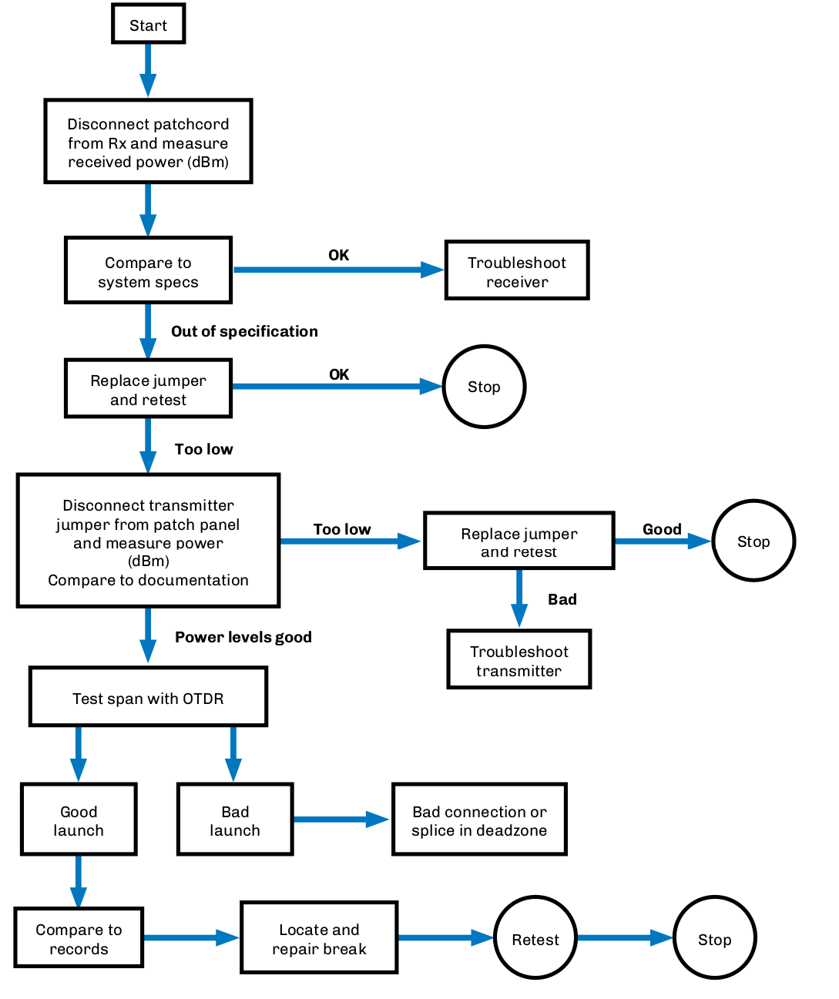

== Emergency Restoration Jump Kit

.Jump Kit.
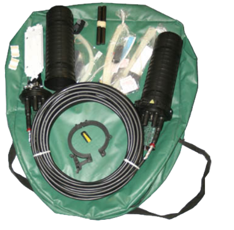

The majority of cable cuts produce only localized damage that extends 3-5 meters on each side of the cable damage area and cause a complete system outage of the primary and protect fiber transmission system. A jump kit, used for quick temporary restorations, is a short patch length method. It consists of a fiber optic restoration kit with two special organizer/closure boxes terminated on a 300' special fiber optic cable that is spooled on a quick deployment reel and packaged in a carrying case with all the necessary tools. It provides a lightweight, portable means of restoring continuity of the fiber cable without having to deploy large bulky spare cable reels and locating organizer/closure systems with their associated tools. After the fiber system is reestablished, a permanent replacement of the damaged cable section with permanent closures and cables can be initiated with time restrictions. Once the permanent restoration is completed, the jump kit is reloaded with any consumables that were used in the restoration and relocated back with the rest of the restoration equipment.

=== Generic Emergency Restoration Jump Kit Requirements

* Length of optical cable.
.. Matching fiber type.
.. Matching fiber manufacturer.
.. Must have fiber count equal to or greater than cable to be restored.
.. Cable must be longer than worst-case outage requirement.
* Closures.
.. Two needed if cut is with nonretrievable slack.
.. Splice trays to match splice protector or mechanical splice to be used in the restoration.
.. Re-entry kits.
.. Consumables.
.. Associated tools and fixtures.
.. Instructions for use.
* Splices.
.. Quantity of mechanical splices required for each splice point (plus spares).
.. Tool fixtures.
.. Consumables.
.. Instructions for use.
.. For nonretrievable slack, double the quantity.
* Tools.
.. Cleaving tools.
.. Cable preparation tools.
.. Closure tools and fixtures.
.. Instructions for use.
.. Fiber strippers.

== Aerial Restoration

.Scenario – Falling tree or gunshot damaged the cable on aerial span. Several repair options are listed.
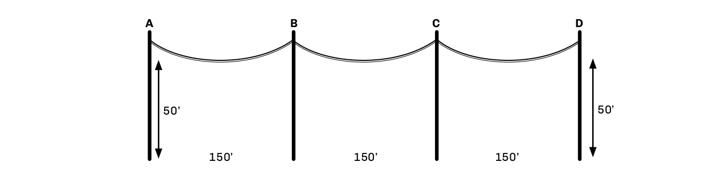

[grid="none", frame="none"]
|===
|*Options* |*Cable Required*|*Equipment Required*
a|
. *Aerial closure mounting* +
Retrievable slack Splice point:
* Inline closure
* Butt style w/snowshoes.
|
None, with retrievable slack.
|
Bucket truck +
One closure +
Safety issues.
|===

.On Pole.
image::media/AerialRestoration2.png[align="center"]

[grid='none', frame='none']
|===
a|[start=2]
. *On pole* +
Nonretrievable slack NEMA +
enclosure +
Size of NEMA enclosure?|550' between A and D +
(450' + 100' slack)|NEMA closure +
Mounting hardware +
Bucket truck +
Spare cable +
Safety issues
|===

== Aerial Restoration - continued

.Underground restoration. 
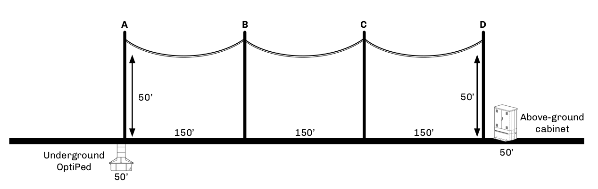

[grid="none", frame="none"]
|===
|*Options* |*Cable Required*|*Equipment Required*
a|[start=3]
. *Underground*
Concrete vault +
OptiPed +
Nonretrievable slack +
Load bearing (?) +
Grounding required?
|
650' between A and D +
(Additional 50' per vault)
|
Two vaults +
Two closures +
Backhoe +
Cable +
Safety issues
a|[start=4]
. *Above ground* +
Pedestals +
Nonretrievable slack
|650' between A and D +
(Additional 50' per vault)
|Two pedestals +
Two closures +
Cable
a|[start=5]
. *Repair to closest existing splice point*
|Unknown
|One closure +
Cable +
Safety issues
|===

.Underground OptiPed & Above-ground cabinet.
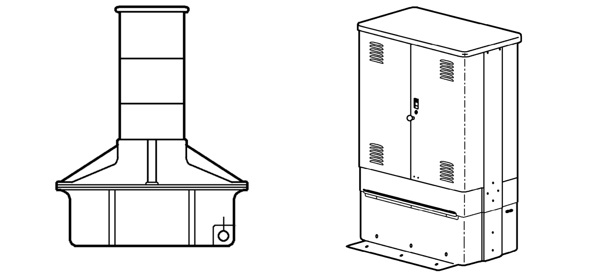

== OSP Restoration of Ducted Cable

.Scenario: Backhoe digs up duct and optical cable, resulting in cable damage. Excess cable has been racked in vaults 1 and 2.
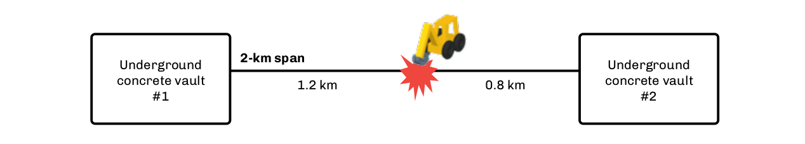

[grid="cols", frame="top"]
|===
^|*Option A* +
Repair duct and replace full span using +
matched cable between vaults 1 and 2, adding +
splice closures in each. ^| *Option B* +
Install new vault or handhole and pull +
cable slack back from vaults 1 and/or 2, splice, +
and repair.
^| *Sequence A* +
^| *Sequence B*
a|
. Remove damaged cable between vaults. +
. Prep closure(s) in vaults. +
. Deliver replacement cable and install. +
. Resplice +
. Retest and document
a|
. Install new vault or handhole. +
. Pull slack cables from vaults 1 and 2. +
. Resplice. +
. Prep splice closure. +
. Test splices with OTDR and document.
|===

=== Equipment List

* Backhoe
* Splice closure(s)
* Spare cable (Option A)
* Racking hardware

* Aerial, underground, ducted, premises.
.. Preterminated drops.
... Replace.
.... Traditional drops.
.... Identify fault location.
.... Ends: reterminate.
.... Middle: Replace span.

* Rural restorations need to be evaluated for repair versus replacement.

== OSP Restoration of Direct Buried Cable

.Buried Cable.
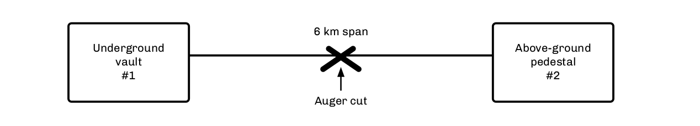

=== Scenario

Cable is cut between vault and pedestal 6 km apart (19,686 feet).

This will require a nonretrievable slack restoration replacing a span of matched fiber and cable. This will require two splice points (closures), plus vaults to protect the closures.

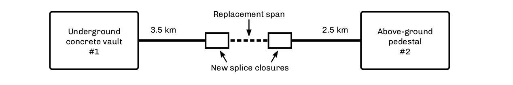

[IMPORTANT]
With nonretrievable restorations we have twice the cost, labor, equipment and attenuation versus retrievable slack.

1. Identify the `full extent` of fiber and cable damage both visually and with OTDR.
2. Remove damaged cable.
3. Deliver emergency restoration kit (ERK) with matching optical cable.
4. Plan permanent splice vault locations.
5. Install ERK for temporary connection.
6. Place new vaults, handholes, or cabinets.
7. Prepare existing cable ends and splice closures at each end of installed cable.
8. Install new cable segment linking existing cable.
9. Cut over ERKs to a new cable and resplice.
10. Retest and document.

=== Equipment List

*  Backhoe
*  Two closures
*  Two vaults, handholes and/or pedestals
*  Spare cable
*  Emergency restoration kit (ERK)

== OSP Emergency Restoration

.Scenario: Replace a 700-foot section caused by a washout.
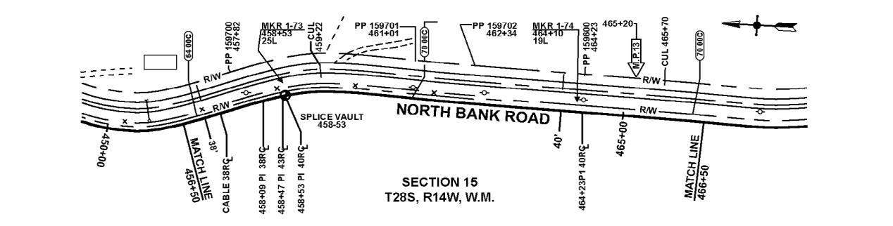

[grid="none",frame='none']
|===
a|
. Establish safe access.
.. Communications.
.. Traffic management.
.. Coordinate needs with repair supervisor. a|[start=4]
. Schedule.
.. Materials.
.. Equipment.
.. Labor (skills of personnel).
.. Cut-over/transition.
a|[start=2]
. Set up work area(s).
.. Construction/engineering requirements.
.. Identify permanent location.
.. Uncover cable for preparation.
.. Access both cable ends.
.. Deliver restoration material (closure, equipment, cable). a|[start=5]
. Splicing.
.. Splice priority fibers.
.. Balance of fibers. 
a|[start=3]
. Closure preparation.
.. Prep cable ends.
.. Prep closure(s).
.. Perform temporary splices.
.. Test for acceptable splice losses.
.. Close and protect site.
.. Await permanent restoration plan.
.. Develop permanent restoration plan. a|[start=6]
. OTDR testing.
.. Retest at 1310 and 1550 nm, bidirectionally.
.. Documentation.
. “As-built” drawings.
. Replenish emergency restoration kit.
. Post-restoration meeting.
|===

== Fiber Optic Restoration for Premises

Local area networks (LANs) consist of intra- and inter-building links over relatively short distances when compared to wide area and metropolitan area networks using optical communications. This requires different approaches and equipment to be responsive to emergency restorations.

Networks and the buildings they are in must accommodate many adds, moves, and changes over their life spans. To plan for these, designers must resolve one of the many headaches associated with LAN cable restorations: retrievable slack versus nonretrievable slack.

Will it be quicker to pull in a new cable or segment? Should a new segment be installed? Should it be spliced or connectorized? How will they be protected?

.Campus LAN.
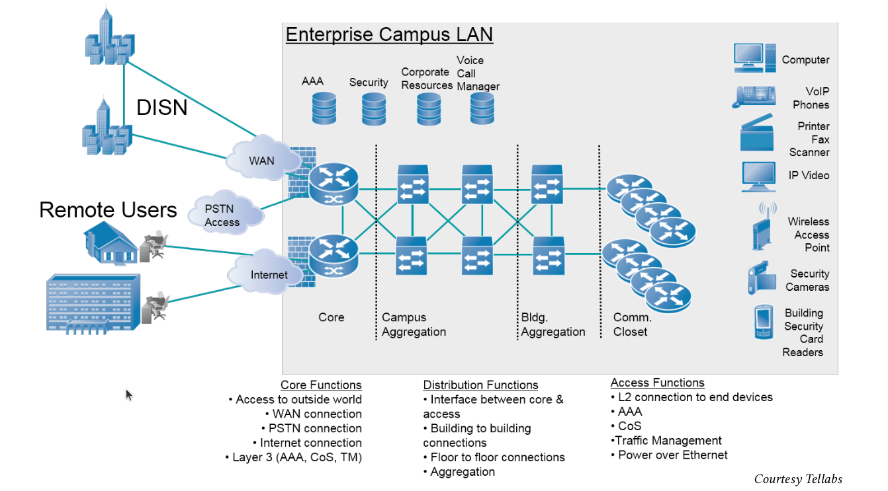

* Plan for prevention first.
.. Route diversity allows flexibility for growth, maintenance and restorations.
.. Label your cables.
.. Lock and protect locations where there is physical access to the cables and connections.
.. Only after confirming that the fault is not within the transmission equipment should you look at the physical plant.

== Proactive Planning vs. Reactive Restorations

All networks start at a conceptual design stage. During this stage we must establish a value to the type of posture we should take for providing the physical plant and its protection. Today's 1, 10, and 100 Gigabit systems require planning to ensure that their entire data systems would not fail in case of either node or cable failure.

Today's designers should learn from these lessons. Most systems today use a star or point-to-point architecture and transmit at data rates of up to 10 Gb/s. Backbones for these systems require special attention to alternative routing. Networks with high data rates, critical circuits, security systems, and priority users should be designed for using route diversity. Route diversity means two specific different routes, not putting two cables in the same duct. This of course can create a cost issue in both materials and construction. If a campus is built on a system of steam tunnels in a star topology the expense would be high to create a physical ring using alternative physical routing.

Another issue to review in the design stage is the types of failures that have occurred in the past. History repeats itself, even in network failures.

.Outage Effect.
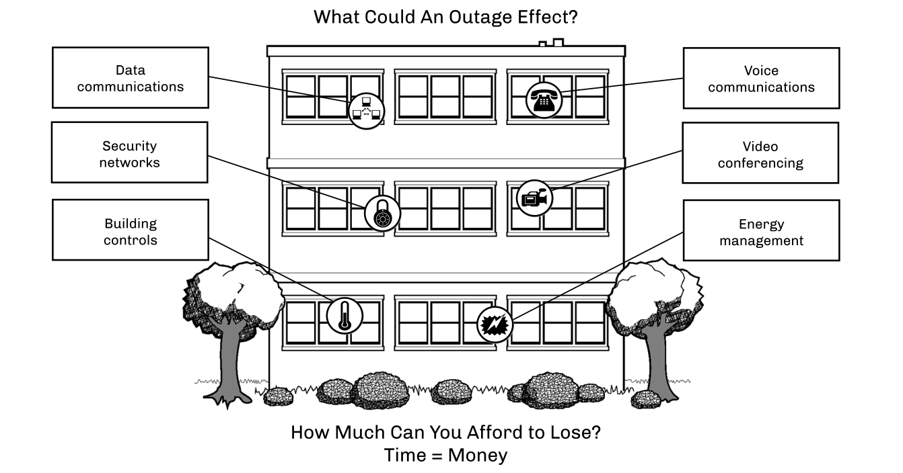

== Premises Restorations - Evaluating the Problem

Once the problem and location have been identified we need to restore the outage. This sounds simple but can be complex.

* Does the span have retrievable slack? If so, we can pull the slack back and make one repair point.
* Will it be easier and/or quicker to replace the section versus repairing the section?
* Will we terminate connectors or use quick mechanical splices for the repair? Either way we will need to protect the repair point(s). This could mean adding closure(s), patch panel(s) or rerouting of cable.
* Can the system handle the additional losses caused by the additional connectors, splices and fiber length?
* What is the worst location/scenario that can occur?
* What location on a span is the weakest link?
* If necessary, can we provide a temporary drop cable over the ceiling, in the ceiling, down the roof, etc., until a permanent restoration can be made?

=== The Basic Recommended Restoration Posture

All users of communications systems must have a basic posture to address what would happen should a failure occur. Following are several recommendations:

* All fiber routes should be properly documented including both optical performance and physical routing. This should include patch panel designations, signal type and interconnect routing information.
* All transmitters and receivers should be documented to their optical transmit and power levels. Receivers should be documented for both minimum and maximum power levels.
* All spans should be documented for optical loss. For multimode networks this would require both 850 nm and 1300 nm. Single-mode spans should be documented at 1310 nm, at a minimum. The documentation should identify the fiber manufacturer, size and type.
* If OTDR tests have been performed, copies of the OTDR traces should be included in the test reports.
* If cable has sequential markings, the difference between the markings tells us the actual cable length in meters or feet for each segment. This should be recorded in the final documentation.
* Fibers should be identified and prioritized to allow for priority fibers to be restored first.

== LAN Restorations

.LAN Resoration.
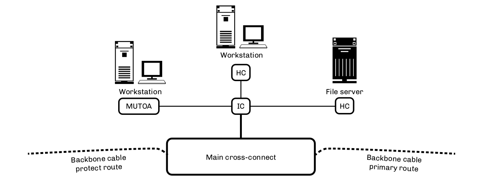

[cols=2,options="header"]
[grid='none', frame=none]
|===
|Causes| Techniques and Options for Restoration 

a|
1. Neglect/abuse.
2. Equipment failure.
3. Cable cuts.
4. Broken connectors.
5. Accidental cuts/disconnects.
6. Macrobends/microbends.
7. Poor documentation.
a. Routing as built.
b. Administration.
8. Vandalism.
a|
1. Clean connections/replace jumpers.
2. Replace cable segment.
3. Mechanical splice/repair.
a. Retrievable slack.
b. Nonretrievable slack (replace section). Replace quick connect repair.
a|
|===

[cols=2,options="header"]
[grid='none',frame=none]
|===
|Types of Problems| Equipment List

a|
1. Cable damage.
a. Walls.
b. Ceilings.
c. Floors.
d. Ducts.
e. Raceways.
2. Jumper related.
a. Improper rolls.
b. Miskeyed.
c. Surface damage/dust.
d. Jumper damaged.
e. Tie wraps.
a|
1. Splice closure/patch panel (1)
2. Jumpers
3. Splicing tool
4. High-resolution OTDR
5. Visual laser
6. Optical loss test set
7. No-polish connectors
8. Mechanical splices
9. Breakout kit
10. Microscope
11. Fiber optic cleaning kit
a|
|===

== The Need for Slack Cable

Restoration planning in premise installations is like having an insurance policy. We don't benefit until we have a problem. Of course we must pay for this protection against the impacts of critical circuits being down. Should these include all voice, video and data networks, your business will soon come to a halt.

=== Retrievable Slack

Cable spans designed with slack points allow spare cable to be pulled together allowing for only one termination point. The use of quick mechanical splices or crimp and cleave connectors allow restoration to quickly take place.

Because most cables within the building are tight-buffered breakout or distribution style, they allow for easy re-termination. The main issue is how to store the splice/connection panel or mini closure. These products provide strain relief of the cable and physical protection of the splice or connectors.

Placement could be above the floor, wall-mounted or ceiling-mounted. In most of these situations aesthetics and size will be key factors. For many users, security and access may need to be considered. 

The cable should be strain relieved and prepared leaving slack for future changes.

=== Emergency Restoration (With Retrievable Slack)

When the cable fault has been located, we must confi rm that the cable break is where it appears to be. Spare cable can now be pulled back to the failure point. The use of visual light sources should be used to check each fiber from both ends. (We wouldn't want to have a second break point one foot away and not cut it out).

The site must be checked to fi nd the best point and method to repair the fi bers. The cable(s) may be pulled back to a ceiling, floor, post or other location for physical mounting. This location should be noted on your drawings and documented. The panel should also be labeled and possibly secured. Aft er the cables are repaired the fi ber spans should be retested for loss using the optical loss test set.

=== Nonretrievable Slack

Without retrievable slack we must add a section of cable to the span. This will require not only two ter mi na tion points, but also twice the labor and material. We must also have a length of fiber that has equal to or greater the amount of fibers in the span. The penalty for not leaving slack is increased outage, time and cost. The processes for the reterminations are the same as the nonretrievable slack,
except now we have two points that need to be repaired.

This will increase the optical attenuation of the span. Per the TIA-568 specifi cation, 0.3 dB is allowed for each mechanical splice and 0.75 dB for each optical connection. In systems with limited attenuation margins, this may require the complete replacement of the damaged cable span.

== Post-restoration Recommendations

1. Document and retest your splices, spans and segments.
2. Adjust “as-built” drawings. New vaults, closures, splices and slack cable points may need to be added or adjusted.
3. Schedule and conduct a meeting to review all aspects of the restoration.
a. What happened?
b. What was the cause and impacts?
c. What did we do well?
d. What didn't work? Technique, equipment, products, staff.
e. How can this be resolved?
f. How can we improve?
g. What needs to be done to rebuild kits and replenish inventory?

