:doctype: book
:title-page-background-image: image:CongruexLogo.png[]

= Chapter 13 - *_Communication System Basics_*

== Fiber Optic Transmitters

The optical transmitter uses an electrical interface (voice, video, data) to encode the information through modulation techniques. Most common are frequency modulation (FM), amplitude modulation (AM), and digital modulation.

.Transmitters
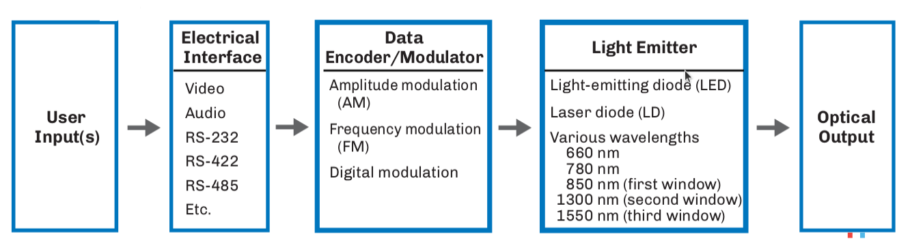

Electro-optic components fiber. An LED or laser converts electrical pulses into optical pulses. At the other end of the link, a PIN or
APD photodiode converts the optical pulses back into current pulses. The wavelength of the source light must be compatible with the detector and fiber.

The drive and receiver circuits shape, time, and amplify electrical pulses to provide proper signal waveforms. They also provide bias to the electro-optic devices. Since these devices are diodes, the electrical design is similar to the design of other high-speed systems.

* Electro-optic components provide the physical interface between the electrical systems and the optical fiber.
* The electrical drive and receiver circuits shape andmodulation amplify the signal wave form.

== Laser Light Sources

Laser diodes are solid-state semiconductor devices that produce light and transmit analog and digital signals. By directly modulating the electrical signal, the laser transmits the signal by an optical format. Stimulated emission is the process that lasers used to generate light energy where each photon has the same wavelength, phase relationship, and direction as the first photon. High-speed lasers may use external
modulators and are coupled with optical isolators for reduction of reflections.

The two dominant types of lasers used in single-mode systems operating at 1310 and 1550 nm are the Fabry-Perot (FP) and the distributed feedback (DFB) semiconductor lasers. For multimode systems, the vertical-cavity surface-emitting laser (VCSEL) was developed in the 1990s for Gigabit LANs and SANs (up to 10 Gb/s) operating at 850 nm over laser-optimized multimode fibers.

=== Parts of the Pulse

.Pulse Parts.
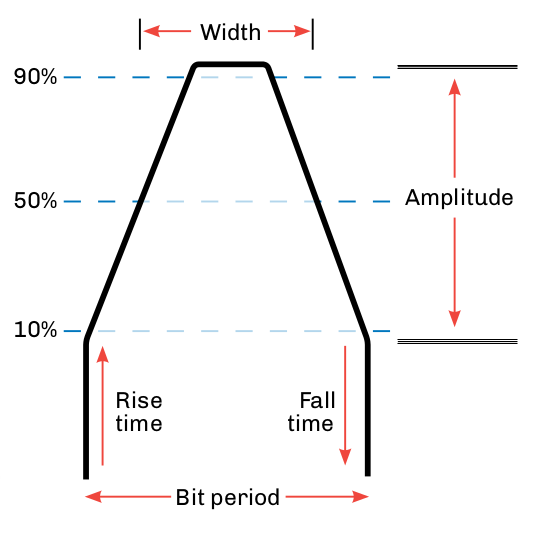

`Amplitude` – The height of the pulse defines the energy or optical power.90%

`Rise and fall time` – The time required for a pulse to rise from 10% to 90% (rise time) of its amplitude and the reverse occurring for the fall time.50%

`Pulse width` – The width of the pulse expressed in time at 50% of the amplitude of the pulse. With light sources it is usually expressed as full width at half maximum (FWHM) power.

`Bit period` – The time given for a pulse. Most digital timing is essential for high-speed systems to keep the information in synchronization.

* The Fabry-Perot (FP) and distributed feedback (DFB) lasers are used in single-mode transmitters.
* The vertical-cavity surface-emitting laser is used in multimode transmitters.
* Solid-state semiconductor devices that produce light and transmit analog and digital signals.
* Amplitude of the pulse is peak power.
* The spectral width of the pulse affects optical dispersion.

== Lasers in Single-mode Systems

=== Distributed Feedback Lasers

Used in digital, DWDM, long haul, and high-speed systems, the distributed feedback (DFB) laser is a semiconductor diode used in optical transmission systems that require high performance optical transmitters. Cooled DFB lasers emit very narrow stable wavelengths that are suitable for dense wavelength division multiplexing (DWDM) transmitters. The narrow spectral widths displayed by DFB lasers can also benefit
high-speed data links by limiting the effects of chromatic dispersion.

.Narrow DFB spectral width Less than 1 nm.
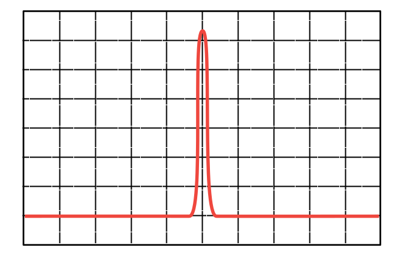

[grid='none',frame='none']
|===
a|
* Used in analog and digital systems.
* Higher priced than FP lasers.
* Data rates greater than 10 Gb/s.
* Narrow spectral width is ideal for DWDM. a|
* Applications.
.. DWDM systems.
.. Oceanic systems.
.. Long haul.
.. CATV (analog) systems.
.. High speed digital systems.
.. Optical line terminals in FTTx systems.
|===

=== Fabry-Perot Lasers

.Wide FP spectral width Typically 4 nm or greater
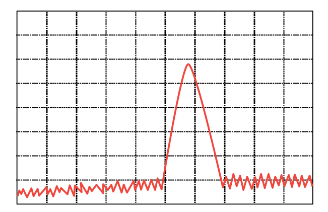

Used in digital single-mode systems at data rates lower than 10 Gb/s, and in multimode systems operating at 1300 nm, Fabry-Perot (FP) lasers were the first solid-state semiconductor laser diodes, and are often referred to as multilongitudinal mode (MLM) lasers. Compared to DFB lasers, they are more economical to manufacture, but tend to be noisier and slower.

* Used in digital single-mode systems.
* Data rates lower than 10 Gb/s.
* Economical to manufacture.
* Noisier and slower.
* Spectral width typically 4 nm or greater.

== Light Sources in Multimode Systems

=== Vertical Cavity Surface-emitting Lasers

Lasers and LEDs have worked as the light sources for optical networks for many years. When fiber optic Gigabit Ethernet products were developed, LEDs could not be modulated at the required speeds, and Fabry-Perot lasers were too expensive. The solution came with the vertical cavity surface-emitting laser (VCSEL). It provided a low-cost solution at 850 nm and could be modulated at Gigahertz levels. This required
multimode fibers to be modified in order to transmit laser signals. These are specified by the IEC as laser-optimized OM3 and OM4 50/125 multimode fibers.

.Emission intensity versus wavelength Typical 10 mA spectrum comprises multiple lines corresponding to multiple transverse modes.
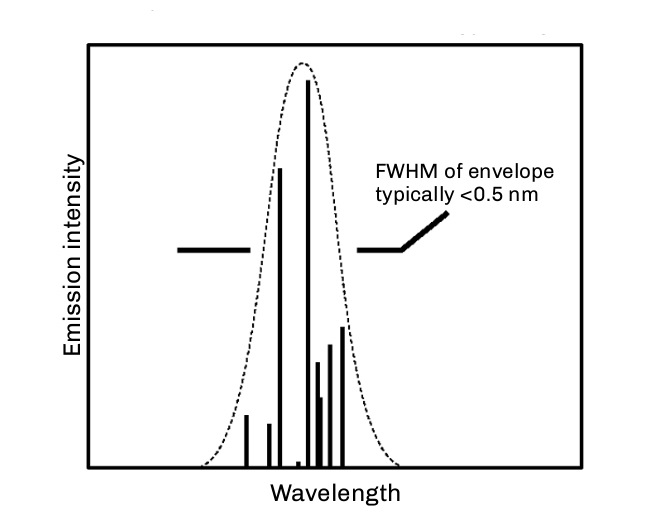

* OM3 and OM4 multimode fibers are designed for use with VCSELs at 850 nm.
* Small beam divergence provides easy coupling to multimode fibers.
* Available for 850, 1310 and 1550 nm operation.
* Standard T0-46 or surface mount packaging.
* Data rates up to 10 Gb/s.
* Meets IEEE-802.3z (Gigabit Ethernet), ATM, Fibre
* Channel, and HIPPI requirements.
* Low power consumption.
* Class I and III safety levels.
* Connector packages for simplex, duplex and ribbon configurations.
* Compatible with low-cost PIN detectors.

== Light-emitting Diodes

Light-emitting diodes (LEDs) are inexpensive solid-state devices that convert an electron flow into photons. They can be directly modulated up to 622 MHz. For short-distance and low-speed multimode systems operating at 850 nm or 1300 nm, the LED has good coupling efficiency when used with the larger cores of multimode fibers. The main limitations of the LED are its wide spectral width and limited modulation speeds. It has provided the solution for the increasing speed requirements of local and storage area networks.

There are two main types of LEDs:

. The surface-emitting LED is reliable, less expensive, and has a very wide (180°) emission pattern, limiting range and bandwidth. These are typically found in low power and low bandwidth devices. Two common types are the Burrus and well.
. The edge-emitting LED is designed to have the optical output exit from the side of the emitter. They are typically found in high power and higher bandwidth multimode applications.

.Edge Emitter & Burrus LED.
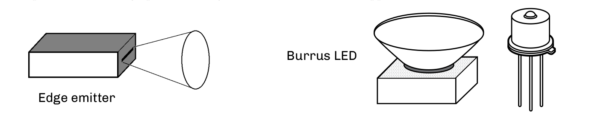

== Laser and LED Spectral Width

Lasers and LEDs emit light over an area greater than the specified wavelength. This spectral width (or line width) creates signal dispersion, which limits bandwidth. Narrower spectral width allows for higher data transmission rates over longer distances. The power from lasers is many times higher than that of LEDs in this narrow range of wavelength; it wouldn't even fit in the same power scale.

The chromatic dispersion of a fiber increases with the source spectral width. The laser, with its narrow spectral width, provides reduced chromatic dispersion.

=== Full Width Half Maximum (FWHM)

Full width half maximum is a measurement of the spectral width of a light source. Measure the spectral width at –3 dB (half power from peak) and at the full width of the source's power peak.

.FWHM
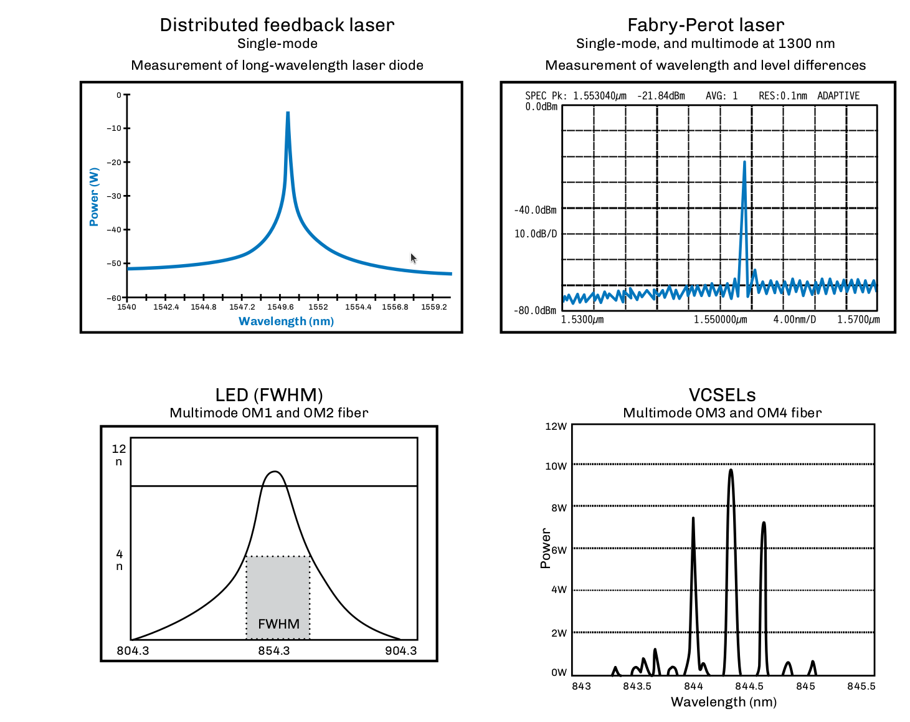

== Reflection Issues

The reduction or elimination of reflections is an issue all system designers must consider in designing a fiber optic link. Active components such as lasers, and in some cases even the receivers themselves, are affected by reflected energy.

All high-speed fiber transmission systems use laser diodes for optical transmission. Distributed feedback or Fabry-Perot lasers are sensitive to optical signals that are reflected by optical components back into the lasing cavities. The closer the reflective component is to the laser and the higher the reflection itself, the greater the impact of the reflection will be. VCSEL lasers are reflection-insensitive, and LEDs are not affected by reflections.

This reflective energy can modulate the laser's power output and/or the laser's spectral frequency. The change in the modulation of the laser power directly causes an increase in the system's bit error rate (BER). This change can also impact adjacent wavelengths in DWDM systems and increase the chromatic dispersion, impacting the BER.

The major cause of reflective energy is Fresnel reflection, caused by abrupt changes in the refractive indices caused by glass-to-glass surfaces, glass-to-air surfaces and glass-to-other surfaces. These are commonly caused by connectors, mechanical splices, lensed devices and unterminated optical splitters. 

Manufacturers and users typically specify optical return loss (ORL) levels required for the optimum level of the equipment manufactured or installed. Special polishes have evolved over the years including UPC (ultra physical contact) and APC (angled physical contact) to reduce Fresnel reflections.

[cols=3,options="header"]

|===
|| Analog | Digital|
Light sources | LEDs (unaffected) DFB lasers | LEDs and lasers (VCSEL, abry-Perot and DFB)|
Detectors | PIN-type detectors only | PIN and APD types |
Connectors | Low-reflection polishes required (PC, UPC, APC) | All types
(PC types recommended)|
Splices | Fusion (nonreflective) | Mechanical or fusion |
|===

* LEDs are not affected by reflected energy.
* Lasers are effected by ORL and component reflectance.
* High speed digital systems >1 Gb/s can be effected by ORL.
* All analog systems using lasers are affected by reflections.
* Designers and installers should pay close attention to reflective components (especially connectors).

== Fiber Optic Receivers

Optical detectors also known as photodiodes and photodetectors, perform the reverse function of the light source -- they convert into electrical signals (energy) that can be processed with conventional circuitry within the optical receiver.

The receiver converts and decodes the optical signal back into electrical signals through the use of either PIN or APD photodetectors. 
This received and amplified signal is then sent to a data decoder or demodulator that converts the electrical signal into the user protocol and format (voice, video, and data).

There are three parameters used to characterize a photodiode: responsivity, sensitivity, and speed. The responsivity is the output current divided by the input power and has units of amp/watt. The sensitivity is the minimum signal, which can be detected in the presence of noise from the photodiode and preamp. The speed is how quickly the photodiode can modulate light.

.Fiber Optic Receiver Principle.
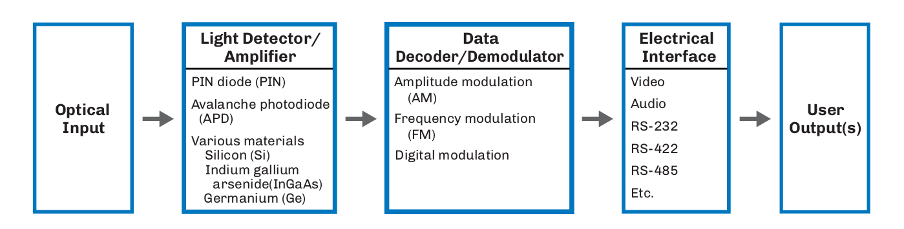

* Photo diodes (detectors) convert optical pulses back into electrical pulses.
.. PIN.
.. APD.
* Three parameters characterize a photodiode:
.. Responsivity – Output current divided by the input power.
.. Sensitivity – The minimum signal that can be detected in the presence of noise.
.. Speed – How quickly the photodiode can demodulate optical signals.

=== Detector Requirements

.Pigtailed Detectors & Active Device Housing.
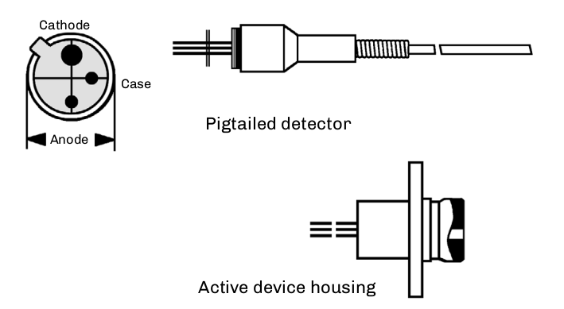

[grid='none',frame='none']
|===
a|
* Faster modulation than the source.
* High output current (high responsivity).
* High gain and sensitivity (APD).
* Low noise (both photodetector and preamp).
* Low bias circuit complexity (PIN). a|
* Wavelength compatible with source and fiber.
* Large size (compared to fiber core diameter).
|===

== Photo Diodes

=== PIN Diodes

The photo diode (or photo detector) is an active device that receives and converts optical pulses into electrical pulses. The optical signal at the end of the link has usually been attenuated and is of low power, resulting in a correspondingly low output current. Therefore, a photo diode is normally packaged with a sensitive preamp to improve performance. The more common type of diode used, positive–intrinsic-
negative (PIN) diodes are relatively inexpensive and do not require great amounts of power, but are limited in sensitivity. They are most often used in short (<30 km) spans.

.Diodes.
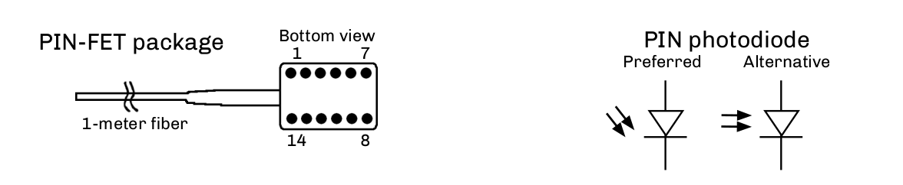

* Used in both digital or analog systems.
.. The only detector type than can be used in analog systems.
* Limited sensitivity.
* Low power input.
* Performance is based on a number of key operating parameters, such as dynamic range, sensitivity, and frequency response.

=== Avalanche Photodiodes

.Avalanche
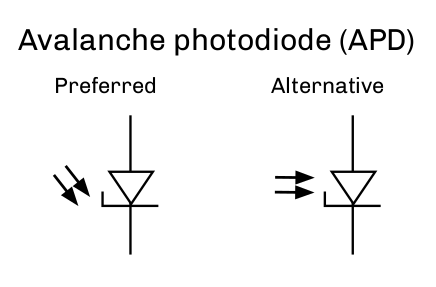

Avalanche photodiodes (APDs) are photodiodes that produce gain, e.g., amplification, and they are generally used with excessively lossy or long-distance systems. The drawback is the higher circuit complexity and cost. APDs use internal current gain to amplify the photocurrent by approximately 10 to 50 times. The APD gain is very sensitive to the amount of reverse bias voltage and ambient temperature. Properly biased,
APDs provide 4-10 dB of gain (adjusted for temperature variations). At a typical single-mode fiber loss of 0.25 dB/km, this corresponds to an additional 16-40 km of fiber.

Telecommunication systems utilize sophisticated temperature and gain-stabilizing circuitry to ensure that the sensitivity of the receiver remains constant. In order to reduce costs, optical receivers with APDs in standard ITS systems typically use the APD with only a small amount of temperature or bias voltage adjustments. Since the optical receivers are typically located in environmentally-controlled facilities,
the temperature variation and thus the APD gain will be relatively constant and not adversely affect the
performance of the transmission system.

[grid='none',frame='none']
|===
a|
* Produce gain (10 dB).
* Amplify photocurrent by 10 to 50 times.
* Used in digital receivers. a|
* Used with excessively lossy (FTTH) or long-distance systems.
* Cannot be used in analog systems. 
* Higher circuit complexity and cost than PIN types.
|===

== Typical Span Distances Based on Optical Power Levels

Span distances are based on typical optical loss budgets using LEDs, lasers, and PIN/APD photodetectors over different fiber types and at different wavelengths. A bandwidth calculation for multimode fibers or dispersion calculation for single-mode fibers should be performed to verify link is within acceptable limits.

.Typical Span Distances.
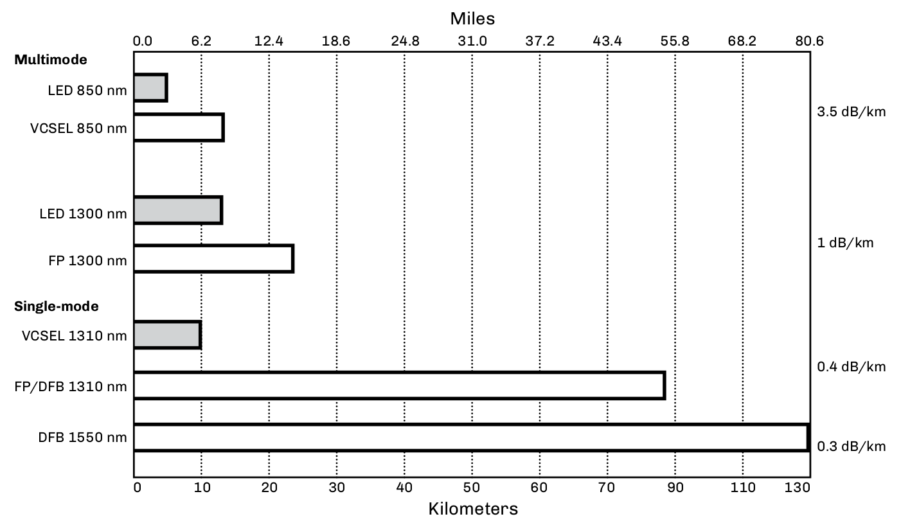

.Typical Optical Detector Specifications.
[cols="3,1,1,1,1,1,1",options="header"]
|===
|
2+|Silicon (Si) 2+| Germanium (Ge) 2+| Indium Gallium +
Arsenide Phosphide (InGaAsP) 
|
|PIN|
APD|
PIN|
APD|
PIN|
APD|
Wavelength (nm)|
400-900|
400-900|
500-1800|
700-1550|
900-1700|
900-1700|
Photon to electron conversion gain|
1|
150|
1|
10-50|
1|
150|
Sensitivity (dBm)|
–30|
–40|
–30|
–40|
–30|
–40|
Wavelength (nm)|
|===

== Repeaters, Regenerators, and Amplifiers

.Bidirectional & UnidirectionaL.
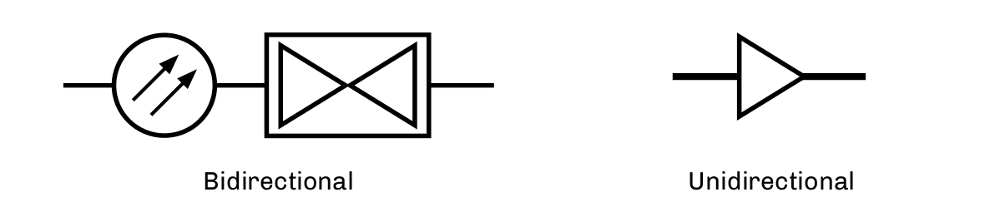

Repeaters and regenerators are used where the fiber-optic span distance is greater than the allowable link attenuation margin, or where the signal dispersion is such that it affects the bit error rate (BER) for digital systems and carrier-to-noise ratio (CNR) for analog systems. They compensate for high attenuation levels, excessive fiber (span) length, splitter attenuation, or increased signal aging losses. The words “repeater” and “regenerator” are sometimes used interchangeably.

.Three R Functions.
[cols=2,float="right"]
[%autowidth]
|===
2+|The Three “R” Functions

|Retime  | Electrical
|Reshape | Electrical and/or optical
|Reamplify| Electrical and optical
|===

`Optical electrical regenerators` – The most common type used in telecommunications systems, the O/E–E/O regenerator performs
“3R” retiming, reshaping, and reamplification, and also may have add/drop capabilities. The unit receives the optical signal, converts
it to an electronic signal, which is retimed and reshapes before it is converted to an optical signal. Once in the electrical domain,
retransmission allows the wavelengths and fiber types to be changed, if needed.

`Regenerator` – A digital term for a receiver and transmitter combination used to reconstruct signals for digital transmission. In an optical regenerator, the receiver converts incoming optical pulses to electrical pulses, decides whether the pulses are 1s or 0s, generates clean electrical pulses and then converts them to squared off pulses for transmission.

`Repeater` – An analog term for an opto-electronic device inserted at intervals along a circuit to boost and amplify an analog signal being transmitted. Repeaters also regenerate digital signal, squaring it and cleaning it but not changing it. Regenerating the signal removes noises and thus reduces the likelihood of errors. Also called regenerator repeater.

`Fiber optic amplifier` – Optical amplifiers are only applicable to single-mode systems. There are three types available. All require power to operate and may not be appropriate in applications where access to power is limited.

* Erbium-doped fiber amplifiers (EDFAs).
.. Common in terrestrial telecom market, EDFAs use a special erbium fiber and an optical pump laser to provide gain of the incoming signal without conversion to an electrical signal.
* Raman amplifiers.
.. Raman amplifiers are more complex and use the transmission fiber itself to provide gain. This type is mostly used in long-distance submarine and long-haul systems.
* Semiconductor optical amplifiers (SOAs).
.. SOAs are small, low-cost devices that are used in many terrestrial applications with only a small gain (6-10 dB) is required. SOAs are a good choice in applications that require gain and in-line amplification.

== Factors for Regenerator Usage

=== Attenuation

Attenuation occurs where the loss is greater than the link loss budget allows. The signal loss is the combined attenuation of the fiber, splices, connectors, and jumpers in the system. This amount may increase over time due to splices, added components, aging, or stress placed on the optical cable or components.

=== Signal Dispersion

Signal dispersion occurs when the signal spreads to the point that pulses overlap and cause the receiver to detect one long pulse instead of three shorter pulses. At faster data rates, this effect is more pronounced. 

An example of a chromatic dispersion problem could occur when the data rate is increased from 2.5 Gb/s to 10 Gb/s. This would result in a 16 times increase in signal dispersion. Resolutions include narrower spectral width lasers, dispersion and/or compensating fibers or modules.

.Transmitted pulses & Received pulses.
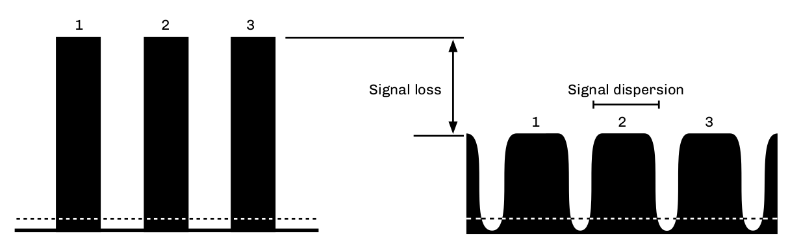

.Optical Dispersion Types.
[cols=2,options=header,float=right]
[%autowidth]
|===
2+|Types of Optical Dispersion

|Single-mode
a|
* Chromatic dispersion (CD)
* Material dispersion
* Waveguide dispersion
* Polarization mode dispersion (PMD)
|
Multimode | Modal dispersion or differential mode delay (DMD)

|===

An example of modal dispersion can occur when a legacy 62.5/125 multimode fiber was installed for use in a fast Ethernet (100 Mb/s) application over 1 km (3,281 feet). Upgrading to Gigabit Ethernet (GbE), the attenuation hasn't changed, but the data rate and modulation required has increased tenfold. The modal dispersion, also known as differential mode delay (DMD), now limits the span distance to a best case of 550 meters.

== Basic Components for Optical Transmission

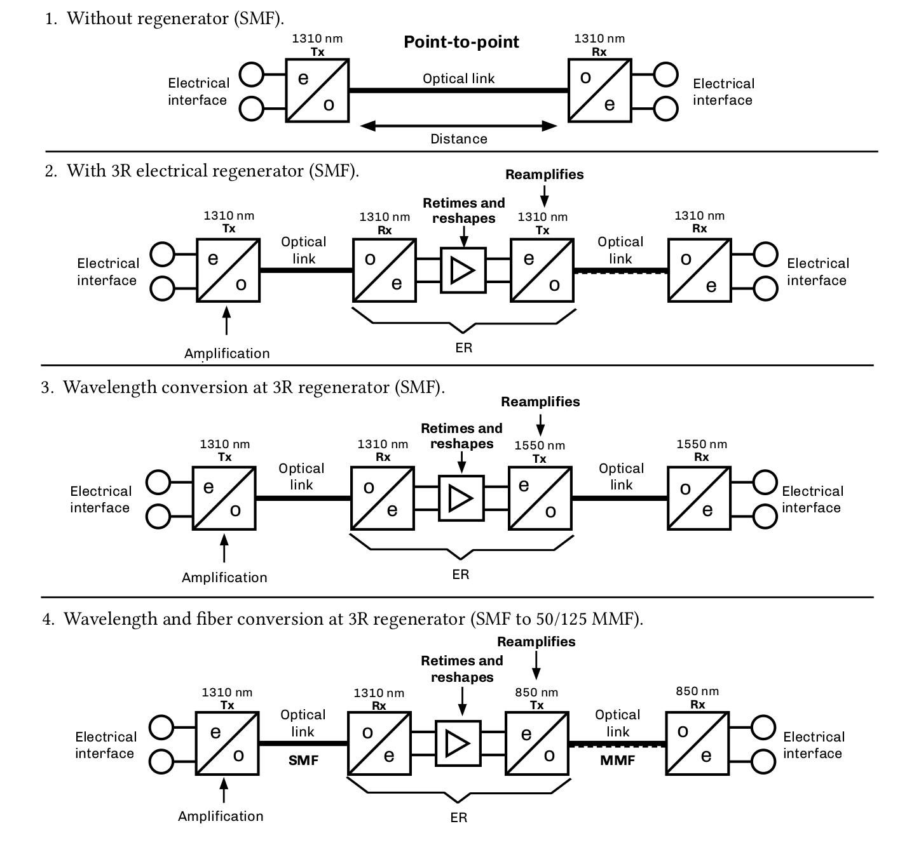

=== Basic Components for Optical Transmission

[grid='rows',frame='none']
|===
2+^| *Key*
|Rx
|Receiver
|Tx
|Transmitter
|e/o
|Electrical to optical, e.g., laser transmitter
|o/e
|Optical to electrical, e.g., photodetector/receiver
|ER
|Electrical regenerator (repeater)
|3R
|Retime, reshape, reamplify
|===

== Point to Point - FTTx Active Ethernet Example
All point-to-point (P2P) optical transmission system consists of three parts: the transmitter, the receiver, and the physical plant. Most transmitters and receivers use SFP and SFP+ modules at transmission locations. From the hub site to a powered cabinet, it has greater distance capabilities than point-to-multipoint (P2MP), as it does not use lossy optical splitters. The P2P option uses optical switches and can be adapted to handle various types of voice, video, and data services at multiple data rates. Most FTTx P2P systems use Ethernet,
as it handles the transmission of Internet protocol (IP) data and can provide voice (VoIP), video (IPTV), and data communications.

To consider the maximum distance for a P2P system, designers first must consider if an existing standard covers the application for the specific protocol and data rate. Other considerations are the optical attenuation level for the selected transmission wavelengths, the optical dispersion over the fiber type to be installed, and the type and spectral width of the system's laser.

.FTTx Active Ethernet Example.
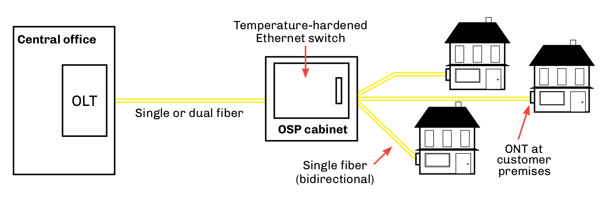

.FTTx Residential Installation Comparison.
[cols=3,options="header"]
[%autowidth]
|===
||*Active Ethernet (P2P)* | *PON (P2MP)*
|*Architecture*
|Dedicated
|Shared, up to 1:64
|*Range*
|Up to 80 km
|Up to 20 km
|*Data rates*
|Up to 10 Gb/s
|Up to 10 Gb/s shared
|*Transmission fibers*
|Two fibers (LX) Single fiber bidirectional (BX)
|Single fiber bidirectional (BX)
|*Fiber requirement*
|Fiber rich
|Fiber lean
|*Costs to deploy*
|Higher (requires more fiber)
|Lower (more fiber efficient)
|
|===

* Dedicated architecture between transmission equipment.
* Easy to test and troubleshoot.
* Ring and star topologies consist of multiple P2P segments.

== Point to Multipoint - FTTH PON Example

Passive optical networks (PONs) use the star or point-to-multipoint (P2MP) topology and optical splitters, which eliminate the need to power any part of the outside plant. Optical splitters allow a minimal amount of fibers to reach a maximum number of end users. Most PON systems can link 32 optical network terminals (ONTs) located at subscriber locations to one optical line terminal (OLT) line card located at the service provider's hub. The Gigabit PON (G-PON) standard allows up to 1:64 configurations.

The major cause of attenuation will be the optical splitters. Standards have identified and specified optical distribution network (ODN) classes for various power levels. Unlike long P2P spans, optical dispersion will not be a major problem.

Since the physical fiber span in the PON is protocol independent, ATM (cell-based) and Ethernet (packetbased) standards handle triple play (voice, video and data) services. RF overlay uses an external wavelength division multiplexer (WDM).

Another variation of the PON based P2MP topology are WDM-PON systems for next generation (NG-PON) networks. The use of passive WDM products can allow for each customer to have a dedicated wavelength providing the most bandwidth available for future migrations.

.Typical Point-to-multipoint Passive Optical Network.
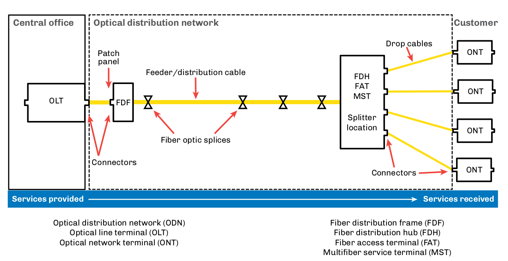

== Passive Devices

Fiber optic passive devices are components that do not require electrical-to-optical or optical-to-electrical conversion during its operation. They give designers the ability to direct, split, control, multiplex, demultiplex, and switch optical signals. They also provide flexibility in operating, monitoring, testing and maintaining optical networks. Fiber optic passive devices are specified by the ITU-T G.671 “Optical Components and Subsystems” standard. Types of passive devices include:

* Optical splitters (also known as optical couplers).
* Wavelength division multiplexers (WDMs).
* Filters.
* Isolators.
* Optical switches.
* Attenuators.
* Optical dispersion compensators.

.Optical Splitter & Optical switch examples.
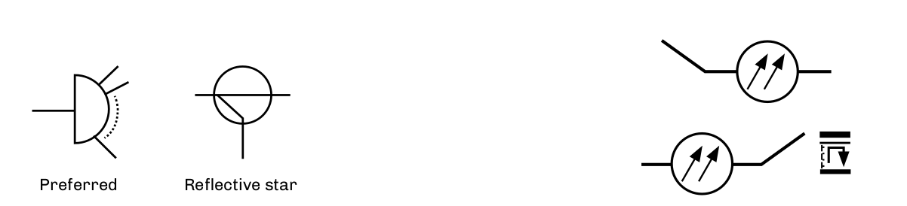

.Multiplexing.

.Demultiplexing.
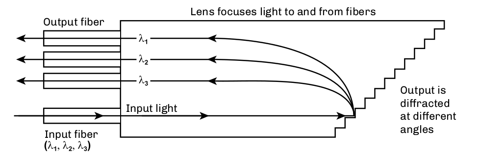

== Optical Splitters

Sometimes called couplers, optical splitters allow one or more input or output signals to be split into two or more fibers. Wavelength independent couplers (WICs) have the same attenuation in either direction and at multiple wavelengths.

When discussing the attenuation of an optical splitter, its theoretical value is a main concern. For example a 1:2 (50/50) split has a 3 dB loss. However, this 3 dB value does not consider fiber tolerances, splice losses when integrating splitters, and other types of mechanical loss.

=== Optical Branching Component (Wavelength Nonselective)

[cols=4,options="header"]
[%autowidth]
|===
4+^|Insertion Loss
|Split Ratio
|Maximum
|Minimum
|Average
|1:2
|4.2 dB
|2.6 dB
|3.4 dB
|1:4
|7.8 dB
|5.4 dB
|6.6 dB
|1:8
|11.4 dB
|8.1 dB
|9.7 dB
|1:16
|15.0 dB
|10.8 dB
|12.9 dB
|1:32
|18.6 dB
|13.1 dB
|15.8 dB
|1:64*
|22.8 dB
|15.7 dB
|19.2 dB
|===

[cols=3,options="header"]
[%autowidth]
|===
3+^|Operating wavelength range
|1310-nm window
|1360 nm
|1260 nm
|1550-nm window
|1580 nm
|1480 nm
|===

Asymmetric tap splitters branching component (wavelength nonselective) are also included in the G.671 standard with 20/80 (%), 10/90, 5/95, 2/98 and 1/99 ratios. All are listed for future study.

The G.671 optical components standard specifies minimum and maximum attenuation values for optical splitters operating over specified wavelengths. Wavelength independent couplers (WICs) must meet the attenuation values when measured bidirectionally using this wavelength spectrum.

== Fused Biconical Taper Splitters

.Fused 
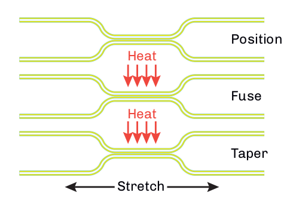

This technique fuses a quantity of fibers together, allowing the cores to mix. By controlling the tension, fusion process, and power
transmission level during manufacturing, precise tolerances can be maintained. Fused biconical tapers (FBTs) are nonreflective and
normally used in small split counts or tapered splitters. 

=== Planar Splitters

Planar splitters are compact, substrate-mounted optical branching circuits manufactured by laminating layers of substrate, cladding, and core glass together. A mask in the design of the split ratio (up to 128 outputs) is placed upon the core glass and the glass is etched away around the pattern. A final layer of cladding glass is then flowed over the top of the core and lower cladding layers to encase the splitter. Optical fibers are adhered to each end of the planar splitter for the input and outputs.

.Planar (PLC Splitter)

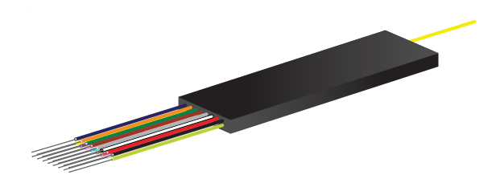

== WDMs and Bidi Devices

Wavelength division multiplexers (WDMs) combine two or more multiple wavelengths onto a single fiber. At the opposite end of the WDM link, the wavelengths are demultiplexed, separating the combined optical carriers and routing them to a receiver for processing. While WDM often describes the multiplexing of several optical wavelengths onto a single fiber, the term can also describe the multiplexing and demultiplexing
of only two wavelengths, usually operating in different optical bands. WDM also allows for bidirectional transmission over one fiber.

WDM has proven to be an effective means of increasing capacity over existing fiber. Other WDM technologies include coarse wavelength division multiplexing (CWDM), wide wavelength division multiplexing (WWDM) and dense wavelength division multiplexing (DWDM).

* Combines and separates wavelengths.
* WDM.
.. Legacy 1310/1550 nm.
* Wide WDM
.. G.671.
* Coarse WDM
.. G.694.2.
* Dense WDM
.. 6.692.

=== Optical Bidirectional Devices

Also known as bidi devices, these components incorporate a photodetector, a laser, and filters or lenses into a single package. These devices are used to more easily provide bidirectional transmission over a single fiber.

The key optical element of this device is the wavelength division multiplexing (WDM) filter. In order to achieve bidirectional transmission over a single fiber, one wavelength is required for each direction of transmission. This WDM element filters and separates the two wavelengths and directs them to and from the proper optical active device (laser or detector). Multimode devices typically use 850 and 1300 nm, while single-mode devices use 1310 and 1550 nm.

It's important to note that in order to properly test and troubleshoot a single fiber bidirectional transmission system, the transmitted power of the forward direction from the transmitter and the reverse (return) direction from the receiver must be measured to verify that both are working properly. The 1550-nm back channel on single-mode systems is sensitive to microbends and macrobends and could be problematic,
even if the forward direction is functioning.

* Bidirectional transmission over one fiber.
* Incorporates laser and detector in a single package (diplexer).
* Integral WDM splits and combines wavelengths.
.. 850 nm and 1300 nm for multimode.
.. 1310 nm and 1550 nm for single-mode.

== Coarse Wavelength Division Multiplexing CWDM

Coarse WDM is a low-cost option for users who don't require the high power levels, close spacings and associated high costs of DWDM. With its fewer wavelengths, conventional spans, 20-nm spacings, low-cost SFP modules, and less expensive uncooled lasers, CWDM offers an alternative solution to many organizations wishing to expand their networks.

CWDM initially was used in the 1980s to allow up to four wavelengths to transmit signals within a single optical window (typically ±30 nm) over both single-mode and multimode fibers. The push to DWDM bypassed CWDM until the communications industry realized that CWDM provided a lower-cost alternative. The ITU G.694.2 standard specifies the wavelengths and channel spacing for CWDM transmission. Singlemode CWDM transmission takes place in the 1271 nm to 1611 nm operating range with 20-nm spacing between channels. While there are 18 single-mode CWDM channels specified, most systems currently have 4- or 8-channel designs.

.Wavelength (nm)
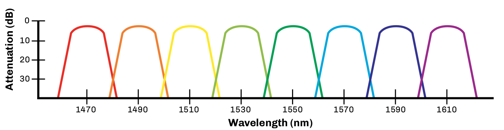

=== CWDM Features

* *Single-mode networks* + 
As specified in ITU-T G.694.2 and G.671 recommendations Specified wavelengths (using 20-nm separation)
.. O-band: 1271 nm, 1291 nm, 1311 nm, 1331 nm, 1351 nm
.. E-band: 1371 nm, 1391 nm, 1411 nm, 1431 nm, 1451 nm*
.. S-band: 1451 nm*, 1471 nm, 1491 nm, 1511 nm, 1531 nm*
.. C-band: 1531 nm*, 1551 nm
.. L-band: 1571 nm, 1591 nm, 1611 nm

* *Multimode networks* +
Specified wavelengths
.. 778 nm, 800 nm, 825 nm, 850 nm

=== ITU-T G.652D Single-mode Optical Fibers

The G.652D single-mode fiber was developed to allow for transmission in the E-band. G.652D fibers are ideal for transmitting wavelengths using the ITU-T G.694 specified CWDM channels. Known as reduced water peak, low water peak, or zero water peak fibers, they are compatible with the older G.652 fibers, and provide the option for future use of CWDM and DWDM in the E-band.

== Dense WDM

Dense wavelength division multiplexing (DWDM) is the transmission of different signals at multiple wavelengths with extremely tight channel spacings through the same optical fiber. The narrower the spacings, the more optical channels that can be multiplexed. WDM systems don't use a specific signal format, so any dedicated protocol (e.g., Ethernet, ATM) can be transmitted with a WDM system.

DWDM technology components and fibers are very mature, and modern DWDM systems can easily handle 40 or more channels at 100 or 50 GHz channel spacing. One fiber with 40 channels is the equivalent of a 40-fiber cable.

The ITU G.692 standard defines channel spacing options in DWDM systems. It specifies the optical wavelengths, attenuation, reflection, and dispersion values required. For DWDM systems, G.655 nonzero dispersion-shifted single-mode fiber is used to minimize attenuation and optical dispersion. This fiber is optimized for transmission and integration of EDFAs in the C-band (1530-1565 nm).

Currently, it is best to use DWDM in feeder routes. DWDM systems are expensive to implement due to the cost of the stringent optics involved. This can be offset by the cost of new physical plant construction. In most cases, today's designers would place a fiber rich cable with ribbon fibers, as material costs are very low compared to the cost of placement. It pays huge financial dividends to install as large a cable as possible in order to future-proof the system.

[grid="none", frame="none"]
|===
a|
* *ITU-T G.692* 
.. 200 GHz (1.6 nm).
.. 100 GHz (0.8 nm).
.. 50 GHz (0.4 nm). a|

* *Manufactured but not in standard*
.. 25 GHz (0.2 nm).
.. 12.5 GHz (0.1 nm).
* WDM-PON (NG-PON2) addresses DWDM in future systems.
|===

.64-channel DWDM system.
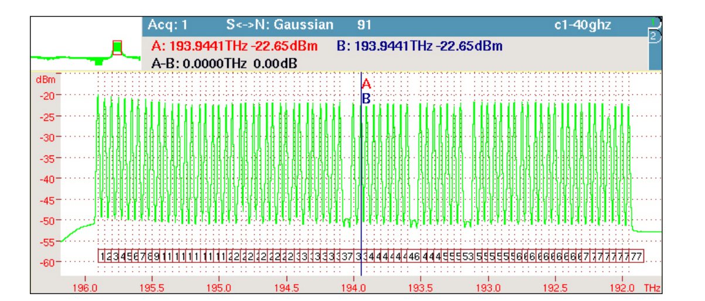
