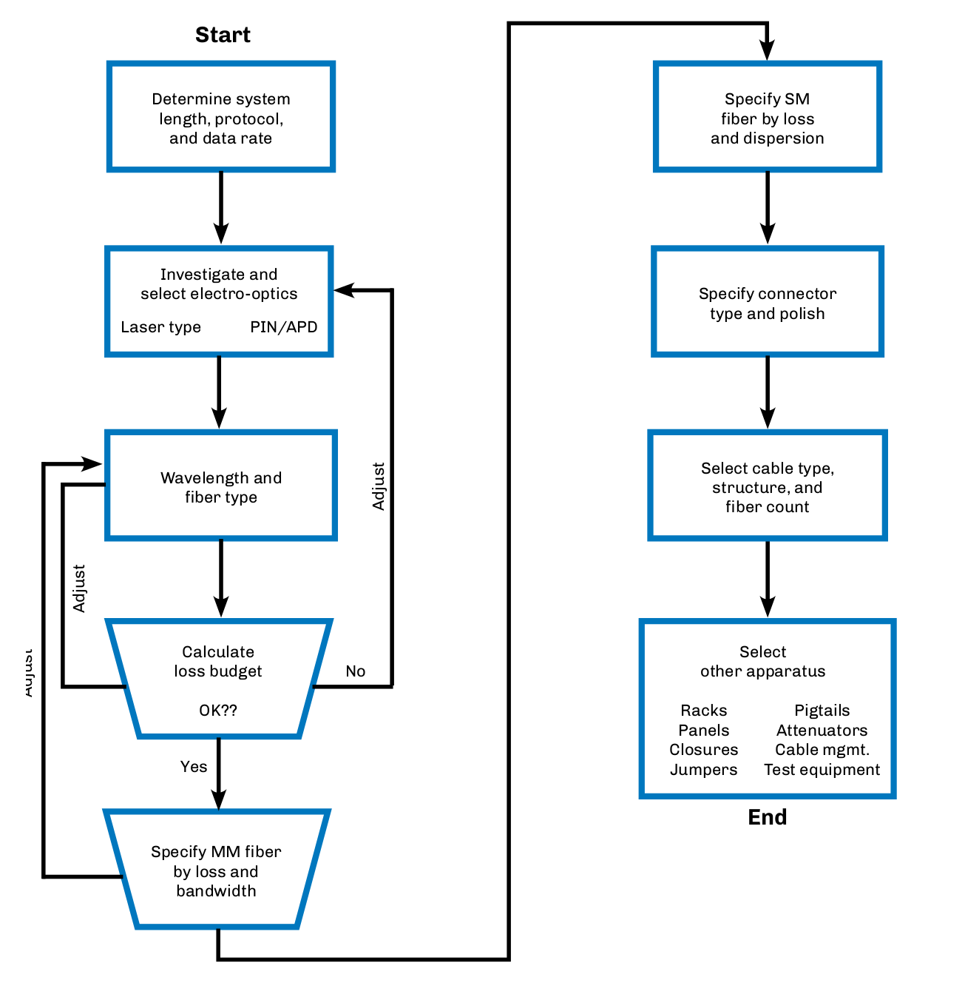
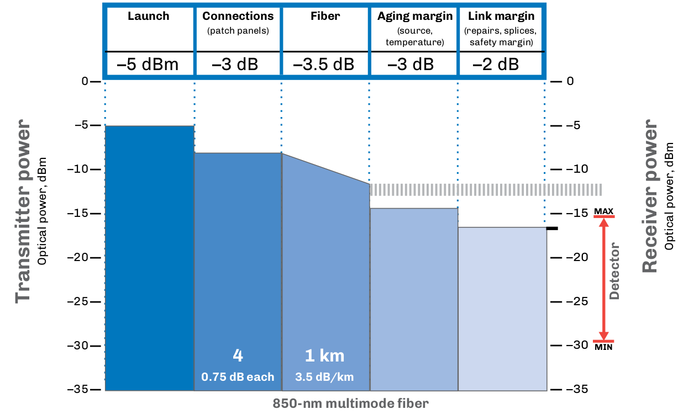
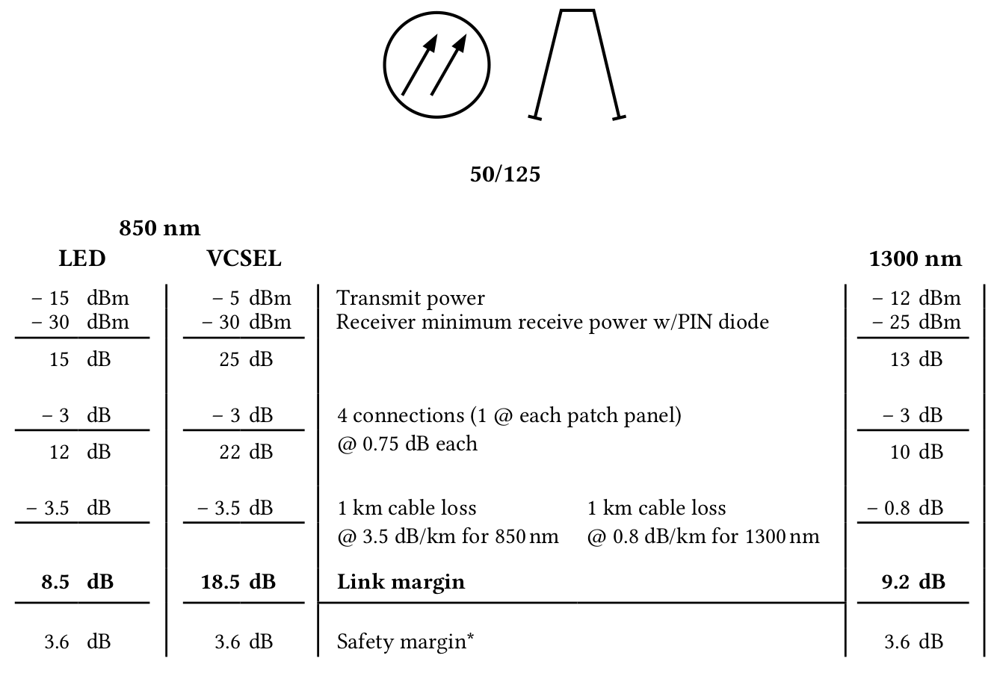
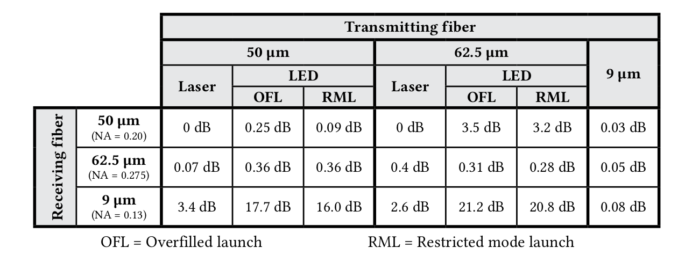
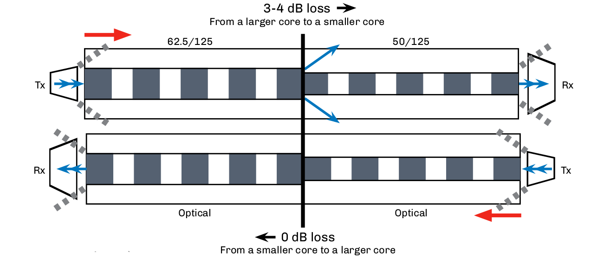
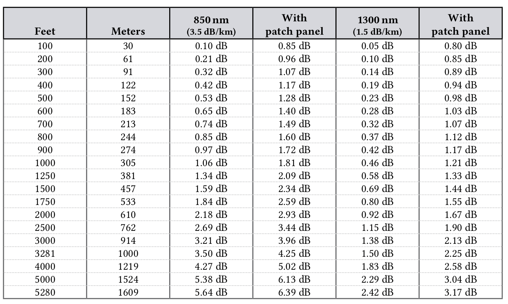
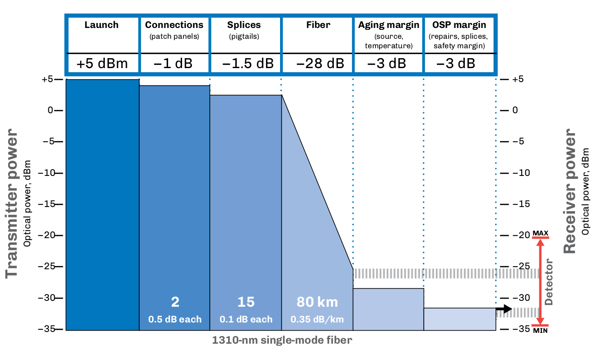
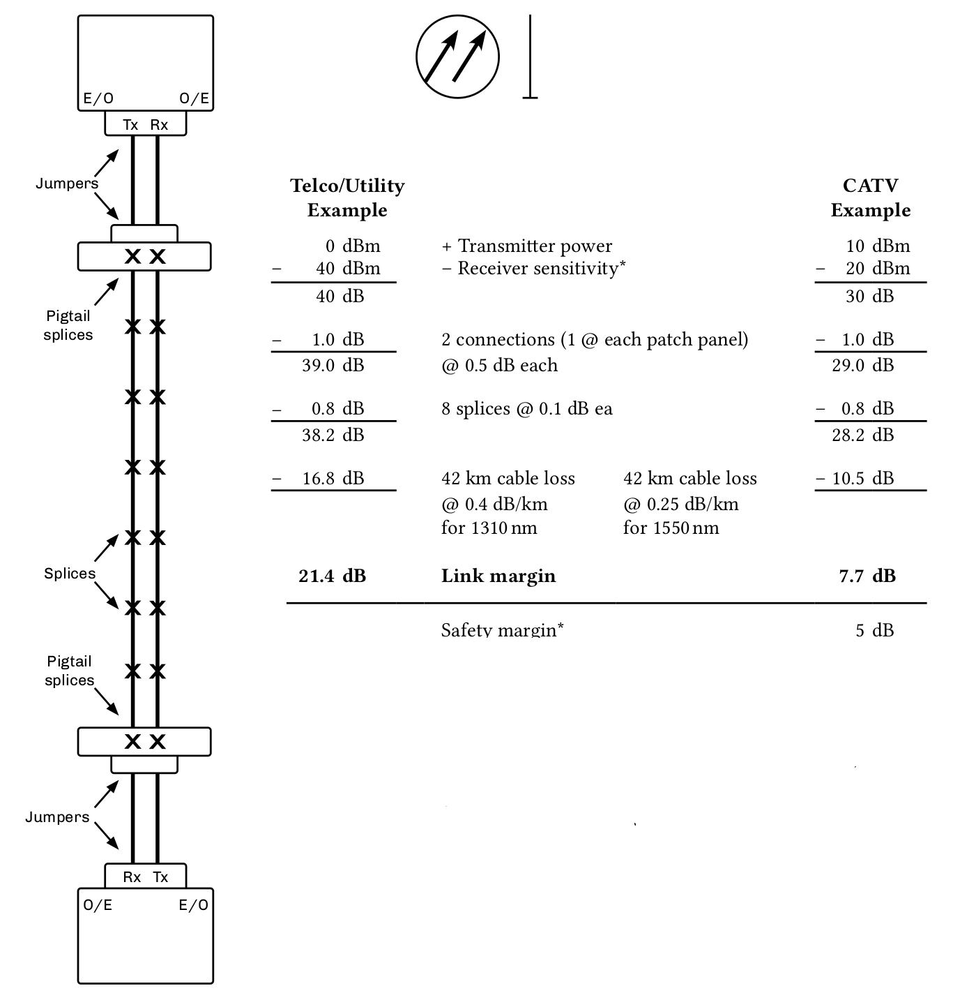
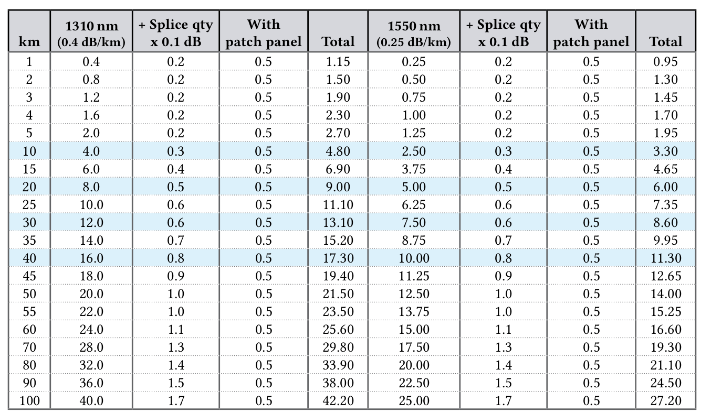
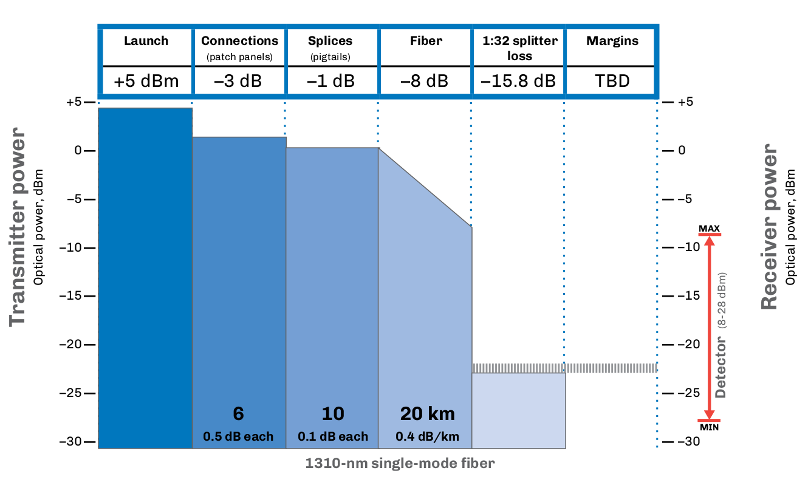

:doctype: book
:title-page-background-image: image:CongruexLogo.png[]

= Chapter 14 - *_Loss Budgets_*

== Loss Budget Basics

One of the most important elements involved in designing a fiber optic system is the link loss budget. The link loss budget is a detailed calculation of the optical power available at the output of the transmitting source, the optical power required at the receiver’s detector, and the dissipation or attenuation of optical power in the optical path between transmitter and receiver. It is a statement of how we intend to use the optical power that is available. Loss budgets are always planned with worst-case scenarios in mind.

Whenever possible, the designer should refer to fiber optic standards when writing system specifications. Through these standards, the designer can identify the attenuation for the components that will be used in order to calculate the loss budget for the fiber span. Every component in the system should be incorporated, including the optical cable, splices, and all connections.

=== The Impact of Attenuation

Attenuation applies to fiber, splices, connectors, splitters, and WDMs.

* If the optical power level is too low, the signal quality is degraded.
* If the power level is too high, the photo detector is affected, thereby degrading the signal quality.

The minimum and maximum optical receive power levels should be reviewed and considered when creating an optical loss budget. The transmitter’s optical power level and the loss in the outside plant will vary, so the actual power levels should be confirmed through optical power and optical loss testing. If the power level is too high, optical attenuator(s) must be added to decrease the received optical power level.

== Loss Budget Design Flow Chart

Calculating a loss budget is critical part of designing a fiber optic link. Once the length of the span is determined and the signal type and protocol(s) selected, the focus turns to what fiber type, light source, photo diode, and operating wavelengths will be used.

For installers, a “not to exceed” budget helps to determine the end-to-end loss calculations as well as the maximum allowable loss for connections, splices, and passive devices.

* It should be a methodical, logical process.
* The length of the span must be determined, followed by selection of the signal type (voice, video, or data) and the protocol.

.Low Budget Flow Chart.

== Design Options for Fiber Optic Networks

=== Fiber Types

[cols=4,options="header"]
[.autowidth]
|===
| Single-mode | G.652/G.652D | G.655 | G.657
|9/125
|Standard single-mode 1310 nm
|DWDM 1550 nm optimized
|Bend insensitive
|===

[cols=4,options="header"]
[.autowidth]
|===
|Multimode |Legacy (FDDI grade) |Laser-optimized |Bend-insensitive
|50/125
|Moderate bandwidth (OM2)
|Highest bandwidth (OM3/4/5)
|OM2/3/4/5
|62.5/125
|Lowest bandwidth (OM1)
|Moderate bandwidth
|N/A
|===

Smaller fiber cores have lower attenuation and higher bandwidths. The exception is OM3 and OM4 laser-optimized multimode fibers designed for use with VCSEL light sources operating at 850 nm.

=== Wavelength

* Single-mode: 1310 nm, 1550 nm
* Multimode: 850 nm, 1300 nm
* The longer the wavelength, the lower the attenuation and the higher the allowable bandwidth.
* However, the higher the price as well.
.. The exception is laser-optimized multimode fibers designed for use with VCSEL light sources operating at 850 nm, where the bandwidth is higher.

=== Light Sources Used in Transmitters

* LED (surface or edge)
* Laser (DFB or Fabry-Perot)
* VCSEL (850 nm only)

Determine minimum and maximum optical power levels. The more powerful the source, the more power is launched into the fiber core. DFB, FP, and VCSEL lasers can be modulated faster than LEDs.

* Lasers launch more light into the fiber’s core.
* Lasers have a small spatial spread.
* Lasers have narrower spectral widths.
* Lasers can be modulated faster than LEDs.

=== Detectors Used in Receivers

* Positive-intrinsic-negative (PIN)
* Avalanche photodiode (APD)

Determine minimum and maximum optical power levels. A more sensitive detector allows for greater loss margins. APD type are more sensitive, but amplify noise and are more expensive than PIN detectors. They cannot be used with analog systems.

* A more sensitive detector allows for greater loss margins.
* APD types are more sensitive, but amplify noise.

== Safety Margin

Degradation of optical power is sometimes affected by factors unrelated to known losses. This factor of 3 dB (or 50%) attenuation is generally included in loss budget calculations but can also be greater than 3 dB.

* Degradation of power output over a period of time of 50% (3 dB).
* Environmental changes ±1 dB.*
* Future restoration splices.
* Connector loss on transmitter/receiver.
* Other unknown future system attenuation.

[NOTE]
Many transmission equipment suppliers have suggested safety margins.

=== Attenuators

Attenuators may be required to increase attenuation of the optical power level received by the photodetector in the receiver. The designer must always review not only the minimum light level of the receiver, but also the maximum level as well.

During the design stage, the designer works with known or probable performance levels from various manufacturers’ product specification sheets. From these specifications, a optical loss budget is derived. Actual performance tests of the transmission products and the physical plant should be made to verify actual loss levels.

The need for a different level of attenuator may be required due to the actual performance levels versus the designed level.

=== Evaluating Optical Input Levels

Input power levels to an optical receiver must fall within the dynamic range of the device in order to properly perform the optical to electrical conversion process required to restore the original transmitted signal information. Dynamic range is the optical input power range in which the receiver can successfully operate to reproduce the transmitted information signal. Many optical receivers possess automatic gain
control (AGC) circuitry that enable the device to maintain a constant output over fluctuating, but limited, range of optical input power levels.

== Multimode System Budgets
The loss budget of an optical system is derived from the difference between the output light source at the transmitter and the photodetector’s minimum sensitivity. This budget ensures designers that enough optical power is available to meet specific quality values, e.g., bit error rate.

From this system loss budget, the system margin, fiber, splice and connector losses are subtracted. The subsequent balance is the excess loss. Should this amount be greater than the maximum amount of light allowed, the photodiode in the receiver will be oversaturated. In this case, the use of an optical attenuator will be required.

This attenuation allows the power or link margin to fall between the minimum and maximum power levels of the receiver. Since this number is dependent upon the final installed loss measurements and not the specified engineering measurements, the attenuator may need to be determined at the final acceptance phase of the installation.

.Example of a multimode transmission budget at 850 nm

In this example, a fiber link has been installed on a campus with the main cross connect (MC) panel in one building that connects to a intermediate cross connect (IC) at the building entrance. This in turn is linked to a horizontal cross connect (HC) panel, which services a number of users with multiple user telecommunications outlet assemblies (MUTOAs), all of which have connections. Th e four locations have
a maximum 0.75 dB attenuation for each connection per the TIA-568 standard. The total span distance from the MC to the MUTOA is one kilometer (3,281 feet), and the system is a 1 Gb/s network with laseroptimized 50/125-µm OM-4 fiber.

A 3 dB aging margin and a 2 dB repair margin have been added, which allows for degradation of the power level as well as possible additions, connections, or physical repairs in case of damage.

== Multimode System Loss Budget

.Multimode System Loss Budget.

[NOTE]
A loss budget is used to calculate the estimated attenuation to verify that enough optical power is available for proper operation. Once the end-to-end optical loss report is completed, it should be compared to the loss budget for any adjustments required, including the need for optical attenuators.

== Multimode Wavelength Optimization

[cols=6,options="header"]
[.autowidth]
|===
2+| 2+|*850 nm* 2+|*1300 nm*
2+|*Fiber and Cable Combined*
|*Loss*
|*Bandwidth*
|*Loss*
|*Bandwidth*
|Th62.5/125
|*OM1*
|3.5 dB/km
|200 MHz-km
|1.5 dB/km
|500 MHz-km
|50/125
|*OM2*
|3.5 dB/km
|500 MHz-km
|0.8 dB/km
|1,000 MHz-km
|Laser-optimized 50/125
|*OM3*
|3.5 dB/km
|2000 MHz-km
|0.8 dB/km
|500 MHz-km
|Laser-optimized 50/125
|*OM4*
|2.5 dB/km
|4700 MHz-km
|0.8 dB/km
|500 MHz-km
|Laser-optimized 50/125
|*OM5*
|2.5 dB/km
|4700 MHz-km
|0.8 dB/km
|500 MHz-km
|===

[NOTE]
Notice that as the core size decreases, the loss decreases and the bandwidth increases.

=== User Options

By varying the type of light source and detector used, manufacturers can provide different options for loss budgets. Example 1 uses a low-cost LED that can only handle a limited modulation rate (less than 622 Mb/s) along with a low-cost PIN photodiode in the receiver. This combination has the lowest cost and functions at both 850 nm and 1300 nm, but is bandwidth and modulation limited. Example 2 uses a much faster and higher power VCSEL light source in the transmitter with a low-cost PIN photodiode in the receiver. This is more common in Gigabit Ethernet or faster transmission products. Example 3 uses a Fabry-Perot laser and a PIN photodiode combination at 1300 nm, where there is no benefit in the use of a VCSEL, which is optimized for 850 nm transmission equipment.

Another task is to determine which wavelength and fiber structure is best for the bandwidth required.

[.center]
[grid="cols", frame="none"]
[%autowidth]
|===
2+^|*Source* 2+^|*Detector* |*Loss Budget* +
(dBm - dBm - dB) 
|
LED +
VCSEL +
Laser   ^|  
-15 dBm +
-5 dBm +
0 dBm ^|
PIN|
-30 dBm +
-30 dBm +
-30 dBm ^|
15.0 dB +
25.0 dB +
30.0 dB
|
|===

== 10/40/100 Gigabit Networks

As the data rates of fiber optic systems rise, physical network infrastructures must not only be reliable but also be flexible enough to support increasing speeds and changing demands. Next generation 10, 40, and 100 Gigabit networks place a demand on infrastructure and electronics not previously seen. To achieve high data rates with high signal quality, 40 and 100 Gb/s systems must use either parallel optics (multiple fibers/ribbons), WDM technologies, and/or advanced modulation formats.

From a loss budget perspective, the fiber type and termination method are key factors in maintaining system performance. Not only is the attenuation (dB/km) of the fiber critical, the loss and reflectance from the chosen termination method will also have a major impact. Loss has always been and will remain a key issue as it relates to power. Once a network has more loss than power, it is no longer operational.

[cols=7,options="header"]
[.autowidth]
|===
|Year |Ethernet Speed |IEEE # |Designation ^|IEC # |Max Link Length |Max Insertion Loss
|1993
|Ethernet
^|802.3
|10BASE-FL
^|OM1/2
^|2 km
^|7.8 dB
|1995
|Fast Ethernet
^|802.3u
|100BASE-FX
^|OM1/2
^|2 km
^|6 dB
|1998
|1 Gigabit Ethernet
^|802.3z
|1000BASE-SX
^|OM1/2
^|550 m
^|4.5 dB
|2002
|10 Gigabit
^|802.3ae
|10GBASE-SR
^|OM3
^|300 m
^|2.6 dB
|2010 
|40 Gigabit 
^|802.3ba 
|40GBASE-SR4
^|
OM3 +
OM4
^|
100m +
150m
^|
1.9 dB +
1.5 dB
|2010
|100 Gigabit
^|
802.3ba +
802.3bm
^|
100GBASE-SR10 +
100GBASE-SR4
^|
OM3 +
OM4 +
OM4
^|
100m +
150m +
100m
^|
1.9 dB +
1.5 dB +
1.9 dB
|

|===

=== Maximum Cabling Distances

[cols7,options="header"]
|===
^|Cable type 2+^|1 GbE 2+^| 10GbE 2+^| 40/100 GbE 
||*Loss*
|*Length*
|*Loss*
|*Length*
|*Loss*
|*Length*
^|OM3
|4.5 dB
|1000 meters
|2.6 dB
|300 meters
|1.9 dB
|100 meters
^|OM4/5
|4.5 dB
|1100 meters
|3.1 dB
|400 meters
|1.5 dB
|150 meters

|===

* As data rates increase, the effects of modal dispersion limit the transmission distance.
.. To maintain a high signal quality, the allowable path loss budget decreases.
.. Connector losses are lower when using VCSELs instead of LEDs.
.. High bandwidth laser-optimized fibers allow longer distances.
* Decrease the data rate per fiber to extend transmission distance.
.. CWDM.
.. Parallel optics – multiple or ribbon fibers and MPO connectors.

== Multimode Fiber Size Compatibility

With the increased use of higher bandwidth 50/125 OM3 and OM4 multimode fibers, there is a high chance these could be cross mated with legacy 62.5/125 OM1 fibers. There are four issues that affect the attenuation of the mismatched link.

. The diameter of the 50-µm core is smaller than the 62.5-µm core, which will create higher losses.  
. The numerical aperture of 50/125 micron is .20 and 62.5/125 fiber is .275. If the transmission occurs from the 50/125 fiber to the 62.5/125, the only loss should be that caused by the Fresnel surface reflections.
. If the transmission occurs from the larger 62.5/125 to the smaller 50/125, the loss will be higher.
. If a transmitter has a VCSEL light source, there is less attenuation as most of the optical energy is in the center of the fiber’s cores.

.Transmitting Fiber.

The tests used a two jumper test method with an worst case overfilled launch (OFL) condition and a restricted mode launch (RML) condition using either a 50 or 62.5 mode filter. The RML technique removed higher order modes from the multimode fibers, making up to a 5 dB difference in the test results. The single- mode to single-mode tests only used the RML technique as the light source was a FP laser.

.dB loss.

== “Not to Exceed” Chart for Multimode Spans

“Not to exceed” spreadsheets are great for installers, contractors and inspectors. They identify the total loss values of the optical cable, connectors, and splices, and help to easily pinpoint fiber spans that are out of specification. Contractors and installers normally provide optical loss testing using the stabilized light sources and calibrated optical power meter to measure the attenuation levels between the transmission equipment’s patch panels to demonstrate proof of performance. These tests normally are performed bidirectionally and at 850 nm and 1300 nm, based on TIA-568 specifications for 62.5/125 graded-index multimode fibers for a given span length.

There is also a column for the additional connection loss (see Note 1), based on performing fiber optic testing when using the insertion loss technique as specified in TIA-455-171-A, test method B (attenuation by substitution measurement), and TIA-526-14B, method A (optical power loss measurements of installed multimode fiber plant). The final measurement in this column is a “not to exceed” number in dB.

.multimode Spans Not to Exceed.

[NOTE]
====
. Attenuation numbers are rounded to the highest 1/100th of a dB.
. With patch panel column includes additional 0.75 dB as specified in TIA-568 for connection not included in light source and power meter reference using two reference jumpers and additional sleeve.
====

== Single-mode Wavelength Optimization

By changing the wavelength, the designer can take advantage of the different loss, bandwidth and dispersion characteristics that optical fibers offer.

[cols=5,options="header"]
[.autowidth]
|===

| 2+^| 9/125 G.652/652D (OS1/OS2) Fiber 2+^| 9/125 G.655 Fiber 

||*1310 nm* | *1550 nm* | *1310 nm*| *1550 nm*
|Loss | 0.5 dB/km | 0.4 dB/km | 0.5 dB/km | 0.35 dB/km
|Dispersion | 0.092 ps/nm2•km | 17 ps/nm•km | –7 to 25 ps/nm•km | 0.1 ps/nm•km
|Optimized for
|Minimal dispersion and moderate loss
|High dispersion and lowest loss
|High dispersion and moderate loss
|Lowest dispersion and lowest loss

|===

With single-mode fibers, the designer must be sure to match the wavelength and perform the bandwidth calculation. While attenuation may decrease, the optical bandwidth would also decrease without nonzero dispersion-shifted (NZDS) fiber optimized for use at 1550 nm.

=== User Options

By varying the type of light source and detector used, manufacturers can provide different options for loss budgets. In examples 1 and 3 below, the only change was to add the more sensitive APD photodiode in the receiver. Example 2 uses a much higher powered DFB laser and the less sensitive PIN detector. This combination is used with analog AM CATV systems due to problems with noise.

Another related task is to select which wavelength is best for attenuation, dispersion, and WDM applications.

[.center]
[%autowidth]
[grid="cols", frame="none"]
|===
2+^|*Source* 2+^|*Detector* ^|*Loss Budget* +
(dBm - dBm - dB) 
|
Laser +
 +
   ^|  
0 dBm +
+10 dBm +
0 dBm ^|
PIN +
 +
APD|
-30 dBm +
-17 dBm +
-30 dBm ^|
30.0 dB +
27.0 dB +
45.0 dB
|
|===

== Single-mode System Budgets

The loss budget of an optical system is derived from the difference between the output light source at the transmitter and the photodetector’s minimum sensitivity. This budget ensures designers that enough optical power is available to meet specific quality values, e.g., bit error rate.

From this system loss budget, the system margin, fiber, splice and connector losses are subtracted. The subsequent balance is the excess loss. Should this amount be greater than the maximum amount of light allowed, the photodiode in the receiver will be oversaturated. In this case, the use of an optical attenuator will be required.

This attenuation allows the power or link margin to fall between the minimum and maximum power levels of the receiver. Since this number is dependent upon the final installed loss measurements and not the specified engineering measurements, the attenuator may need to be determined at the final acceptance phase of the installation.

When determining loss budgets using WDM technologies, the worst-case loss budget at each wavelength must be used to determine maximum transmission distance.

.Example of a single-mode transmission budget at 1310 nm.

* Address receiver range.
* Address actual Tx level.
* 80 km.
* Fiber loss.

== Single-mode System Loss Budget

Single-mode systems designed for long spans and used for short or moderate spans may require optical attenuators to prevent the receiver’s photodetector from oversaturation. Check your system specifications for both minimum and maximum receive levels. A loss budget is used to calculate the estimated attenuation to verify that enough optical power is available for proper operation. Once the end-to-end optical loss report is completed, it should be compared to the loss budget for any adjustments required, including the need for optical attenuators.

== “Not to Exceed” Chart for Single-mode Spans

“Not to exceed” spreadsheets are great for installers, contractors, and inspectors. They identify the total loss values of the optical cable, fiber, connectors, splices, and splitters, and help to easily pinpoint fiber spans that are out of specification. Contractors and installers normally provide optical loss testing using the stabilized light sources and calibrated optical power meter to measure the attenuation levels between the transmission equipment’s patch panels to demonstrate proof of performance. These tests normally are performed bidirectionally and at 1310 nm and 1550 nm. In single-mode systems these tests also are performed using the OTDR.

Based on generic specifications for G.652 single-mode fibers for a given span length for 1310-nm and 1550-nm wavelength-based systems.

In addition, a column has been added for the additional connection loss (1) based on performing fiber optic testing when using the insertion loss technique as specified in TIA-455-171-A, test method B (attenuation by substitution measurement) in this column is a “not to exceed” number in dB.

.Chart for Single Mode Spans.

[NOTE]
====
. Attenuation numbers are rounded to the highest 1/100th of a dB.
. With patch panel column includes additional 0.5 dB as specified in ITU-T G.671 for connection not included in light source and power meter reference using two reference jumpers and additional sleeve.
. Adjust splice loss to meet your requirements. Column is based on 0.1 dB/splice as specified in the Telcordia GR-20 and outside plant standard.
. Based on the inclusion of two pigtail splices and 6-km cable spans.
====

== Loss Budgets for FTTx Networks

Loss budgets for active Ethernet networks are based on a standard point-to-point format. This also applies to individual passive optical network (PON) spans before or after an optical splitter. Splitter attenuation must also be included in the loss budget, as it is the factor that limits the distance of a PON to 20 kilometers (12 miles). The loss through a single 1:32 splitter is equal to the attenuation of a 40-kilometer (26 mile) span.

=== General Rules for PON

. Length of fiber is less than or equal to 20 km.
. Loss should be no greater than 30 dB for Class A, Class B, and Class C and greater than 30 dB for Class B+ and Class C+.
. Splitters are bidirectional wavelength independent couplers (WIC).
.. Losses are consistent upstream/downstream at 1310/1490/1550 nm.
.. ODN splitter loss is calculated at 15.8 dB for 1:32 splitters, and 19.2 dB for 1:64 splitters.

=== General Rules for PON and Active Ethernet

. Splices are less than 0.1 dB per Telcordia GR-20 and GR-765.
. Connectors are less than 0.5 dB per ITU-T G.671.
. G.652 single-mode fiber with 1490 nm rating.
. Downstream attenuation is calculated at 1550 nm (0.3 dB/km).
. Upstream attenuation is calculated at 1310 nm (0.4 dB/km).
. RF overlay applications add 1.0 dB for the WDM.

=== General Rules for Active Ethernet

. Length of span limited by single-mode loss and dispersion; 100-kilometer spans are achievable.
. For bidirectional (BX) transmission, verify wavelength (1310 nm, 1490 nm, 1550 nm) and fiber options
(G.652, G.655) with system suppliers.
. Dual fiber (LX) can operate at 1310 nm or 1550 nm based on distance, attenuation, and chromatic
dispersion.
. SFP (GbE), SFP+ (10GbE), and XFP (10GbE) are common interfaces.
* PON criteria.
.. Identify expected OSP losses.
.. Select ODN class required.
.. Tx/Rx cards.
.. Address splitter attenuation.
.. Upstream and downstream fiber attenuation.
* Active Ethernet.
.. Can be longer than 20 km.
.. No splitter losses.
.. Single fiber bidirectional (BX).
.. Dual fiber unidirectional (LX).

== PON Architectures 

[float='right']
.G.984.2 Optical Interface Parameters. 
[cols=5,options="header",float=right]
[%autowidth]
|===
|Items|Unit 3+|Single fiber
5+|*OLT transmitter*
|Nominal bit rate
|Mbs
3+|2488.32
|Operating wavelength
|nm
3+|1480-1500
2+|ODN class
|A
|B
|C
|Mean launched power min
|dBm
|0
|+5
|+3
|Mean launched power max
|dBm
|+4
|+9
|+7
5+|*ONT receiver*
|Minimum sensitivity
|dBm
|-21
|-21
|-28
|Minimum overload
|dBm
|-1
|-1
|-8
|===

=== Transmitter and Receiver Specifications
The charts below show a typical G-PON Class A (5-20 dB), Class B (10-25 dB), and Class C (15-30 dB) transmitter and receiver optical power recommendations for services provided to the customer over the ODN. The fiber, splices, connector, and splitter losses need to subtracted from the loss budget, which leaves a sufficient safety margin to address future restorations and transitions.

=== Downstream Power Levels

In this example of the downstream transmission from the OLT to the ONT, the center wavelength of the spectrum is 1490 nm. Three power classifications are provided from the lower power Class A to the higher power class C cards. Not shown are classes B+, C+, and C++ for larger split configurations.

[float='right']
.G.984.2 Optical Interface Parameters at 1,244 Mb/s
[cols=5,options="header",float=right]
[%autowidth]
|===
|Items|Unit 3+|Single fiber
5+|*ONT transmitter*
|Nominal bit rate
|Mbs
3+|1244.16
|Operating wavelength
|nm
3+|1260-1360
2+|ODN Class
|A
|B
|C
|Mean launched power min
|dBm
|-3
|-2
|+2
|Mean launched power max
|dBm
|+2
|+3
|+7
5+|*OLT Receiver*
|Minimum sensitivity
|dBm
|-24
|-28
|-29
|Minimum overload
|dBm
|-3
|-7
|-8
|===

=== Upstream Power Levels

In this example of the upstream transmission from the ONT to the OLT, the center wavelength of the spectrum is 1310 nm. Three power classifications are provided from the lower power Class A to the higher power class C cards. Not shown are classes B+, C+, and C++ for larger split configurations. Both the OLT and ONT’s receivers have both the minimum and the overload optical power levels. Designers need to select the card lassification based on their loss budgets. Technicians need to confirm the power levels upon activation.

== P2MP System Budgets

.P2MP System Budgets.

=== P2MP “Not to Exceed” Charts

* Fiber attenuation is 0.4 dB/km at 1310 nm and 0.35 dB/km at 1550 nm.
* Splice attenuation is 0.1 dB per splice.
* Patch panel attenuation is 0.5 dB per connection.

[cols=6,options="header"]
[%autowidth]
|===
|km |Fiber |Splices |Patch panel |1:32 splitter |Total, in dB

6+^|*1310 nm*
|1
|0.4
|0.4
|3.5
|15.8
|20.1
|5
|2.0
|0.4
|3.5
|15.8
|23.9
|15
|6.0
|0.8
|3.5
|15.8
|26.1
|20
|8.0
|1.0
|3.5
|15.8
|28.3
|===

[cols=6,options="header"]
[%autowidth]
|===
|km |Fiber |Splices |Patch panel |1:32 splitter |Total, in dB
6+^|*1550 nm*
|1
|0.3
|0.2
|3.5
|15.8
|19.8
|5
|1.5
|0.4
|3.5
|15.8
|21.2
|10
|3.0
|0.6
|3.5
|15.8
|22.9
|15
|4.5
|0.8
|3.5
|15.8
|24.6
|20
|6.0
|1.0
|3.5
|15.8
|26.3

|===

