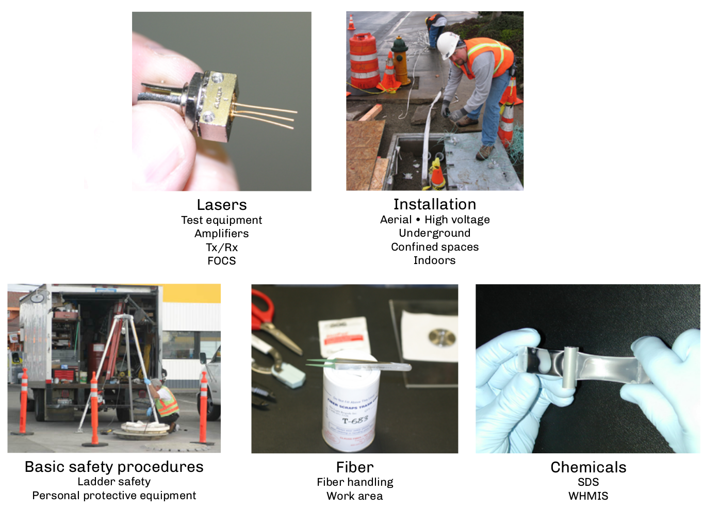
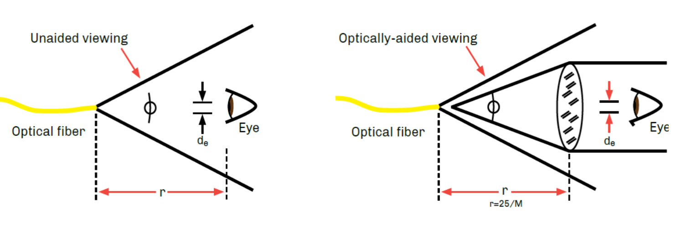
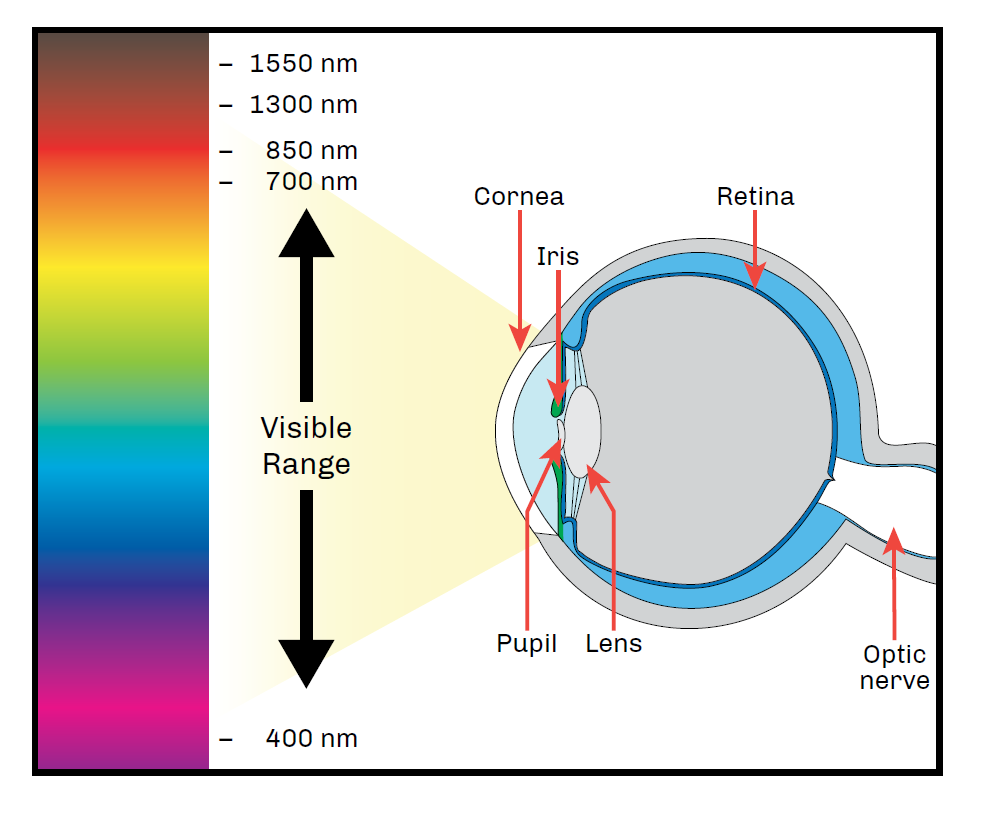
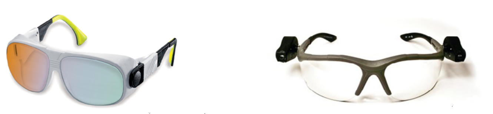
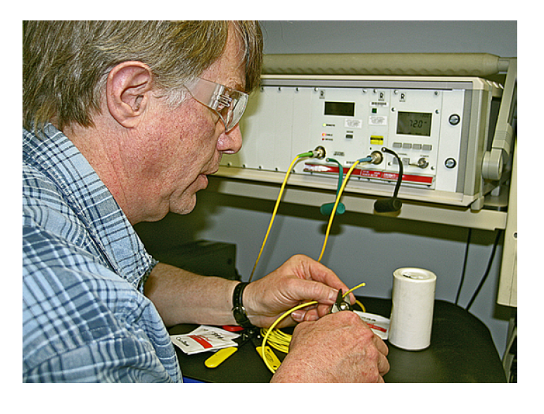
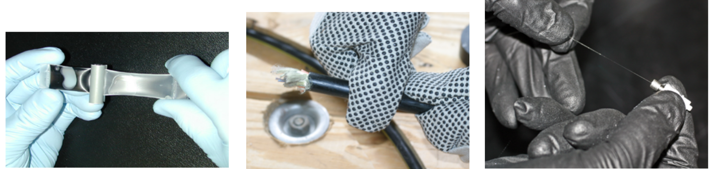

:doctype: book
:title-page-background-image: image:CongruexLogo.png[]

= Chapter 15 - *_Safety Best Practices_*

== Fiber Optics Safety Concerns

== Visual Safety Using Fiber Optic Sources

The following diagrams show how light energy spreads once the optical beam exits the optical fiber. The angle of this spreading is determined by the numerical aperture (NA) of the optical fiber.

The nominal ocular hazard zone (NOHZ) is the distance from the source, fiber, or connector to the eye. The optical power level must not exceed the maximum permissible exposure (MPE), which is the maximum level of optical power that can be safely used. Exposure beyond the MPE can result in injury or biological changes in the eye or skin. The MPE is used to determine the nominal hazard zone (NHZ), the optical density (OD), and the accessible emission limit (AEL).

.Unaided Viewing & Optically Aided Viewing

When using microscopes, the optical beam can be collimated, or refracted to increase the optical density to the eye. New digital scopes are safer, as they show the visual image on their LCD screen. This example shows how the distance from the source, fiber or connector can determine the amount of optical radiation that is received by the eye. The closer to the fiber, the more optical power.

* Nominal ocular hazard zone (NOHZ).
* Distance from source, fiber, or connector to the eye.
* Maximum permissible exposure (MPE).
* Maximum level of optical power that can be safely used.
* Determines NHZ, OD, and AEL.

=== Laser Safety Standards

. North America: ANSI Z.136.2, “Safe Use of Fiber Optic and Free-space Optical Communication Systems Utilizing Laser Diodes and LED Sources”.

. International: IEC 60825-2, “Safety of Optical Fiber Communication Systems”.

== Wavelength and The Eye

.Visible Light Spectrum

=== Visible and Near Infrared (400 nm – 1400 nm)

* Light in these wavelength ranges cause retinal damage.
* Focusing effects of the lens and cornea increase the irradiance on the retina.
* Can be permanent if the laser has a high enough power level.

=== Mid Infrared, Far Infrared, and Far UV (1400 nm – 1 mm)

* The cornea absorbs the light of these wavelengths.
* Causes a temporary denaturation of proteins in the cornea caused by the temperature rise.
* Corneal tissues can regenerate.
* 1550-nm systems apply to this range.

Most fiber optic communication systems (FOCS) use lasers that are low power and rated Class 1. The most dangerous FOCS applications are those using erbium-doped fiber amplifiers (EDFAs) and Raman amplifiers.

=== Laser Classifications

The ANSI Z136.2 standard from the American National Standards Institute addresses the concerns of organizations and personnel involved with the use of fiber optic communications systems. “Safe Use of Fiber Optic and Free-space Optical Communications Systems Utilizing Laser Diodes and LED Sources,” published by Laser Institute of America (LIA), Orlando, Florida, www.laserinstitute.org.

The international laser safety standard is IEC 60825-2, “Safety of optical fibre communications systems”.

The safety practices for working with fiber optics are similar to when working with electricity. Like with electricity, the hazards aren't visibly evident. Most lasers used with fiber optic transmitters and test equipment operate in the infrared range where the beam is invisible to the eye. Viewing an optical beam does not cause pain. The iris of the eye will not close involuntarily as when viewing a bright light.

[cols="1,4,1"]
[%autowidth]
|===
|Type | Risk or Injury | Risk level

|Class 1| Low energy levels, not hazardous to skin or eyes. Safe during normal operation | Low
|Class 1M | Safe during normal operation. May cause eye injury if viewed through optical
instruments | Low-Medium
|Class 2| Visible wavelengths only, blink response provides eye safety. Will not burn skin.| Low-Medium
|Class 2M | Visible wavelengths only, blink response provides eye safety for unaided viewing.
May cause eye injury if viewed through optical instruments. Will not burn skin.| Medium
|Class 3R|Transitional zone between safe and hazardous laser products. Direct viewing of
beam may be hazardous as well as certain specular refl ections.| Medium-High
|Class 3B| Direct viewing and specular refl ections can cause eye injury. Diff use refl ections
usually safe.| High
|Class 4|Can cause severe skin and eye injury through any direct exposure, specular
refl ections and sometimes from diff use refl ections. Oft en a fiber hazard as well.| Extreme|
|===

* Most communication systems use Class 1 lasers. These are considered eye safe because of their low power levels.
* Optical amplifiers can be Class 3 or Class 4 and require optical safety laser eyewear.
* Visible lasers are Class 2 or Class 3R (restricted).
* The best protection against eye damage is to NOT LOOK into the fiber or transmitter ports. The safety practices for working with fiber optics are similar to when working with electricity. Like with electricity, the hazards aren't visibly evident. Most lasers used with fiber optic transmitt ers and test equipment operate in the infrared range where the beam is invisible to the eye. Viewing an optical beam does not cause pain. The iris of the eye will not close involuntarily as when viewing a bright light.

Several factors can determine the safe use of optical sources and fibers. These include:

* Optical wavelength —  The shorter the wavelength, the more dangerous.
* Optical power (mW) —  Lasers emit more power than LEDs.
* Time exposure.
* Distance from the end of the fiber to the eye.
* Ribbon fiber (amount of fibers) —  Closely spaced. Optical multiplexing (DWDM) —  Use Class III optical amplifiers.

== Working with Lasers

=== Accessible Emission Limits (Maximum Power or Power Range)

The maximum power levels or ranges presented below are appropriate for exposure duration’s equivalent to a whole working day (3x104 seconds).

These levels are given for Classes 1, 2, and 3 lasers.

[Cols = "1,1,2,2,3"]
[%autowidth]
|===
|Operating Wavelength|Light Band| Class 1 Retina Safe*|Class 2 Visible Only|Class 3 High Power
|670 nm| Visible| <0.024 mW +
<–16 dBm| ≤0.024 mW ≤1 mW +
≥–16 dBm <0 dBm| ≤1 mW ≤500 mW +
 ≥0 dBm <26.98 dBm
|850 nm| Infrared|  <0.25 mW +
 <–6 dBm| N/A| ≤0.25 mW +
  ≤500 mW≥–6 dBm <26.98 dBm
|1310 nm| Infrared| <4.9 mW +
<6.9 dBm| N/A|≤4.9 mW ≤500 mW +
≥6.9 dBm <26.98 dBm
|1490 nm| Infrared| <9.6 mW +
<9.8 dBm| N/A| ≤9.6 mW ≤500 mW +
≥9.8 dBm <26.98 dBm
|1550 nm| Infrared| <9.6 mW +
<9.8 dBm| N/A| ≤9.6 mW ≤500 mW +
≥9.8 dBm <26.98 dBm
|1625 nm| Infrared| <9.6 mW +
≤9.8 dBm| N/A| ≤9.6 mW ≤500 mW +
≥9.8 dBm <26.98 dBm
|===

=== Potential Problem Areas

* During inspection of fiber ends with microscope, which collimates the laser beam.
* When inspecting a fiber or connector, be sure that the inspection scope has an adequate safety filter and that the transmitter is off.
* Looking into the output ports of an optical transmitter. Many CATV lasers and optical amplifiers are classified as Class 3 lasers and extra precaution should be used when working with these sources. 

* Optical ports should always be capped when not in use.
* When terminating high-powered lasers used on test equipment, be aware of the lo ca tion of access to the other end. Accessible Emission Limits (Maximum Power or Power Range).

[.center]
.Lasers
[cols='1,1,1']
[grid='cols', frame='none']
[%autowidth]
|===
|*Class* |*Type* |*Wavelength*
|Class 1|VCSELs|850 nm
||Fabry-Perot, DFB|1310 nm
|||1550 nm
|||1625 nm
|Class 2| VCSeL| 632-670 nm
|===

[.center]
[grid='cols', frame='none']
.Optical Amplifiers
[cols=1.1]
[%autowidth]
|===
|*Class* |*Type*
|Class 3 |EDFA or Raman
|Class 4 |Combined EDFA and Raman
|===
[grid='none', frame='none']

== Potential Protblem Areas - _continued_
[grid='none', frame=\none\]

|===
a|
.. Inspecting fibers or connectors.
.. Fiber preparation.
.. Transmitter ports. a|
.. Ribbon fibers.
.. Optical test equipment.
.. Public access.
.. Optical amplifiers.
.. Visible lasers.
|===

=== Safety Eyewear

Protective glasses or goggles with appropriate filters can protect the eyes from laser light. The protective goal of laser eyewear is such that if laser radiation strikes the lens portion of the eyewear, the lens will reduce or completely block any transmitted radiation to below the MPE level. Laser protective eyewear is rated for OD which is the base-10 logarithm of the attenuation factor by which the optical filter reduces beam power. For example, eyewear rated as OD 3 will reduce the beam power at the specified wavelength range by a factor of 1,000. One can think of OD as similar to SPF for sunblock. Eyewear must be selected for the specific type of laser, to block or att enuate in the appropriate wavelength range.

.Safety Googles & Laser Eyewear

[grid='none', frame='none']
|===
a|
* Safety glasses for eye protection:
.. Working with fibers.
.. Illumination option.
.. Various styles.
.. Goggles.
.. Side shields. a|
* Laser eyewear:
.. Reduces or completely blocks any transmitted radiation to below the MPE level.
* Rated for optical density (OD).
.. Base-10 logarithm of the attenuation factor by which the optical filter reduces beam power.
* Three key elements.
.. Optical power level.
.. Viewing conditions.
.. Wavelength.
* Wavelength and OD must be labeled.
|===

[%autowidth]
|===
|*OD* >|*Attenuation* | *Transmission*
|1 >| 10| 0.1
|2 >| 100| 0.01
|3 >| 1,000| 0.001
|4 >| 10,000| 0.0001
|5 >| 100,000| 0.00001
|6 >| 1,000,000| 0.000001
|===

=== Working with Optical Fibers

During the process of testing, splicing and connectorizing fibers, a great quantity of work is done with optical fibers. Proper handling and disposal of these strands is important! Prevention is the best posture to use when working with or around optical fiber. Fiber can penetrate the skin and become irritating. You may also find that you cannot locate the imbedded fiber because of its clarity. The best method for removal is the use of Tefl on™-tipped safety tweezers.

.Tefl on™-tipped safety tweezers

=== Prevention

. Use a dark chemical resistant work mat, table or workbench when working with optical fibers. The dark surface makes it easier to contrast glass fibers and chips. New portable cable tables are available that are specifically designed for fiber optic technicians and splicers.

. The wearing of safety glasses is a good idea should any glass chips break off during the scribing process, especially during splicing and connectorization disciplines. For those working in laboratories,
manufacturing or with high-power lasers, specific types of optical eye wear are available for protection from specific wavelengths.

. The potential for ingestion. Do not eat or drink at or near the work area. Dropping fiber strands on a work surface may just be the place where your partner sets their donut and coffee down. When the
donut is picked up, a “silica sandwich” has been digested.

. Safely dispose of your fiber debris. Putting into garbage cans may cause accidental injury to cleaning staff. Do not throw fiber debris into raised computer or vault floors. These are pressurized and could cause accidental eye injury to workers lifting floor tiles. Proper disposal and handling are the best working methods. Place the chips in small plastic bottles, or wrap a piece of tape around itself with the strands placed on the inside and safely dispose of them in a sealed plastic bag.

. Good lighting and visibility are critical.

. Wash your hands after working with optical fibers. Never rub your eyes without washing first.

. Always clean up your work area. This way the work environment will be safe for everyone.

== Personal Protective Equipment

. Clothing for manufacturing:
.. Lab coats and aprons.
.. Shoe covers.
.. Face masks, hairnets, and caps.
.. Gloves.

. Clothing for installation:
.. Boots.
.. Hardhats.
.. Gloves for fiber and cable handling.

. Breathing apparatus:
.. Respirators selected for specific particulates and coverage.

=== Safety Gloves

* When working with chemicals:
* Material must be compatible with chemicals used.
* Some people have latex allergies.
* Nitrile recommended due to puncture and chemical resistance.

* When prepping cables:
* Puncture resistance for strength members and armor.
* When working with optical fibers:
* Options on colors, thickness, comfort, and allergies.
* Darker colors recommended for best contrast against fibers and debris.
* Disposable.
* Must have tactile sensitivity due to small size of fibers.
* Textured surface on fingers for holding fibers.

Materials:

* `Nitrile` – Recommended. Best puncture and chemical resistance. Available in different colors.
* `Chloroprene` – Better moderate puncture and chemical resistance than latex.
* `Latex` – Superior elasticity and tensile strength. May cause allergic reaction.
* `Vinyl` – Should not be used with chemicals.

== Chemicals

A variety of chemicals are commonly used in the manufacturing and installation of fiber, cable, connectors and splices. Each chemical requires a safety data sheet (SDS) to be supplied by the manufacturer or supplier.

=== Products that Require SDS

. `Isopropyl alcohol`:
Used for cleaning of optical end faces and connectors. Disposable towelettes (e.g., optic pads or alcoholsaturated pads) are sometimes easier as they are available in small disposable packages.
. `Epoxies/anaerobic adhesives`:
Used in the connectorization process. Be aware of the date codes on the packages for product expiration.
. `Gel removers and cable gels`:
Used in installations and inside cables. If a technician’s hands, arms, etc., are exposed to the various chemicals in these solutions, thoroughly wash the aff ected areas.
. `Cable lubricants`:
Used to reduce friction in cable installations inducted systems. Spills create the potential for falls and injury. Should a spill take place, the location should be barricaded until it is cleaned up. A temporary
measure could be pouring sand or dirt on the spill until proper cleanup can take place.

=== Uncommon Stripping Agents

Early fibers used different coating materials instead of the acrylate coatings used today. In many cases, the coating had to be dissolved chemically because it couldn't be mechanically stripped. If some of this old fiber is encountered it may require chemical stripping.

. `Methylene chloride`:
This chemical is now rarely used in fiber optics because coating technologies improved allowing mechanical stripping. The applications involving methylene chloride are when buffer coatings must be removed from the fiber prior to splicing or connectorization.
. `Acetone`:
Used to clean off light buffer coatings. Best to use after mechanical or chemical (methylene chloride) stripping to assure a clean fiber surface. If acetone is hard to locate, use fingernail polish remover
(90% acetone based).

== Safety Data Sheets (SDS)

In 1985, the Occupational Safety and Health Administration (OSHA) of the Department of Labor issued standards for chemical manufacturers, importers, and distributors. OSHA identifies a hazardous chemical as one that has a physical and/or health hazard. Concerns such as flammability, combustibility, vapor or irritability are addressed.

A document known as the safety data sheet (SDS) establishes uniform requirements to assure that hazards of all chemicals used by manufacturing employees in the United States are evaluated and that this hazard information is then transmitted to employers and employees. The SDS is a technical bulletin detailing information about the physical or health hazards of a chemical or mixture. SDS were known as material safety data sheets (MSDS) until 2012.

Another OSHA’s safety regulation known as Standard 29 CFR Telecommunications 1910.268 set forth safety and health standards that apply to the work conditions, practices, means, methods, operations, installations, and processes performed at telecommunications centers and at telecommunications field installations.

Workplace Hazardous Material Information System (WHMIS) is implemented in Canada through coordinated federal, provincial, and territorial legislation. The Department of Health (Health Canada) administers the Hazardous Products Act, which includes suppliers’ labelling and SDS requirements.

If a material contains 1% of an ingredient that is considered hazardous, the entire mixture is considered hazardous under the definitions. This same rule applies if the material contains only 0.1% of a material identified as a known or suspected carcinogen, whether human or animal.

=== Hazardous Materials Safety

All products should be labeled with information on the safe storage and handling of the chemical, as well as instructions in case of contact, swallowing, etc.

* When using chemicals, a training program encompassing the following should be provided:
.. Location of the SDS information.
.. Handling concerns of each solution.
.. Storage and disposal of these solutions.
.. Procedures for personal protection (clothing, eye wear, practices, etc.).
.. Proper clean-up procedures.
.. Incompatibility issues.
.. Reporting practices for supervisory personnel

== The Work Area

Before starting an installation involving placing, splicing or termination, the public and the workers must be provided with a safe environment. In many cases, local govern ments or company policies will establish the proper safety requirements. The following are a few areas to consider:

* Guarding and protecting work areas.

* Testing and ventilating confined spaces and avoiding exposure to possibly harmful substances. The ANSI Z117.1 standard establishes the minimum safety requirements to be followed when entering, exiting and working in confined space operations. The standard includes definitions, identification, evaluation, atmospheric testing, isolation and decontamination, lockout and tagout, personal protection equipment, safeguarding, warning sign requirements, confined space permits, non permit requirements, and emergency response and rescue plans.

* Precautions pertaining to smoking or the use of open flames.
* Removing and replacing manhole covers.
* Wearing of appropriate safety equipment and clothing.
* Ladders.
* High voltage. When working near energized power lines, be aware of the safety hazards posed byinduction and flashover. Be careful to remain outside the minimum approach distances as outlined in national electric safety codes.
* Personal protective equipment (PPE), clothing, and eye wear

[grid='none', frame='none']
|===
a|
* The indoor work area.
.. Ventilation.
... Location.
... Air pressure.
.. Flooring should be smooth with no seams.
... No carpeting.
.. If above raised flooring, the system must be turned off prior to opening tiles.
.. Possible eye damage from fiber chips.
.. No fabric on chairs and stools.
.. Safety signage.
... Fiber debris.
... No food or drink.
... Laser signs, if used.
... SDS location.
* Safety clothing. a|
* The outdoor work area.
.. Work area should be safe, clean,and organized.
.. Good lighting.
.. No food or drink
.. Dark work surface.
... Chemical resistant.
... Nonreflective.
.. Personal protective equipment.
* Safe cable handling.
.. Sharp tools.
.. Cutting techniques.
.. Work clothes and gloves.
.. Sealing cable ends.
.. Proper disposal of debris.
.. Work table.
|===

== Installation Practices

Use the standard safety practices and awareness that your job skills require and show concern for those who do not have knowledge of the potential hazards. Work with your safety officer regarding any questions or concerns you may have.

. `Tools`:
Scissors, cutters, tweezers and cleaving tools can all have sharp points and edges. Careful handling of these instruments and proper storage should minimize any po ten tial hazards.

. `Pulling lubricants`:
Lubricants used for fiber optic installations can be extremely slippery. Spills should be cleaned up immediately to prevent falls.
. `Mechanical tools`:
During cable installations, cables are installed using capstans, winches and other devices. These devices are all moving and may have a great amount of tension being applied to the pulling eye and/or swivel,
and can be a potential hazard to personnel working with them. Follow all safety procedures by the manufacturer and your own company's safety guidelines.
. `Fusion splicing`:
Fusion splicing machines involve the use of an electrode arc for fusing the optical fibers together. In highly-electrified areas such as vaults, this arc could cause an explosion.
. `Cable placement`:
Hazards for cable placement include heavy equipment, cable pulling tension, ladder safety, proximity to high voltage, trench cave-ins, and confined spaces.
. `Cable stripping`:
Concerns when stripping cable include tools, tool forces, and metallic cable elements.
. `Safety standards`:
Always follow installation safety standards. In North America, follow the National Electrical Safety Code. Outside of North America, follow your local guidelines.
. `Aerial installations`:
When performing an aerial installation, consult IEEE-524 for information on high voltage safety. Ladder and bucket trucks should have regular inspections and fall protection. Weight limits and proper
positioning should also be keep in mind.
. `Direct buried installations`:
When performing a direct buried installation, be sure meet shoring requirements during trenching and/or excavation. Call to locate any underground utilities.
.  `Ducted installations`:
Take care with cables under tension.

== Cable Installation Safety Issues

When placing aerial or underground fiber optic cable, crew safety is of utmost importance. All precautions and safety requirements of the respective company must be followed. When required, warning signs and cones must clearly define the work area in order to safely channel traffic. On streets and highways, always place the cable in the same direction as the flow of traffic and place flagmen to direct traffic.

As stated in NESC Section 42, all crew members should have the appropriate tools and personal protective equipment to properly perform the job. Installation of the cable without the proper equipment may put personnel and the cable at risk.

When placing ADSS or OPGW on active structures, or structures involving power crossings, observe the safety precautions outlined in the company's applicable procedures. When pulling up and tensioning self-supporting cable, observe the same precautions used when pulling up and tensioning metallic phase conductors or any other aerial cables. When aerial lift equipment is used to place self-supporting cable, all
precautions and instructions outlined for placement of phase conductors must be observed.

Although ADSS is an all-dielectric cable, some conductivity can result from moisture on the cable and in the surrounding air. As a precaution in high voltage environments, it is recommended that the installed cable and metallic attachment hardware are grounded prior to touching. For cables installed in other situations, the NESC should be consulted for recommendations. The cable can be classified as either a fiber optic supply or fiber optic communications cable, and should meet the requirements for an effectively grounded neutral as defined in NESC Rule 230E1. The precautions in the following paragraphs must be observed to ensuresafety during and after the cable installation.

In high voltage transmission applications, leakage current can be induced onto ADSS and attachment hardware even when the cable is a relatively long distance from the phase conductors. ADSS manufacturers can calculate the leakage current based upon the cable position relative to the phase conductors and to the ground, the transmission voltage, and the surface resistivity of the cable jacket. The cable surface resistivity is dependent on the moisture and contaminants on the cable. A clean, dry cable has a surface resistance of ~10 MΩ/meter and a dirty, wet cable has a surface resistance of ~4-6 MΩ/meter. Do not install cables on active high voltage transmission towers during wet environmental conditions.

OPGW cable is a metallic conductor. Thus the same safety rules associated with stringing power conductor are applicable. Safe approach to active conductors and the potential for flashover to the OPGW must be considered and the appropriate work rules applied. Specific safe approach distance to active phase conductors are defined in the NESC work rules sections 43 and 44. The safe approach distance is different for electrical personnel and telecommunications personnel. The values listed should be the minimum safe approach distance to active phase conductors.

For all cable installation, underground or aerial, working tensions of the cable pulling and the cable tensions of the cable sag process must consider the safe working load of the associated equipment and tools. Safety margins of a minimum of 50% should be considered. Grounding and protection of personnel of the installation apparatus is a must. Adequate electrical protection must be established at all work sites. The method required and the equipment used will be determined by the degree of exposure to electrical hazards and the soil conditions at the site. All metallic equipment, hardware, anchors, and structures within such work sites must be common bonded together, and then grounded to ensure worker safety.

== Aerial Safety Issues

Crew safety is of the utmost important when placing fiber optic cable. When placing aerial cable, all precautions and safety requirements of the respective company shall be followed. When required, use of warning signs and traffic warning cones shall clearly define the work area to safety channel the traffic. On streets and highways, always place the cable in the same direction as the traffic flow and use flagmen to control traffic.

All crew members should have the appropriate tools and personal protective equipment to properly perform the job. Installation of the cable without the proper equipment may place personnel and the cable at risk.

When placing aerial cable on active structures, or structures involving power crossings, observe the safety precautions outlined in your company's applicable procedures. When pulling up and tensioning self-supporting cable, observe the same precautions used when pulling up and tensioning any other aerial cables. When aerial lift equipment is used for placing self-supporting cable, all precautions for placing phase conductors, as well as the instructions covering the equipment must be observed.

Although aerial cable is all-dielectric, some conductivity can result from moisture on the cable and in the surrounding air. As a precaution in high voltage environments, it is recommended that the installed cable and metallic attachment hardware are grounded prior to touching. For cables installed in other situations, the National Electric Safety Code (NESC) should be consulted for recommendations. The cable can be classified as either a “fiber optic supply” or “fiber optic communications” cable, and meets the requirements for an effectively grounded neutral as defined in NESC rule 230E1. The precautions in the following paragraphs must be observed to assure safety during and after the cable installation.

Leakage current can be induced onto aerial cable and attachment hardware even when the cable is a relatively long distance from the phase conductors. Manufacturers can calculate the leakage current based upon the cable position relative to the phase conductors and to the ground, the transmission voltage and the surface resistance of the cable jacket. The cable surface resistance is dependent on the moisture and contaminants on the cable. Since a clean, dry cable has a surface resistance of 1014 Ω/ft and a dirty, wet cable has a surface resistance of 106 Ω/ft. *Do not install cables on active towers during wet environmental conditions.*

When the cable is too close to the phase conductors, a scintillation can occur through the air from phase conductors to the cable. This scintillation from a phase conductor to ADSS cable can occur only when the resistance of the cable sheath to the grounding location is low enough to lower the induced voltage. In the worse case condition, the cable resistance is zero, at which time it will be similar to a grounded metal rod. A grounded rod configured in air has a flashover voltage of 15 kV/in for large gaps. Hence, the safe approach distance to keep the phase conductors away from the ADSS cable can be calculated by:

[.text-center]
SD = E/15

where SD = distance (inches), and E is the phase-to-ground voltage (kV).

[NOTE]
The work rules of the NESC section 43 and 44 should be used to determine safe approach to live systems.

Specific safe approach distance to active phase conductors are defined in the NESC work rules sections. The safe approach distance is different for electrical personnel and telecommunications personnel. The
values listed should be the minimum safe approach distance to active phase conductors.

== Aerial Safety Issues

=== Wet/Rainy Weather Conditions

When splicing ADSS cable during wet or rainy conditions near active high voltage phase conductors, it is advised to ground the cable between the work area and the spans (such as at the attachment hardware). This will prevent dangerous leakage currents and transients from flowing through personnel. In dry weather, there is little induced charge on the cable; however as a personnel safety practice, the cable should be grounded between the work area and the spans.

When the cable is wet, the resistance to ground is low near the tower or grounded structure, so there is little voltage potential on the metal grips or cable at these points. However, at distances of 10 or 15 feet or further from the metal grips, a voltage potential may exist. To avoid dangerous electrical hazards, *ground the cable within 3 to 5 feet on both sides of the area to be touched.*

=== Dry Weather Conditions

When the cable is suspended by insulators or on wooden poles, a voltage potential may be induced in the metal suspension grips and support hardware. To avoid dangerous electrical shock, *ground the metal grips before touching*. The cable can be touched anywhere when it is dry, because there is little charge induced on the small area that is touched.

=== Scintillation

Careful selection of the suspension position of the ADSS cable prevents dangerous scintillation. Scintillation is a surface arc that may pose a cable and personnel hazard. These scintillations occur mainly at the attachment points of the cable; therefore, minimum clearance between the cable and phase conductors should be determined at this point. The separation and clearance requirements for ADSS cable is found in the NESC section 230.

The recommended position must be such that there will be no contact between the ADSS cable and the phase conductors or static wires, either during installation or under maximum environmental load conditions. If during a rare case of galloping conductors contact should occur, there may be a potential for scintillation. However, the potential for subsequent cable damage is minimal. Adequate electrical protection must be established at all work sites. The method required, and the equipment used, will be determined by the degree of exposure to electrical hazards and the soil conditions at the site. All metallic equipment, hardware, anchors and structures within such work sites must be common bonded together, and then grounded to assure worker safety.
