:doctype: book
:title-page-background-image: image:CongruexLogo.png[]

= Chapter 2 - *_Transmission Theory_*

== The Electromagnetic Spectrum

:figure-caption: Figure
:table-caption: Table

The electromagnetic (EM) spectrum is the range of all types of EM radiation. Radiation is energy that travels and spreads out as it goes --- the visible light that comes from a lamp in your house and the radio waves that come from a radio station are two types of electromagnetic radiation. The other types of EM radiation that make up the electromagnetic spectrum are microwaves, infrared light, ultraviolet
light, X-rays and gamma-rays.footnote:[https://imagine.gsfc.nasa.gov/science/toolbox/emspectrum1.html]

.Electromagnetic Spectrum.
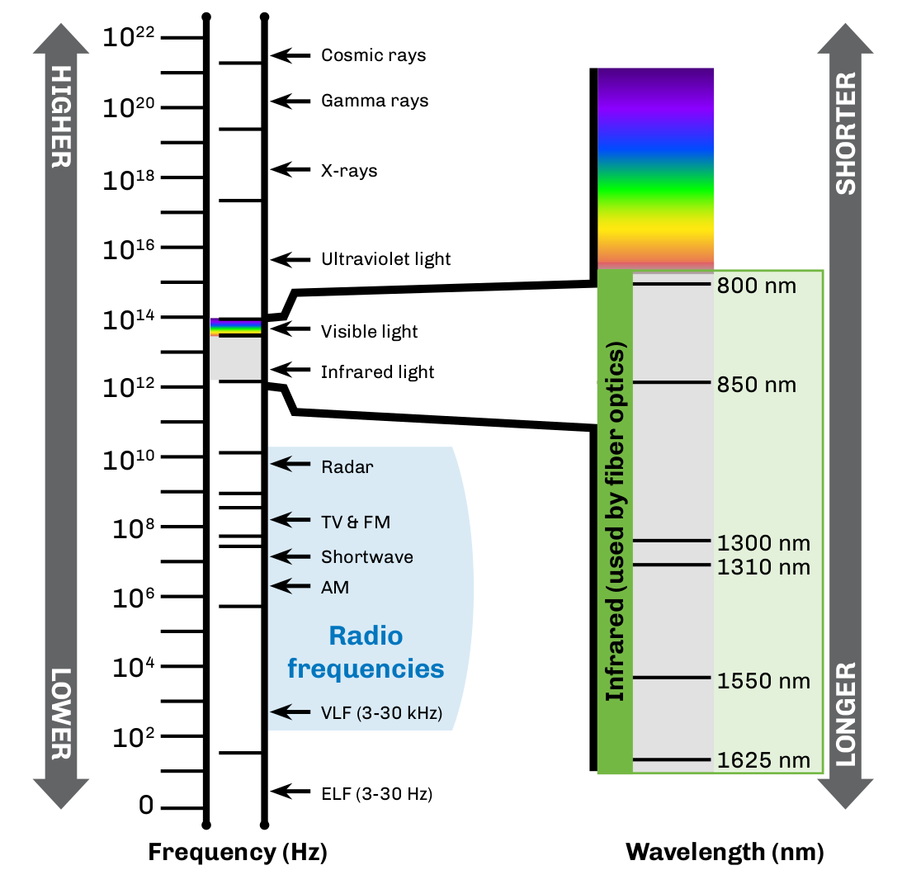

Light operates in a higher frequency and shorter wavelength than radar,TV, and radio. Fiber optic uses visible and infrared light.

=== Standard Transmission Wavelengths

Fiber optics typically uses the transmission wavelengths between 770 nm and 1675 nm. These infrared regions, which are invisible to the human
eye, are where optical signal loss is lowest.

* Multimode fiber typically transmits at 850 and 1300 nm.
* Single-mode fiber can transmit between 1260 nm and 1650 nm, but typically uses 1310 nm and 1550 nm.

== Fiber Optic Transmitters

A fiber optic transmitter consists of a modulator of some type and either a light-emitting diode (LED) or laser light source. The transmitter modulates the light source to convert the electrical signal ---  Ethernet, SONET, RF, and the like ---  to an optical signal. For example, using a simple binary on/off keyed digital signal, it converts this information into optical light pulses by turning the light source on (bright) and off (dim) in the correct sequence, and then launches the resulting signal into an optical fiber.

.Optic Receiver & Transmitter.
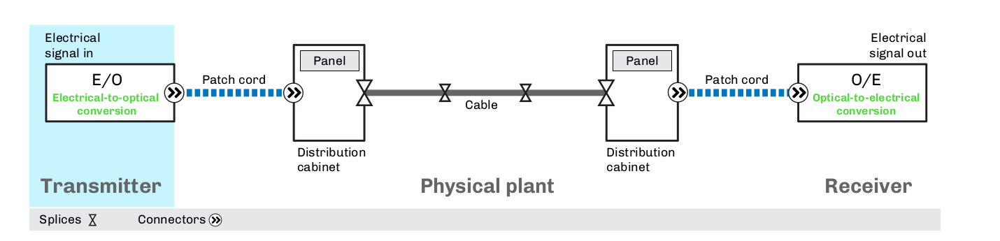

=== Functions

The fiber optic transmitters do the following:

* can use a light-emitting diode (LED) or a laser diode
* converts electrical signals into optical signals
* launches the optical signals into the fiber.

== Multimode Systems

Multimode optical fiber is a type of optical fiber used most often for communication over short distances ---  within a building or on a campus. It can be used for data rates up to 100 Gb/s. Multimode fiber has a fairly large core diameter, enabling multiple light modes to be
propagated and limiting the maximum length of a transmission link by modal dispersion. The standard `G.651.1` defines the most widely used
forms of multimode optical fiber.

.Propagation of light energy in Multimode fiber Systems.
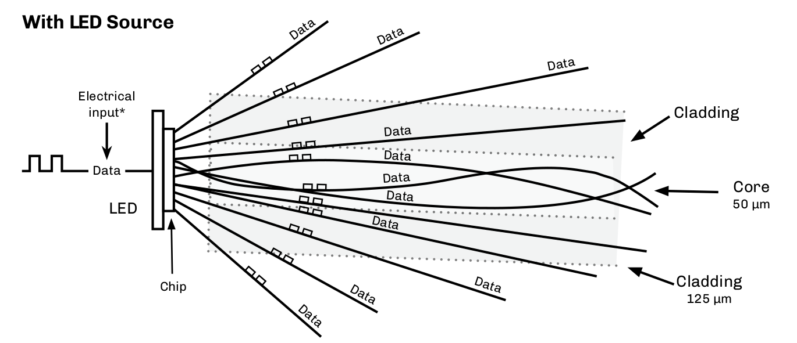

=== LED Source

Light energy propagates as hundreds of modes in a multimode fiber, each carrying the same data. Light emitting diodes (LEDs) are limited to
maximum modulation rates of slightly less than one Gb/s. A laser must be used for greater speeds.

=== VCSEL Source

Vertical cavity surface emitting lasers (VCSELs) in transmission and test equipment can launch more (or less) optical energy into the outer
core, impacting bandwidth and signal loss.

.VCSEL Source.
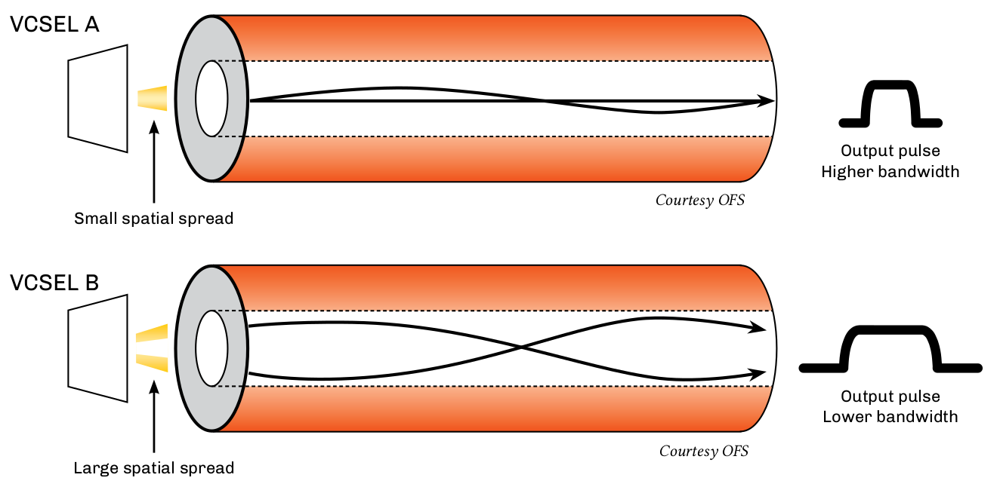

== Single Mode System - Laser

Single mode fibers have a core of approximately 8-9 microns and a cladding diameter of 125 microns. Early point-to-point (P2P) single-mode
systems operated at 1310 nm and 1550 nm. Long haul P2P systems migrated to the 1550-nm window ---  since optical amplifiers function within that spectrum ---  or operate at multiple wavelengths closely spaced at or near 1550 nm. Many other wavelengths are used in coarse wavelength division multiplexing (CWDM) and fiber-to-the-premises (FTTx) systems.

.Laser Source.
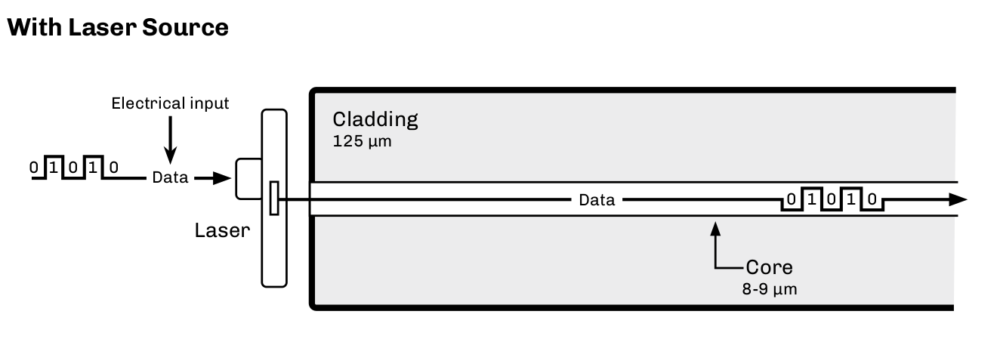

Single-mode fibers have a core of approximately 8-9 microns and a cladding diameter of 125 microns.

Early point-to-point (P2P) single-mode systems operated at 1310 nm and 1550 nm. Long-haul P2P systems migrated to the 1550-nm window (since optical amplifiers function within that spectrum), or operate at multiple wavelengths closely spaced at or near 1550 nm. Many other wavelengths are used in coarse wavelength division multiplexing (CWDM) and fiber-to-the-premises (FTTx) systems. 

* Fabry-Perot (FP) laser
** Relatively broad spectrum (3-5 nm)
* Distributed feedback (DFB) laser
** Narrow spectrum (<0.1 nm)
** Sensitive to reflections

== The dBm Scale

`dBm` is an abbreviation for `dBmW`. It is one decibel (dB) relative to one milliwatt (mW) of power. Using a logarithmic scale is a convenient
way to express very large and very small levels with small numbers.

[grid="none", frame="none"]
|===
|*dBm* +
*Used to express the optical power in a fiber optic system* +
An absolute logarithmic measurement of optical power relative to
1 mW of optical power|
*dB* +
*Used to express optical loss,gain, and reflection* +
dB values are obtained by calculating the difference between input power and output power
|===

[.text-center]
`dBm +/– dB = dBm` +   
`dBm +/– dBm = dB`

* Any dBm value less than zero, for example, -3 dBm, is less than 1 mW of power. Any dBm value greater than zero is more than 1 mW of power.

* A 10 dB increase is a gain equal to 10X the original power. A 10 dB decrease is a gain equal to 1/10th (10%) the original power.

* An increase of 3 dB is double the power. An decrease of 3 dB is half the power.

[width="100%",cols="22%,42%,36%",options="header",]
|===
|dBm |Milliwatts |Watts
|30 |1000 |1
|20 |100 |0.1
|10 |10 |0.01
|0 |1 |0.001
|–3 |0.50 |(500 µW)
|–4 |0.40 |(400 µW)
|–6 |0.25 |(250 µW)
|–7 |0.20 |(200 µW)
|–10 |0.10 |(100 µW)
|–20 |0.01 |(10 µW)
|===

== Fiber Optic Receivers

Optical detectors ---  photo diodes and photo detectors ---  perform the reverse function of the transmitter. They convert incoming optical
signals ---  light pulses ---  into electrical signals which are then processed with conventional circuitry within the optical receiver. The
converted signal is amplified and sent to a data decoder or demodulator that converts it into voice, video, or data.

.Fiber Optic Receivers.

* The photodiode or photodetector in the receiver converts the optical signal back into an electrical signal.
* Receivers will have a “sensitivity” range of powers that they can accept.

== Loss and Attenuation

The loss of optical signal in a fiber is measured in dB, or decibels. The term “decibel” derives from the prefix “deci” from the Latin term “decimus” meaning “tenth,” and “Bell” after Alexander Graham Bell. This is why in its abbreviated form, the “d” is always lowercase and the “B” is always capitalized.

dB is both a logarithmic function and a relative value that is used todenote the decrease of optical power between two points (attenuation), or the percentage of the signal reflected by an optical component such as a connector (reflection).

.Logarithmic function.
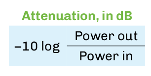

[.lead]
Light Loss Measurement

* Represents the ratio of signal gain or loss.
* Loss, gain, and reflectance are expressed as “dB”.
* Attenuation in optical fiber is expressed in decibels per kilometer, or dB/km, at a given wavelength.
* Sample values:
** Single-mode fiber attenuation: 0.35 dB/km @ 1310 nm
** Multimode fiber attenuation: 3.0 dB/km @ 850 nm
** Connector loss: 0.5 dB

.Signal Loss CHart.
[cols=",,",options="header",]
|===
|dB |Throughput |Loss
|0.00 |100.0 |0.0
|0.01 |99.8 |0.2
|0.02 |99.5 |0.5
|0.05 |98.9 |1.1
|0.1 |97.7 |2.3
|0.15 |96.6 |3.4
|0.2 |95.5 |4.5
|0.25 |94.4 |5.6
|0.3 |93.3 |6.7
|0.4 |91.2 |8.8
|0.5 |89.1 |10.9
|0.6 |87.1 |12.9
|0.7 |85.1 |14.9
|0.8 |83.2 |16.8
|0.9 |81.3 |18.7
|1.0 |79.4 |20.6
|1.1 |77.6 |22.4
|1.2 |75.9 |24.1
|1.3 |74.1 |25.9
|1.4 |72.4 |27.6
|1.5 |70.8 |29.2
|1.6 |69.2 |30.8
|1.7 |67.6 |32.4
|1.8 |66.1 |33.9
|1.9 |64.6 |35.4
|2.0 |63.1 |36.9
|3.0 |50.1 |49.9
|4.0 |39.8 |60.2
|5.0 |31.6 |68.4
|6.0 |25.1 |74.9
|7.0 |20.0 |80.0
|8.0 |15.8 |84.2
|9.0 |12.6 |87.4
|10.0 |10.0 |90.0
|15.0 |3.2 |96.8
|20.0 |1.0 |99.0
|25.0 |0.3 |99.7
|30.0 |0.1 |99.9
|35.0 |0.03 |99.97
|40.0 |0.01 |99.99
|45.0 |0.003 |99.997
|50.0 |0.001 |99.999
|===

== Attenuation

.Loss and Attenuation.
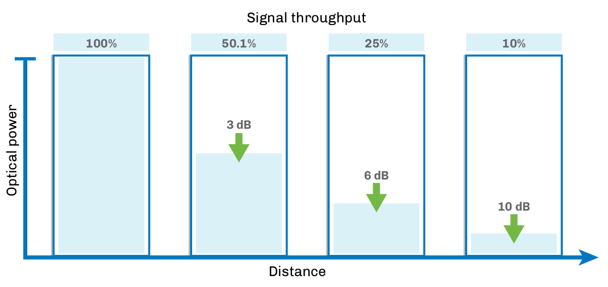

Attenuation is the loss of light or power in an optical signal. As the signal is transmitted along the medium (the fiber), a percentage of the signal is lost. The amount of loss that occurs varies based on thetype of fiber and the operating wavelength. The longer the wavelength, the lower the attenuation.

Attenuation in optical systems can be identified as _intrinsic_ or _extrinsic_. Intrinsic attenuation is inherent or _built into_ the fiber material and the cabling and manufacturing processes. It cannot be changed. Extrinsic attenuation results from outside factors such as bends in the fiber. Components such as connectors, splices, and splitters add their own attenuation, both intrinsic and extrinsic. Most components in a fiber network have maximum attenuation ---  loss ---  values recommended by the standards, nominal loss values for planning and design, and then _real world_ or actual loss values confirmed by testing.

[.text-center]
=== Optical Power Loss
.Power can be lost anywhere in the network.
[grid="none", frame="none"]
|===
|*Fiber* +
*Intrinsic* +
• Absorption + 
• Scattering +
*Extrinsic* +
• Macrobends +
• Microbends +
*Other* +
• Attenuators +
• Splitters/couplers|*Splices* +
*Intrinsic* +
• Core and cladding ovality +
• Fiber defects +
• Core/clad eccentricity +
• Core diameter mismatch +
• Profile mismatch +
*Extrinsic* +
• Misalignment of cores +
• Distortion of core during fusing|
*Connectors* +
*Intrinsic* +
• Core and cladding ovality +
• Fiber defects +
• Core/clad eccentricity +
• Core diameter mismatch +
• Profile mismatch +
*Extrinsic* +
• Polish quality +
• Undercut +
• End separation +
• Center radius/core mismatch +
• Fiber/ferrule diameter tolerance +
|===

== Intrinsic Attenuation

=== Rayleigh Scattering

This effect is caused by undissolved particles, boundary roughness, refractive index fluctuations, and other intrinsic molecular or optical impurities introduced into the fiber during the manufacturing process.

Rayleigh Scattering has the following characteristics.

* Caused by the interaction of light with the molecular structure of the fiber.
* Causes light to be scattered in all directions.
* Small amount of light is captured by the core and reflected back to the source.
* Referred to as _backscatter_.
* OTDRs work partially on this principle
* Decreases as wavelength increases.

Scattered light is reflected in all directions. A small portion of this light is captured by the fiber core and returned back to the optical source. This backscattered light is used by optical time-domain reflectometers (OTDRs) to perform optical measurements. The OTDR measures this light and displays it as attenuation.

.Backscattered Light.
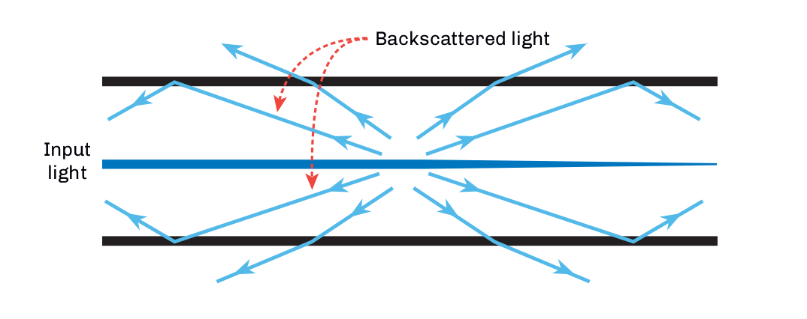

=== Absorption

Absorption creates loss in the fiber by absorbing light energy and converting it to heat. The amount of absorption also varies with
wavelength and depends upon the composition of the glass.

.Diagram shows loss in fiber due to absorption.

* Caused by the interaction of the light with the molecular structure of the fiber.
* Creates loss by absorbing light energy and converting it to absorptionheat.
* A fiber may exhibit isolated regions of spectrum (wavelengths) with very high absorption (and attenuation) due to OH- (water) content in the fiber.
* Absorption becomes a more significant mechanism at wavelengths above 1550 nm.

== Lightwave Transmission

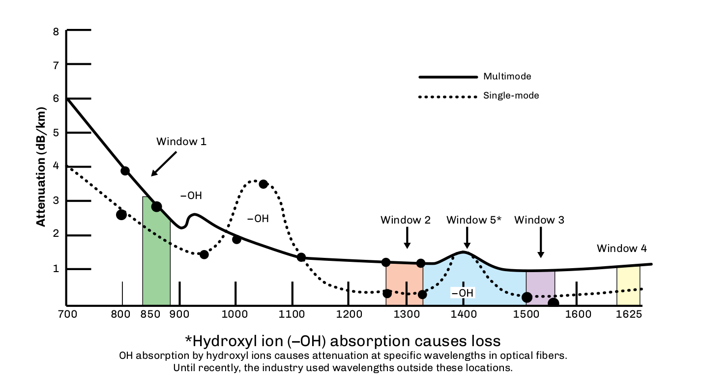

`Wavelength (nm)` – Technically the distance between peaks of a given color of light, each wavelength corresponds to a unique frequency of electromagnetic energy. Wavelengths used in optical communications are in the infrared spectrum, so are invisible to humans. Early point-to-point systems operated at 1310 nm and later 1550 nm to take advantage of low loss. Long-haul systems use multiple wavelengths near 1550 nm to take advantage of optical amplification. FTTx systems may use two wavelengths on the same fiber, for example, 1310/1490 nm, operating in different directions.

`Windows` – Wavelength regions of relatively low loss on the fiber were initially referred to as windows (of operation). The first window was near 850 nm, the second window was near 1300 nm, and 50-µm fibers operated as multimode fibers at those wavelengths. A 9-µm core fiber would operate as a single-mode fiber in the second window, but we refer to single-mode operation here as 1310 nm (as distinct from 1300 nm).
Single-mode fiber also operated in the third window, near 1550 nm.

`Bands` – The single-mode spectrum is further divided up into bands.

.Band, Wavelength & loss.
[cols="1,2,4"]
|===
|Band | Wavelength | Description
|O Original | 1260-1360 nm | Relatively low loss fiber region with low-cost transmitters available.
|E Extended | 1360-1460 nm | Band centered on the high-loss 1383-nm water peak. Usually avoided (the “excluded” band) unless low water peak fiber is installed.
|S Short | 1460-1530 nm | Low loss region not suited to amplifier operation.
|C Conventional | 1530-1565 nm | Lowest loss region where C-band amplifiers can operate.
|L Long | 1565-1625 nm | Lowest loss region where L-band amplifiers can operate.
|U Ultra long | 1625-1675 nm | Used for monitoring and testing. Most susceptible to fiber bending loss.
|===

== Extrinsic Attenuation

Macrobending occurs when transmission loss increases because the fiber radius has decreased to the point that light rays begin to pass through the cladding boundary. These fiber rays reflect at a different angle, creating a circumstance where higher-order modes are refracted into the cladding and escape. As the radius decreases, attenuation increases. Excessive bending of a fiber will ultimately cause it to break.

The increase in attenuation due to bending will depend on the fiber type, design, and operating wavelength. 

.Macrobending Loss.
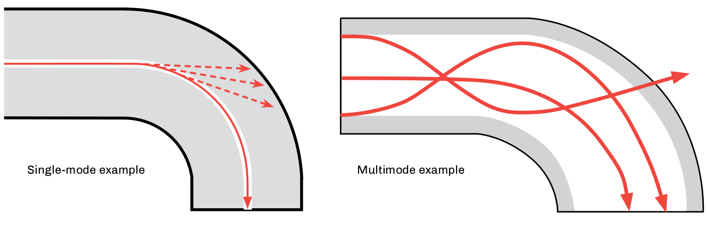

Higher wavelengths are more susceptible to bending losses than lower wavelengths. Single- mode bend-insensitive (BI) fibers can be used in patchcords, pigtails, in-building installations, and drop cables where bending and handling are more likely. They can be specified for FTTx, RFoG and other systems designed to operate in the region above 1550 nm. Bend-insensitive multimode fibers (BI-MMF) are also widely available for specific applications.

.Microbending Loss.
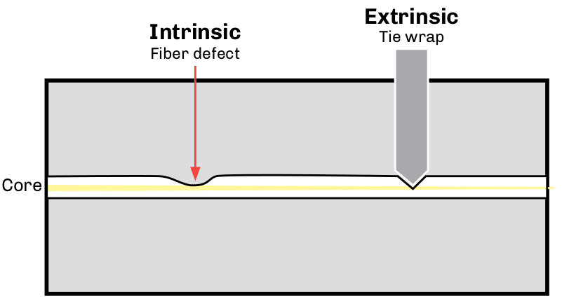

Microbending losses are caused by deviations of the core/cladding boundary. Stresses on an installed cable from tie wraps, clamps, or sharp rocks can also cause microbends.

NOTE: Single-mode fibers are particularly sensitive to macrobending and microbending losses. If the fiber exhibits higher loss at 1550 nm than at 1310 nm, it identifies bending or some type of stress as the cause.

== Refraction

Refraction is the bending of a beam of light as it passes through the boundary between two materials that have two different densities. Light is only refracted when it enters into the new material at an angle. If the light travelled straight down, it would continue straight down and not refract.

.Refraction through air and water.
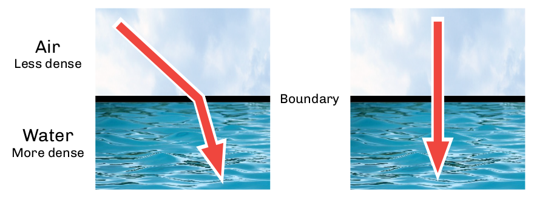

=== Speed of Light

Light travels at different speeds through different materials. The lower the density of the material – its index of refraction (n) ---  the faster the light will travel through it. Light moves the fastest in a vacuum, and slower through materials with higher densities.

.Speed of light.
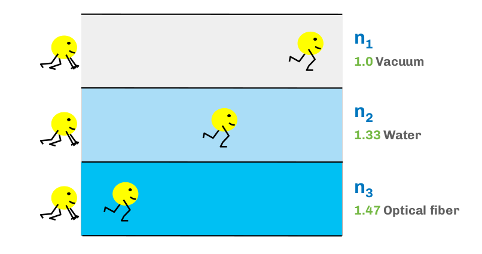

=== Index of Refraction (IOR)

IOR or _refractive index_ (n\%) is a ratio of the speed of light in a vacuum (c\%) to the speed of light through a transmission medium (v%). n = c /v The speed of light through a vacuum is 186,282 miles per second (299,792 kilometers per second). Its speed through an optical fiber varies based on the fiber type, manufacturer, and wavelength. For example, light travels through a particular optical glass at 126,642 miles per second. Based on the formula, the IOR through that glass would 1.471.

.Speed of light through various medium.
[cols=3*]
|===
|Speed of light | Miles per second | Kilometers per second
|In a vacuum | 186,282 | 299,792
|Through the optical fiber | ÷ 126,642 | ÷ 203,802
|Index of refraction | 1.471 | 1.471
|===

In another optical glass, the light travels at 126,900 miles per second, so the IOR for this glass would be 1.468. The faster the measured light is travelling through the optical fiber, the lower the IOR of the material.

Optical fibers have different glass for the core and cladding, each with a different IOR. It is this difference that keeps the light confined within the core.

== Total Internal Reflection

In 1841, Daniel Colladon, a professor at the University of Geneva, first demonstrated light guiding by focusing sunlight into a thin stream of water flowing through a hole in a water tank. When the light hit the forward edge of the water flow, he observed that the light rays were trapped in the water stream. This is now known as total internal reflection.

Light propagates through optical fibers by the principle of total internal reflection. It occurs when a core with a higher index of refraction is bounded by a cladding with a lower refractive index. This interface point between the two materials acts like a mirror to keep the light reflecting in the core.

.Diagram shows Total Internal Reflection.
image::media/InternalReflectionInside.png[400,400,align="center"]

TIP: Total internal reflection only occurs when the light signal propagates at an angle lower than the critical angle.

== Numerical Aperture / Light Gathering Ability

The maximum angle from the fiber axis at which light can propagate and still be captured by the core is called the critical angle. If this angle is rotated 360° around the fiber axis, it describes the cone of acceptance. Light propagating inside this zone will be captured by the fiber core, while light propagating outside this zone will not.

The sine of the critical angle is called the numerical aperture of the fiber. Numerical aperture does not vary greatly between fibers of the same type. The NA is intrinsic and cannot be influenced by the user. It is of primary interest to device (transmitter, splitter, receiver) manufacturers and can be largely disregarded by the user or operator.

Note that a small portion of light propagating outside the cone of acceptance may be captured in the cladding or become a very high order (loosely bound) mode within the core. This light energy may propagate for a short distance but will self-extinct. These can cause some inaccuracies in power and loss measurements. Techniques are available to obtain accurate measurements by filtering or stripping these _leaky_ modes.

.Cone of Acceptance.
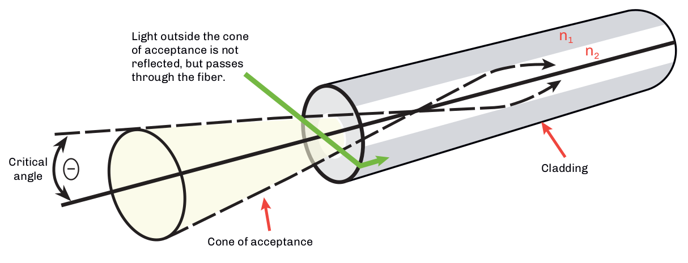

== Optical Reflection

=== Fresnel Reflection

When light energy travels from a medium of one index of refraction (IOR) to a medium with a different IOR, the transfer is not 100% efficient. Some of the light energy will be reflected back into the original medium. This effect is called Fresnel (fruh-nell%) reflection. The magnitude of the reflection is proportional to the difference between the two IORs. The direction of the reflection captured by the fiber core and returned to the transmitter is dependent on the geometry of the boundary between the two media.

Reflectance from a flat perpendicular fiber end exposed to air can be as high as about 3% (–14 dB) of the original signal sent back up the fiber core. Reflectance from a shattered endface may not be captured by the core. This will measure on an OTDR, for example, as a non-reflective break. Angled physical contact (APC) connectors are specifically designed to vector this reflected energy so that it is not trapped by the core, improving connector performance by about 20 dB.

Excessive energy reflected back to the transmitter can cause transmission problems, particularly for distributed feedback (DFB) lasers. Light undergoing multiple reflections and returning to the receiver after delay can be perceived as noise (multipath interference, MPIF).

.Cleaved surface vs broken surface.
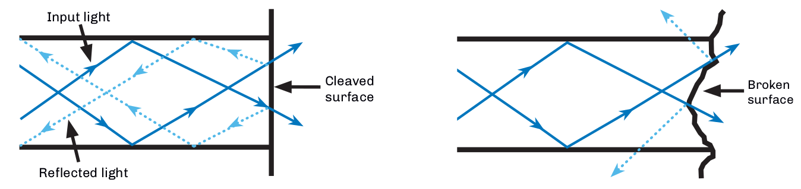

`Reflectance` is the magnitude of light returned back down the core, as a fraction of the forward signal, expressed in dB. It represents the local reflectance value at the component (connector, splitter, splice, and the like) location. Reflectance will always be a negative number.

`Optical return loss (ORL)` is the term for the total optical power received back to a transmitter placed at some point in a fiber span. It is measured at the transmitter and includes local and distant reflections and backscatter as well as the attenuation between the source of the reflection (or scattering). Because it is expressed as a loss, it is expressed in dB as a positive value.

ORL can be a little confusing at first but the calculation can be better understood by an example. A reflective connector with a –40 dB reflectance is located 1 meter from a transmitter. Its contribution to ORL as measured at the transmitter is essentially –40 dB, as 1 meter of fiber has essentially zero loss. If the same connector is placed 15 km away from the transmitter and the fiber loss between the transmitter and the connector is 10 dB, then the reflectance of the connector is still –40 dB. But the ORL contribution of the connector is –10 dB (loss forward of Tx signal) plus –40 dB (reflectance of connector) plus –10 dB (loss on return trip). So the distant connector only contributes –60 dB of reflected energy or –60 dB of return loss. In this case, the fiber backscatter contribution along the 15-km route would also have to be added to the ORL.

Both reflectance and ORL are expressed in dB. That reflectance is a negative value and ORL is a positive value may be confusing. Consider that with any value, positive or negative, the further it is from zero means less reflectance or ORL.

== Optical Dispersion

Dispersion is a phenomenon in which some portion of the optical energy in a modulated pulse travels at a different speed than other portions of the energy. If enough of the energy travels at sufficiently different speeds over a length of fiber, then preceding optical signals can interfere with trailing optical signals. This is called intersymbol interference (ISI).

There are several causes of dispersion in a fiber. Dispersion will vary based on fiber type, fiber quality, transmitter type, transmitter spectral width, and other factors. Dispersion becomes more significant as the length of fiber span increases. Higher bit-rate systems are generally more negatively impacted by dispersion than lower bit rate systems.

There are three major types of dispersion in optical transmission:

. `Modal dispersion` (multimode fiber). Adherence to design limits, specifically application supported distances for a particular transmission protocol on a particular type of fiber, will avoid this issue.
. `Chromatic dispersion` (multimode and single-mode fiber).
. `Polarization mode dispersion` (single-mode fiber).

.Optical Dispersion.
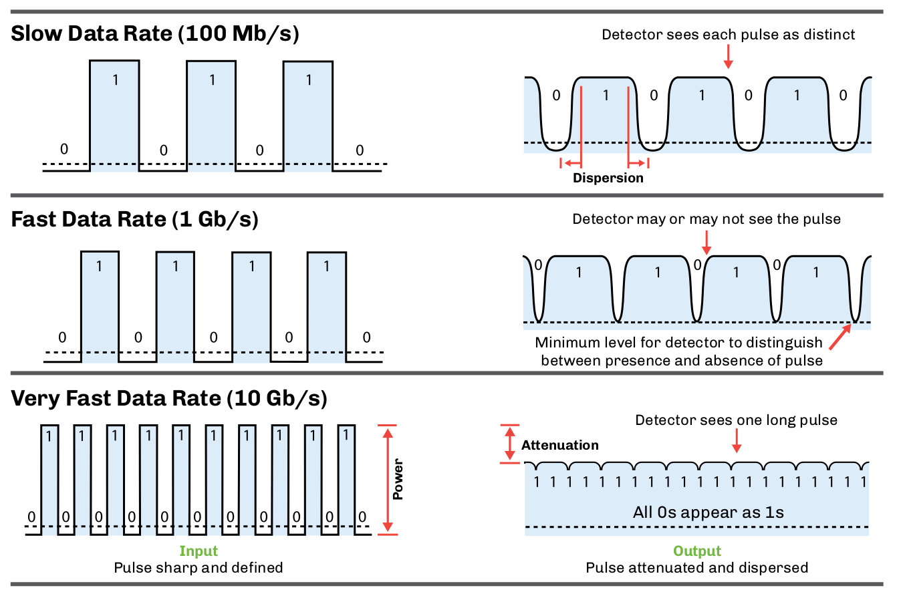

Almost all fiber communication links experience some amount of dispersion. If the total dispersion is lower than the threshold for the type of transmission (bit rate, encoding, and detection protocol) on the link, then there are no issues. However, if the link is to be upgraded to a higher bit rate or extended in length, the dispersion values may impose a limit on the maximum bit rate. Fiber links must be engineered for dispersion limits as well as att enuation limits.

== Bandwidth

In fiber optic communications, bandwidth is a measure of the maximum amount of data that can be transmitted over a link in a period of time, typically one second. It is usually measured in bits per second, for example, Megabits (Mb/s) or Gigabits per second (Gb/s). Bandwidth can also be measured in megahertz (MHz), with a rough correlation of one bit per Hz.

Bandwidth usually represents the total capacity of the system and is not necessarily equivalent to link data rate. While it’s interesting to think about the potential maximum theoretical bandwidth of a system, there are also practical concerns that limit the system to a throughput level much below the maximum. Standards documents often define system architectures and transmission protocols that dictate the bandwidth of a system, not so much to maximize it, but to ensure interoperability of multiple vendors’ equipment at that throughput. Bandwidth can be asynchronous, for example, it can be different in the forward or downstream direction than it is in the reverse or upstream direction.

The analogy of a highway representing a data link ---  with the bandwidth represented by the amount of traffic the highway can support --- is somewhat useful in thinking about bandwidth. One might get more cars on the highway by building more lanes. One could even build lanes vertically and create a double or triple decker thruway, or one could drive the cars faster. Maybe trucks that carry more data can be substituted for cars. None of these are exactly analogous to increasing data traffic, but it may help one think about it. There are many methods that fiber systems use to increase bandwidth.

.Bandwidth traffic.
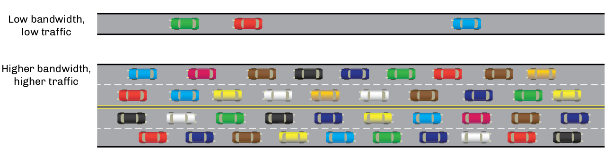

With multimode fibers, the bandwidth is the amount of information that can be transmitted effectively over a given distance, usually defined as MHz relative to a kilometer span (MHz-km) at a specific wavelength, for example, 4700 MHz-km @ 850 nm. Since multimode fiber transmits photons over a variety of modes, the distance that a fiber can transmit a signal before dispersion degrades the signal quality is limited by the data rate. As distance increases, multimode bandwidth decreases.

While single-mode fiber does not have a bandwidth specification, its transmission is limited by the amount of dispersion in the system.