:doctype: book
:title-page-background-image: image:CongruexLogo.png[]

= Chapter 3 - *_Fiber_*

:figure-caption: Figure
:table-caption: Table

== The Physical Plant

The physical plant encompasses all of the components between the transmitter and receiver that make up the entire fiber optic network.

.Physical Plant
image::media/physicalplant.png[500,500,align="center"]

* The infrastructure that makes up the fiber optic network
* The fiber, cable, connectors, splices, panels, and cabinets, et al., that are deployed in the field.

The optical fiber acts as a waveguide to route the signal from the transmitter to the receiver. In order to create a continuous waveguide, many segments of optical fiber are joined together. Permanent joints are made with fusion or mechanical splices. Reconfigurable joints are made using fiber connectors.

The fiber is not 100% efficient and loses some power over distance. Splices and connectors also contribute to signal loss where they are installed.

All other components, cable, closures, racks, ducts, poles, etc., serve to either mechanically or environmentally protect the fiber or to assist in routing the fiber within the cable between the transmitter and receiver.

== Fiber Comparison

.Singler Mode vs Multimode.
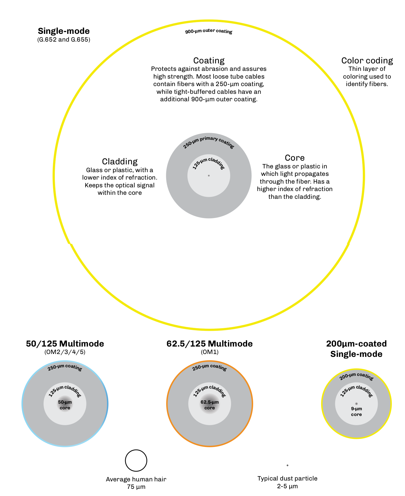

== What is a Mode?

* A _mode_ is a discrete light path within the core of the fiber between the transmitter and the receiver.
* The number of modes that a fiber will support increases as the wavelength decreases.

.Light path in single mode & multimode.
image::media/mode.png[align="center"]

The ability of an optical fiber to bind or hold light energy and transport it as a mode is determined by physics and can be modeled by some complex mathematical equations. Essentially, multimode fiber will have many solutions to its equations, while the design of a single-mode fiber will restrict the solution set to one.

The design of the fiber does not make it specifically single-mode or multimode. The design only determines that the fiber will exhibit single-mode behavior or multimode behavior through a specific range of wavelengths. For example. many single-mode fibers exhibit single-mode behavior above approximately 1200 nm but exhibit multimode behavior below 1200 nm. If you transmit an 850-nm signal down a single-
mode fiber, there will be many modes.

== Multimode Fiber

Multimode optical fiber is designed to simultaneously carry multiple light pulses, or modes, each at a slightly different angle of reflection within the core. Multimode fiber is used for relatively short transmission distances (<2 km), because the modes spread out over longer distances (modal dispersion) limiting the overall bandwidth. Multimode fiber systems use lower-cost transmitters such as light-emitting diodes (LEDs).

[grid="none", frame="none"]
|===

|*Advantages*

• Lower cost electronics, which leads to lower overall system cost. +
• Easier to splice and connectorize than single-mode fiber.|

*Disadvantages*

• More attenuation (loss) than single-mode fiber Short distances (<2 km). +
• Bandwidth limited due to greater modal dispersion (pulse spreading).

|===

*Applications*

* Local area networks (horizontal and backbone)
* Data centers
* Industrial controls
* Control systems
* CCTV systems
* Campuses
* Security.

=== Multimode Fiber Characteristics
* Bandwidths up to 4,700 MHz-km with OM4 and OM5 laser-optimized fibers.

* Losses of 0.6 dB/km to 3.5 dB/km.
* Core is 50 microns, or 62.5 microns for legacy multimode designs.
* Effective with laser or LED sources.
* Lower costs for components, test equipment, and transmitters/receivers compared to single-mode fiber.
* Higher cost than single-mode fiber.
* Distance limitations due to higher loss and pulse spreading.
* Operates at 850-nm and 1300-nm wavelengths.

== Fiber Specifications

Below are the maximum allowable specifications for multimode and single-mode fiber per TIA-568D. The TIA-568 specification is generally applied to campuses and in-building applications.

.Multimode and Singlemode specifications.
[cols="4,2,2,2,2,2,2"]
|===
||*S/M(OS1/2)*| *M/M(OM5)*| *M/M(OM4)*| *M/M(OM3)*| *M/M(OM2)*| *M/M(OM1)*
|*Core diameter (microns)*| 8.3| 50| 50| 50| 50| 62.5
|*Mode field diameter (microns)* +
1310 nm|9.3 ±0.5| - | - |- | - | - 
|*Cladding diameter (microns)* |125|125|125|125|125|125
|*Numerical aperture*|0.13|0.20|0.20|0.20|0.20|0.275
|*Attenuation (dB/km)* +
850 nm +
1300/1310 nm +
1550 nm|— +
≤0.4 +
≤0.3|≤3.0 +
≤1.5 +
— + |≤3.0 + 
≤1.5 +
—|≤2.3 +
≤0.6 +
— + |≤3.5 +
≤1.5 +
—|≤3.5 +
≤1.5 +
—
|*Bandwidth (MHz-km)* +
850 nm +
953 nm +
1300 nm|— +
— +
—|4700 +
2470 +
—|4700 +
— +
—|2000 +
— +
—|500 +
— +
500|200 +
— +
500
|*Dispersion (ps/nm-km)* +
1310 nm +
1550 nm|3.2 +
17|- + 
-|- +
-|- +
-|- +
-|- +
-
|*Primary coating layer (microns)*† +
With color code +
Without color code|250 +
245|250 +
245|250 +
245|250 +
245|250 +
245|250 +
245|
|===

== Application Supported Distance

Application supported distance is the maximum transmission distance for a fiber using a specific transmission protocol at a given bit rate.

.Supported distance.
[cols="2,2,2,2,2,2,2,2"]
|===
.2+^.^| *Fiber Mode* .2+^.^| *100BASE* 2+^|*1000BASE* 2+^| *10GBASE* .2+^.^| *40GBASE* .2+^.^| *100GBASE* 
|850nm |1300nm |850nm |1300nm 
|OM1|≤2000m|275M|550M|33M|≤300m|-|-
|OM2|≤2000m|550m|550m|82m|≤300m|-|-
|OM3|≤2000m|550m|550m|300m|≤300m|100m|100m
|OM4|≤2000m|1000m|550m|550m|400m*|150m|150m
|OM5|≤2000m|-|-|-|400m*|150m|150m
|===

== Legacy Multimode Fibers

Multimode optical fibers were initially optimized to perform with light-emitting diode (LED) sources at 1300 nm. The larger 62.5-µm core size of OM1 fiber represented a compromise between greater modal dispersion from the larger core size and the ability to capture more light from a nondirectional, noncoherent LED source. The core size was narrowed to 50 microns in order to reduce modal dispersion, but the fiber was still optimized for LEDs operating at 1300 nm.

Unfortunately, LEDs in general are limited to modulation speeds below about 1 GHz. They also tend to excite more higher order modes than a laser, resulting in relatively higher modal dispersion. In order to get high-speed operation in a multimode system, it was clear a laser source would be necessary.

Rather than use a Fabry-Perot laser or a distributed feedback laser with a very small spot size suitable for high coupling efficiency into a single-mode fiber, the vertical-cavity surface-emitting laser (VCSEL) was developed. For various reasons, it is easier and cheaper to produce VCSELs optimized at 850 nm. The VCSEL’s laser offers very high-speed modulation and less excitation of high order modes (compared to an
LED), resulting in drastic improvements in multimode fiber system performance. Therefore, OM3 and OM4 fibers were developed for high-speed operation with these new lasers.

NOTE: Due to the core mismatch, it is never recommended to connect a 50-µm core fiber to a 62.5-micron core fiber as this results in a connection that is extremely high loss in one direction.

Today, OM1 and OM2 fibers are considered legacy fibers. This means that they are no longer a part of new revisions of standards documentation or the development of new systems.

.Historical Legacy Multimode Fiber Specifications.
[cols="3,1,1,1,1,1,1,2"]
|===

.2+^.^|*Manufacturer* .2+^|*Core Size* 2+^|*Index of refraction* 2+^|*Attenuation (dB/km)* 2+^.^|*Bandwidth (MHz-km)*

|*850nm* |*1300nm* |*850nm* |*1300nm* |*850nm* |*1300nm*
|*Corning* +
OM2 +
OM1|50 µm +
62.5 µm|1.490 +
1.496|1.486 +
1.491|≤2.5 +
≤2.9|≤0.8 +
≤0.6|500 +
200|500 +
500
|*Prysmian/
Draka* + 
OM2 +
OM1|50 µm +
62.5 µm|1.482 +
1.496|1.477 +
1.491|≤2.2 +
≤2.6|≤0.5 +
≤0.5|1000 +
300|1500 +
1000
|*OFS* +
OM2 +
OM1|50 µm +
62.5 µm|1.483 +
1.496|1.479 +
1.491|≤2.4 +
≤2.9|≤0.7 +
≤0.7|500 +
200|500 +
500
|===

== Multimode Graded-index Fibers

One approach to improving multimode fiber performance is to design the core to reduce modal dispersion.

Instead of simply relying on a single index of refraction (IOR) difference at the core/cladding boundary to reflect the light, a graded-index fiber is constructed with a core that has hundreds of concentric layers of glass between the center of the core and the cladding. Each of these layers has its own IOR so that light is gradually refracted back toward the center of the fiber core.

.Grade Index.
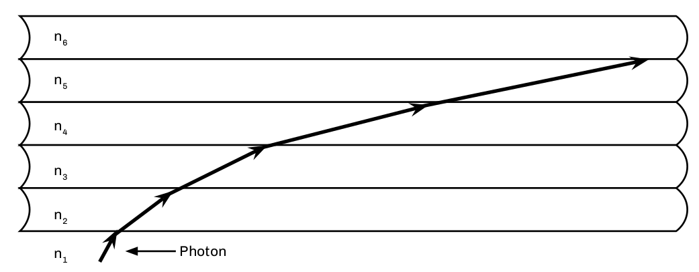

The regions of the core closest to the cladding have a slightly lower IOR. The highest IOR (lowest velocity of propagation) is found near the axis while lower IORs (highest velocity of propagation) are found in the outermost region of the core. As the velocity of propagation of light in the core is equal to the speed of light in a vacuum divided by the IOR, the lower IOR results in a slightly higher velocity of propagation of light near the outside of the core compared to its axis. A mode would slow down when passing through the inner layers of the core and accelerate when passing through the outer layers. This allows the higher-order modes to arrive at the same approximate time as the axial- or lower-order modes. While this technique does not completely compensate for modal dispersion, it does maximize bandwidth Step-index multimode by reducing modal dispersion. It also makes the fiber more complex and expensive to manufacture than if it had a uniform index of refraction.

.Output Pulse.
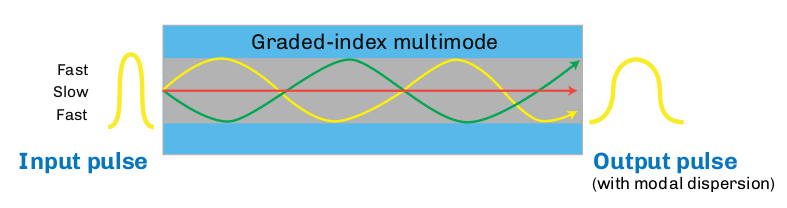

== Laser-optimized Multimode Fiber Types

[cols="2,1,1,1,1,1,1,1,1,2"]
|===
.2+^|*Manufacturer* .2+^|*IEC* # .2+^|*Fiber Size* 2+^| *Index of + 
refraction* 2+^|*Attenuation +
(dB/km)* 2+^|*Bandwidth +
(MHz-km)* 1+^| *Max +
Distance*
|850nm|1300nm|850nm|1300nm|850nm|1300nm ^|850nm
|*Alcatel +
Glight* *6933*|OM3|50/125|1.482|1.480|≤2.5|≤0.8|500|500 ^|2000
|*Corning +
ClearCurve*|OM3|50/125|1.480|1.479|≤2.3|≤0.6|1500|500 ^|1000
|*Corning +
ClearCurve*|OM4|50/125|1.480|1.479|≤2.3|≤0.6|3500|500 ^|1100
|*Corning +
InfiniCor SX+*|OM3|50/125|1.481|1.476|≤2.3|≤0.6|2000|500 ^|1000
|*Prysmian +
MaxCap*|OM3|50/125|1.482|1.477|≤2.2|≤0.5|1500|500 ^|550
|*Prysmian +
HiCap*|OM4|50/125|1.482|1.477|≤2.2|≤0.5|3500|500 ^|550
|*OFS +
Laser Wave* *300*|OM3|50/125|1.483|1.479|≤2.2|≤0.6|1500|500 ^|1000
|*OFS +
Laser Wave* *550*|OM4|50/125|1.483|1.479|≤2.2|≤0.6|3500|500 ^|1040
|===

[NOTE]
Source to fiber coupling variations affect bandwidth-length products. Refer to ANSI/TIA-492AAA and AAAE for information on determining effective modal bandwidth as required by 10-Gigabit applications. +
Gigabit Ethernet specified in IEEE 802.3z for 10 GbE pplications, refer to IEEE 802.3ae and manufacturer product specification sheets.

Laser-optimized fiber was developed to work with vertical-cavity surface-emitting lasers (VCSELs) operating at 850 nm. 

The highest performance multimode fiber today is the OM4 classification. The attenuation values of this laser-optimized 50/125 fiber are 2.5 dB/km at 850 nm and 0.8 dB at 1300 nm. It is specified with 4700 MHz-km effective modal bandwidth at 850 nm and overfilled bandwidth values of 3500 MHz-km at 850 nm and 500 MHz-km at 1300 nm. _Overfilled_ refers to LED operation, while the effective modal bandwidth (EMB) refers to operation with a laser source.

== OM5 Multimode Fiber

Transmitting multiple high-speed data streams at differing wavelengths (colors) of light increases the bandwidth or data carrying capacity of a fiber. For example, four VCSEL transmitters each operating at a slightly different wavelength transmit four separate 25 Gb/s data streams. These four streams are combined (multiplexed) into a single fiber. At the receive end, the four wavelengths are separated (demultiplexed) and
sent to four separate detectors within the receiver module. This technique permits 100 Gb/s transmission on a single multimode fiber. Accomplishing this with one wavelength is not feasible due to modal dispersion. This technique is known as wideband multiplexing or short wavelength division multiplexing (SWDM).

A new fiber specification was developed to support this transmission technique and is designated OM5 wideband multimode fiber (WBMMF). OM5 fiber is specified to meet the performance characteristics of OM4 at both 850 nm and 953 nm, as compared to OM4 which is specified at only 850 nm. The nominal transmission wavelengths established by the Metro Ethernet Forum are 850, 880, 910, and 940 nm.

.Wideband multimode fiber.
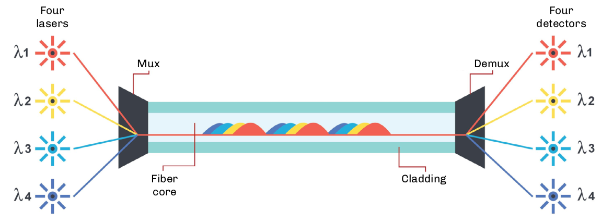

For installers and end users, the only requirement for field testing is to use the standard 850 nm/1300 nm windows. Chromatic dispersion values are in the standards and fiber manufacturers are required to ensure these performance values are met.

* Designed for short wavelength division multiplexing (SWDM)
* Enables 400 Gb/s transmission using 8-fiber technology
* Optimized for 850-953 nm spectrum
* Four wavelength channels assigned
* Testing occurs at 850/1300 nm

== Bend-insensitive Multimode Fiber

In a standard multimode optical fiber, the higher order modes will leak into the cladding when the fiber is bent. To reduce the magnitude of this bending loss, bend-insensitive multimode fiber (BI-MMF) is manufactured with an optical trench between the outer modes of the optical core and the cladding. This trench creates a reflective barrier, which keeps the outer modes within the core region when the fiber is bent.

.Graded Index bend insensitive multimode fiber profile.
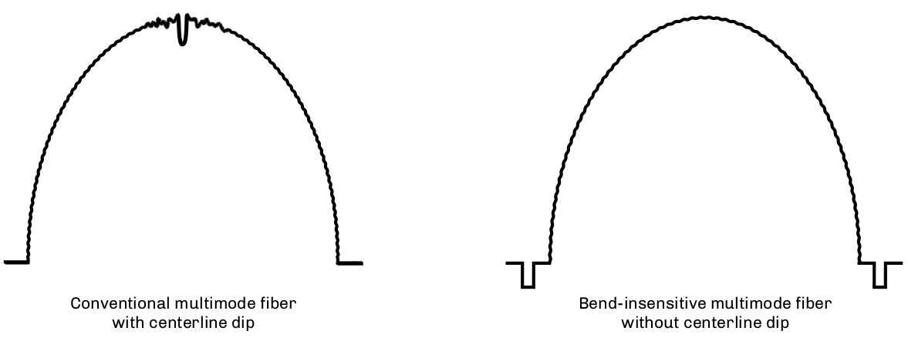

While multimode fiber has always been less sensitive to bends than single-mode fiber, the minimum bend radius limitation on installed multimode fibers in buildings has always been an issue. Bend-insensitive fiber allows for smaller cabinetry and enclosures, increased storage in small spaces, and more elegant routing in buildings. Fiber manufacturers have turned their atte ntion to the premises applications where graded-index multimode fibers could be improved. While the greatest need is for the laser-optimized OM3 and OM4 50/125
fibers, some fiber manufacturers are also providing legacy OM1 and OM2 BIMMF fibers.

=== Mechanical Specifications

Bend radius physical testing originally specified for overfilled launch conditions was standardized by the TIA-455-62 FOTP and the IEC 60793-1-41 as 100 turns around a 75-mm diameter (or 37.5-mm radius) mandrel for the measurement. This has since been modified for EMBc testing to two turns around a 15-mm radius mandrel per ITU-T G.651.1. Further reduction to two turns at 7.5-mm bend radius testing is currently under IEC work group consideration.

== Bandwidth in Multimode Fibers

Bandwidth testing of multimode fiber measures differential mode delay (DMD), which limits the amount of information that can be effectively transmitted. It is performed by the fiber manufacturer using optical time-domain or frequency domain methods as defined in TIA-455-203, 204, and 220 fiber optic test procedures (FOTPs), and in the IEC 60793 standard.

Since modal dispersion in multimode fibers is highly dependent on launch conditions, two different bandwidth performance levels may be specified: one based on an overfilled launch for LED operation; andone based on the effective modal bandwidth (EMB) for operation with the laser.

Launch conditions include:

. Overfilled launch.
** Legacy OM1/OM2 fibers.
. Restricted mode launch (RML).
** More accurate than overfilled launch with LEDs.
. Minimum calculated effective modal bandwidth (minEMBc).
** OM3, OM4, and OM5 fibers.
. Encircled flux.
** OM3, OM4, and OM5 fibers.
** Greater accuracy than minEMBc, but more difficult to test installed multimode fiber plant.

.Bandwidth graph.
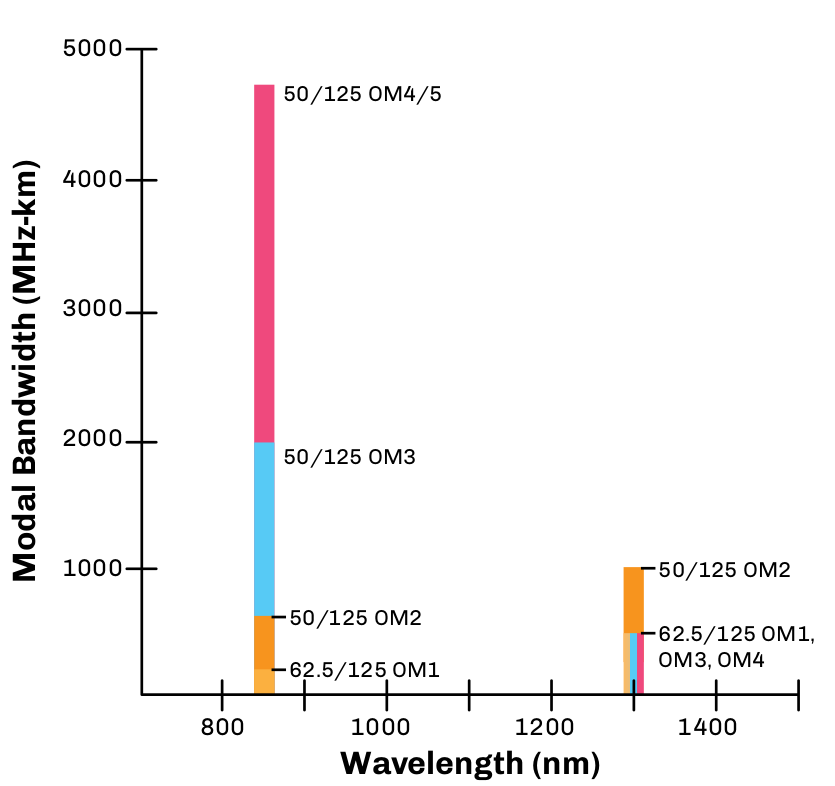

== Dispersion in Multimode Fibers

=== Modal Dispersion

Light energy is transmitted in multiple modes. Each mode travels a different path and arrives at the end of the link at a different time.

In multimode fibers, modal dispersion limits effective transmission distance. Because axial modes arrive sooner than higher order modes, individual bits, variations in light amplitude in the time domain, will _spread_.

Modal dispersion is affected by launch conditions.

* An LED _overfilled_ launch creates a higher ratio of high order modes, increasing modal dispersion and limiting bandwidth.
* A VCSEL _underfilled_ launch creates a higher ratio of lower order modes, decreasing modal dispersion and improving bandwidth.

The total cumulative effect of modal dispersion will define the potential performance of a multimode fiber with a given transmitter type at a given bit rate. This data is usually expressed in a table of application supported distances (ASD) where the operator can easily determine the maximum transmission distance for a given protocol using a given type transmitter over a specified number of fibers.

=== Chromatic Dispersion

Chromatic dispersion (CD) is the variation in the velocity of light (group velocity) as a function of wavelength. It causes pulses of a modulated laser source to broaden when traveling within the fiber, up to a point where pulses overlap and bit error rate increases. CD is a limiting factor in high-speed transmission and must be properly compensated, which implies proper testing.

CD is affected by the spectral width of the source.

* LEDs have a large spectral width and can cause enough CD to be significant.
* VCSELs have a relatively narrower spectral width, so modal dispersion is by far the dominant cause
of dispersion.

== Single-mode Fiber

Single-mode optical fiber has only one mode or pathway for the transmission of a light energy. This eliminates modal dispersion as a cause of pulse spreading, resulting in significantly higher bandwidth.  Higher-cost laser transmitters are typically required to effectively couple to its smaller 8-9 micron core.

[grid="none", frame="none"]
|===
| *Advantages* | *Disadvantages*

|• Greater bandwidth +
• Less loss +
• Greater distances +
• Can be optically multiplexed +

|• More expensive electro-optics are required, resulting in greater overall system costs.
|===

*Applications*

* Telcos
* Telephony users
* FTTx
* Broadband/CATV
* Intelligent transportation systems
* Wide area networks (WANs)
* Data centers

=== Single-mode Fiber Characteristics

* Typically has a 9-micron core and a 125-micron cladding
* High bandwidth (200-500 THz)
* Low attenuation (0.2 dB/km to 0.4 dB/km)
* Higher costs for connectors, splices, test equipment, and transmitters/receivers
* Operates from 1260 to 1650 nm

== Mode Field Diameter

Mode field diameter (MFD) is the diameter of the spot of light transmitted through a single-mode fiber. Unlike multimode fibers where the optical power distribution occurs entirely within the core of the fiber, in single-mode fibers approximately 80% of the light is within the core while the remaining 20% is transmitted in the surrounding cladding.

.Model Field Diameter (MFD).
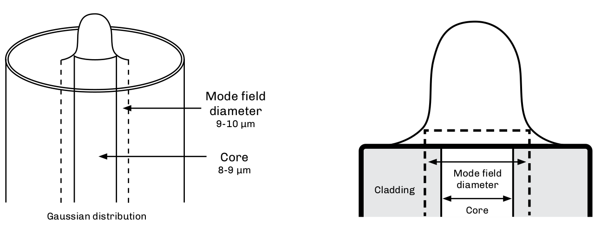

The TIA-455-191 standard calls out how the optical power distribution is determined in single-mode fibers. Fiber/cable specification sheets may call out recommendations for both single-mode core and mode field diameter. The effects of MFD are the following:

. The larger the MFD, the easier it is to splice and onnectorize.
. The larger the MFD, the more sensitive the fiber is to microbends.
. The MFD varies depending on the wavelength used.

[cols="2,3,5"]
|===
|*Specification* | *Wavelength* | *Mode Field Diameter*|
ITU-T G.652 | 1310 nm +
1550 nm 
| 8.6-9.5 ±0 µm +
9.8-10.7 ±0.5 µm|
ITU-T G.655 | 1550 nm | 8-11 ±0.7 µm
|===

[start=4]
. Because optical energy is traveling in both the core and the cladding of single-mode fibers, the difference in the index of refraction between the core (slower IOR) and the cladding (faster IOR) causes waveguide dispersion to occur. Waveguide and material dispersion combine to create chromatic dispersion.

. The mode field diameter of a fiber is an intrinsic characteristic at any given wavelength and is usually not of concern to the technician or operator conducting routine operations, e.g.,splicing or testing.

.Material Dispersion.
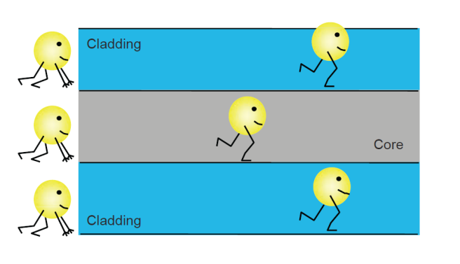

== Fiber Tolerances

Fiber tolerance values apply everywhere. All splices and connection losses are affected by tolerances. Splicing or connecting new fibers to older fibers may result in higher losses due to tolerances. While new products have better tolerances, even splicing new fiber to new fiber can result in loss from tolerances. Connector ferrules and splicer V-grooves also have tolerances.

Fiber tolerances affect splice and connector losses and vary with different fiber types, from different ends of the fiber. These tolerances can cause variations in loss measurements such as differing bidirectional measurements, high losses, and OTDR traces that report splices that exhibit gains (known as gainers). Different fiber types have different attenuation and dispersion characteristics, and different manufacturers use different manufacturing processes.

Listed below are a few of the fiber tolerances one must recognize with standard fiber types.

* Cladding O.D. tolerances can vary as much as ±1 micron for single-mode and ±2 microns for multimode.

* Core diameter can vary from one part of the cable to another, as much as 0.7 microns. Core tolerances can vary as much as ±1 micron for single-mode, and ±3 microns for multimode.

* The core/cladding concentricity (how centered the core is) and core ovality (how round the core is) also can vary from fiber to fiber.

.Cladding tolerances (±microns).
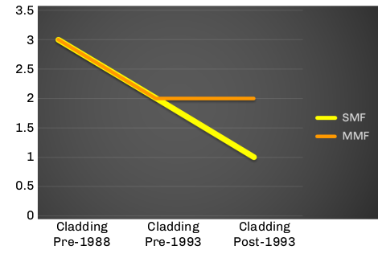

Optical characteristics can vary from manufacturer to manufacturer. Several generations of fibers from vendors can each have different characteristics.

.Optical Characteristics.
[cols="4,2,2,2"]

|===
| >| *1987* >|*1993* >|*2017* |
Cladding diameter tolerance >|3 µm >|1 µm >|0.7 µm|
Core diameter tolerance >| 
8.7 ±1 µm >|
8.3 ±1 µm >|
8.2 ±1 µm |
Mode-field diameter >|10±1 µm >|9.3±0.5 µm >|9.2±0.4 µm |
Cladding non-circularity >|
2% >|
1% >|
0.7%|
Core/cladding concentricity >|
1 µm >|
0.8 µm >|
0.7 µm|
Numerical aperture >|
.11 >|
.13 >|
.14|
|===

== Single Mode Optical Fiber

=== ITU-T G.652D

ITU-T G.652 fiber was the first type of single-mode fiber manufactured, and is the most widely-deployed single-mode fiber by telephone companies, utilities, and multiple service operators (MSOs). It has a typical loss of 0.33 dB/km at 1310 nm and 0.21 dB/km at 1550 nm. Dispersion is optimized at 1310 nm. It has an abrupt index profile change between the core and the cladding.

As the development of lasers operating at wavelengths other than 1310 and 1550 nm opened up the entire optical spectrum between 1260 nm and 1650 nm, manufacturers returned to address the hydrogen (OH) intrusion problem centered around 1383 nm. The presence of excess OH- ions in the fiber can create an increase in attenuation of up to 2 dB/km in the E-band (1360-1460 nm). The result was a new generation of single-mode fibers that had improved attenuation and allowed for transmission in the E-band. These fibers also fall within the ITU-T G.652 recommendation and are designated as G.652D fibers.

G.652D fibers (IEC 60793 OS2) are ideal for transmitting the full spectrum of wavelengths using ITU-T G.694 specified coarse wavelength division multiplexing (CWDM) channels. Though designated by the ITU as reduced water peak single-mode fiber, this variant is commonly called low water peak (LWP) or zero water peak (ZWP) fiber. They have the same manufacturing tolerances as and are compatible with the older G.652 fibers.

It is strongly recommended that network operators document the specific type of fiber contained in their deployed OSP cables.

.OSP cable types of cable.
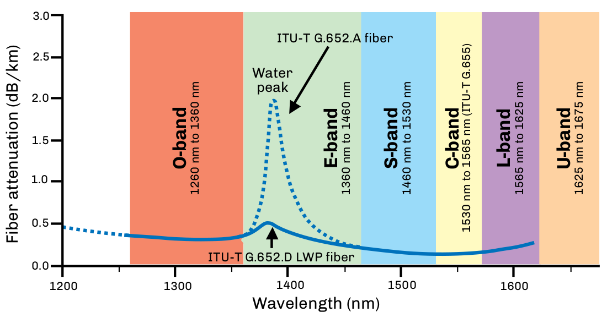

Another variant of the G.652 fiber is the G.657 bend-insensitive fiber designed for use inside buildings where tight bends are common. There are several methods to manufacture this fiber and adjustments to fusion splicers may be required to obtain the lowest splice loss values.

. G.652 (IEC 60793 OS1) standard SMF.
. G.652D (IEC 60793 OS2) single-mode.
** Designed to minimize attenuation and open up CWDM wavelengths in the E-band.
** Physically document where installed for future CWDM use.

== ITU-T G.657

With dense populations of distribution and drop cables installed into networks and premises, space limitations became a challenge for optical fiber manufacturers. In 2002, the first type of fiber to address these issues was developed, and it was soon standardized in the ITU-T G.657 _Bending Loss Insensitive Single-mode Optical Fiber and Cable for the Access Network recommendation._ ITU-T G.657 specifically calls out the following:

[subs="quotes"]
----
_"Class A contains the recommended attributes and values needed to support optimized access network installation with respect to macrobending loss, while the recommended values for the other attributes still remain within the range recommended in G.652.D.”_

_"Class B contains the recommended attributes and values needed to support optimized access network installation with very short bending radius applied in fibre management systems and particularly for in- and outdoor installation. For the mode-field diameter and chromatic dispersion coefficients, the recommended range of values might be outside of the range of values recommended in [ITU-T G.652].”_
----

Bend-insensitive fiber (BIF) is ideal for FTTB installations due to its ability to handle smaller bend radius requirements. They are used in high-density applications, low count cables, cable management products, or in-building applications.

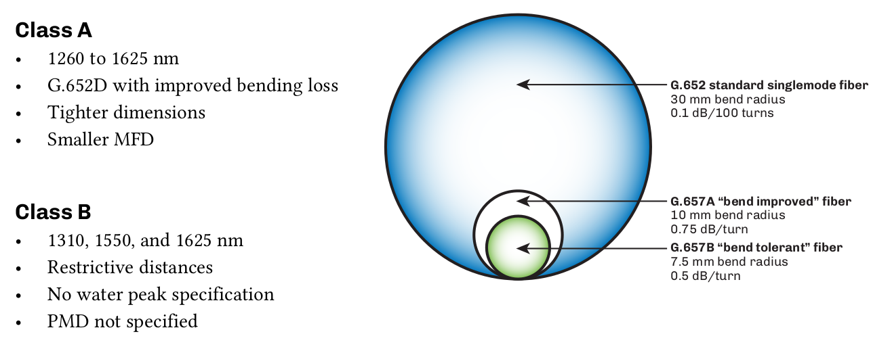

.Macrobend Loss.
[cols="3,1,1,1,1,1,1,1,1,1,1,1"]
|===
| *Details* 2+^| *G.657.A1* 3+^| *G.657.A2* 3+^| *G.657.B2* 3+^| *G.657.B3*
|Radius (mm)|15|10|15|10|7.5|15|10|7.5|10|7.5|5
|Number of turns|10|1|10|1|1|10|1|1|1|1|1
|Maximum at 1550 nm (db)|0.25|0.75|0.03|0.1|0.5|0.03|0.1|0.5|0.03|0.08|0.15
|Maximum at 1625 nm (db)|1.0|1.5|0.1|0.2|1.0|0.1|0.2|1.0|0.1|0.25|0.45
|===

== ITU-TG.654

The ITU-T G.654 cutoff-shifted fiber, also known as ultra low loss (ULL) fiber, has attenuation as low as 0.16 dB/km. This fiber supports single-mode operation in the 1550-nm wavelength region and transmission in the C-band, L-band, and U-band. It is ideal for submarine and terrestrial long-haul applications that may have up to 400 kilometers between repeaters.

Because these applications also involve high optical power levels, mitigating nonlinear effects is critical to successful operation. G.654 fiber has a wide effective area, which decreases the spatial energy density and the fiber’s susceptibility to nonlinear effects, primarily self phase modulation and four wave mixing. In G.654 fiber, the effective area is typically in the range of 120 square microns, 50% larger than conventional fiber, allowing greater total power levels to be coupled into the fiber.

* Also known as low attenuation fiber.
** 0.16 dB/km.
* Transmits in the C-band, L-band, and U-band.
* Ideal for long-haul applications with up to 400 km between repeaters.
* Mitigating non-linear effects is critical.
* Wide effective area. uypically 120 square microns.
** Greater power levels can be coupled for longer spans.
** Reduces non-linear effects and the effects of micro and macro bending.

.G.652 & G.654
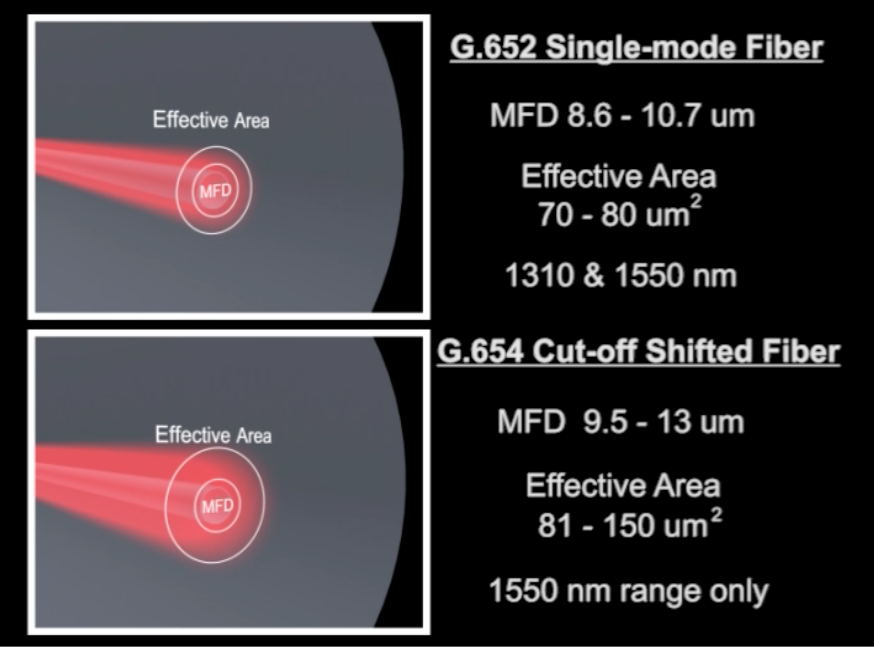

== Dispersion in Single-mode Fibers

Chromatic dispersion (CD) is the term for the pulse spreading or differential delay of an optical signal in a fiber caused by different velocities of propagation with respect to wavelength. It causes pulses of a modulated laser source to broaden when traveling within the fiber, up to a point where pulses overlap and bit error rate increases. CD is a limiting factor in high-speed transmission and must be properly compensated, which implies proper testing.

CD specified in ps/nm-km, where a picosecond (ps, or one trillionth of a second) represents the magnitude of the differential delay of wavelengths separated by 1 nm over a nominal 1 km distance traveled.

.Chromatic Dispersion.
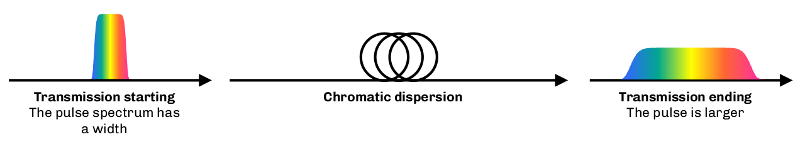

Material dispersion is the principal component of CD. The refractive index of silica is wavelength- dependent. Therefore, different spectral components (i.e., colors) of the source output will travel at slightly different speeds. A laser with a wide spectral width will experience more dispersion than a laser with a narrow spectral width. Manufacturers will seldom publish the laser spectral width but instead will specify, for example, “this laser transmitter and receiver pair is rated up to 80 km of G.652 chromatic dispersion”.

In a single-mode fiber, some of the light energy travels in the core and some in the cladding based on the mode field diameter of the fiber at a given wavelength. The core and cladding have different IORs, which causes the two components to travel at different velocities. The actual ratio of the core/cladding energy is wavelength dependent, so this would vary with wavelength as well. This is termed waveguide dispersion. The sum of waveguide dispersion and material dispersion is equal to the total chromatic dispersion of a fiber.

NOTE: Chromatic dispersion is also a limiting factor in multimode fiber performance primarily due to the wide spectrum of LED sources. However, it is not specified separately.

== ITU-T G.652

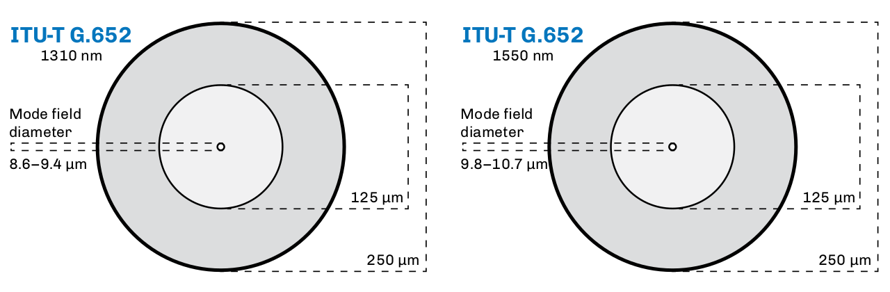

ITU-T G.652 fiber, often referred to as standard single-mode fiber (SSMF), was the first type of single- mode fiber manufactured. It is the dominant single-mode fiber used by telephone companies, utilities, and for campus applications. It is referred to as OS1 or OS2 fibers in IEC 60793. The OS1 designation encompasses covers all G.652 fibers, while OS2 only refers to the low water peak G.652 fibers only.

G.652 is a dual window (1310/1550 nm) fiber that is dispersion optimized for transmission around 1310 nm. It has a distinct index profile change between the core and the cladding.

.Index Refraction.

=== Index of Refraction for SSMF

[cols="13,20,10,15,9,9,6,6,6,6"]
|===
2+^| *Manufacturer* 2+^| *Mode Field Diameter (microns)* 3+^|*Attenuation (db/km)* 3+^|*CD ps/(nm•km)*
2+^| |1310 + 
(nm)|1550 +
(nm)|1310 +
(nm)|1550 +
(nm)|1625 +
(nm)|1310 +
(nm)|1550 +
(nm)|1625 +
(nm)
|*Corning*|NexCor +
SMF28 +
SMF28E|9.4 ± 0.4 +
9.2 ± 0.4 +
9.2 ± 0.4|10.6 ± 0.5 +
10.4 ± 0.8 +
10.4 ± 0.8|0.35 +
0.35 +
0.35|
0.20 +
0.22 +
0.22|0.23 +
N/A +
0.23|- +
- +
- |<18 +
- +
<18|<23 +
- +
<22
|*OFS*|AllWaveTM +
Depressed-cladding +
Matched-cladding|9.2 ± 0.4 +
8.8 ± 0.5 +
9.2 ± 0.4|10.4 ± 0.5 +
9.7 ± 0.6 +
10.4 ± 0.5 | 0.34 +
0.40 +
0.35|0.21 +
0.25 +
0.25|0.24 +
- +
-|- +
- +
-|- +
- +
<18|- +
- +
-
|*Prysmian*|BendBright +
ESMF +
6900 +
6901 +
267E|9.0 ± 0.4 +
9.0 ± 0.4 +
9.0 ± 0.5 +
9.0 ± 0.4 +
9.3 ± 0.4|10.1 ± 0.5 +
10.1 ± 0.5 +
10.2 ± 1.0 +
10.2 ± 1.0 +
10.5 ± 1.0|0.35 +
0.35 +
0.35 +
0.34 +
0.38|0.21 +
0.21 +
0.25 +
0.21 +
0.23|0.23 +
0.23 +
- +
- +
-|- +
- +
- +
- +
-|<18 +
<18 +
- +
- +
-|<22 +
<23 +
- +
- +
- 
|*Sumitomo*|PureBand +
PureAccess|9.2 ± 0.4 +
8.6 ± 0.4|- +
-|0.33 +
0.35|0.19 +
0.22|0.22 +
-|- +
- |<18 +
<18|<22 +
-
|===

== ITU-T G.653

ITU-T G.652 dispersion-shifted fiber (DSF) was designed with the zero dispersion wavelength near the 1550-nm region. The design goal was to take advantage of lower attenuation in the 1550-nm region without having to compensate for its relatively high CD of G.652 at 1550 nm. G.653 was ideal for single wavelength transmission in very long haul networks. Unfortunately, when attempting to use multiple wavelengths, the
very low CD caused the wavelengths to exchange energy between them, aggravating four wave mixing.

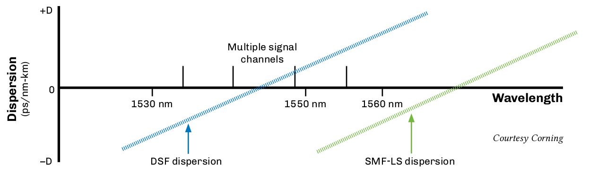

* Dispersion-shifted into low-loss 1550-nm window.
* Obsoleted by ITU-T G.655.
* Aggravated four wave mixing.

== ITU-T G.655

The G.655 nonzero dispersion-shifted (NZDS) fiber was designed for use with DWDM and optical amplifier technologies operating in the C-band near 1550 nm. It is predominantly used by long haul carriers, competitive local exchange carriers (CLECs), and multiple service operators (MSOs). G.656 fiber was designed for use with CWDM and DWDM transmission. Both are attenuation and dispersion optimized at 1550
nanometers. A small amount of positive or negative dispersion is added at 1550 nm, allowing all channels to move at slightly different speeds and reducing the magnitude of four wave mixing.

Some primary differences when comparing G.65x fibers to G.652 fibers are their typically smaller cores and mode field diameters.

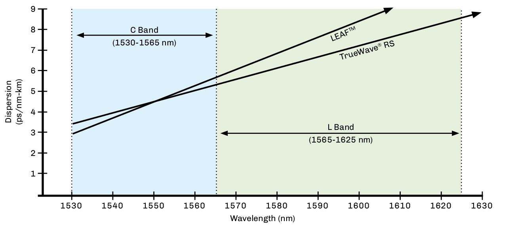

.Dispersion Rate.
|===
2+^|*Manufacturer* 2+^| *Mode Field Diameter* 3+^| *Attenuation(db/km)*
|||*1350nm* |*1550nm* |*1350nm* |*1550nm* |*1625nm*
|*Corning* |Leaf +
LS +
MetroCor|N/A +
N/A +
N/A|9.5 ± 0.5 +
8.4 ± 0.5 +
8.1 ± 0.5
|N/A +
0.5 + 
0.5
|0.22 +
0.25 +
0.25 
|0.24 +
N/A +
0.25
|*Fujikura* |FutureGuide LA
|N/A|9.6 ± 0.4|N/A|0.22|0.25
|*OFS* |TrueWave Reach* +
TrueWave +
RSTM|N/A +
N/A|8.6 ± 0.4 +
8.4 ± 0.6|N/A +
0.39|0.22 +
0.22|0.24 +
0.24
|*Prysmian* |TeraLightTM +
TeraLight Ultra +
TeraLight Metro|N/A +
N/A +
N/A|9.2 ± 0.5 +
9.2 ± 0.5 +
9.2 ± 0.5|0.38 +
N/A +
0.40|0.25 +
0.22 +
0.25|0.28 +
0.25 +
0.28
|*Sumitomo* |PureGuide +
PureMetro|N/A +
N/A|9.2 ± 0.5 +
8.3 ± 0.5|N/A +
0.40|0.22 +
0.22|0.25 +
0.25
|===

== Dispersion in Single-mode Fibers - Polarization Mode Dispersion

Polarization mode dispersion (PMD) is the term for the pulse spreading that occurs as a result of light energy of a given wavelength traveling at different states of polarization that are propagating at different velocities. Fiber geometry, stresses, or vibration, et al., can cause light traveling at different states of polarization to travel at different speeds. In this case, that fiber is said to be birefringent —  having more than one index of refraction. PMD is usually modeled mathematically as a difference in velocities of light
traveling it to orthogonal polarizations, for example, the X axis and the Y axis.

The primary cause of PMD in a fiber is poor geometry (ovality) at time of manufacture. Other major causes include post-installation stresses, galloping, Aeolian vibration due to wind, or vibration of a supporting structure, for example, a bridge, due to vehicular traffic.

.Polarization & Dispersion.
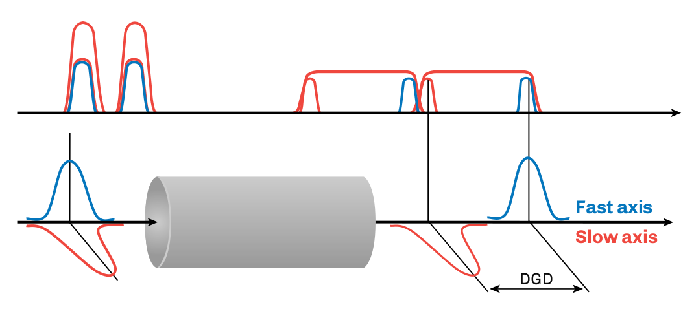

Higher PMD values were more common in fibers of early manufacture and high PMD fibers were represented statistically dependent on overall consistency and quality of fiber manufacture. External stresses induced after manufacture can also aggravate PMD. Because some statistical percentages of all fibers exhibited high PMD, high PMD fibers are found as a statistical percentage of all fibers in a cable. That is, the PMD
values of individual fibers in a single fiber cable can vary greatly.

The major figure of merit for PMD is mean differential group delay (DGD). Any given transmission protocol and speed will generally have a corresponding PMD tolerance or limit. For example 10 Gb/s SONET transmission has a PMD limit of 10 ps mean DGD, while 10 Gb/s Ethernet transmission has a PMD limit of 5 ps mean DGD. PMD is not generally compensated for in the way that CD is, but some new high-speed
modulation formats are PMD tolerant. Coherent detection with digital signal processing can compensate for many picoseconds of PMD.