:doctype: book
:title-page-background-image: image:CongruexLogo.png[]

= Chapter 4 - *_Cable_*

== Cable Designs

Fiber optic cables are designed to protect the internal fibers while providing an organized structure for terminations and routing. The cabling process bundles fibers in a tough, resistant structure to address different applications that require different cable jackets, internal structures, and components. They must protect against extreme weather conditions and may be strengthened to provide resistance to high tensile loading or armored to prevent attacks from rodents and other animals.

Cables are divided into two broad categories: outdoor and indoor. With indoor cables, the main concern is complying with national electric and fire codes. These codes strictly regulate the types of materials that can be used in cable to reduce flame spread and the evolution of toxic smoke in the event of a fire.

=== Loose Tube (Loose Buffered)

In loose tube cables, the 200/250-micron coated optical fibers or fiber ribbons are unrestricted within the buffer tube. This allows the fibers to be slightly longer than its confining cavity and to move within the cable when temperature variations lead to expansion and/or contraction.

In order to block the ingress and axial migration of water, filling material may be used in the buffer tube, or flooding material may be used in the cable core or sheath interface. In older loose-buffered designs, the fiber’s buffer tube is usually filled with a viscous gel compound that repels water. Newer cable designs often use powders or tapes that restrict water intrusion. If water gets into the cable structure and freezes, it can increase the fiber’s attenuation to unacceptable levels.

Loose buffering comes in two major styles (stranded or unitube) and is used for armored, indoor/outdoor, ADSS, OPGW, and FTTx drop cables.

=== Tight Buffered

`Distribution` —  The smallest common cable type, these are mostly used inside or in between buildings in campus applications. In buildings, the cable is usually found in riser applications and must meet national electrical codes. The use of sub-groups allows for a high count of optical cables. Distribution cables have up to with 3,456 fibers using a ribbon structure. They do not have individual strength members.

`Breakout` —  In breakout style, each 900-µm coated fiber has its own aramid strength member and outer jacket. Breakout cables are larger and more costly than distribution styles due to the amount of aramid yarn. They are very good for industrial applications. Cordage used in patchcords and jumpers are breakout style.

`Cable design objective` — To isolate the fiber from the cable
structure while maintaining practicality of design.
|===
| *Installation* | *Operation*
|Code requirements|Installed tension
|Pulling tension|Bend constraints
|Conduit/subduct size|Environmental exposure
|Fiber access|Temperature, wind, moisture/ice,
|Cost|toxicity
|Bend constraints|Reliability
|_20 x outside diameter (O.D.) of cable_|Useful life
||Required optical properties
|===

== Cable Materials and Structure

Cable jackets require a variety of materials to best serve the environment in which they will reside.
These materials offer protection from mechanical, thermal, chemical, and other environmental concerns.

=== Jacket Materials

[cols="30,70"]
|===

|Polyethylene (PE)|Resistant to moisture, weather, and abrasions. Good electrical properties over a wide temperature range. The standard jacket material for outdoor fiber optic cables

|Polyvinylidene fluoride (PVDF) |
Fire-retardant and low smoke; used for plenum cables.

|Polyurethane (PU) |
Excellent abrasion resistance. Used in raceways and duct environments.

|Polyvinyl chloride (PVC) |
Flame and oil resistant, flexible, and somewhat rugged. Used in both indoor and outdoor cables.

|Teflon^TM^ |
A jacketing material offering excellent properties in all cable categories with the exception of radiation environments. Used to meet flame, smoke, and toxicity codes, Teflon cable is more costly than other cable materials.
|===

=== Structural Elements

[cols="30,70"]
|===

|Aramid yarn|Commonly termed as a strength member, it is a fibrous material, i.e., Kevlar^TM^, that protects layers of the cable structure from damage and provides tensile strength to the optical cable. It also provides strain relief for fiber optic connectors.

|Armoring (buried cable)| Interlocked or corrugated steel armor is most common, offering protection from rodent attack and crushing forces. NEC Article 250 and NESC Section 9 consider cable with armor to be conductive and must be bonded and grounded. Shielding
tape contains a highly-conductive metal such as aluminum or copper primarily for its electrical properties. Armoring tape contains a metal with lower conductivity such as stainless steel for mechanical protection of the cable core.

|Buffer jacket (tube)| Protects fiber from moisture, chemicals, and mechanical stresses placed on cable during installation, splicing, and over its lifetime.

|Solid strength member| Can be in the cable center or on two sides in the cable jacket. Provides strength and stability to the cable structure. Generally a dielectric material like fiberglass rod and possibly covered with a PE or PVC. When placed on the sides of the cable, the cables will have a preferential bend direction.
|===

=== Gels, Powders, and Tapes

To repel water intrusion, most outdoor loose tube cables have replaced gel with water absorbents such as water-swellable powder, tapes, and yarns. These have less associated costs, and simplify the cable preparation process for the technician.

== Indoor Optical Cables — Plenum and Riser Cables

The National Electrical Code (NEC) and the CSA’s Canadian Electrical Code (CEC) discuss indoor optical cables with a prime focus on fire and smoke resistance for plenum and riser areas. The NEC code has designated requirements for cables that will create less smoke and resist flame better than similar PVC or PE cables, without the use of metal conduits.

* `Plenum`-- The return of air handling space located between a roof and a dropped ceiling.

* `Riser`-- Cables installed in vertical runs that penetrate more than one floor, or cables installed in
vertical runs in a shaft.

* `General purpose`-- Cables unsuitable for use in riser and/or plenum areas.

NEC Article 770 recognizes three types of optical cables and calls out markings for cables that meet NEC listing requirements for flame resistance and low-smoke emission:

* `Conductive` —  Those that contain metallic conductive elements.

* `Nonconductive` —  Those that do not contain metallic conductive elements.

* `Composite` —  Those with both electrical and optical conductors.

.Guide for marking of flame resistance and low smoke emission.
[cols="1,4,1,1"]
.Optical Cable Types
|===
|*Marking* |*Type* |*CSA* |*UL* |
OFC|
Conductive optical fiber cable|
|
UL 1581|
OFCP|
Conductive optical plenum cable|
FT 6|
UL 910|
OFCR|
Conductive optical riser cable|
FT 4|
UL 1666|
OFCG|
Conductive optical fiber general-purpose cable|
FT 4|
|
OFN|
Nonconductive optical fiber cable|
|
UL 1581|
OFNP|
Nonconductive optical fiber plenum cable|
FT 6|
UL 910|
OFNR|
Nonconductive optical fiber riser cable|
FT 4|
UL 1666|
OFNG|
Nonconductive optical fiber general-purpose cable|
FT 4|
|
|===

NOTE: Telcordia GR-409 provides technical requirements and characteristics for indoor optical cables.

Because no conduit is required for plenum cables, it is easier to route cables, creating a cost savings. Other benefits from this cable type are reduced weights on ceilings or fixtures, easier configuration, and flexibility for local area networks (LANs) and computer data systems. Floor penetrations that require types OFNR or OFCR shall contain only cables suitable for riser use.

=== NEC Article 770-48(A)

==== The 50-foot (15-meter) rule

In sections 770-48(A) and 800.48 of the NEC, it is stated that no more than 50 feet (15 meters) of measured unlisted conductive and nonconductive outside plant cables shall extend into the structure and should transition (as practical) to inside listed (rated) cables. There are several exceptions listed to this rule in the NEC.

NEC Article 90.2 lists some exceptions, including electric utilities, communications utilities, and mines.

== Low Smoke Zero Halogen

Low smoke zero halogen (LSZH) cable materials are common for international installations and seeing increased usage in the United States. Utilized in confined areas, this material is environmentally stable at low temperatures and resistant to wet locations.

Due to their chemical make-ups, cable jacket materials emit a variety of environment-affecting substances when burned. Chlorine, heavy metals and plasticizers are just a few of the residual by-products left over from the intense heat emitted from the plastics manufactured into the various structures of a cable. Hence, the development of LSZH materials.

LSZH cabling materials contain flammable polymers including high amounts of metal hydrates (a chemical combination high in water molecules). When burned, the hydrates release water that reduces the flame through a heat-absorbing process, retarding the spread of fire and smoke and the production of fire by-products.

.LSZH Cabling Interior
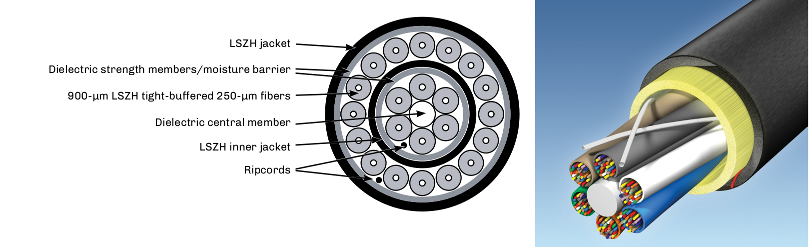

* International standard for indoor cables.
* Zero halogen means removing halogens such as chlorine and fluorine from jacket compounds.
* Retards flame spread and reduces smoke.
* Specified by IEC 60332, 60754, and 61034 standards.
* Will be seeing increased usage in the United States.

== Distribution Cables

Used mostly in indoor plenum (OFNP), riser (OFNR), and low smoke zero halogen (LSZH) building environments, distribution cables are a tight-buffered cable design that incorporates 900-µm coated fibers. There are two basic styles: the standard distribution cable, in which all of the 900-µm fibers are surrounded by aramid yarns, and the sub-unit distribution cable, which has two or more distribution cables under the
same outer jacketing. A 144-fiber sub-unit cable would have 12 color-coded sub-groups of 12 fibers each.

.Distribution Cable
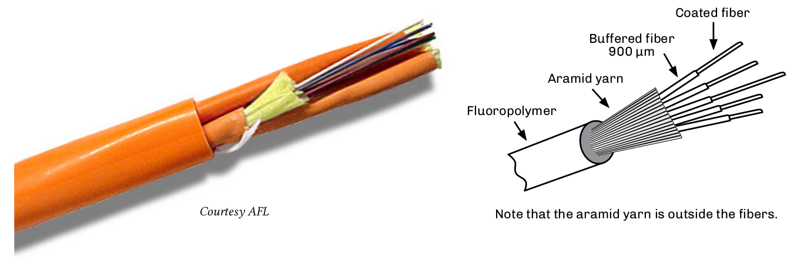

Most indoor applications use the standard distribution cable due to its small diameter and small bend radius. In applications where multiple fibers are being dropped from the cable, the sub-unit distribution cable allows access to individual groups of fibers. Each of the sub-unit outer structures is color-coded to comply with the TIA-598 color code standard. For example, the first group of 12 fibers would have a blue
jacket and the second group would have an orange jacket, etc.

Distribution cables have the smallest diameter of the tight-buffered cable designs, allowing them to be used in tight or space-limited locations. While most applications of distribution cables are premises-related, indoor/outdoor styles are also available for substations. These provide a cost benefit by eliminating the need for a splice or cross-connect within 50 feet of a building entrance. For service providers using single-mode fibers, this allows for preterminated patch panels to be installed with a length of fiber cable that
can be spliced at the outside plant entrance vault. For premises applications, this would save two splice or connection points, providing both cost and attenuation benefits.

Distribution cable may also be known as non-breakout style cable.

.Double jacketed & Sub-unit distribution cable
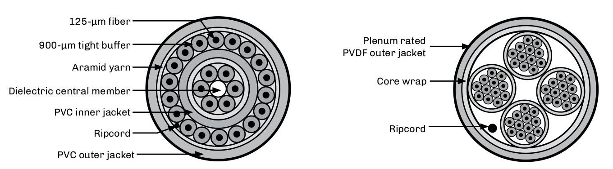

== Interlocking Armor Cable

This cable structure is manufactured with a jacketed aluminum outer structure to provide additional protection for indoor or indoor/outdoor breakout or distribution cables. The interlocking armored cable provides ruggedness and flexibility. Because of this, the cable does not require a conduit and can be installed easily into raceways or areas where space is limited. The cable structure also protects against rodents and heavy duty industrial applications. Due to the metallic structure of the cable, it must be grounded per NEC requirements. The cable is available with plenum (OFCP), riser (OFCR) and LSZH listings.

.Metallic-structured Cable
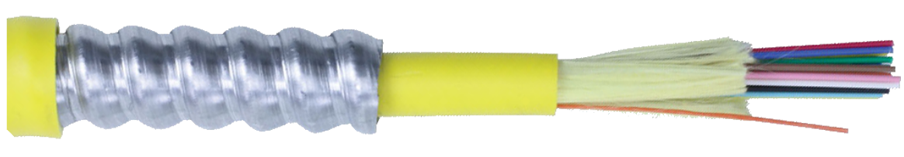

. Features jacketed metallic structure
.. Rugged yet flexible
.. OFCP, OFCR, and LSZH jackets
. Grounding is required

== Breakout Cables

The breakout cable design offers a heavy-duty rugged cable for shorter network applications. This may include local area networks (LANs), data communications, utility substations, video systems, and process control environments.

Breakout cables feature a tight buffered design with individual aramid yarn strength members surrounding each 900-micron fiber. As each optical fiber has its own strength member, this style is ideal for direct termination with optical connectors. However, these cables are usually heavier and physically larger than telecom types with equal fiber counts. They have higher tensile strengths and greater crush resistance values than distribution cables.

The term `breakout` defines the key purpose of the cable: that one could breakout several fibers at any location and route the other fibers elsewhere. For this reason breakout cables should be color-coded for ease of identification. Because this cable is used in environments where building and safety codes may require plenum- or riser-rated cable jackets, breakout cables are designed to meet national electric codes (NEC).

Most types of cordage used in jumpers, patchcords, and pigtails are breakout cable designs. For users planning on direct connectorization, it is key to match the subunit’s outside diameter with appropriate plug (rear assemblies) for proper strain relief.

.B12-fiber breakout cable diagram.
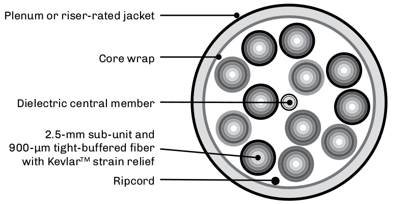

.Breakout Cable Graphics.
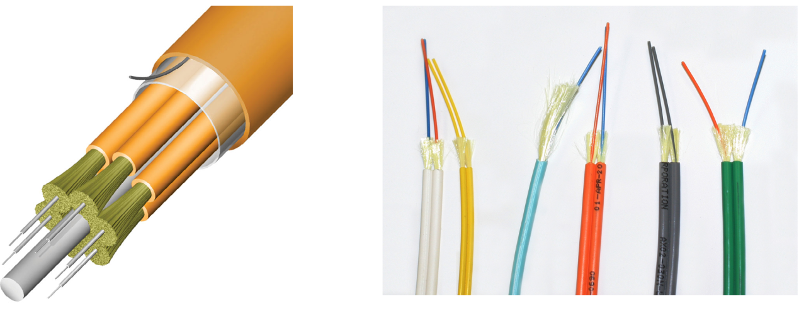

== Fiber Optic Cable Cordage

The need to provide a cable structure with standardized geometries and structures for connector applications was recognized early in the history of fiber optics. Once fiber optics moved from the lab to the users’ environment, the need for cross-connecting and routing optical fibers to terminal equipment was critical.

The cable had to feature flexibility, ruggedness, and meet applicable building codes all while protecting the internal optical fiber. Cable and connector manufacturers quickly standardized cordage using the 3-mm O.D. jacket for standard connectors and 1.6 and 2 mm for small form factor connectors. While there are several terms for these cables, the basic requirements still exist today. Cable assemblies made from this
cordage are also known as jumpers, patchcords, pigtails, and interconnect cables.

.Cable Cordage diagram.
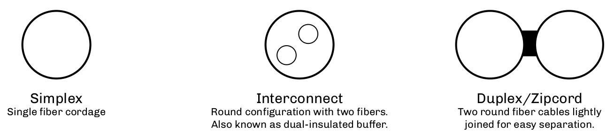

NOTE: Breakout cables have numbers of the simplex versions built internally into the cable structure. These sub-units can vary from 1.6 mm to 3 mm.

.Cordage Color
image::media/cordageColors.png[align="center"]

== Indoor/Outdoor Cables

Indoor/outdoor cables are a cost-effective solution for applications that previously would have required a transition point at the building entrance to meet the 50-foot limitation required National Electric Code (NEC) for unlisted communications cables (NEC 770.48(A)).

To meet the requirements of the NEC, several considerations have to be designed into the cable structure. The cable cannot use jacket materials such as polyurethane (PU) or polyethylene (PE). The PVC jackets include a black UV stabilizer for higher UV resistance, required for aerial applications. The internal elements would have to meet the flame and toxicity requirements, eliminating most internal cable gels. The use of blocking tapes, aramid yarn, and special (nonhygroscopic, nonnutritive to fungus, nonconductive, homogenous, nontoxic) gels that meet the requirements of the NEC are key components that allow this cable to meet both the indoor and outdoor requirements.

=== Standard for Indoor/Outdoor Optical Fiber Cable

The ICEA S-104-696, TIA-472E000, or Telcordia GR-409 govern the standards for indoor.outdoor optical fiber cable.

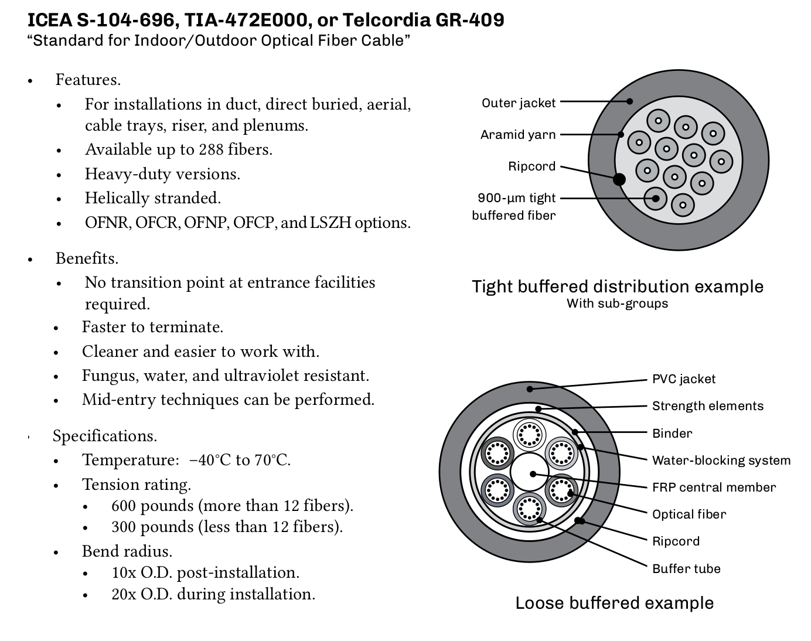

== Loose Tube Outside Plant Cables

Cables used in outside plant applications must be designed to survive a large range of environmental conditions. The term outside plant (OSP) covers cables used in aerial, underground, and ducted applications. Issues for OSP cables include wind or ice loading effects, freezing conditions, or UV radiation from the sun. Damage caused by rodents, gun shots, or lightning, and instances of multiple cables being installed in the same duct (or innerduct) are also factors.

Of these, aerial cables require the most stringent specifications. This is due to thermal cycling from day to night and from season to season. Aerial cables must also handle the expansion and contraction stresses that these thermal cycles cause.

Aerial cables need to be attached to pole and tower structures to provide a firm grip onto the cable structure. Therefore, sag becomes an issue. The less the sag, the greater the tension on the cable clamps. The National Electrical Safety Code (NESC) also mandates clearances near highways, rivers, canals, and railroad tracks.

Over the years, a variety of cable structures have been developed for different installation methods for communication systems. Aerial, underground ducts, and direct buried cables are the basic three installation locations for optical cables. Once the location of the cable is known, then one must address the cable structure itself.

.Environmental guide for OSP installation.
[cols="26,35,40"]
|===
|*Installation type* | *Environmental conditions* | *Types of cable used* 
|*Aerial*|
•Thermal hot/cold cycling +
•Wind and ice loading +
•Lightning +
•UV from the sun +
•Expansion/contraction +
•Aging effects +
•Tension +
•Squirrels +
•Gunshots
|•Optical ground wire (OPGW) +
•All-dielectric self-supporting (ADSS) +
•Outdoor cable (overlashed to messenger) +
•Figure 8 cable +
•Skywrap
|*Underground, ducted*
|•Possibility of water presence +
•Possibility of icing +
•Friction (for ducted installations) +
•Rodents +
•Dig-ups 
|•Stranded OSP cables +
•Unitube (central tube) OSP cables +
•Indoor/outdoor cables +
•Slotted core cables +
•Microduct cables|

|===

. Loose buffered.
. Stranded and unitube structures.
. 250-µm fiber coatings.
..  200-µm fiber coatings for high fiber count cables.
. Designed for greater stress.
. Special designs for aerial, direct buried, duct and utility applications.
.. Armored option.

== Stranded Cables

In stranded cables, individual color-coded buffer tubes are wrapped or stranded around the cable’s central strength member, periodically reversing (reverse helical wrap or reverse oscillating lay). The tubes may be left dry or filled with gel to protect the fibers and can have one or two layers, depending on the fiber count required. Cables with fiber counts less than 288 fibers are generally stranded-type, while larger fiber counts are usually placed into a 12-fiber ribbon matrix.

Multistacking buffer tubes and grouping up to 24 fibers per tube has allowed for high fiber (432) counts. The drawback of this approach is that when OTDR testing, the inner tubes will show a shorter length versus the outer layer of tubes. This is due to the longer lay of the tubes during manufacturing. This should be noted on OTDR acceptance test forms.

.Example stranded Cable.
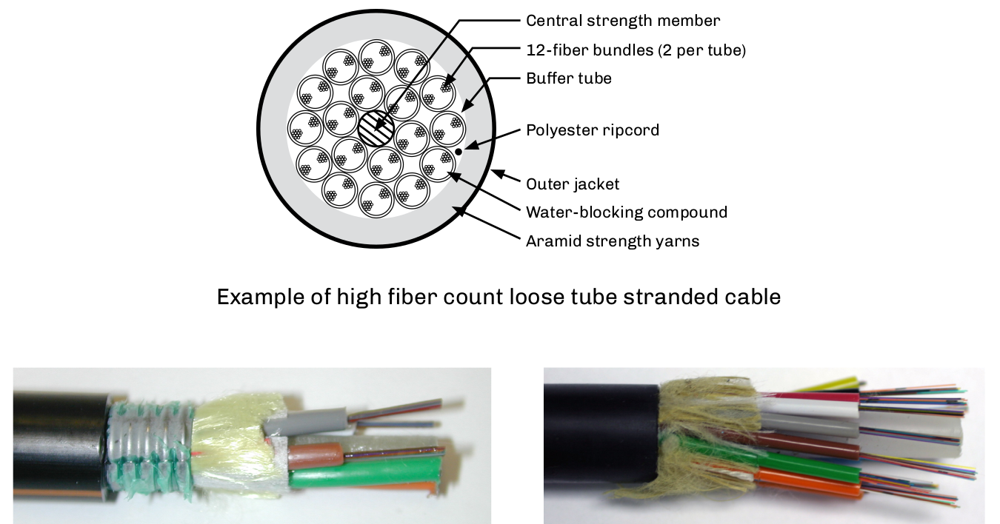

* A loose tube cable with individual color-coded buffer tubes are wrapped or stranded around the central strength member.
* Tubes may be dry or gel filled.
* Cables with 288 fibers or less are generally stranded-type, while larger fiber counts are usually ribbon-type.

== Unitube Cables

Unitube cables are sometimes known as central tube or LXE cables. As opposed to stranded loose tube cables, these feature a large central tube in which fibers are grouped using a color-coded binder (yarn) per the TIA-598 color code standard. Cable structure can be physically smaller due to a central tube versus many multiple tubes around a central strength member. Cable has two steel or dielectric strength members 180° apart for cable strength and rigidity.

.Diagram of a Unitube cable.
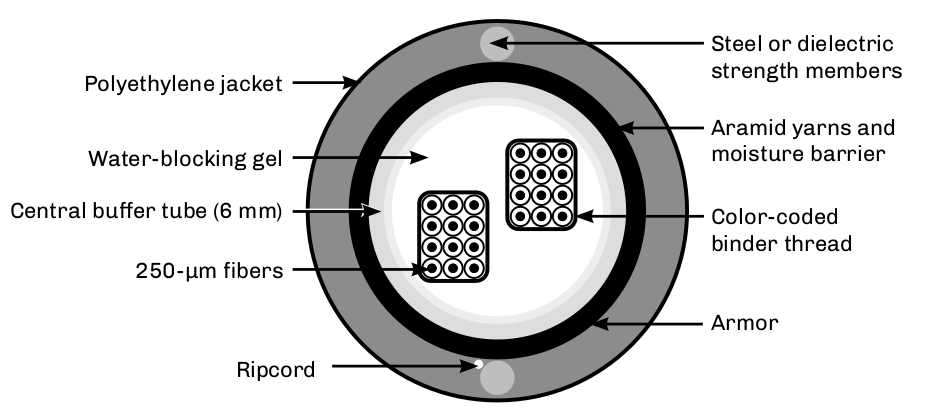

[NOTE]
====
. Mid-entries require special tooling. 
. Fanout kits are unique for unitube/central tube cables. 
. If the cable is armored or has metallic strength members, it must be grounded per NEC Article 250 or NESC Section 9.
====

* Loose tube design.
* Also known as central tube or LXE cables.
* Use a large central tube with the fibers grouped using color-coded binder thread.
* Physically smaller than stranded types.
* FTTH drop cable design.
* Commonly used with internal ribbons.

== Ribbon Cables

High fiber count loose tube stranded ribbon cables are used in feeder and long haul routes. The use of ribbon fibers allows for high fiber counts. The stacking of six ribbons of twelve fibers each (or more) in each tube (six shown) allows for a fiber count of 432. Ribbon cables are also provided in counts of 864, 1152, 1,728 and 3,456. High fiber count cables are available with flat ribbons or with collapsible ribbon technology, allowing ribbons to be collapsed into a round shape then flattened into a standard ribbon format for easy splicing.

.Uniform Ribbon Cable diagram.
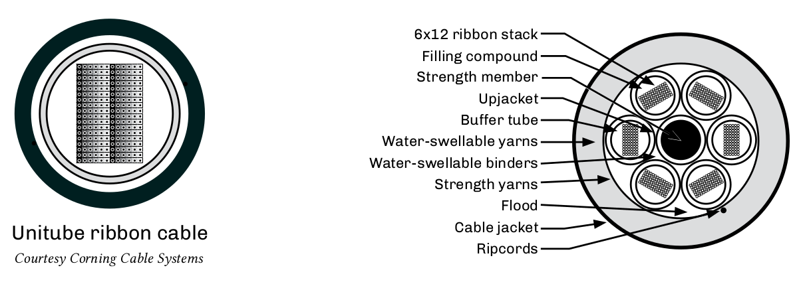

Fiber ribbons generally contain 8, 12 or 24 fibers, although the trend is to even higher fiber count ribbons with new banding and color markings for identification. Each fiber in the sequence is either individually color-coded or one fiber is colored and the rest are identified by their position in relationship to the reference fiber.

.Spider Web Ribbon Cable.
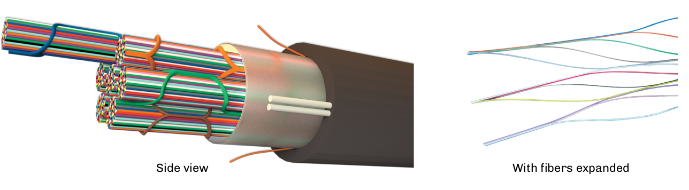

* Used in feeder and long haul routes.
* Available in counts from 432 fibers to 3,456 fibers.
* Fiber ribbons contain two or more fibers.
* Each fiber is individually color coded, or one fiber is color-coded and the rest are identified in relation to the reference fiber.

== Microduct Cables

Microduct cables are a small diameter cable with high density fiber counts up to 432 fibers. This provides efficient utilization of duct space and reduces installation costs when used with cable jetting technology and microducts with diameters ranging from 5 mm to 16 mm.

Compliant with Telcordia GR-20 and IEC 60794 standards, it is available as an outdoor cable with HDPE jacketing, or as an indoor PVC riser or LSZH cable, or as an indoor/outdoor design. The outdoor design is a dielectric design with water blocking and intrinsic ripcord.

Fiber options include single-mode and multimode types in stranded or central tube designs.

.Microduct Cable
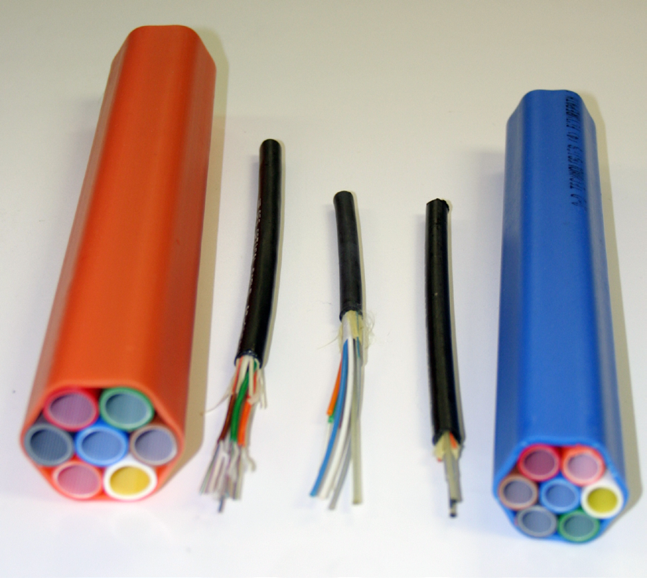

.Microduct cable specifications
|===
3+^| *Mechanical Specification*
|Bend radius|Dynamic +
Static |20X - 40X +
15X - 20X
|Tension | Installation + 
Static |300 lbs (1335 Newtons) +
 90 lbs (400 Newtons)    
2+^|Outside diameter|0.25” - 0.85”
|===

. Small diameter cables with high density fiber counts.
.. Two to 432 fibers.
. Efficient utilization of duct space.
. Reduced installation costs when used with cable jetting.
. Meets Telcordia GR-20 requirements.
. Indoor or outdoor.
. Single-mode or multimode.
. Stranded or central tube.

== Aerial Fiber Optic Cables

Aerial cables must be specifically designed to handle the environment over their life span. Wind and ice loading, pollution, UV radiation, thermal cycling, stress, and aging are a few considerations that must be addressed when selecting aerial cable. Several styles are available, varying based on intended placement,application, and environment.

.Loose Tube Overlashed To Messenger.
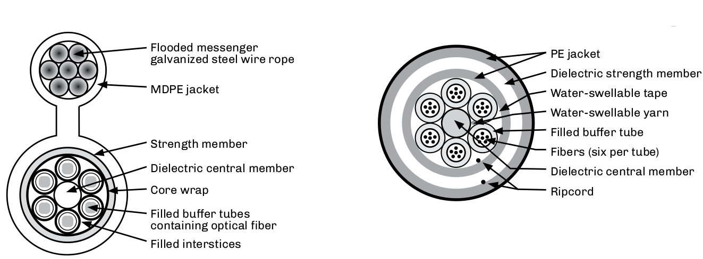

.Typical ADSS Specifications
[cols="3,1,1,1,1"]
|===
|Specified span length (ft.) +
Nominal Sag (ft) +
Nominal Axial Load (lbs.)|600 +
6 (1%) +
750 |800 +
8 (1%) +
1,6351 | 1250 +
12.5 (1%) +
2,070|1,500 +
22.5 (1.5%) +
2,350 
|Number of fibers +
Cable diameter (in.) +
Cable weight (lbs./mi.) +
Minimum bend radius (in.) +
Cable breaking strength (lbs.) + |12 +
0.53 +
525 +
10 +
7,500 |22 +
0.68 +
865 +
13 +
9,500| 16 +
0.61 +
700 +
12 +
13,400 |48 +
0.73 +
995 +
14 +
19,000 +
|NESC heavy condition Sag (%) +
Axial load (lbs.) |3.5 +
2,100 | 3.5 +
3,400 | 3.5 +
4,800 |3.5 + 
6,000
|===

.Dielectric and Optical Ground wire diagram.
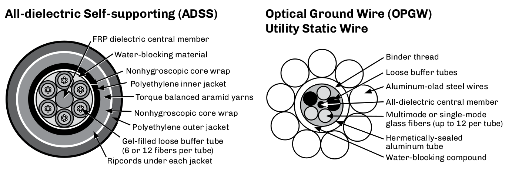

== ADSS Fiber Cables - IEEE P-1222

Mostly used by utilities, all-dielectric self-supporting (ADSS) fiber optic cable cable can be installed as an underbuild on existing electric lines without de-energizing the electric circuit.

All ADSS cables have a central core of dielectric fiberglass reinforced plastic (FRP) anti-buckling element. Spaced around the anti-buckling element are variable quantities of gel-filled loose tubes that contain the optical fibers, followed by water blocking binders. Around all these items is the non hygroscopic core wrap.Some ADSS cables also have a polyethylene inner jacket.

The following layer contains the cable’s strength member —  the aramid yarns —  which are torsionally balanced to prevent twisting during installation. Next comes a nonhygroscopic core wrap. The polyethylene outer jacket varies in thickness. When the cable is to be installed adjacent to or as an underbuild on an extremely high voltage (EHV) electric line, their outer jacket is a cross-linked polymer with anti-tracking additives.

Big ADSS cables require a lot of KevlarTM for strength; this is applied by wrapping Kevlar yarns helically around the core of the cable. When a lot of Kevlar is required, the Kevlar is wrapped in several counter- rotating layers. This gives a torsionally-balanced design in which the tendency for the cable to rotate from one layer of Kevlar is cancelled out by the next layer. The different layers are at different distances out from the core and therefore have different torsional effects. The core itself is also helical and contributes to the total torsion in the cable. So it is very difficult to get a fully torsionally-balanced design.

.Comparison of ADSS Cable Design Examples.
[cols=4*]
|===
||*Long span*|*Medium span*|*Short span*|
*Fiber count*|
2 - 576|
2 - 432|
2 - 288|
*Diameter*|
0.535 - 1.142 in

13.6 - 29 mm|
0.512 - 0.969 in

13 - 24.6 mm|
0.323 - 0.693 in

8.2 - 17.6 mm|
*Rating breaking strength*|
6,100 - 16,400 lbs

2,766 - 7,439 kg|
3,100 - 8,080 lbs

1,406 - 3,665 kg|
2,625 - 4,250 lbs

1,191 - 1,927 kg|
*Span length*|
800 - 2,100 feet

274 - 640 meters|
100 - 1000 feet

30.5 - 305 meters|
50 - 900 feet

15.25 - 274 meters|
|===

Each has a certain number of fibers, certain dimensional data and a certain rated breaking strength (RBS), or maximum rated cable load (MRCL), and is utilized under varying conditions in the field.

ADSS fiber optic cable is being designed and manufactured in accordance with IEEE P-1222, the worldwide standard for ADSS cable.

== Optical Ground Wire Cables - IEEE 1138

Optical ground wire (OPGW) cable is manufactured from a minimum of four fibers up to a maximum of 432 fibers. Research is underway to assemble an OPGW cable with greater than 432 fibers. Reels of OPGW can be manufactured in lengths up to 6,000 meters (19,685 feet). On most projects these lengths vary according to the distance between the splice points. Longer lengths can be manufactured at an increased cost.

Optical fibers are placed in hermetically-sealed stainless steel or aluminum tubes. They are also placed in grooves on an aluminum channel core. Around the tubes or channel core is wound aluminum alloy and aluminum-clad steel strands. The number of each strand applied depends on the required fault current capacity and rated breaking strength (RBS) of the cable. The strands can be a combination of the two wire
types and installed as a single layer of wrap. If a higher fault current capacity or RBS is required, two layers can be installed. The inner layer is the aluminum-clad steel strands for cable strength. The outer layer is aluminum alloy strands for fault current. There are designs where the two are interwoven. Each requirement warrants a special investigation as to the design characteristics of the fiber optic cable.

.Ground Wire.
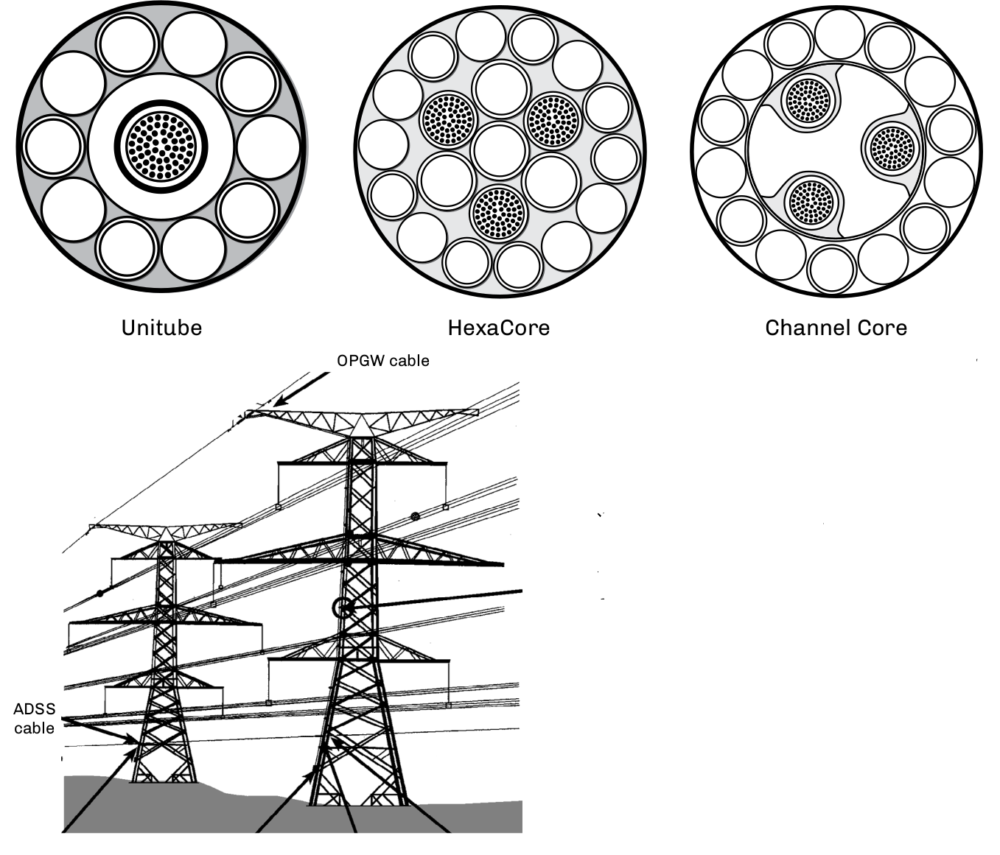

OPGW is installed on the top of electric
power line structures where it is used to
carry the fiber optic glass as well as to shield
the power line against lightning strikes.

== FTTx Drop Cables

FTTx drop cables provide the final delivery to the subscriber. Traditionally, drop cables have had low fiber counts from 1 to 12 fibers.
Many were flat cable designs, taking fiber to the subscriber location. With various FTTx applications dropping fiber to single homes and
multiple dwelling units, drop cables now come in higher fiber counts and in flat, round, and even armored designs.

Customer drop cables can be an aerial or an underground installation. Underground drop cables include a metallic strand for
locating. The individual customer requirements for the drop cable to the building determines which of the varied styles will be used.
Because of the short spans that are involved with drop cables, they are designed for lower tensile strengths (typically 300 lbs.) and have
lower fiber counts, i.e., one to two fibers for FTTH and up to twelve fibers for FTTB.

.FTTx Drop Cables & Figure Eight Drop Cable.
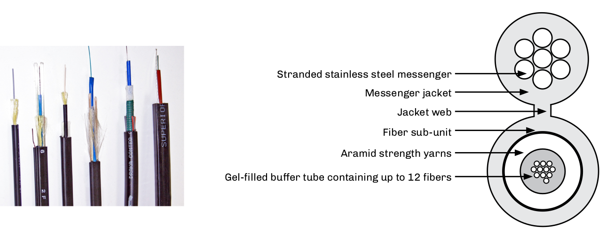

.Sample Specifications for Smaller Drop Cables
|===
.2+^|*Fiber count* .2+^| *Nominal diameter mm (in)* .2+^|*Nominal weight kg/km (lbs/kft)* 2+^|*Max Tensile Loading* 2+^|*Min. tensile loading*
|*Install n(lbs)*|*Long Term n(lbs)*|*Install mm(in)*|*Long Term mm(in)*
|2 – 12|7.0 (0.28)|44 (30)|1335 (300)|445 (100)|140 (5.5)|70 (2.8)
|===

=== Environmental Temperature Specifications

* Operation/storage —  -50℃ to +70℃
* Installation —  -30℃ to +75℃
* Aerial, direct buried, and ducted versions.
* 300-pound tension rating.
* Unitube structure.
* Optional tracer wire.
* Fiber counts from 2-12.

== Typical Optical Cable Specifications

.General Purpose Loose Tube Outdoor Cable.
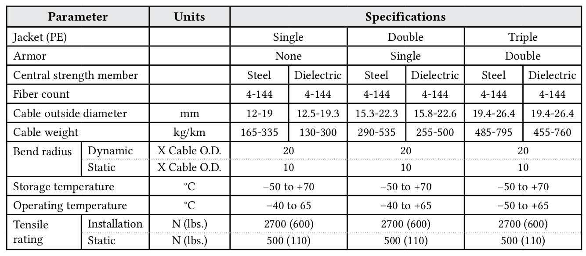

=== Fiber and Buffer Color Codes

The colors and designations in TIA-598 are also used for the buffer tubes and twines in loose tube outside plant cables, as well as in the fibers and subgroups in indoor distribution and breakout tight buffered cables.

Based on 12 colors per fiber grouping (for example, tube or bundle), the 13th fiber in a cable would be connected to port 13 in a patch panel. It would be the first (blue) fiber in the second (orange) tube.

.Tube Colour and Buffer colour codes.
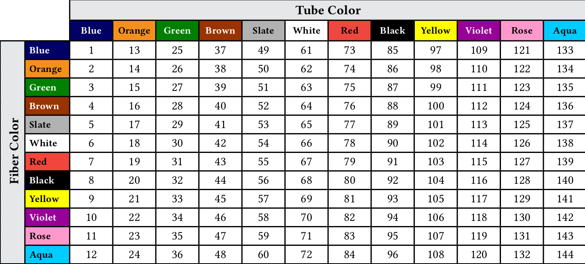

== Composite and Hybrid Cables

.Composite and Hybrid Cable.
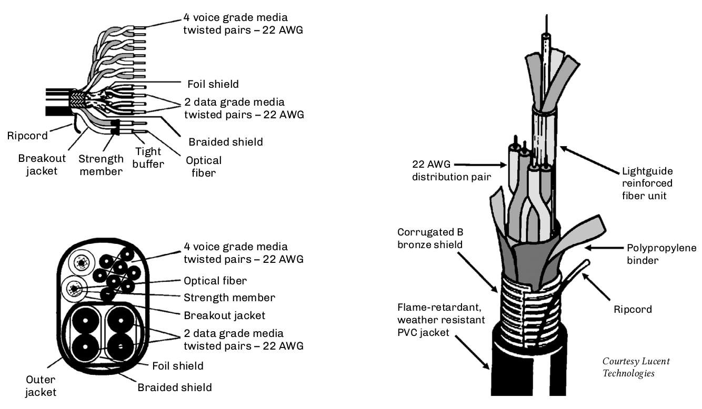

=== Composite Cable

A unique type of cable designed for multipurpose applications. Both optical fibers, and twisted pair wires and/or coax are jacketed together for situations where both technologies are presently used.

The NEC defines composite cable as containing both optical fibers and current-carrying electrical conductors in the same jacket.

An additional usage of this cable style is when future expansion for optical fibers is being planned. This cable allows for existing copper networks to be upgraded to fiber without requiring new cable to be installed. This can be accomplished without disrupting the existing service.

In application areas such as local area networks and fiber to the curb, a smooth transition can be made from copper to fiber. The addition of the copper can also resolve the powering issues of remote electronics such as in the HDTV camera cable.

=== Hybrid Cables

Designs are available with multiple elements including specific fiber types (multimode or single-mode). These fibers are color coded for easy identification. As with other conventional types of cables, the hybrid types can be manufactured to best meet the user’s environmental and transmission requirements.

NOTE: Be careful of the terms hybrid and composite. There is no uniformity in the descriptions as defined by TIA-440-B Fiber Optic Glossary Standard.

== Cable Interconnection Options

=== Distribution Cables
* Multimode:
.. Connectors directly terminated onto 900-µm buffer coating.
.. Pigtail spliced (mechanical or fusion); requires a splice tray.
.. Mechanical splice-on connectors.
.. Fuse-on connectors.
* Single-mode:
.. Pigtail spliced (mechanical or fusion); requires a splice tray.
.. Mechanical splice-on connectors.
.. Fuse-on connectors.

=== Breakout Cables
* Multimode:
.. Connectors directly terminated onto 1.6, 2.0, or 3.0-mm sub-unit.
.. Pigtail spliced.
.. Direct connectorization using splice-on plugs.
* Single-mode:
.. Pigtail spliced (mechanical or fusion); requires a splice tray.
.. Fuse Connect connectors.
.. Direct connectorization using splice-on plugs with prepolished UPC and APC endfaces.

=== Loose Tube Outdoor Cables – 250-µm Coating (Central Tube or Stranded)
* Multimode:
.. Fanout kit to build 250-µm coating up to 900 µm.
.. Direct termination onto fanout kit (900 µm).
.. Pigtail spliced (mechanical or fusion); requires a splice tray.
.. Direct connectorization using splice-on connectors.
* Single-mode:
.. Pigtail spliced (mechanical or fusion); requires a splice tray.
.. Fuse-on connectors.
.. Fanout kit to build 250-µm coating up to 900 µm.
.. Direct connectorization using splice-on plugs with prepolished UPC and APC endfaces.

== Loose Tube Cable Preparation

=== For Splicing and Connectorization

.Loose Tube Cable Preparation.
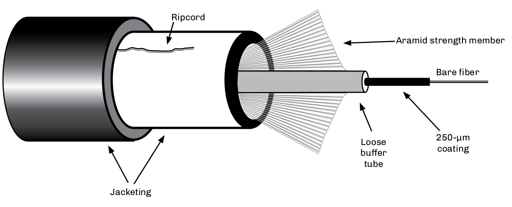

To prepare a fiber for splicing or connectorization, the cable’s protective outer jacket(s), armoring*, and buffer tubes must be removed to allow access to the individual optical fibers. In this drawing, the cable’s outer and inner jackets and buffer tube are removed to expose the aramid strength member and internal fibers. The fiber still has the protective coating, which will also have to be removed prior to splicing or
connectorization.

To remove the outer jackets, standard cable strippers can be used. Make sure the blades or cutting members do not damage the internal buffer tubes. First cut a small section (6”) of the cable’s jacket to allow access to the ripcord, make tool adjustments, and practice a few cuts. When using a ripcord for access, a small notch is made in the outer cable jacket to allow the ripcord to start (without breaking). A small length of ripcord should be left for future access to the cable.

The aramid strength members now can be removed with splicer’s scissors or aramid cutters. The amount of aramid yarn removed varies depending upon the design of the cable’s strength member. If the cable does not incorporate a strength member, the aramid yarn can be used as one.

The buffer tubes, like the outer jacket, can be removed by mechanical stripping tools. The operator should be careful not to kink or damage the internal coated fibers.

Once the coated fibers are exposed, the splicer must remove the fiber’s 250-µm protective coating before cleaving can begin. Most coatings can be stripped using mechanical methods. The splicer should take careto use tools and procedures that will not damage the fibers.

After the fiber’s coating is removed, clean the fiber with isopropyl alcohol to ensure that it is clean. Contaminants on the fibers can cause it to misalign in the splicer’s alignment fixture and contaminate the splicer’s V-grooves.