:doctype: book
:title-page-background-image: image:CongruexLogo.png[]

= Chapter 5 - *_Connectors_*

== Fiber Optic Connectors

Connectors offer a mechanical means to terminate optical fibers to other fibers and to active devices, which connect transmitters, receivers, and cables into working links.

The primary task of the fiber optic connector is to minimize the optical loss across the interface of the coupled fibers. High-performance connectors are classified as those with less than 0.75 dB of loss for premise applications and 0.5 dB for high-speed single-mode applications. Most losses occur from inexact end-to-end mating of the fibers, the surface condition of fiber ends, and fiber and ferrule tolerances.

The second task of the connector is to provide mechanical and environmental protection and stability to the mated junction.

The third task is to minimize reflections by maintaining physical contact, which reduce Fresnel reflections between fiber surfaces. An ideal connector would encompass the following features:

* Utilize a fiber alignment scheme yielding low loss;
* Be physically small;
* Have low reflectance values;
* Be of rugged construction;
* Be easily field terminated;*
* Offer excellent fiber/cable strain relief; and
* Have good repeatability.

To minimize the attenuation of a connection, certain conditions must be met. First, the fiber ends must be optically flat (multimode), spherically polished or angled, and smooth. Second, the alignment of both fibers must be precise.

With high-speed digital systems and analog video systems that incorporate laser sources using single-mode fiber, the connectorized fiber endface can become a highly-reflective surface. To prevent Fresnel reflections from interfering with system performance, several types of optical finishing techniques have been developed. Called physical contact (PC) endfaces, the fibers can be polished at angles (APC) or spherically (UPC/SPC) to minimize Fresnel reflections.

Fiber optic connectors are specified by the TIA 604 Fiber Optic Connector Repeatability Intermateability Standard (FOCIS) in North America, and the IEC 61753/61754 for international use. The FOCIS 604 specifications define the minimum physical attributes of mating fiber optic connector components. The specification includes types, configurations, tolerances, keys, polishes, and, in many cases, connector
terminology.

=== Connector Keys

Since the early 1980s, the dominant fiber optic connectors have provided male keys and female keyways to assist with the alignment of the fibers, ferrules, and plugs. Keyed connectors allow for 0.2 dB repeatability of optical measurements. In the case of APC connectors, keying is essential to proper alignment, as specified by Telcordia GR-326.

== Main Connector Components

.Connector Plug Sideview.
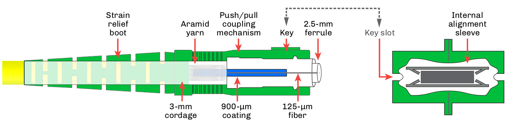

* `Boot`: Designed to provide strain relief at the connector/cable interface.

* `Body`: Also called the housing, this typically plastic or metal part provides the mechanical attachment to the sleeve using push/pull (SC and LC), threaded (FC), or bayonet (ST) coupling mechanisms.

* `Ferrule`: The precision part of an optical plug that provides the fiber optic centering and stabilizing of the fiber. The optical fiber’s cladding is retained in the ferrule either by adhesive or crimp techniques. Usually consists of a hardened material such as ceramic (zirconia), stainless steel, and tungsten carbide. Typical ferrule diameters are 2.5 mm for standard (ST, SC, FC) plugs and 1.25 mm for small form factor (LC) plugs.

* `Alignment sleeve`: Internal to all adapters, a precision internal mechanism is required to axially align the mating ferrule(s). A ceramic C-clip is the most commonly used method. The C-clip slot is compressed and inserted into the sleeve. Once released, it will expand and lock itself into the adapter sleeve. Sleeves can also be of solid design and sometimes come in metallic versions.

* `Adapter`: Also known as a bulkhead, the adapter is for mechanical mating of the mating plugs and its internal C-clip aligns the optical ferrules. Adapters used in patch panels allow interconnections to be made between transmission equipment and fiber spans. Never use the term coupler (also known as a splitter) to describe a sleeve; in fiber optics, a coupler splits optical signals.

=== Causes of Excess Loss
[grid="none", frame="none"]
|===
|*Connector* | *Fiber*
|• Axial separation +  
• Angular misalignment +  
• Radial displacement +   
• Endface damage +        
• Contamination and dirt |
• Core mismatch +
• Numerical aperture +
• Core/cladding concentricity +
• Cladding ovality.
|===

== Connector Types

. In-line style.

Consists of two plugs with a middle adapter. Sleeves are used to mechanically align the two mating ferrules. Loss across the entire connection
should be 0.75 dB or less for multimode fiber and 0.5 dB for single-mode. Sometimes called housings or bulkheads.

[start=2]
. Multifiber.

Consists of a plug and mating receptacle with male and female termini (pins and sockets). This approach offers multiple fiber interfaces and most are easy to connect or disconnect. However,the dis ad van tag es are higher costs, optical repeatability, and difficulty to repair. Types include broadcast, military, and array connectors such as MPO/MTP.

.In-line connector assembly & Multifiber broadcast connector.
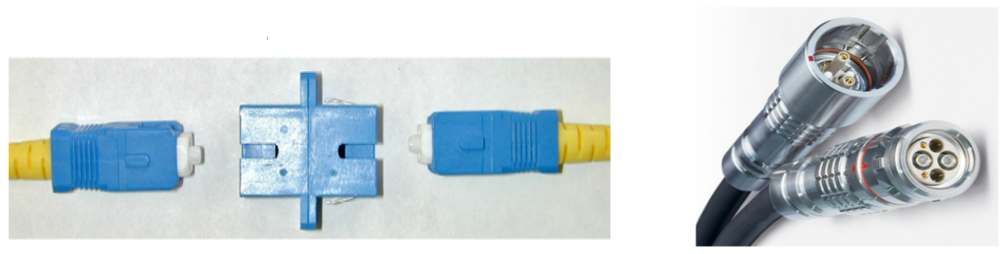

[start=3]
. Receptacle for active devices.

Consists of a receptacle housing built to align the plug with the window of a LED, laser, photodetector, or photodiode.

[start=4]
. Attenuators.

Attenuators consist of adapters with an internal filter that attenuates the optical signal at specific wavelengths. A wide variety of constructions are available providing fixed or variable amounts of attenuation. Attenuators can be reflective or nonreflective, and provided with or without connectors, e.g., in-line patchcords

.Active decive receptacle & Attenuators.
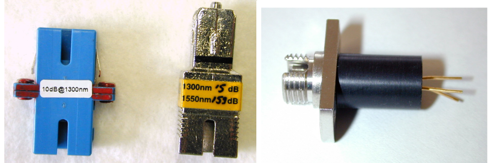

[start=5]
. Terminators.

Terminators are modified plugs with the same endface polish as the network connection. They are used in high optical power systems to reduce
Fresnel reflections.

== What to Look for in a Connector:

* Low loss (attenuation)
.. 0.50 dB – ITU-T G.671.
.. 0.75 dB – TIA-568.
.. 0.40 dB – Telcordia GR-326-CORE.
* Repeatability (keyed)
.. 0.2 dB – Telcordia GR-326-CORE.
* Reflectivity (in dB)
.. >20 dB (62.5/125 fiber) – IEEE 802.3, TIA-568
.. >35 dB (single-mode fiber) – TIA-568
.. >55 dB (CATV) – TIA-568
.. >50 dB (UPC polish)
.. >65 dB (APC polish)
* Rugged (strain relief).

=== Typical Connector Roles

.Point to Point.
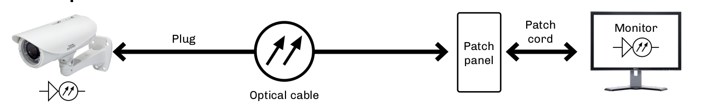

.Network Example.
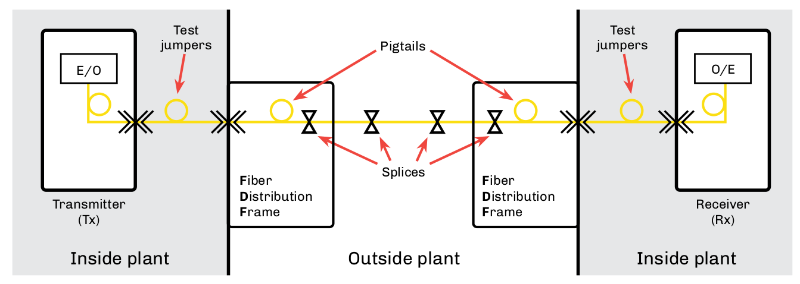

== Subscriber Connector (SC)

Standardized in TIA-604 (FOCIS-3) and IEC 61754-4, SC connectors have a 2.5-mm ferrule and are keyed to prevent cross-mating. They use a push/pull design to mate and unmate, and are available in simplex or duplex styles (SCFOC2.5).

SC connectors are color coded based on fiber and polish type:

* Beige for multimode
* Green for single-mode with APC
* polish
* Blue for single-mode with PC, SPC, or UPC polish.

.Connectors.
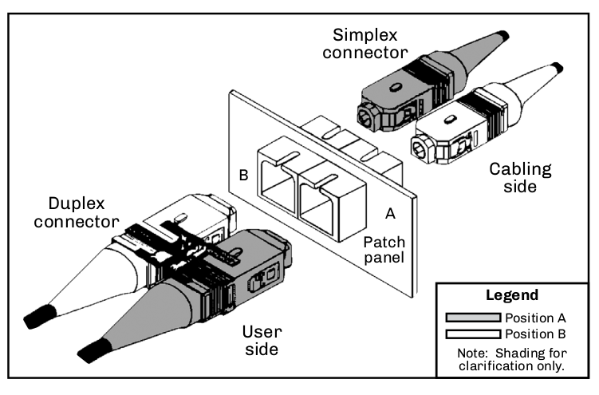

SC hybrid adapters are available for easy migration to networks wired for LC, FC, or ST connectors.
* Standardized by TIA-604 (FOCIS-3) and IEC 61754-4.
* 2.5 mm ferrules.
* Keyed push/pull design.
* Simplex or duplex.
* Color coded.

SC hybrid adapters are available for easy migration to networks wired for LC, FC, or ST connectors.

* Standardized by TIA-604 (FOCIS-3) and IEC 61754-4.
* 2.5 mm ferrules.
* Keyed push/pull design.
* Simplex or duplex.
* Color coded.

.Duplex SC optical fiber patch cord.
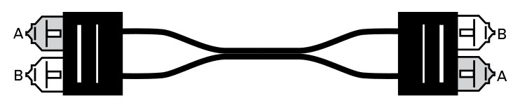

=== Hardened SC Connectors

This version of the SC connector is specified by Telcordia GR-3120 requirements. It is keyed with a threaded coupling housing. The hybrid adapter allows it to be coupled with standard SC/APC or SC/UPC pigtails, while the mating plug is environmentally-sealed for OSP and FTTx applications. This connector is terminated onto factory-built drop cables for quick installations to outside plant cable management products
and FTTx termination points.

* Specified by Telcordia GR-3120.
* Environmentally sealed for OSP and FTTx applications.
* Quick termination to factory-built drop cables.

.Hardened SC Connector.
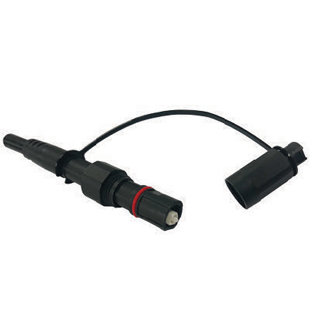

== BFOC/2.5 (ST)

The de facto standard multimode connector of the late 1980s and early 1990s, the bayonet fiber-optic connector (BFOC) style standardized in the IEC 61754-2 and TIA-604-2 standards. Available in ST and STII versions, the style is keyed, has a 2.5-mm ferrule, and uses a push/turn (bayonet) motion to attach to its mating sleeve (adapter). It is used in single-mode and multimode applications, but has the most use in
multimode LANs and CCTV security systems.

.BFOC.
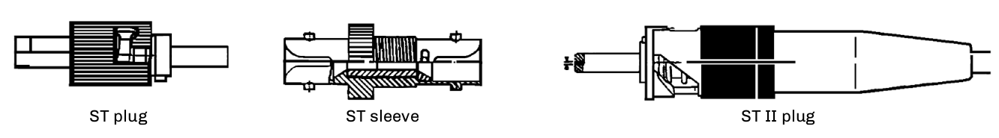

As most standards now use the push/pull SC and LC connectors, use of the ST is declining, but it is still used in CCTV and industrial control applications. Hybrid solutions, whether they be jumpers or adapters, provide current users and manufacturers of network equipment with a migration path from ST connectors to SC and LC connectors.

=== ST and STII Connectors

Two types of ST connectors are manufactured: ST and STII. The stock ST style utilizes an open-ended bayonet slot design for the knurled, retaining lock. The STII style adds an enclosing ring around the rim of the bayonet slot. This strengthens the slot area, reducing deformation from over-tightening. Both types are intermateable with one another.

* ST and STII.
* Specified by IEC 61754-2 and TIA-604-2.
* Multimode and single-mode versions.
* Standard 2.5 mm ferrule.
* De facto standard of late 1980s and early 1990s.

.STC hybrid Adapter.
image::media/stcHybrid.png[align="center"]

As most standards now use the push/pull SC and LC connectors, use of the ST is declining, but it is still used in CCTV and industrial control applications. Hybrid solutions, whether they be jumpers or adapters, provide current users and manufacturers of network equipment with a migration path from ST connectors to SC and LC connectors.

== LC Connector

The LC connector was the first successful small form factor (SFF) connector. Its latched design provides confirmed engagement with the click of the latch, while the 1.25-mm ferrule helps with its reduced size for added density. This connector can be UPC or APC polished and is available in as simplex or in a duplex configuration that occupies the same footprint as a single SC-type connector.

Because of its small size, the increase in density for component board assemblies, interconnect panels, network closets and outlets is increased by 100%. Due to their small size, the LC connector is standardized on most small form factor pluggable (SFP), SFP+, and 10 Gigabit small form factor pluggable (XFP) transmission equipment.

Specified by the IEC 61754-20, TIA 604-10 FOCIS, and TIA-942 standards, the all-in-one connector body equals the side-load requirements of the standard 2.5-mm connectors and also meets TIA-568 and ISO/IEC 11801 performance specifications.

The connector latch mechanism has been designed similarly to the RJ-style telephone plug, assuring proper keying and positive locking of the connector into the receptacle. Some LC connectors have been manufactured with a field-installable, extended duplex latch clip. This helps to eliminate:

* Polarity issues in duplex cable assemblies with connector pairs that remain separated.

* Mislatching one connector or the other in the duplex receptacle. LC connectors are most often used with 900-micron, 1.6-mm or 2.0-m.

.LC Connector.
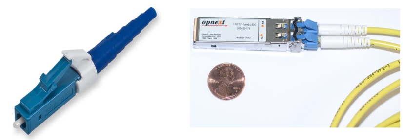

=== Features

* Small size
* High density
* Single-mode or multimode versions
* Low attenuation
* Low reflectance
* Commonly used on transmission products

== Multifiber Push-on Connectors

The multifiber push-on (MPO) connector and mechanical transferable (MT) ferrule technology were developed by NTT Labs in the early 1980s. Also known as an array connector, the MPO is standardized by IEC 61754-7 and TIA-604 FOCIS-5 for both multimode and single-mode applications. The connector housings are color coded for the type of fiber used in the application.

Multimode connectors are available in 4, 8, 12, 16, 24, 32, and 72 fiber densities, while standard single-mode connectors come in 4, 8, 12, and 24 fiber densities. 

.Multifiber Coupling.
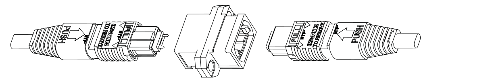

The latest MPO connectors have 16 fibers across or two rows of 16 fibers (32 total). These designs have different pin spacing and keying to avoid mating with the more common version that has 12 fibers per row. MPO connectors are used for a wide variety of equipment, including parallel optical transceivers, optical backplanes, optical switches, fiber-optic cross-connects, optical circuits, and high-density front panel applications. They commonly see use in public and private networks, building backbone applications, and premises cable environments. Its high density makes it attractive for data center applications.

It has specific fiber and lane assignments with numbered designations to show transmit/receive fiber locations plus unused ports. If the plug has pins, it is designated as male; if it does not have pins, it is female.It uses thermoplastic ferrules and incorporates two metal guide pins that fit into alignment holes in the mating plug.

MPO connector manufacturers each have different features in their connector designs that might impact guide pins, polarity conversions, and even male-to-female connector changes in the field.

Also known as array connectors.

* Versions for single-mode and multimode.
* Used in data center and FTTx applications.
* MPO connector options.
.. Choose male or female connector.
.. Define fiber polarity.
.. Single-mode: Up to 24 fibers with 8° APC polish.
.. Multimode: Up to 72 fibers with flat polish.

.Multifiber Connector Image.
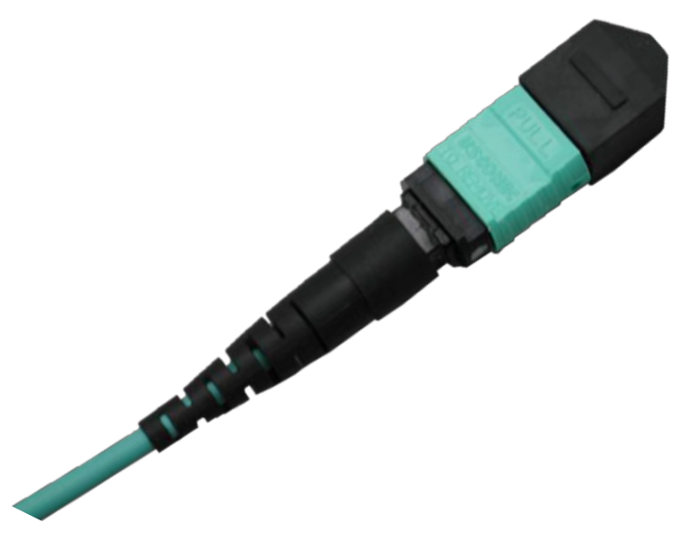

== Older Connector Styles

=== MT-RJ

The mechanical transferable – registered jack (MT-RJ) ferrule is a duplex, push/pull, small form factor connector incorporating a reversed
latching mechanism to prevent snagging fibers and jumpers. It is a multifiber connector with ten times the density of a standard SC connector, and comes in both male and female versions.

The connector resembles the standard RJ-45 modular plug and the adapter uses the same hole pattern for easy conversion from existing hardware. 

.Older Connector Styles.
image::media/olderConnector.png[400,400,align="center"]

==== FC (Fiber Connector)

A simplex connector with keying features and a 2.5-mm ferrule, the FC continues to be a popular connector style in single-mode systems and laboratory test equipment. IEC 61754-13 and TIA-604 FOCIS-4.

.Fiber Connector.
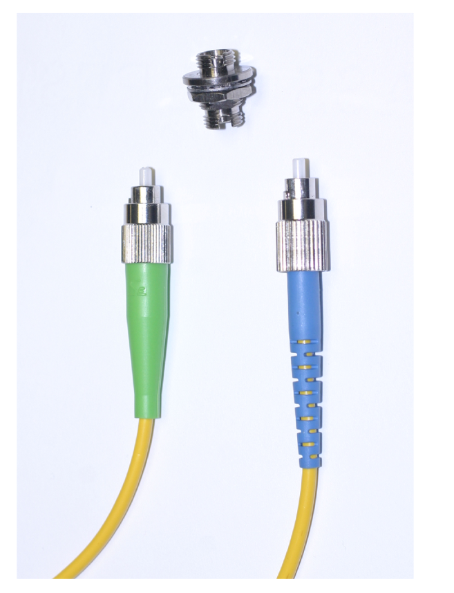

== DWDM Influenced Single-mode Connectors

New technology has created a demand for connectors with smaller physical profiles capable of terminating mass fibers, including ribbon fibers. Several of these new higher-density connectors from Europe include:

`E-2000` – A push/pull connector with a 2.5-mm ferrule. It has built-in protective caps that automatically engage when the connector is
removed from the system to protect the user from laser radiation and the ferrule from contamination. The sleeve features shutters that block light from the other side of the sleeve. The field-installable version connects the cable fiber to a preloaded fiber via a fusion splice for optical return loss values above 70 dB for the APC version. Manufactured by Diamond S.A. IEC 61794-15 and TIA 604-16.

.E-2000.
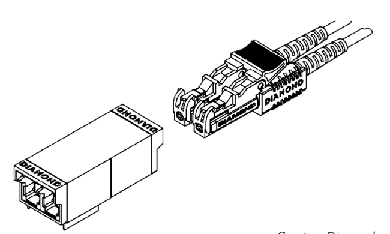

`E-3000` – A push/pull connector similar to Diamond’s E-2000 model. The E-3000 features latching shutters that automatically cover the plug and sleeve when not in use. The E-3000 is LC compatible and uses the 1.25-mm ferrule. The connector is available in both simplex and duplex versions and is considered a small form factor generation connection. The connector has low attenuation and return loss and is designed for
FTTx applications. Available in both single-mode and multimode versions. IEC 61794-20.

.E-3000.
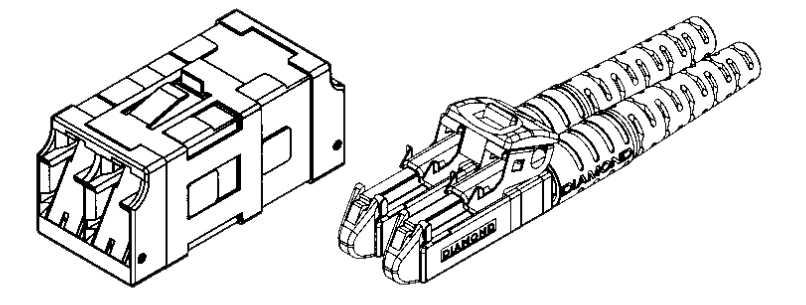

`LX.5`– A push/pull small form factor single-mode connection that allows for duplex terminations in the space of a single SC housing. The plugs and adapter feature a shutter to prevent contamination when unterminated that also prevents accidental exposure to high-power lasers. Using a 1.25-mm ceramic ferrule, the connector design also uses a low-profile optical cable (0.9 mm to 1.7 mm) to allow for high-density
applications including DWDM. IEC 61794-23 and TIA 604-13.

.LX.5.
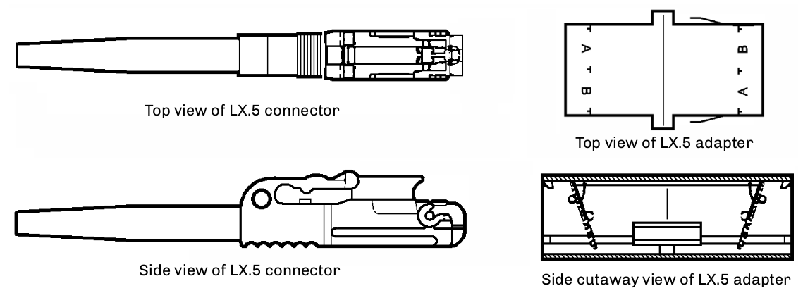

== DWDM Influenced Single-mode Connectors

`MU` – Designed as a high-performance high-density connector using push/pull coupling mechanism, the MU is available for single-fiber terminations up to eight port terminations ideal for backplane applications. The connector plug features a 1.25-mm ferrule and can be PC polished providing both low attenuation and low reflectance characteristics. Manufactured by NTT and specified by the IEC 61754-6 and TIA-604
FOCIS-17 standards.

With high-density applications becoming critical for systems, the MU is provided with different mounting features for patch panels and printed circuit boards. With up to eight sleeves in a single housing,the connector is designed for minimal compression forces.

.DWDM Influenced.
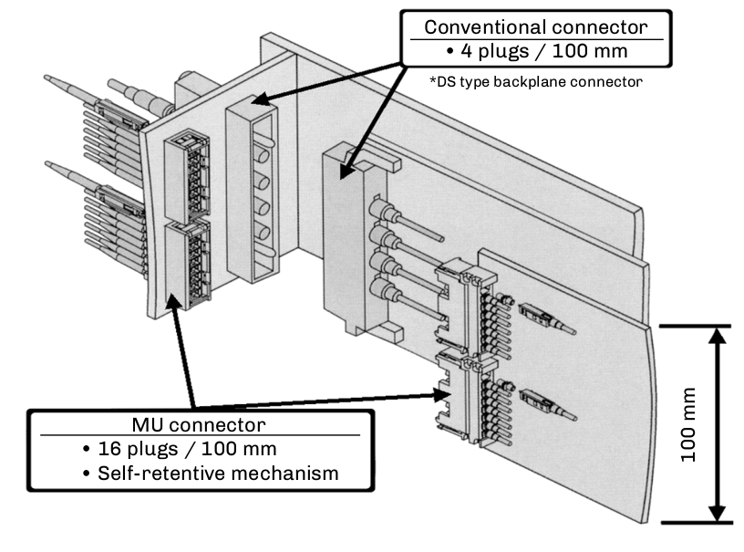

== Termination Techniques

Through the years, many techniques have been developed to improve on both the performance and the installation time for fiber optic connectors. Each technique has its own advantages and disadvantages for users. The most common types are listed below.

=== Thermal Cure Epoxy

The most common connectorization technique, mostly used in factory terminations. This method uses either heat cure epoxy or five-minute (ambient) epoxy to cure the fiber into the ferrule. After curing, the fiber is scribed and polished to a fine flat end surface. Newer hot-melt styles use this technique but have the epoxy preloaded into the connector. Summary: Lower component cost, but higher technician skills required.

=== Anaerobic

Two different chemical solutions are used in this technique. One solution is loaded into the connector, while the fiber is dipped into the other. When the two solutions come into contact the chemical reaction causes a bonding action that holds the fiber in position. Summary: Quick technique; contamination of solutions a problem.

=== Splice-on Connector

Also known as cleave and crimp connectors, this technique uses a preloaded fiber stub in the ferrule to allows the user to prepare the fiber and jacket and then cleave the fiber to a pre-established length. The fiber is then inserted into the plug and either fusion spliced or mechanically fixed into place. FuseConnects have several variations of plugs in which the optical fiber is fusion spliced into the plug to provide low-cost terminations with low reflectance values. Summary: Highest component cost, lower technician skills and cost.

[NOTE]
A fiber that will be terminated with a splice-on connector must match the first in the preloaded fiber stub.

=== Ultraviolet (UV) Adhesive

Rarely used, this technique is similar to the epoxy technique, except that the fiber is bonded with a ultraviolet adhesive via the use of an ultraviolet light source, such as a lamp or sunlight. Summary: Medium cost.

=== Epoxyless

The epoxyless connectors use a unique body technique where the fiber and cable is crimped to the plug body. The plug is then mounted into a tool that forces a resilient sphere to provide a compression fit over the fiber. The plug is then scribed and polished in a manner similar to the ultraviolet and thermal epoxy types. Summary: Best used in indoor multimode applications.

== Connector Polishing Procedure

Polishing a plug is a series of steps starting with a coarse polishing step, e.g., 15 micron, then progressively polishing using finer lapping films, e.g., 3 micron, 1 micron, 0.3 micron.

.Example of polishing.
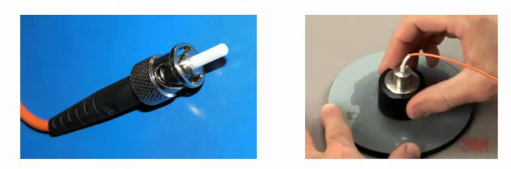

`Step A` – Hold the plug body in one hand and a 15-µm lapping film in the other. Gently draw the lapping film across the exposed fiber in a circular motion. Continue this procedure until the fiber is nearly even with the plug-ferrule tip. This step is necessary to avoid crushing thefiber during the semi-rough polishing procedure.

`Step B` – Clean the polishing puck with an alcohol-saturated pad and insert the plug into the polishing tool. Avoid crashing the plug face against the tool during insertion. With a 3-µm lapping film, polish the connector endface using gentle, graduated pressure in a Figure 8 motion. Continue this procedure for 20-30 strokes or until a solid grey line appears on the lapping film. Clean the connector tip and inspect it with a microscope. If there is an excess of epoxy on the ferrule tip, extra polishing may be required.

`Step C` – Clean the connector endface and the polishing puck. Replace the 3-µm lapping film with 1-µm lapping film for the final polish. Using a gentle, graduated pressure in a Figure 8 motion, polish the connector endface for 10-15 strokes. When finished, the endface should appear free of debris or defects.

[NOTE]
Prior to Step B, clean polishing tool and glass plate with an alcohol-saturated pad, such as an Alcopad. Prior to Step C, clean polishing
tool and connector endface with Opticpad.

=== 0.3-µm Film

Substituting 12-µm, 1-µm, and 0.3-µm lapping films for the above specifi ed 15-µm, 3-µm, and 1-µm films may be desired. You can add the use of 0.3-µm lapping film as a fourth step to the above sequence to remove any fine scratches or pits discovered during microscopic inspection.

=== Diamond Film

Diamond lapping film may be used as a last resort to remove a deep scratch or pit, as it is abrasive enough to resurface both the ceramic ferrule endface and the optical fiber, potentially saving the terminated plug.

== In Process Polishing Views - At 400X Magnification

During the polishing process, the ferrule’s endface will get progressively polished. At first, the epoxy on the surface will be visible. As the fiber is polished to the surface of the ferrule, any imperfections, epoxy, or debris should be removed. In multimode plugs, an epoxy ring exists between the fiber and the ferrule due to the fiber and ferrule tolerances.

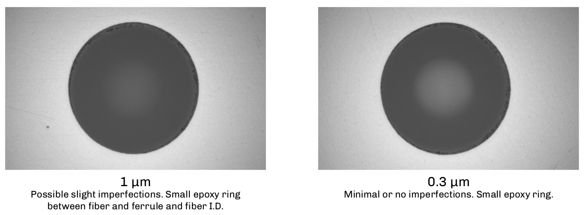
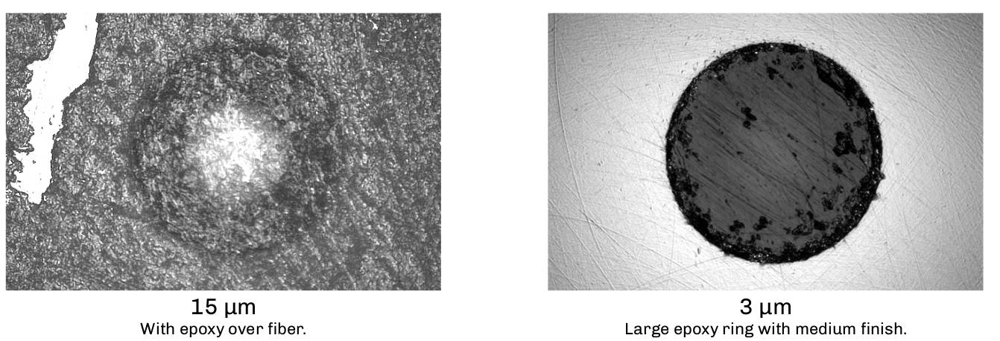

With bend-insensitive multimode fibers, the illumination optics on the inspection scope can produce a reflection off the fiber’s endface caused by the “trench” in the cladding.

.Halo Polish.
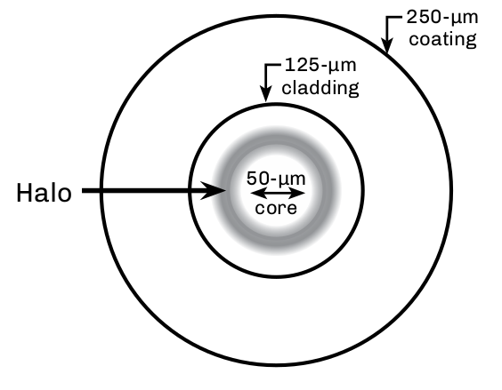

== Fiber Optic Connector Inspection

The IEC 61300-3-35 and the TIA 455-240 standards specify acceptable parameters for cleanliness and/or damage for both the fiber optic and the ferrule endface. Under these standards, any damage to the optic and the area within a specific diameter of the ferrule endface around the optic is compared to a micron-accurate, laser-etched test pattern or artifact. Based upon this type of visual inspection, field of view, microscope types and magnifications, the pass/fail criteria for scratches and pits for both multimode and single-mode fiber types can be determined.

Several work groups specified acceptance criteria for connector endface visual inspection with a consensus on magnification, resolution capability, and hardware qualification. Utilizing comparison artifacts laser-etched with micron-sized anomalies, these work groups created an acceptable set of pass/fail parameters to determine contamination and/or damage to the connector and fiber interface.

For many years, TIA-455-57B had been the accepted standard for fiber optic endface preparation characteristics. However, it was limited to low-resolution representative drawings of side views of cleaved fibers and was not specific to optical fiber endface criteria associated with connectors.

.Measurement Regions for Single Fibre Connectors.
[cols=3*,option="header"]
|===
|*Zone* |*Single-mode diameter* |*Multimode diameter* |

A: core| 0 µm to 25 µm| 0 µm to 65 µm|

B: cladding| 25 µm to 120 µm| 65 µm to 120 µm|

C: adhesive| 120 µm to 130 µm| 120 µm to 130 µm|

D: contact| 130 µm to 250 µm | 130 µm to 250 µm| 
|===

[NOTE]
All data above assumes a 125 µm cladding diameter.
Multimode core zone diameter is set at 65 µm to accommodate all common core sizes in a practical manner.
A defect is defined as existing entirely within the innermost zone which it touches. Minor defects are allowed in the outer cladding, per Zone B.

.Single Mode Connector Interface.
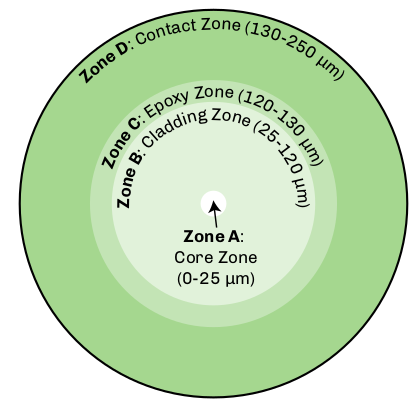

== Fiber Optic Cleaning Methods

In any of the various fiber optic scenarios, it is essential that any time a fiber optic connector is disconnected from an optical port it is visually inspected for contamination or damage before it is reconnected.If no damage is found, it should be cleaned before it is reinserted into the optical port.

More than 50% of optical network failures are caused by contamination on the connector endface. Prudent planning during design and installation to accommodate well-defined cleaning practices can reduce this problem in the future.

`Why we clean`: Single-mode cores are approximately 8 microns (1/10th the size of a human hair) in diameter. Dust particles can impair the network by higher loss or reflection or shut it down entirely.

`When to clean`: Prior to inserting the connector into any optical port. It is prudent to inspect and clean any new jumper or connection, rather than relying on factory clean or others. Remember, there are two sides to every connection and both must be cleaned and inspected.

`What to clean`: Any optical connector endface (system, test equipment and patchcords), regardless of whether it has had a cap on it or not; and optical ports and the mated connector endface within them. Adapters can also be a source of contamination.

=== Fiber Optic Cleaners

Cleaning sticks, precision swabs with lint-free cleanroom-grade materials, or One-Click style cleaners are best for cleaning optical ports and connector endfaces that are mounted on the backplane. Common sizes are 2.5 mm for SC and FC, and 1.25 mm for LC-type optical ports.

Reel cleaners can be used for many types of single fiber ferrules as well as for MPO connectors. Look for specific MPO cleaners that can accommodate cleaning around the alignment pin of male MPO connectors.

The jumper side or backplane of a connection, if accessible, is best cleaned on a larger cleaning surface. Cleaning 99.9% IPA should be limited to fusion splice preparation, as there are important differences between this and endface cleaning. IPA techniques do not ensure that a connection is properly cleaned. IPA is not recommended for cleaning connector endfaces because it leaves a film on the endface surface that
increases attenuation and reflectance.

Non IPA cleaning solutions remove far more contaminants, ranging from gels to lubricants to carbon black. Some new cleaners are flammable, while others are not. There are also aqueous-based fiber optic cleaners. It is prudent to study the safety data sheets for safety concerns and environmental impact. 

Visual inspection of each connection before (to identify the contaminant or damage) and after (to ensure the endface has been properly cleaned) is best practice. A light source and/or power meter are not an effective means of qualifying or quantifying cleanliness or cleaning ability of one process or another.

== Fiber Optic Connector Polishes

High-bit-rate digital systems and analog systems using laser sources are affected by reflections from connectors, which reflect light back to the transmitter. This backreflected light, known as Fresnel reflection, is caused by variations in the index of refraction of the light path, such as those occurring at connectors, mechanical splices, or cleaved fiber ends.

In digital systems, excessive reflections may cause an increase in the bit error rate (BER). In analog broadband cable systems, excessive reflections will show up as a degradation to composite triple beat (CTB), composite second order (CSO) distortion, and carrier-to-noise ratio (CNR), thereby degrading system performance. In more recent quadrature amplitude modulation (QAM) based broadband transmission, high
reflectance can cause and increase in modulation error ratio (MER).

Factory-manufactured patch cords and pigtails control the reflectance by machine polishing the fiber endface during the manufacturing process. For single-mode connectors, the performance level of the resulting connector are designated as PC, SPC, UPC, or APC polishes. Factory-installed multimode connectors are PC-polished, and usually shipped with reflection performance of −30 to −35 dB. Hand polishing can yield a contacting connector with performance of −20 dB or better, while over-polishing can yield an air gap with reflectance as high as −14 dB. Single-mode connectors are seldom polished in the field.

.Reflection by Polish.
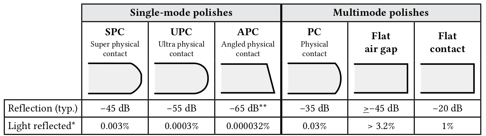

== Single-mode Field Connectorization Issues

Unlike multimode fibers with their large cores, single-mode fibers require precision to handle the mechanical alignment, optical loss, and reflectivity concerns. Single-mode ferrules and sleeves have tighter tolerances, which provide better ferrule alignment. If you choose to terminate single-mode fibers in the field, it is best to have an ability to check the reflectance of the connector and/or use an portable interferometer to be able to confirm the polish quality.

Historically, factory-built pigtails were spliced onto the ends of fiber spans at distribution panels to provide quality connections at a low installed cost. However, more recently, newer splice-on connectors are being installed. The mating end of a single-mode fiber stub is factory-polished (UPC or APC) to meet the specified reflection value and then installed into the plug’s ferrule. A bare fiber to be terminated is then stripped, cleanedm and cleaved, and the end is inserted into the rear of the plug and either mechanically fixed or fused into place. The key is a quality cleaving tool.

[grid="none", frame="none"]
|===
^|*Tolerances* ^| *Polish and Reflectivity concerns*
.2+^.|• Cladding outside diameter (O.D.). +
• Core diameter. +
• Core concentricity. +
• Fiber ovality. +
• Ferrule hole inside diameter (I.D.). +
• Ferrule O.D. +
• Sleeve I.D.
^|• UPC or APC polish. +
• Industry standards. +
^|*Tests and measurements* +
• Visual inspection. +
• Optical loss test set (OLTS). +
• Reflectance.
|===

[grid="cols", frame='none']
[cols="4,1,4"]
|===
>|*Single-mode* ^|*versus*| *Multimode* +
>|Small 9-µm core ^|versus| 50-µm or 62.5-µm core +
>|Tight tolerances ^|versus| Loose tolerances +
>|PC, UPC, or APC polish ^|versus| Flat polish +
>|Complex test & measurement ^|versus| Simple test & measurement 
>|Ferrule inventory ^|versus| Same size for all +
>|Reflection sensitive ^|versus| Non-reflection sensitive
|===

[grid="cols", frame='none']
[cols="3,1,3"]
|===
3+^|*Installed Cost*
>|Factory pigtails ^|versus| Field termination +
>|Splice-on connectors ^|versus| Field-polish connectors +
>|High yield ^|versus| Lower yield
|===

== Attenuators

The need to add loss requires an optical attenuator. These devices are used to perform system checks as well as reduce the optical power levels into the receiver’s photodetector, which can be oversaturated and create system errors or degraded circuit quality.

Most attenuators use a filter, controlled air gap, lenses, or fused fibers to increase attenuation. Remember that attenuation in fiber optics is wavelength dependent so the attenuator used should always match the transmission wavelength.

[grid="none", frame="none"]
|===
|*Requirements* |*Applications*
|• Match to operating wavelength. +
• Match to fiber type. +
• Match to connector type. +
• What are tolerances (+/-)? +
• Reflective?
|• Receiver padding. +
• System testing. +
• Bit error rate testing. +
• Power meter calibration.
|===

=== Fixed Attenuators

Available in increments of 1, 5, 10, 15, and 20 dB, fixed attenuators are commonly in 1 dB increments when used in analog CATV applications. Tolerances depend upon the manufacturer and type.

.Fixed Attenuator.
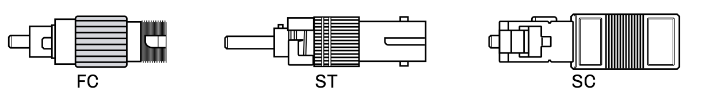

. Receptacles with a controlled air gap or neutral density filters.
. Plug types with built-in neutral density filters or air gap.
. Jumpers with internal splices to specific loss values.

=== Variable Attenuators

This type of attenuator is most commonly to qualify and verify bit error performance during system acceptance testing or product evaluation. The variable attenuator adds loss in either stepped or continuous methods. It will typically operate from 0 to 65 dB.

.Variable Attenuator.
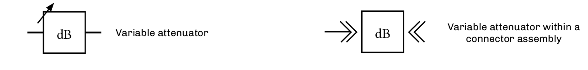

.Optical Attenuator.
image::media/opticalAttenuator.png[align="center"]

== Terminators

.Single Mode Plug Terminator.
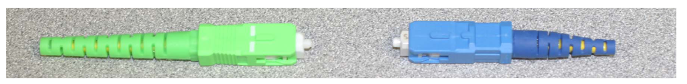

A modified single-mode plug with the same endface geometry as the network under test.

* Used to perform ORL and reflection tests with an OTDR.
* Used to prevent Fresnel reflections on unused or open connector ports.
* Available in different connector styles with UPC or APC endfaces.

=== How to Measure Reflectance using a Deadzone Box and Optical Terminator

* Testing the front end connection: The first events of reflective loss are normally hidden inside the trace’s deadzone because of the OTDR’s pulse width. To measure those requires a deadzone box with 20x the shortest length of the pulse width as specified in TIA-455-59, 60, and 61. For example, if the OTDR’s pulse width is 10 meters, the deadzone box must have 200 meters of internally-stored fiber.

* Testing the far end connection: Measuring the far end of a connection requires a terminator with the same type of polished endface as the connector under test. The internal fiber is dead-ended to prevent light from being reflected. This terminator mates to the connector at the patch panel to allow reflective measurements to be taken. If a terminator or deadzone box isn’t used, the resulting measurement
(approximately 14 dB) will be incorrect.

.Deadzone Box & ODTR deadbox.
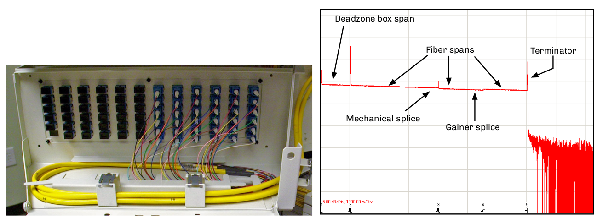

This OTDR trace shows a deadzone box installed prior to the first patch panel. A deadzone box compensates for the deadzone that is created
by the initial laser pulse of the OTDR and the OTDR receiver’s capability to recover the normal trace after the pulse. 

Depending on the OTDR characteristics, the length of fiber in a deadzone box must be at least 20x the launch pulse length. Deadzone boxes need to
be manufactured using the same type of fiber used in the network under test, and also contain the same type of OTDR and network connector interfaces to minimize backreflection issues.