:doctype: book
:title-page-background-image: image:CongruexLogo.png[]

= Chapter 6 - *_Splicing_*

== Why Do We Need to Splice?

* Installation constraints and limitations.
* Building codes.
* Adds, moves, and changes.
* Restorations.
* Acceptance testing.
* Mid-entry splices.
* Pigtails.
* Splitters.

.Fusion splice sleeve, Butterfly splice protector & Mechanical splice.
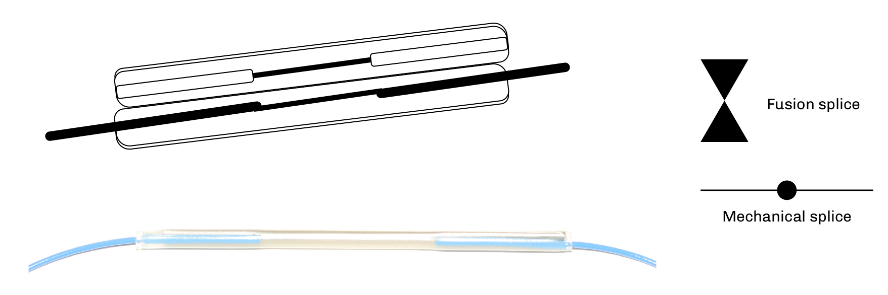

=== Performance

*Attenuation* 

* 0.1 dB mean average per Telcordia GR-20 and GR-765.
* 0.3 dB max loss per TIA-568 (premises/LAN).
* 0.5 dB per ITU-T G.671.

*Reflectance*

* 40 dB per Telcordia GR-765

== The Splicing Sequence

Most of the work involved in splicing is setting up the site, preparing the splice closure/panel, and dressing the tray. The splicing itself progresses rapidly once setup is complete:

. Work area setup.
. Panel/closure preparation.
. Opening cable sheaths.
. Securing cables (including bonding to ground, if applicable).
. Route buffer tubes/fibers to splice trays (slack). If needed, fan out kits can be used at the splice panels.
. Fiber splicing.
.. Prepare fiber for splicing —  length.
.. Strip coating —  clean.
.. Cleave fiber.
.. Place fibers in splice alignment fixture.
.. Inspect cleave.
.. Align or tune fibers.
.. Splice.*
.. Visually inspect/test.
.. Splice protection.
.. Route into splice tray.
. Seal closures.
.. Seal closure without locking down completely.
.. Shoot fibers with an OTDR to verify that the closure is dressed and prepared correctly without stressing the fiber.
.. Complete proper sealing of the closure.
. Rack cable and closure.
. Clean up and pack up.

== Splicing Considerations

* Fiber structure
.. Single-mode
.. Multimode
* Fiber tolerances
.. Fiber core-to-core alignment
* Quality of the cleave
.. Good quality (less than 1°)
.. Precision cleaving tool
* Cleanliness
.. Clean environment
.. No fiber contamination
.. No tool contamination
* System performance (reflectivity)
* Splice techniques
.. Fusion
.. Mechanical
* Equipment types
.. Core alignment
.. Active cladding alignment
.. Fixed V-groove
.. Mechanical splices
* Application (temporary or permanent)
* Environment
.. Humidity
.. Altitude
.. Temperature
* Splice protectors
.. Butterfly
.. Heat shrink
* Splice tray
.. Designed for splice method (fusion, mechanical, ribbon)
.. Houses splices and optical splitters
.. Designed for proper fiber routing
* Technician skills
.. Training
.. Experience
.. Techniques
.. Tools.

== Fiber Cleaving

Fiber optic cleavers are tools that allow the operator to scribe and break the fiber (with a 90° endface perpendicular to the axis of the fiber) with little irregularity or damage to the fiber. There are several types of cleavers available for use in lab or field environments. These tools vary in price and performance and should be chosen based on the type of splicing needed. Poor cleave angles and any other cleaving imperfections lead to added loss.

.Examples of optical fiber cleaves.
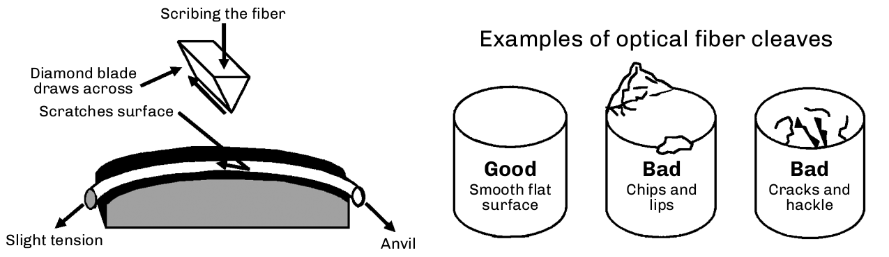

[NOTE]
Because different mechanical splice connectors (cleave and crimp style) and fusion splicers require differing cleave lengths, cleaving tools should be adjusted to the manufacturer’s specifications.

=== Cleaving Tool Issues

.  `Cleave accuracy`.
The more accurate the tool is for maintaining a low angle tolerance, the lower the loss will be in the splice. Cleaver blades can last for thousands of cleaves if properly maintained and rotated when they begin to wear. The tool should never experience cleaves over 1°. If so, adjustment or cleaning may be required. Cleaving ribbon fibers degrades the blade more quickly than cleaving single fibers.

. `Costs`
Equipment costs can vary, but we recommend getting the best equipment possible for the job. A good  cleaver will be used for a long time, providing quality preparation for splicing and achieving the best results with the least amount of time on the job. A major cost of the tool is the type of blade. Diamond, carbide, ceramic, and sapphire blades are most common, with higher-priced diamond blades being the best.

. `Maintenance`
Can the tool blade be adjusted easily? Cleavers with blades that are easy to rotate and replace will also save you time and money.

. `Exposed fiber`
A key factor to remember is how much fiber must be exposed during the cleave process. A tool that can be adjusted for variable lengths is ideal.

. `Cleave length`
Most fusion splicers have specific cleave lengths while mechanical splices with cleave/crimp connectors have the most critical length tolerances. Specified cleave lengths are crucial for low-loss performance.

. `Cleanliness`
The best method to clean an optical fiber is to use a disposable wipe or pad that contains 99% isopropyl alcohol. Stripped fiber should be cleaned properly prior to cleaving and not touched again between cleaving and splicing so as not to introduce any debris on the end of the fibers.

== Common Fiber Optic Cleavers

=== Precision Cleaver

Used for single-mode terminations, the precision cleaver is a must for single-mode splicing. It provides optimum cleave performance and
consistent <1° cleaves. The circular diamond blade is good for approximately one to three thousand cleaves per position. Fixtures are available for 1, 4, 6, and 12 fiber counts. Optional fixtures also allow for cleaving ribbon fibers. 

Adjustable cleave lengths with V-grooves for 250-µm and 900-µm coated fibers.

=== Precision Ribbon Cleaver

Splicing ribbon fibers requires precision cleavers, as the cleaver must scribe anywhere from two to 24 fibers at the same time. Most of these cleavers have a 16-position carbide blade with an accuracy of typical 0.5°. This allows them to perform up to 4,000 cleaves on a 12-fiber ribbon before the blade must be replaced.

=== Stapler Cleaver with Carbide Blade

Good for multimode splicing and single-mode/multimode acceptance testing. Not recommended for splicing single-mode fibers. The fiber is placed across a curved surface, and a a blade is brought down to lightly scratch (or scribe) the fiber. After the blade is released and the leaf spring is bent, the fiber will break at the scored location. If improperly used, the tool will create an angled cleave.

.Stapler Cleaver
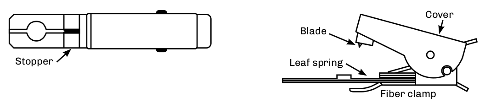

=== Hand Scribe

Used to scribe fibers when preparing plugs prior to polishing. Hand scribes are not recommended for splicing because they usually produce an uncontrolled angled cleave. This technique is used mainly with the connectorization process where polishing will create the final end finish.

.Hand Scribe
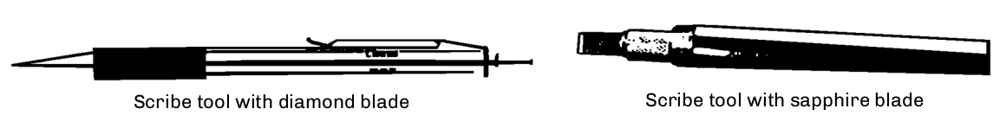

== Fusion Splicing

.Diagram shows splice Sequence.
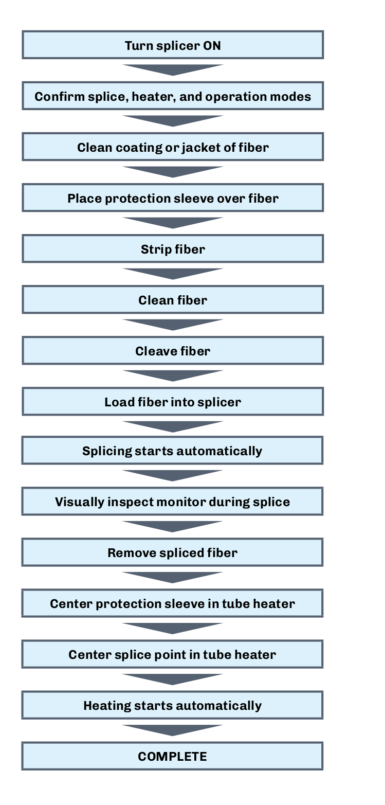

== Fusion Splicing - _continued_

* Joins glass fibers by melting them together using an electric arc.
* Permanent, highly reliable, nonreflective. Can perform hundreds of splices per day in one location, depending on time required for cable
preparation.
* Lowest loss when used with precision fusion splicer using active core alignment.
* Cost effective with fiber installations with large fiber counts.

.Fusion Splicing.
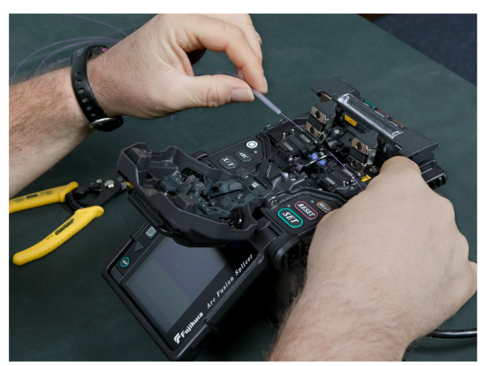

=== Cleaning Issues

`Fibers` —  Make sure to clean the fibers and V-grooves with alcohol. Contamination will cause misalignment and high losses. Splicing ribbon fibers requires great precision. The cleanliness of the splicer’s V-grooves is critical for low loss fiber splices. Specialized brushes, fluids, and cleaning products have been developed to remove dust, dirt, and fiber coating debris from the V-grooves.

`Cleavers` —  Use alcohol to clean the blades. Try not to touch the blade surface with bare hands, as oils from your skin will transfer to the blade. Use V-groove cleaners or a small, soft bristled brush and air to clean V-grooves and clamps.

[NOTE]
Remember to order accessories, spare electrodes, fuses, batteries and power cords.

== Fusion Splicing Methods

=== Fixed V-groove Alignment

In use since 1976, usage of the fixed V-groove or manual splicer has increased since 1992 when improved fiber tolerances of ±1 µm allowed them to achieve 0.1 dB splices with single-mode fibers. Benefits are low cost and simplicity. Fusion splicers that use this technique tend to be inexpensive. Ribbon fibers all use manual precision V-groove techniques, but are higher cost than single fiber splicers.

The fibers are placed into V-grooves on the splice machine. The accuracy is determined by the precision of the V-grooves and the fiber’s core/cladding concentricity. Since there is no active alignment, the quality and cleanliness of the V-grooves and fiber can affect the accuracy.

.Dirt in V-grooves will impact splicing accuracy.

* Accuracy determined by cladding tolerance and V-groove cleanliness.

* Used by all ribbon fiber splicers. Dirt in V-grooves will impact splicing accuracy

=== Active Cladding Alignment

An active cladding alignment splicer moves the fibers in the X and Y axis relative to one another. This movement centers the outside diameters of the two fibers to be spliced, which compensates for differences in their cladding diameters. This can also offset the effects of contamination and dirt in the V-grooves. It cannot, however, compensate for core non-concentricity within the cladding. 

These machines produce lower loss splices than fixed V-groove machines, particularly on modern fibers with good core concentricity or in cases where the equipment is not meticulously maintained.. They are also lower cost than active core alignment splicers.

.Active Cladding
image::media/activeCladding.png[align="center"]

== Fusion Splicing Methods - _continued_

=== Active Core Alignment

An active core alignment splicer uses either two cameras or a camera and a mirror to see through the side of the two fibers to be spliced to determine the internal position of their cores. The two cores are aligned regardless of their positions in the cladding. Core alignment performs much better than other alignment methods, achieving the lowest loss splices and even with used with legacy fibers. It is cited as improvement upon earlier profile alignment system (PAS) splicers that used a similar method to calculate core location, although the two terms are often used interchangeably despite performance variations between different splicer generations and manufacturers.

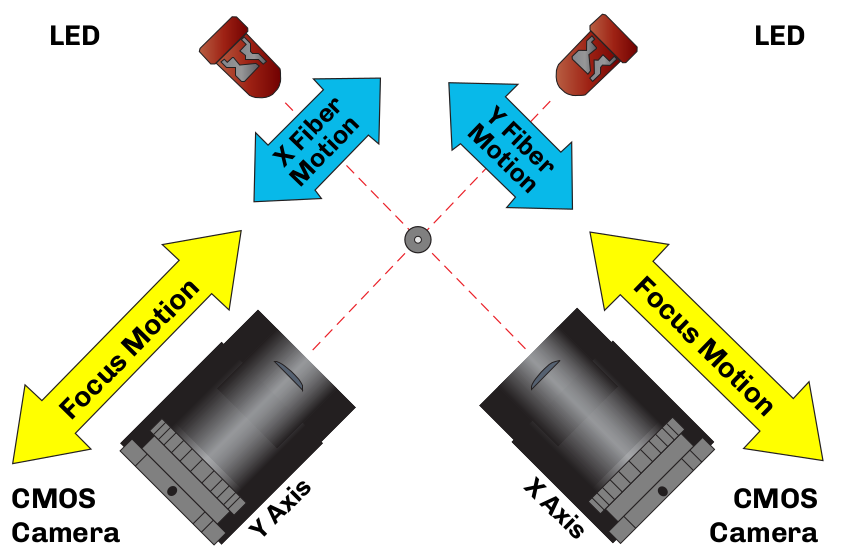

Profile Alignment

The profile alignment system (PAS) splicing method transmits beams of collimated light at right angles to the fiber axis at the point of the splice. Cameras produce images of the core and cladding that are then displayed on a video monitor. The core in these images are then aligned in both the X and Y axis to achieve the lowest loss.

While this can be done with only one camera, many higher-end machines employ a two-camera system. With two cameras, the splicer can more
accurately align the fibers, since it can look at both the X and Y axes together. Most two-camera systems will give the user a splice loss estimation based on observed cleave angles of both fibers and the final alignment of the cores.

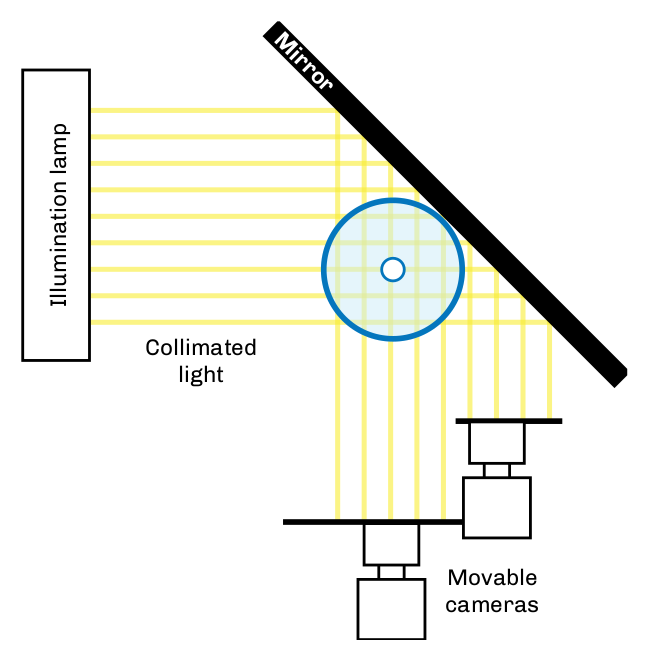

== Ribbon Splicing Technology

Ribbon fibers can be spliced using both fusion or mechanical splicing methods. Regardless of the splicing method, specialized splicers, strippers, cleavers, and other equipment will be required. Splice tray management must also be considered. Splice trays, fanouts, closures, and patch panels should all be thoroughly investigated to ensure a successful installation.

=== Ribbon Splicing Considerations

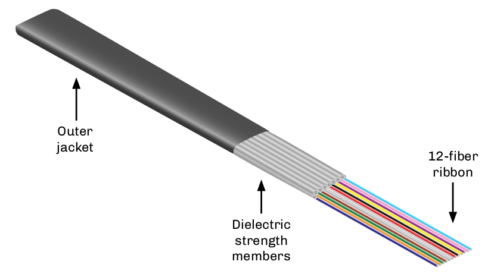

* Ribbon-to-ribbon splicing.
.. Ribbon counts.
.. Clamps.
.. Fanouts.
.. Fusion or mechanical.
* Ribbon preparation.
.. Stripping.
.. Cleaving.
.. Cleaning.
.. Splice protectors
* Tray recommendations
.. Splice holders.
.. Routing.
.. Protection.
* Electrodes.
.. Life.
.. Cost.
* Warranty and support.

== Mechanical Splicing

Mechanical splices have been used since the early days of optical fiber technology. They provide a means of aligning optical fibers with lower losses than optical connectors. Applications include acceptance testing of fiber optic cables, temporary connections as needed, emergency restorations, and pigtail terminations.

Mechanical splices are the least expensive to use and may be reusable. They are cost effective for installations involving smaller fiber counts, and are also available for ribbon fibers. Splicing tool kits are required.

Although better than average losses can be obtained, consistency and measurable back reflection numbers are issues. Most mechanical splices use index matching gels or index matching fluids to reduce Fresnel reflections. For permanent splices, the bonding method is typically mechanical alignment and gripping or ultraviolet (UV) index matching adhesive.

Historical drawbacks of mechanical splices have been their reflectance levels and higher attenuation values compared to fusion splicing. However, most mechanical splices have less reflection than field-

terminated connectors due to their use of index-matching fluids to reduce Fresnel reflection at the fiber endfaces. They are ideal for pigtail applications such as those used in the premises industry, which is beginning to use single-mode fibers that benefit from a mechanical splice’s reflection values and critical alignment. They are also ideal for security installations where low fiber counts are normal. The costs of
tooling are offset by the elimination of connectorization tooling, while providing the ability to repair cables as well as terminate them.

* Reflection.
.. -45 dB per TIA-758.
.. -40 dB per ITU-T G.671.
.. -50-55 dB for SCTE for broadband
analog video.
* Attenuation.
.. 0.1 dB per Telcordia GR-20.
.. 0.3 dB per TIA-758.
.. 0.5 dB per ITU-T G.671.
.. Can be reusable.
.. Bonding by mechanical alignment
and/or UV adhesive.
* Cost effective for small fiber counts.
* Requires splicing tool kit.

.Mechanical Splicing
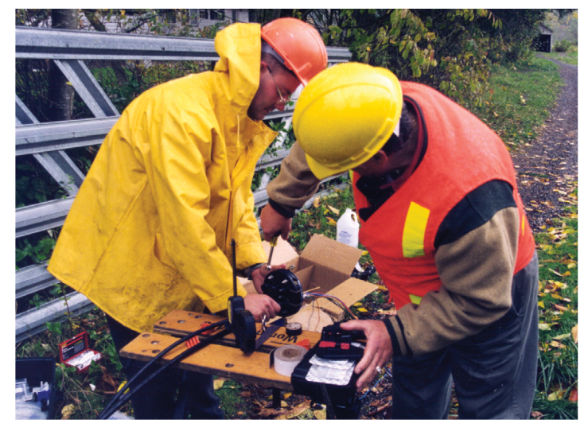

== Mechanical Splices

=== 3M Fibrlok^TM^

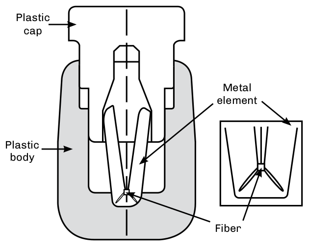

The Fibrlok splice uses a fiber groove that allows the fibers to position at the apex of the three channels. To lock the fiber in place, a plastic cap is pushed down forcing the three grooves to align and position the fiber on its outside diameter. The fiber is cleaved prior to insertion and is held mechanically without the use of epoxy. To reduce reflections, the splice uses internal index matching gel.

=== 3M Fibrlok Ribbon Splicer

The 3M Fibrlok^TM^ 2600 Series multifiber optical splice is a high-performance, easy-to-use, 125-µm single-mode ribbon mechanical splice. The unit simultaneously splices several optical fibers, providing secure fiber retention and environmental protection.

.3M Fibrlok Ribbon Splicer
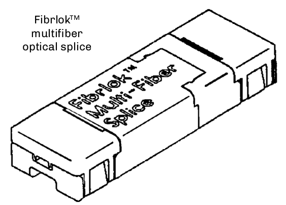

This item is factory assembled and ready for fiber insertion. It includes a malleable aluminum element that aligns and retains the fibers. The element is encased in an injection-molded liquid crystal polymer housing to supply the force required to embed the fibers. The splice
is actuated by displacing a wedge on the underside of the splice. A gel-filled cover provides strain relief and environmental protection.

=== Corning Cable Systems Camsplice

A mechanical splice that accommodates both single-mode and multimode fibers with 250-µm and 900-µm coatings, the Camsplice incorporates an index-matching gel for low reflections and mechanically retains the fibers. An optional assembly tool is available to assist technicians.

.Corning Cable Systems Camsplice
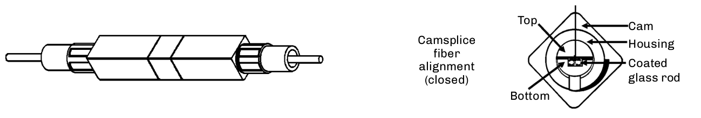

=== Reusable UVC Norland Splice

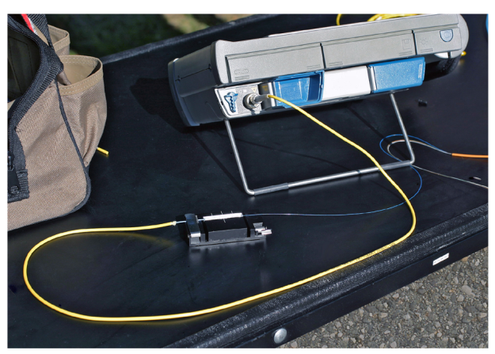

This method uses four glass rods to precisely align optical fibers. The rods are fused together to create an hollow inner core. The rods are bent at a slight angle at each end, allowing the fibers to orient themselves in the uppermost V-groove of the rods. By positioning the fiber so the ends are in the middle of the splice, the fibers can be precisely rotated for the lowest attenuation. Use of index-matching fluid reduces reflections.

Splice holders allow this type of splice to be used for temporary splices in lab and field applications. For permanent installations, the hollow section with the rods is filled with an index-matched UV fluid. After aligning the scribed fibers, the splice is cured in minutes using a UV lamp.

=== CSL Splice & Corelink

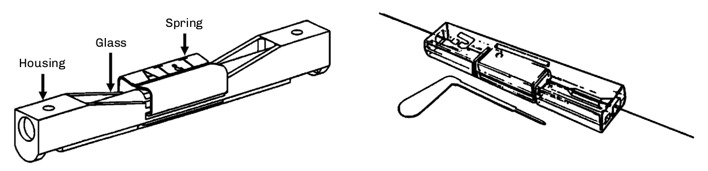

This splice consists of three elements that mechanically hold two fibers in alignment without the use of UV adhesives. A clear plastic housing
allows visual inspections of the fiber during splicing. The second element is a Pyrex (glass) capillary that is preloaded with index-matching gel and has offset bores for fiber alignment. Finally, a spring clip locks the fibers into place.

A mechanical splice that uses V-grooves to maximize fiber positioning and alignment, the Corelink design uses a key, which can be inserted and turned 90° for fiber positioning. When the key is removed, the V-grooves compress and position the fiber. The splice encompasses index-matching fluid to lower reflections. An adjustable cleaving tool is required due to the different strip lengths necessary for 250- and 900-µm buffer coatings.

== Pigtail Splicing and Splice-on Connectors

Use of pigtails —  short cable assemblies with a connector on one end —  is common practice for many applications. Indoor and outdoor panels can include splice trays that will hold the splice sleeves when bulk cable is transitioned to a patch panel. Whether you are terminating single-mode or multimode fiber this way, consider these key points:

* The fiber in your pigtails should be the same type of fiber as the cable you will splice to.
* If you use jacketed pigtails (1.6 mm, 2.0 mm, etc.), they will be color coded by fiber type and not as the standard individual color codes so you will need to label them.
* If you use 900-micron pigtails, you can continue the color code if you can order all the right colors. Otherwise, you will also need to label them.
* Specify your connector types properly, matching the adapters that will be in your patch panels.
* Order connectors based on the loss and reflectance requirements of your network.

=== Field Splice-on Connectors

Mechanical splice-on connectors have been a common way to make field terminations for years. These pre-polished connectors eliminated the need to terminate, cure, and properly hand-polish a connector in the field —  which was time consuming and often had poor results.
Although a mechanical splice point might add a bit of reflectance to the link, the high-quality polish of the connector itself provided very good loss and backreflection results.

Fusion splice-on connectors are another great option for anyone with a splicer, allowing for field terminations with very low loss and reflectance values. These connectors are available from many vendors, and once equipped to install them, they can provide a significant time savings in the field, with very good performance results.

.UniCam mechanical & FUSEConnect fusion splice-on connectors.
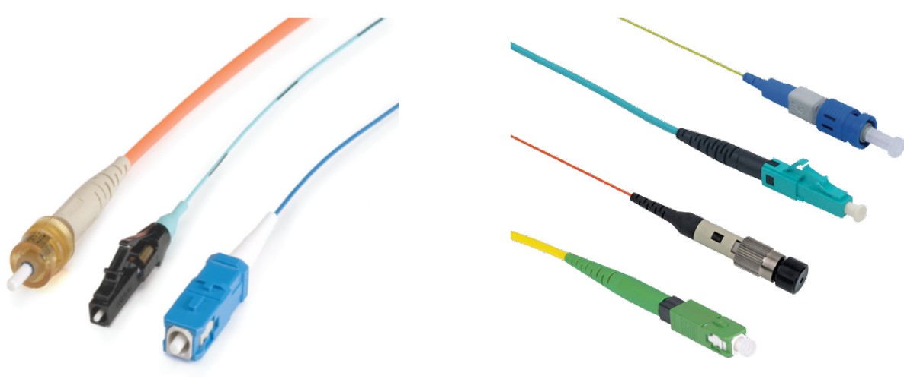

== How Do We Protect the Splice?

[grid='rows',frame='none']
|===
||||
|*Level 1* |Protect the splice| • Protectors + 
• Heat shrink +
• Butterfly|
40 mm/60 mm/ribbon +
250/250 - Yellow +
250/900 - Blue +
900/900 - Green| *Level 2* |
Protect the fiber|
• Splice trays +
• Single +
• Ribbon ||*Level 3* |
Protect the fiber, splice,
and tray|
• Splice closures +
• In-line +
• Butt style||*Level 4* |
Protection for inside buildings|
• Splice panels +
• Wall mount +
• Rack mount||
|
|===

=== Miscellaneous Issues to Address:

* Fiber and unit (buffer tube) identification.

* Documentation.
* Restoration kits.
* Mid-entry splices.
* Future changes.
* Bidirectional loss values.
* Power.
.. Generators.
.. Batteries.
* Analog/digital signals.
.. Reflectivity.
* Cost versus performance.
.. 0.05 dB.
.. 0.10 dB.
.. 0.15 dB.
.. 0.20 dB.

