:doctype: book
:title-page-background-image: image:CongruexLogo.png[]

= Chapter 7 - *_Fiber and Cable Management_*

== Hubs and Premises

For inside building applications, there are two basic types of mounting commonly used. Hub sites such as central offices and head-ends will typically use racks to mount single-mode splice, patch, and distribution panels, along with transmission equipment. They may also use wall-mounted storage and splice panels to increase flexibility and simplify internal cable routing.

Premises and data centers tend to use racks in hub sites and wall-mounted panels in remote locations. Generally, multimode fiber is used, but single-mode fiber is seeing more deployment as data rates increase. For premises installations, the structured wiring terminology in TIA-568, TIA-569, and IEC 11801 is used.

.Premise Installation guide.
[cols="3,3,3"]
|===
|*Description* |*Telco/CATV Applications*|*Premises applications*
|*Fiber distribution frames* +
(patch panel) Rack mount 
|Central office +
Headends Nodes |
Intrabuilding +
Intermediate (IC) +
Main cross-connect (MC)|
*Distribution panels* +
Rack mount |
Central office +
Headends
Nodes|
Building entrance +
Hub
Main cross-connect (MC)|
*Splice panels* +
Wall mount
Rack mount|
Building entrances
(Entrance facilities)|
Building entrances +
Entrance facilities|
*Optical entrance enclosures* (OEE) + 
Central office|
Headends +
Entrance facilities|
Building entrances +
Entrance facilities|
*Premises panels* +
Wall mount|
Entrance facilities|
Intrabuilding +
Intermediate (IC) +
Main cross-connect (MC)|
|===

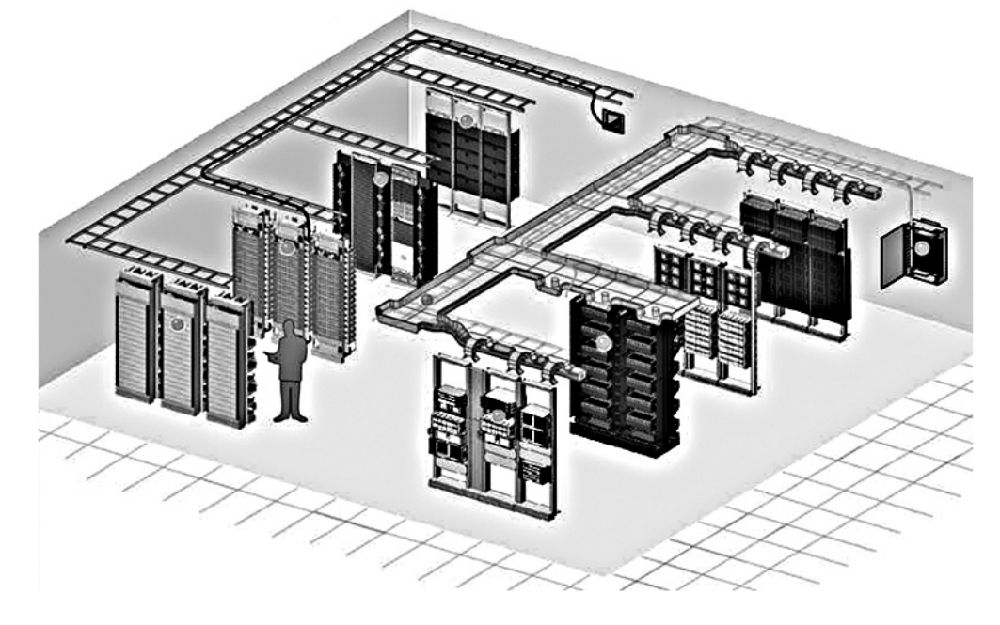

== Fiber Management - Traditional Installation

Loose tube cable is spliced at the outside cable vault and routed into the building. If the distance inside the building exceeds 50’, the cable must be placed inside electrical metallic tubing (EMT) per NEC Article 770. The cable is routed to the correct rack and then to the splice panel. If there are metallic members in the cable they must be grounded per NEC Article 250. The internal fibers are then routed to the splice tray via buffer tubes or transition tubing making sure the internal fibers are protected. Pigtails are spliced to these fibers via the splice trays. The pigtails are then properly installed and routed making sure no macro or microbends are present.

.Without OFNR cable.
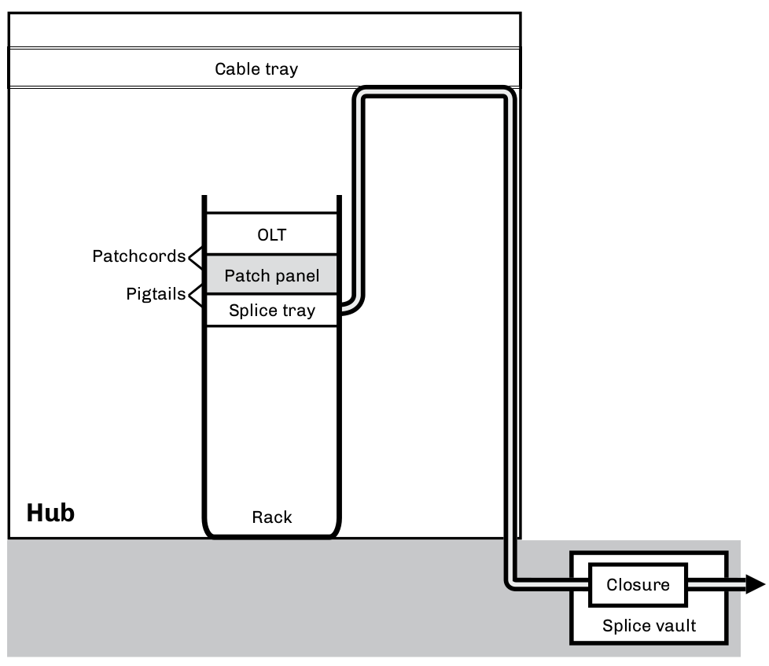

* Loose tube cable is spliced at the outside cable vault and routed into the building. 
* Cable is routed to the correct rack and then to the splice panel, where internal fibers are routed to the splice tray via buffer tubes or transition tubing. 
* Pigtails are spliced to these fibers via the splice trays and connected to the patch panel. 
* Patchcords and jumpers are used to link transmission equipment.

== Fiber Management - Preterminated Patch Panels

Loose tube outside plant cable is routed to a wall mount fiber entrance cabinet (FEC). The patch panel has been ordered with the correct connector type (e.g., SC) and polish (UPC or APC) and a predetermined length of NEC-rated cable (OFNR or OFNP). The panel is mounted in the rack and the cable stub is routed to the FEC via fiber optic cable trays where it is spliced to the incoming outside plant cable. This technique saves rack space, has a lower installed cost, and centralizes all splices in one convenient location.

.With OFNR cable.
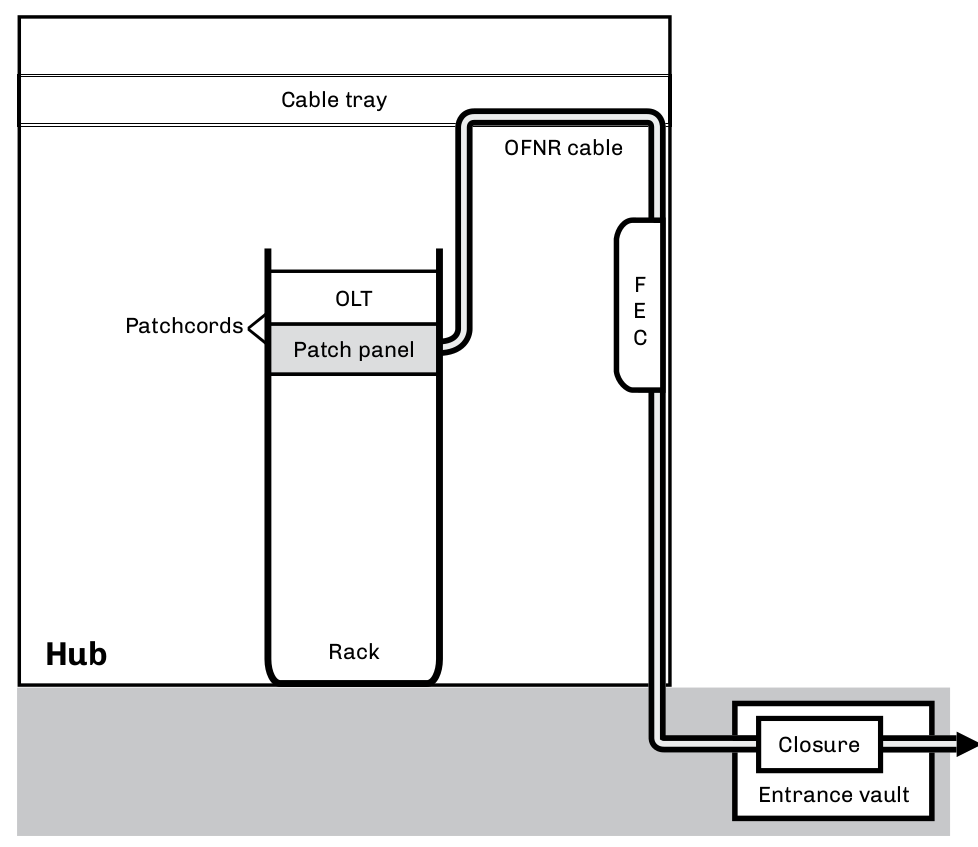

* Loose tube cable is routed to a wall mount fiber entrance enclosure (FEC). 
* Patch panel is mounted in a rack and the preterminated cable stub is routed to the FEC and then spliced to the incoming cable.
* Saves rack space, has a lower installed cost, and centralizes all splices in one convenient location.
* Eliminates NEC transition problems.

.Predermined Patch Panel.
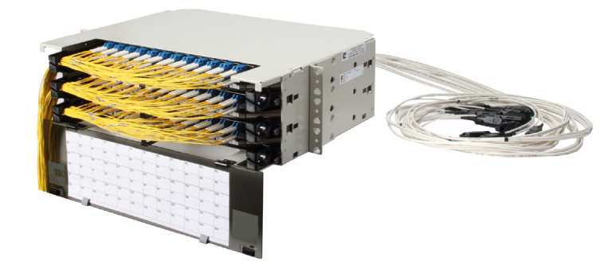

== Rack Space

As bandwidth consumption has increased, the demand for additional fibers continues to grow. However, the amount of physical space available to house those fibers is often a problem. Proper management of rack space is important to meet these growing demands for density.

Racks are listed in terms of rack units (RUs), which is measured in height. For example, a 1RU panel is 1.75 inches, and a 2RU panel would be 3.5 inches. A full size rack is 6 feet (1.8 meters) and can accommodate 42 RUs. This can be either 19 inches for data communications cabinets, or 23 inches for standard telephony installations.

.Connector Density Comparison.
[cols=4*,options="header"]
|===
| ^|*1RU* ^|*2RU* ^|*4RU* |
*LC - Standard density* ^|72F ^|144F ^|288F|
*LC - High density* ^|
144F ^|
288F ^|
576F|
*MPO/MTP* ^|
576F ^|
1152F ^|
2304F|
|===

Connectors also play a major part in density. The SC, LC, and MPO push/pull connectors have all been designed for ease of coupling by the user. However, density is the major reason why high-density connectors are needed where transmission equipment and fiber management products are installed. While the SC connector is better for those with large hands, the LC has double the density of a standard SC connector.

.Images showing good cable (left) and bad cable management  (right).
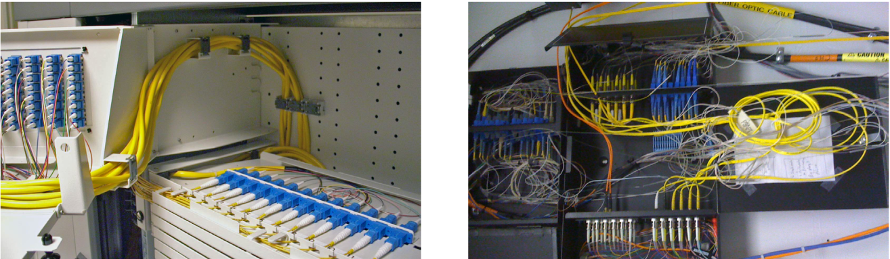

[grid="none", frame="none"]
|===
|*Good cable management*|*Bad cable management*
a|
* Provides organization. +
* Greatly reduces or eliminate related
attenuation. +
* Provides a clean and defined pathway for
patch cords and cables. +
* Reduces maintenance and administration
time. +
a|
* Dirty connectors add unneeded attenuation
and reflection. +
* Includes excessively long patch cords for
short distances and tight tie wraps coiled
around extra slack. +
* No cable management product in place to
provide weight support. +
* No defined path for patch cords to follow. +
* Lack of or improper usage of labels.
|===

== Patch Panels - Intermediate and Main Cross-connects

IC and MC patch panels provide a central location for patching, testing, monitoring, and restoring service to fiber-optic transmission lines. The patch panel receives the fiber optic patchcords or jumpers from the splice panel or from equipment and properly routes it to other pieces of equipment.

Patch panels can be main cross-connects or intermediate cross-connects. Personnel can access backbone cabling in intrabuilding links and transmission equipment. Patch panels are available with various types of connector options. Preterminated patch panels routed to optical entrance enclosures allow for easy installation.

.diagram shows Patch Panels.
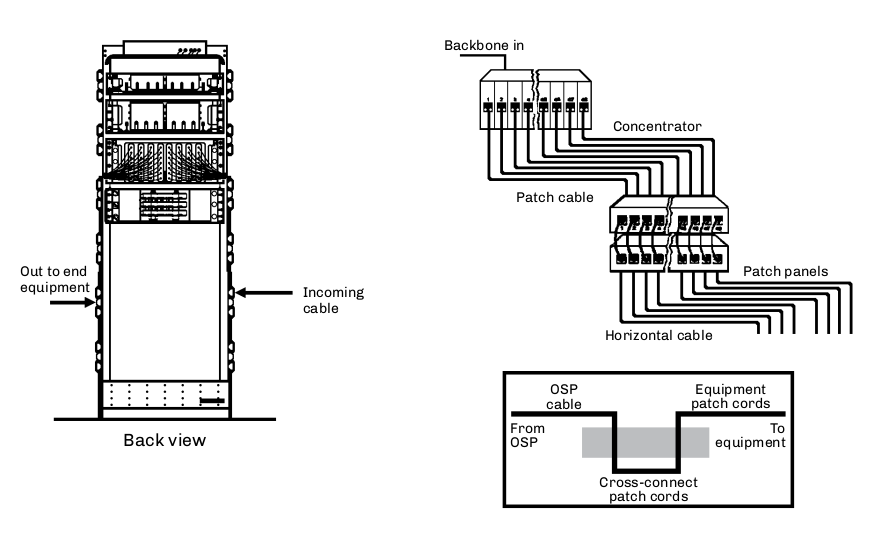

* Centralized location for patching, testing, monitoring and restoration.
* For LANs the patch panel may be the main cross-connect (MC) or an intermediate cross-connect (IC)
point.

== Splice Panels

Splice panels allow the user several options to route fiber optic cable and are most commonly used in two locations:

1. As a transition point between outside plant loose tube single-mode cables with 250-µm coated fibers and pigtails with 900-µm coated fibers. These panels are most often mounted in 19” racks either above or below the patch panel or integrated within a patch and splice panel.

2. As an optical entrance enclosure, normally wall-mounted at an entrance facility where the required National Electric Code transition point is made.

In order to meet the NEC’s requirements for a transition from outdoor cable to indoor tight tube cable, the outdoor cable must be terminated or spliced within 50 feet (15 meters) of the building entrance unless enclosed in grounded rigid metal conduit (NEC 800-40(b)).

It is also important to check the requirements for the distribution of cables to various equipment rooms, buildings or cross-connects in a site. In many cases, controlled room access or locks may be required.

.Rack Mount Splice Panel
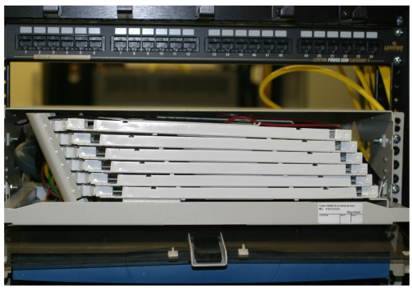

* Entrance facility or rack mounted.
* Facilitate distribution of fibers and/or cables to various equipment rooms, buildings, or cross-connects.
* Must use appropriate splice holders and trays and accommodate proper bend radius.
* Transition point between outdoor and indoor cables.

== Optical Entrance Enclosures - Wall Mount 

Optical entrance enclosures provide a convenient splicing and interconnection location for outside plant cabling entering a central office, controlled environmental vault (CEV), or customer location. They are designed to allow the entrance and management of up to 60 cables for splicing and interconnecting. Cables from termination locations and the outside plant are easily installed and managed. Access to individual fiber splices and fiber bundles is made easy by splice tray and fiber management designs. Other features include:

* Provide a transition point between the OSP and internal rated cables.
* Consolidate splicing in one location.
* Save rack space.
* Multiple cable entrance ports to accommodate routing and growth.

.Optical Entrance Enclosure.
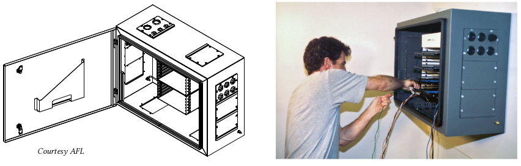

=== Entrance Facilities

Depending upon the application, access to the outside plant can be provided through a variety of options and products to best meet the
designer’s requirements:

. Installation of a patch panel and routing pigtails to a splice panel.
. Installation of a distribution panel with both patching and splicing capabilities.
. Installation of a fiber management bay with both patching and splicing capabilities.
. Installation of a preterminated patch panel with a known length of cable routed to a splice panel located at the entrance facility.
. Installation of a preterminated patch panel with a known length of cable routed to a splice closure at an entrance vault.

These options require an understanding of each of the product types and usages from the entrance facility back to the transmission
equipment. The entrance facility provides a transition between outdoor loose tube cables and indoor cables when using a splice panel.

.Buiilding Entry Point (BEP).
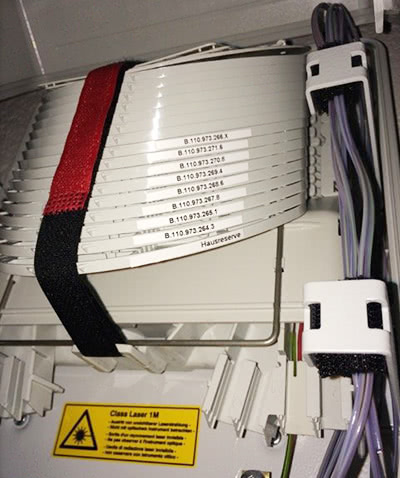

== Fiber Distribution Units - Main Cross-connects and Entrance Facilities

The fiber distribution unit (FDU) is a panel with splicing and patch functions combined in the same unit. Connector and splice trays may be removable for convenient access for maintenance, testing, and splicing. Available with both 19” and 23” mounting brackets. Cables are normally secured at the panel with buffer tubes routed to splice trays where pigtails are spliced and routed to numbered six-packs and adapters.

.Fiber Distribution Units.
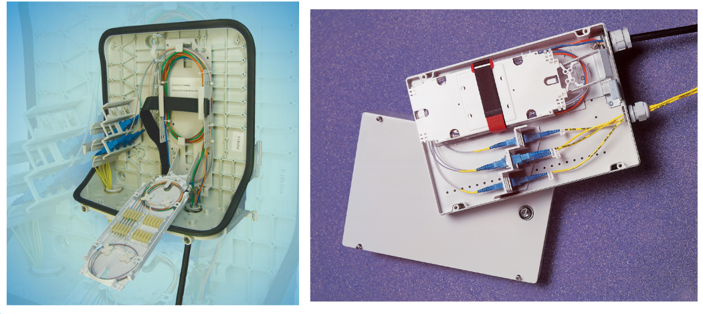

.Rack Mount Panel (left), diagram of wall mounted panel (right).
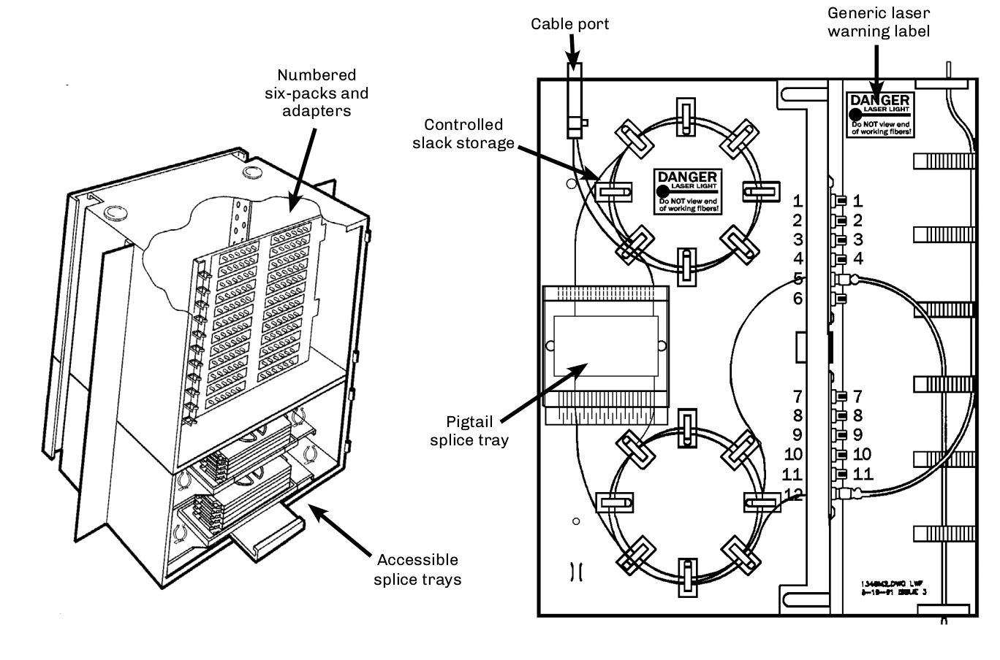

== Splice Closures

Designed for splicing optical cables together from one reel to another after installation, a splice closure can allow splitting or
routing of fiber cables from multiple locations. The closure may permit either a butt or in-line splice application. The fiber optic
cable’s strength member(s) must always be secured to the splice closure, in accordance with the manufacturer’s specifications.

.TE Connecttivity.
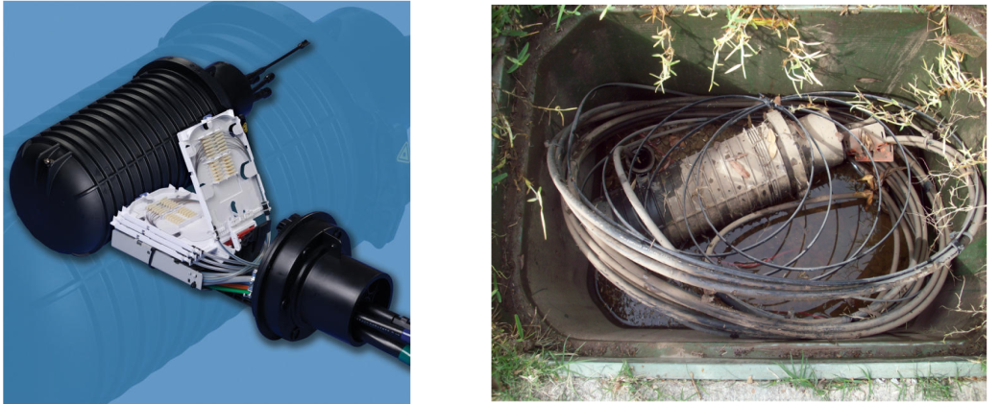

The closure must be environmentally sealed to protect the fibers from water intrusion and potential freezing. After sealing the closure, perform a pressure/flash test (normally at five pounds of pressure) to confirm proper dome and cable entrance port sealing. Closures should also be re-enterable.

The Telcordia GR-771-CORE, titled “Generic Requirements for Fiber Optic Splice Closures”, is a comprehensive specification with which closures must comply. The standard includes features and functions such as cable compatibility, cable entrance capacity, cable termination hardware, bonding and grounding hardware, fiber and splice organization including minimum bend radius, as well as fiber and splice protection. Performance requirements for electrical (bond clamp retention and AC fault tests), mechanical (cable clamping, sheath retention, cable flexing, cable torsion, vertical drop, compression, impact, and central member retention) and environmental concerns are also included.

=== The Necessity for Excess Fiber Length

. To allow resplicing due to errors in splicing fibers.
. To allow the fiber ends to reach the fiber work station or fusion splicer.
. To accommodate fiber movement by creeping or thermal changes.
. To allow single fiber splices in ring networks.

=== Splice Closure Application

* In-line splicing.
* Mid-entries.
* Restoration splicing.
* Splitter function (FTTx and HFC).
* Cross-connects.
* Optical add/drop multiplexing.
* Butt or inline styles.

== Splice Closures and Transition Tubes

Due to the versatility and importance of the splice closure, it is critical to consider its intended use, application, and environment over its lifespan. How much cable should be slacked within the closure? Normally you would want to store as much as possible to address future adds, moves, and changes.

Remember that buffer tubes can be pinched easily so that proper dressing (or routing) of the buffer tubes should be performed carefully. If buffer tubes and closure design do not allow proper installation of the buffer tube(s) to splice tray, a transition tube may be required.

Mid-entries require only one buffer tube to be entered. Remember to order a storage tray for holding unopened buffer tubes.

=== Closure Issues
[grid="none", frame="none"]
|===
|Bonding and grounding |Size and space| Tools
|Mid-entry capability |Ribbon routing|Growth
|Buffer tube routing |Splitter mounting|Transition tubes
|Environmental sealing|Cable strain relief|Drop ports
|Re-entry.
|===

=== Splice Closure Transition Tubes

Splice closures use transition tubes for a variety of reasons:

. `Fiber protection` If a splice closure has hinged or movable splice trays, transition tubes should be applied over any exposed buffer tubes or fibers to keep them from kinking or pinching during movement,as they are generally very rigid.

. `Mid-entries` Fibers may need to be distributed from one splice tray to another and will need to be protected. Transition tubing should be applied over any bare fibers and secured to the splice tray like a buffer tube.

. `Splitters` A 1:8 splitter requires nine (or more) spaces for the splitter (FBT, module, or cassette) and the pigtail splices. A 1:16 splitter would require 17 and the splitter package. This would mean two splice trays with a transition tube to route and protect the fibers.

.Opened splice closure with storage tray for mid-entry applications.
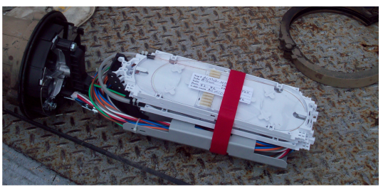

== Splice Closure Types

=== OSP Closures

.OSP Closure (left) & FTTX closures.
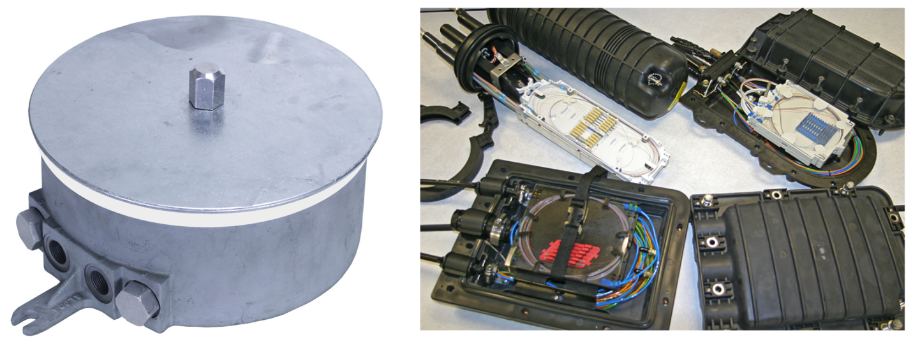

* High fiber counts.
* In-line or butt style.
* Larger.
* Environmentally sealed.
* OPGW and ADSS.

=== FTTx Closures

FTTx/PON splice closures are designed for use with splitters and mid-entries. Fusion splicing the network together to maintain low losses, these small closures provide a stable environment for slack storage, splitters and the splices by housing them in a permanent encasement. A variation of FTTx closures known as multiport service terminal (MSTs) have evolved with a hardened connector interface inside the closure
assembly that allows customer subscriptions to be diverted until the customer signs up. Internally, pigtails from these connections are routed to splice trays.

Whether closures are located at drops or mid-entries, in vaults or enclosures, proper environmental sealing is critical to prevent invasive exposure to the elements.

* Small fiber counts.
* Butt style.
* Smaller.
* Multiple drop ports.
* Environmentally sealed.

== Splice Trays

Internally, splice panels normally have splice trays to organize and house either fusion or mechanical splices. All splice trays should be designed for proper bend radius for both single-mode and multimode fibers. Other additional concerns include:

* Color code organization.
* Securing the cable and buffer tube elements.
* Routing and securing the fiber, buffer tube and pigtails.
* Bonding to ground if metallic elements are present.
* Deeper trays for ribbon fibers.
* Housing splitters.

.Splice tray with clear plastic cover (top) and for 12 fusion splices (botton).
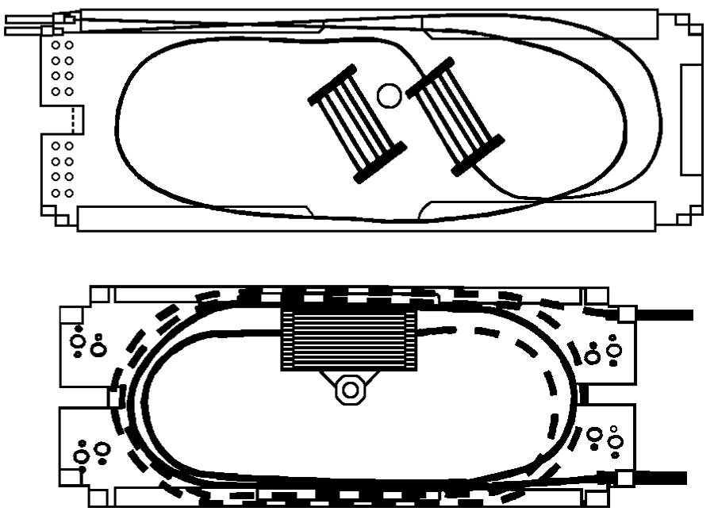

== Splice Tray Recommendations

.Blocking Loose Tube Gel.
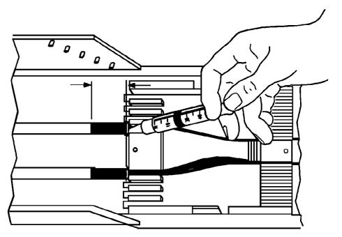

Most fiber networks are designed for a 25-year life span. Over time, many additions, moves, and changes will occur. Normally you would want to store spare cable buffer tubes and fiber slack in the splice tray to address these future adds, moves, and changes.

Splice Trays
Most splice trays are designed to hold up to twelve fibers in a design that addresses both mechanical and optical radius concerns. This includes proper bend radius, color code organization, securing of the buffer tubes and proper labelling. Ribbon splices require deeper trays than standard types.

=== Loose Tube to Loose Tube

This structure is most common in closures where two tubes are spliced together. If the yellow tube is being spliced to a yellow tube, each containing twelve fibers, the following must be considered:

. Securing the tubes.
. Blocking the tubes.
. Routing the fibers.
. Splicing the fibers.
. Protecting the splice.
. Mounting the splices into holders. 

=== Loose Tube to Pigtails

. Securing the tube.
. Blocking the tube.
. Routing the fibers.
. Labeling the pigtails.
. Securing the pigtails.
. Splicing the fibers.
. Protecting the splice.
. Mounting the splice into holders.

[NOTE]
Remember that pigtails use 900-µm coatings and 3-mm jackets and will reduce the amount of space in the tray. +
Remember that once you use all of the fiber slack, you must cut back the cable to recover morebuffer tube for the splice tray. +
Ribbon fibers require specific splice protectors and splice trays. They also require care in routing and slack storage. Ribbon mid-entries can be difficult and must be taken into consideration when selecting splice trays, closures, and patch panels.

== Fanout and Breakout Kits

When terminating loose tube cable into rack- or wall-mounted patch panels, it is recommended that afan out or breakout kit be installed onto the fibers for additional physical protection.

Fanout kits are installed onto loose tube cables to build up a 250-µm fiber to the minimum size of 900 µm that is recommended for direct termination with plugs. Fan out kits should be used inside a panel, rack, or cabinet so that the cabinet supports the weight of the cable and no stress is placed on the fibers or connectors.

Breakout kits build up loose tube cables to 3-mm breakout-style cordage so that they have more durability and structural integrity. This is beneficial if they are to be installed in high-traffic areas and plugged directly into equipment.

In most cases, when terminating unitube cables, the fibers will need to be separated into smaller, more manageable groups in order to splice or terminate with plugs. This can be accomplished by using a pitchfork splitter and buffer tubing. After the fibers have been divided into smaller groups, they will resemble a stranded cable, at which point either of the two previous methods can take place.

.Fanout kits & Breakout kits.
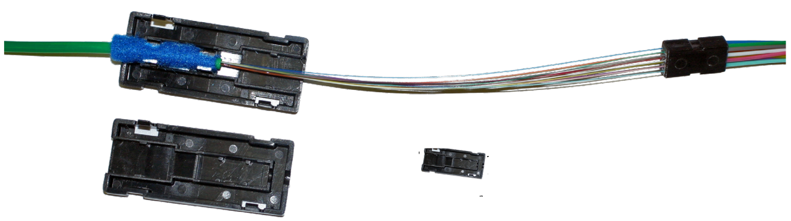

* Fanout kits. +
.. Build up loose tube cables up to 900-µm +
cordage. +
.. Recommended for termination into patch +
panels when not splicing. +

* Breakout kits. +
.. Build up loose tube cables to 3-mm cordage. +
.. Recommended for high-traffic areas.

== Buildings and Campuses

The term “campus” can include hospitals, airport terminals, business parks, schools, office buildings, government facilities, military bases, and factories. These can be vertical and/or horizontal structures located over large areas.

The age, structure, user density, and bandwidth requirements of the building or campus will directly influence the method of cable installation and where fiber and cable management products are placed. What type of fiber is required to support current and future bandwidth requirements of the users? What termination technique should be used? Should bend-insensitive fibers be used? Most campuses use data
communications, but video services and security systems can also be a part of the requirements.

Building entrance sites and indoor and OSP transition sites need to be located, including telecom, communication, or utility closets. Where should cable and fiber management products be located within these sites and elsewhere throughout each building?

[grid="none", frame="none"]
|===
|• *Challenges* |• *Types of products*
|• Applicable building codes. +
• Risers. +
• Horizontal infrastructure. +
• Asbestos. +
• Firewalls. +
• Aesthetics. +
• Security.
|• Patch panels. +
• MUTOAs. +
• Distribution panels. +
• Optical entrance enclosures. +
• Cable storage panels.
|===

.Fiber Optic Interconnect Hardware.
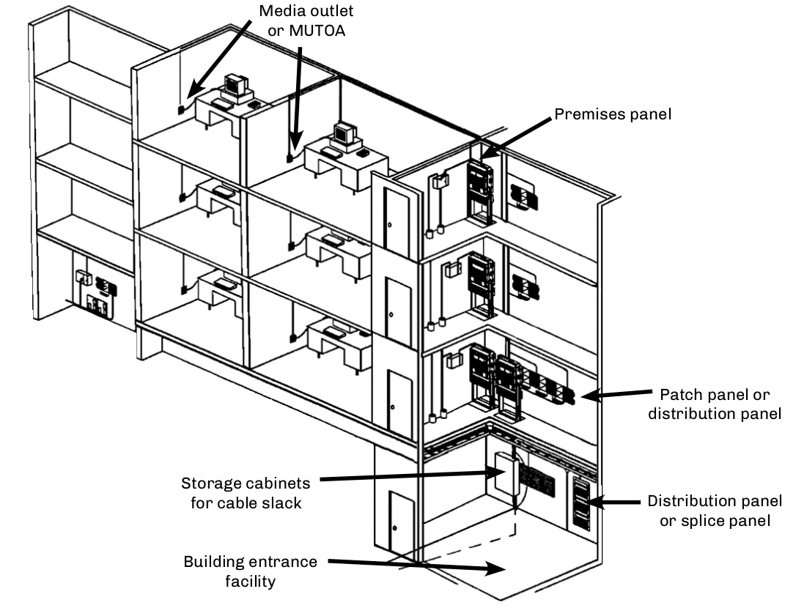

== Campus or Building Star Topology

The backbone hierarchical star topology is used for campus, building, or FTTx designs. The following example shows how the cabling can be organized using a star topology and in accordance with the TIA-568 Commercial Building Telecommunications Cabling and the IEC 11801 Generic Cabling for Customer Premises standards. The span distances should be calculated for attenuation based on the distance, the number of
terminations, the fiber type, and the wavelength. The fiber type, distance, and wavelength are also used to determine the bandwidth for multimode fibers, or the dispersion for single-mode fibers.

.Star Topology.
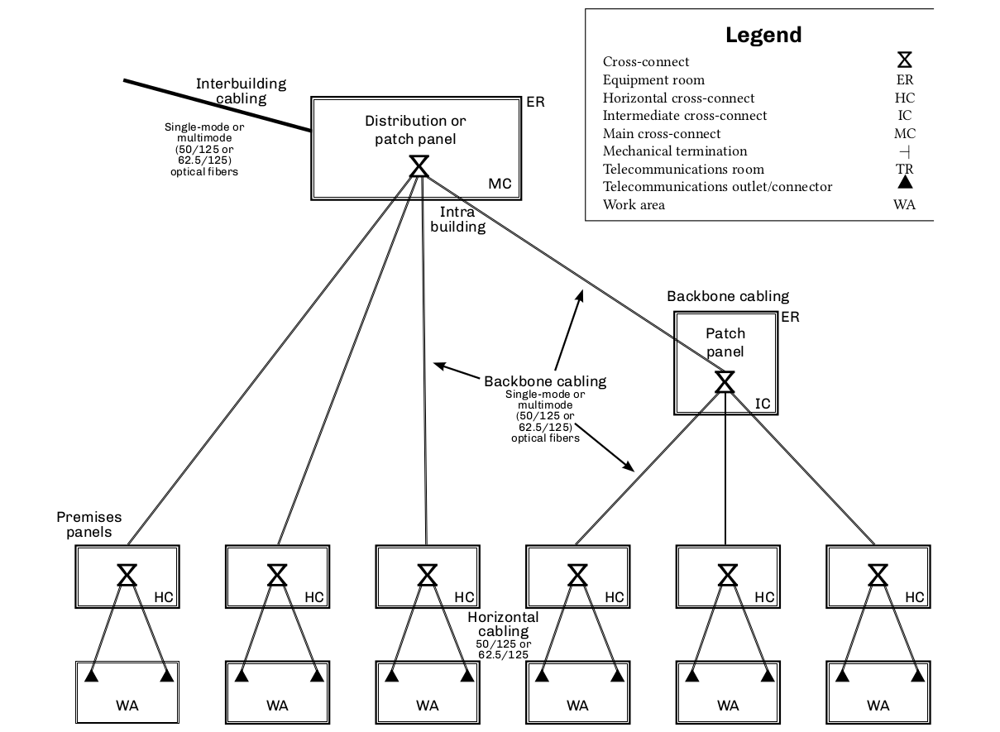

[grid="none", frame="none"]
|===
^|*Maximum distances* ^|*Multimode* ^|*Single-mode*
^|MC to IC +
MC to HC +
IC to HC +
HC to WA
^|1500 meters (4,920 feet) +
2000 meters (6,560 feet) +
300 meters (984 feet) +
90 meters (295 feet)
^|2500 meters (8,200 feet) +
3000 meters (9,840 feet) +
500 meters (1,640 feet) +
Not recognized
|===

== Typical Building Layout

In this example, an outdoor-style loose tube cable enters the building. To meet NEC requirements, the cable must not extend for more than 50 feet (15 meters) into the building. The entrance facility (EF) may be designated as a telecommunications room (TR), telecommunications closet (TC), equipment room (ER), common equipment room (CER), or a common telecommunications room (CTR). Regardless of its designation, this is where access providers and service providers may provide equipment access and terminations.

The main cross-connect (MC) is used to cross connect the backbone cables from the entrance facility. Normally wall-mounted patch panels are used at horizontal cross connects (HCs) for connections and/or splices to the horizontal cables linking work areas (WA) and or subscriber locations in fiber to the building multidwelling units (MDU) and multitenant unit (MTU) installations.

Be sure to specify the proper listings for all indoor cables being used. OFNP or OFNR plenum- or riser-rated cables must be used inside the buildings.

.Typical Building Layout.
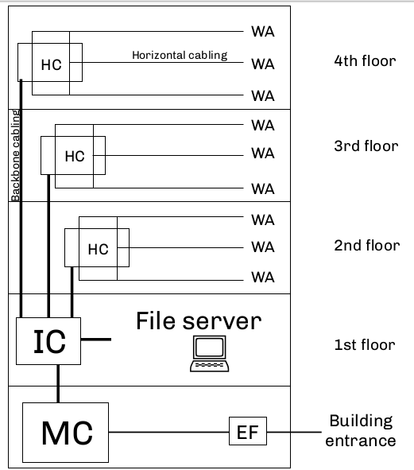

TIA-568 allows 300 meters (984 feet) between the centralized cross-connect (MC or IC) and the work area (WA).

NEC Articles 250 and 800 require that all communications systems entering a building be bonded to the building’s grounding electrode system. “Systems” includes the equipment. In the case of fiber optics cables, only those with metallic members need to be bonded to ground.

== Premises Panels - Horizontal Cross-connects

Designed for applications of up to 144 fibers, the premises panel is designed for wall mounting and allows the user flexibility in cable routing, connector types, and splice methods. The unit usually has one or two latched doors with locking mechanisms, allowing the splices to be locked and all patching work done in an unlocked portion. The primary applications are intermediate (IC) and horizontal (HC) cross-connects
in local area networks (LANs), but they are often used by service providers at building entrances (FTTB) with an optional splice tray for holding single-mode pigtail splices.

.Wall mount distribution panel with fanouts.
image::media/premisePanels.png[300,300,align="center"]

.Wall mount Distribution panel guide.
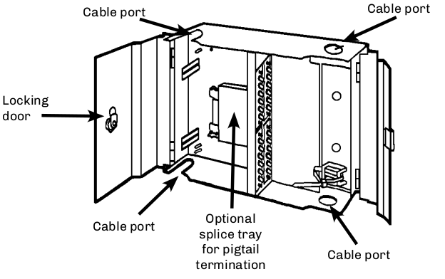

* Features
.. Controlled bend radius
.. Secured access
.. Cable management
.. Fiber identification
.. Grounding option
.. Optional connector types
.. SMF or MMF.
.. Optional splice trays
.. Fanout kits
.. Options for cable access
.. Flexibility for growth
.. Smooth cable ports

== Fiber Raceway Systems

Fiber management systems were developed to protect the optical cables inside physical facilities where routing and protection are required. This includes areas such the central office, head-ends, customer premises, computer rooms, and data centers. They provide clearly identified cable routes while protecting the cables from bend radius and uncontrolled transition problems. They also keep cables organized while
requiring less space.

.Fiber Raceway Systems.
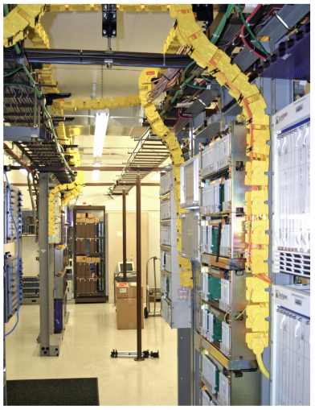

Cables can include preterminated high fiber count cables meeting plenum and riser rated NEC requirements and intra-facility patchcords used to interconnect terminal equipment, optical cross connects, and building entrance cabinets. Manufacturers normally will provide a family of related products that can be integrated easily to handle vertical and horizontal needs of cable routing. Related products required for
a complete family of fiber management systems including straight sections, fittings, junctions, support kits, downspouts, elbows, Ts, end caps, and crosses. The goal of each component is not only to protect the cables, but to ease installation and address physical flexibility for adds, moves, and changes.

=== Mechanical

Fiber management products must be designed to maintain the optical fiber and cable’s installed minimum bend radius specifications. They are most often found in 2”, 4”, and 6” variations with widths up to 24”. They are designed to be mounted above racks, cabinets, and frames, as well as under raised floors where they provide better airflow for plenum areas.

=== Environmental

UL 94V and UL 2024 and NEC 770.51 rated and designed for Telcordia Network Equipment Building System (NEBS) general recommendations:

* Protects optical cable inside facilities.
* Provides clearly identified cable routing between panels and transmission equipment.
* Organizes cables while saving space.
* Easy installation of preterminated patch panels.
* Mechanical features.
* Environmental recommendations.

== Work Area (WA) Media Outlets

.Minimum 25 mm (1.0”) bend radius outlet & Telecommunication media outlet.
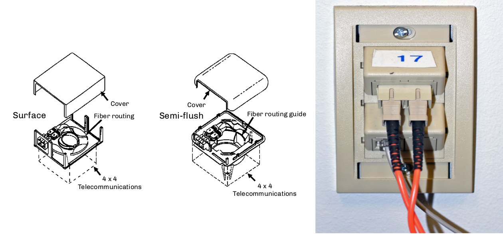

With fiber-to-the-desk (FTTD) and fiber-to-the-building (FTTB) applications, protection, routing aesthetics, and optional interfaces are becoming more important. Two fibers are recommended along with one meter of slack at the equipment outlet.

Since most workstations generally use a mix of applications and media types, +
it is important to maintain flexibility in the media outlet products. For locations with multiple users, +
such as offices where partitions or modular furniture is used, the multi-user telecommunications +
outlet assembly (MUTOA) can be used. They are also known as telecommunications outlets (TOs) or equipment outlets (EOs).

[cols+"1,1"]
[grid="none", frame="none"]
|===
|*Common MUTOA Interfaces*|
|*Fiber optics*|
|SC +
ST +
LC +
MPO/MTP|General purpose +
General purpose +
General purpose +
|===

[grid='none', frame="none"]
|===
|*Twisted pair*|
|RJ-11/14/45 +
DB-25|Telephone/data +
RS-232
|*Coax*|
|75Ω BNC +
F-type|Video +
Video
|===

[NOTE]
Spare room for fiber storage. +
Maintain proper bend radius. +
Use dust caps when not in use. +
Always angle adapters down.

== Fiber to the Building Installations

Specific products and installation techniques allow for easier fiber routing within existing buildings. Design engineers have several options for termination and fiber management when considering the building layout and planning for adds, moves, and changes in the future.

=== Invisilight^TM^ Solution by OFS

* 900-micron coated G.657 fibers.
* Aesthetic horizontal solution.
* Vertical integration.
* Fiber management products with slack storage.
* Multiple termination options using MPO, SC, or bare fiber.

=== OmniReach^TM^ Solution by TE

* Minimizes termination costs, including MPO ribbon terminations.
* Slack storage on panel.
* Up to 432 fibers.
* Various fiber management options.
* G.657 bend-insensitive fiber and cable.

=== OnePass^TM^ Solution by 3M

* Aesthetics.
* 6 or 12 fiber units.
* Hallways and inside.
* Pass through.
* No-polish connectors and terminations.

=== Thermal Adhesive Coated Fiber System (TACS) Solution by TE

* Low profile and aesthetic.
* 900 micron G.657 fiber.
* Heat activated adhesive.
* Simple tooling.
* Easy terminations.

== OSP Fiber and Cable Management

Outside plant cable management products must secure, route, and protect the optical cables as well as their internal buffer tubes and fibers. One key requirement for these products is cable and fiber management. They must control proper bend radius, be flexible, and support cable and fiber identification using color codes or numbering sequences. Other important factors include strain relief, grounding and bonding if metallic
members are present, and environmental sealing with future access.

These products are designed specifically for the mechanical task they will perform.

In all fiber optic applications, the cable is placed between two sites. Therefore, some type of cable management product must be used at each end of the span, usually an indoor type of cabinet or panel. There  are often splice points or mid-entries along the span, which are often enclosed in splice closures. However, other applications such as fiber to the home have high-fiber-count trunk cables for access to drop cables
that provide service for subscribers. New types of fiber distribution hubs, pedestals, and closures have been specifically designed to provide fiber, cable, and circuit management while housing splices, connectors, optical splitters, and future wavelength division multiplexers.

.Fiber Distribution.
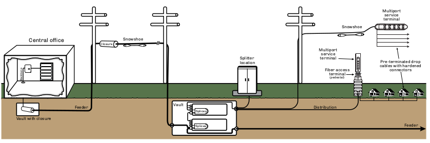

* Fiber distribution hub.
* Splice closures.
* Pedestal/FAT.
* Vaults.
* Handhole.
* Snowshoe.

== FTTx Cable Management Products

.Fiber distribution hub (FDH) & Fiber access terminal (FAT).
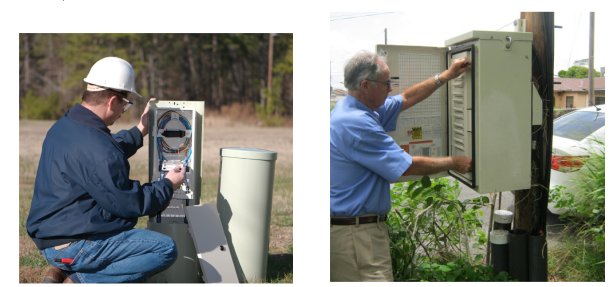

* Fiber distribution hub (FDH).
.. Houses optical splitters.
.. Splice options.
... Preterminated with cable pigtails.
... Traditional splice trays.
* Connector ports.
* Centralized and/or distributed topologies.

* Fiber access terminal (FAT).
.. Also known as a pedestal.
.. Optical splitters.
.. Connectors.
.. Slack cable storage.

.MST & Transition box.
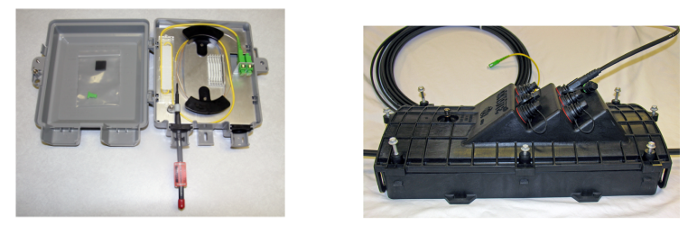

[grid='none',frame='none']
|===
a|
* Multiport service terminal.
.. Hardened connectors.
.. Drop cable terminations.
.. Splitter options.
.. Preterminated cable stubs. a|
* Transition box.
.. Also known as a network interface unit.
.. Splice options.
.. Connector options.
.. Slack cable
|
|===

== Outside Plant Cable Management Overview

The fiber distribution hub (FDH) addresses fiber optic cable, fiber, splitter, and circuit management for FTTx applications, as well as splicing, patching, and splitting. What makes the FDH unique is that it addresses fiber circuit management in the OSP.

The FDH can be mounted on the ground, on a pole, or in a building. It is environmentally sealed from dust, rain, wind, and rodents. The cabinets are designed to be breathable and are strictly passive cabinets.

=== Fiber Distribution Hub (FDH)

* Splicing, patching and splitter functions combined in the same unit. 
* May contain removable trays for convenient maintenance, testing, and splicing.
* Provides physical circuit management for FTTx installations.

=== Splice Closures

* In-line or butt style configurations.
* Accommodate a variety of cable types, splice types and cable counts.
* Provide mechanical protection of the splice point.
* Multiport service terminals for factory terminated drop cables.

=== Pedestal (Fiber Access Terminal)

* Provide fiber routing, storage, patching and splicing capabilities.
* Utilized similarly to a splice closure.
* Provide an option for servicing serving areas and local neighborhoods.
* Accommodate hardened connectors in multiport service terminal (MST).

=== Vaults

* Can be above ground or below ground.
* Powered and conditioned for electronics, or have contain nothing but closures and cable slack.

=== Handhole

* Limited space.
* Require space to hold slack cable and splice closures.

=== Snowshoe

* For aerial installations.
* Store cable slack for future adds, moves, and changes.
* Strand storage or butt splice closure installations.
* Dual closure technique.
.. Feeder example using mid-entry to provide protection.
* Distribution splice closure to allow local access.

== Fiber Distribution Hubs

The fiber distribution hub (FDH) is an outside plant cabinet designed to house fiber optic splitters with splicing and patch functions combined in the same unit. Designed for FTTx installations, the FDH allows for effective cable and fiber management, and for maximizing take rate when grouping splitters into local serving areas. The FDH is mostly used in centralized architectures, but can be used in distributed designs as well. FDHs come in many sizes and configurations with variations for pedestal, pole, or wall-mount mounting.

The FDH should be placed so that the cable is terminated or an mid-entry is performed for the buffer tube or fiber access. Fibers are then spliced to splitters and pigtails routed to an internal cross-connect (patch) panel. Drop cables to streets or homes would be internally pigtailed, spliced, and routed to corresponding ports in the patch panel for reconnection to the OLT path.

Modular connector and splitter housings can provide flexibility. The types of splitters installed can range from a small concatenation of many to the recommended maximum. The input fiber is pigtailed to an appropriate connector for loss and reflection. Each incoming fiber is terminated and routed to the input port of the splitter.

Pigtails are attached to the fiber in the customer’s drop cable that is fed in and stored in the bottom of the cabinet. Once a customer has signed-up for service, a pigtail is taken from its parked position on the patch panel, routed, and then plugged into the output of the splitter module. The parked position provides cable/connector storage and termination to reduce reflection during the time the connector is not in use.

=== Benefits

.Fiber Distribution Hubs.
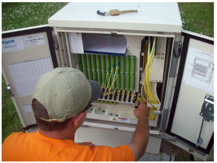
[grid='none', frame='none']
|===
a|
* Splitter housings.
* Various configurations.
* Feeder to distribution fibers.
* Feeder to drop fibers.
* Cable stubs inbound and outbound.
* Growth and migration.
* Flexibility.
* Pad, pole, and wall mounting.
* Easy fiber management in the ODN.
* Splice point for drops, distribution, and feeders.
* Test access points. a|
* Controlled slack storage.
* Cost-effective provisioning.
* No power or HVAC requirements.
* Indoor FTTB versions available.
|===

== Fiber Access Terminals - Pedestals

Pedestals provide fiber routing, storage, patching, splicing, and splitting capabilities. Cable storage and routing are in the base. Once the fiber from the cable is exposed, then it can be utilized to either a splice closure or cabinet. FTTH pedestals, which are also known as fiber access terminals (FATs), tend to be smaller than fiber distribution hubs (FDHs) and are an option for servicing local neighborhoods and serving areas.

When considering what type of containment will protect each component of the PON system, thought must be given to whether the assembly contains splitters, curbside electronics, battery backup, security,  air conditioning, and/or alarms associated with various installation and electrical codes. These factors will determine the size and style of the enclosure assembly.

The general location of the enclosure should be out of the direct traffic pattern to help prevent accidental vehicular damage and to provide access for technicians.

.Fiber Access Terminal.
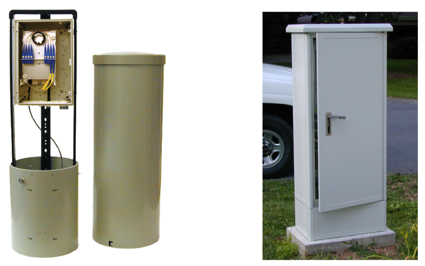

* Urban and rural applications.
* Transition for small fiber routes.
* Mid-entry capable.
* Cross-connect, splice, and splitter options.

== Multiport Service Terminals

Historically as fiber gets closer to the end user, fiber count drops and construction and labor costs increase. For this reason, termination techniques have evolved to lower installation costs while still maintaining quality terminations. The multiport service terminal (MST), used for low-cost installations, is an example of this. Preterminated hardened drop cables reduce labor costs to installing the MST, accessing the fiber(s) from the distribution, and the dressing, cleaning, and connecting the drop cable. Available with port counts of 4, 6, 8, or 12, this technique can service multiple residences easily.

MSTs with splitters provide even greater options for designers. They are available for aerial and below-
grade installations, and are adaptable for applications where fiber optic cables must be located in the future.

* Dress slack during installation.
* Keep ports capped when not in use.
* Clean ferrules and adapters every time the port is exposed.

.Multiport Service Terminal.
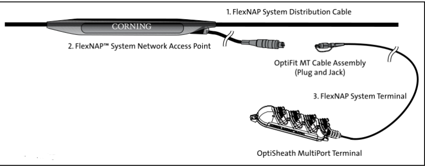

* Traditional drop cable spliced to distribution fibers.
* MST with hardened connectors.
.. Dust caps.
.. Up to 12 ports.
* Slack storage.
* Mid-entries.
* Environmental sealing.

.Outdoors MST
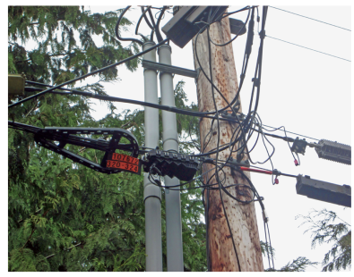

== Fiber Transition Terminals

.Fiber Transmissionn Terminal.
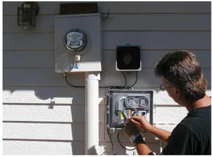

Fiber transition terminals (FTTs) offer a connector interface that gives a subscriber access to services.  This unit is placed on the side of the customer’s premises, usually where the optical network terminal (ONT) will be installed in the future. When the customer accepts services, a technician opens the FTT and patches the connectors so that the system will begin to supply services to the customer.

In FTTx installations, the FTT acts as a transition point during the construction phase. Drop cables can be installed and slack left until the user subscribes to services that would require an ONT. Once this occurs the FTT can serve as the splice point for the pigtail, saving valuable space in the ONT.

In FTTB applications, the FTT also acts as a small cross-connect terminal as there may be higher fiber counts, splicing needs and connector ports for cross connections. Normally these would be secured and placed at an entrance facility or telecommunications closet.

.Outdoors Terminal.
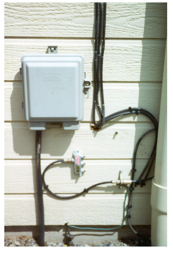

* Temporary storage.
* Low cost.
* Slack fiber storage.
* Connector options.
* Splice tray options.
* Media converter options.

== Cabling Scenarios - Fiber to the Home

.Conventional Drops.
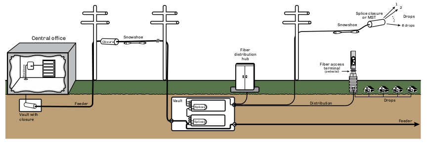

Designers and installers of FTTx drop cables have several options for the final terminations. The conventional technique is to install the drop cables and splice the cable into a splice closure or pedestal. A pigtail would be spliced to the drop cable at each optical network terminal (ONT) located at the home or building. Installers may choose to have long pigtails with preterminated connectors on one end. This
pigtail would then be back pulled to the splice closure or pedestal where the cable slack would be trimmed  as required. All the splicing and preparation work would be at one location using existing trailers, splicing vehicles and equipment. New low-cost fusion splicers, mechanical splices and field-installable single-mode connectors are options for installers for the termination at the ONT.

.Predetermined Drops.
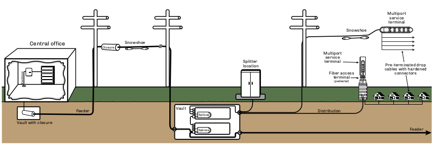

Preterminated drop cables use hardened connectors as specified by Telcordia GR-3120. These hardened fiber-optic connectors (HFOC) allow for low-cost installations. Th ese drops are manufactured in standard lengths. Single-ended drops can help to minimize slack challenges at the pedestal or closure where many of these cables are routed from and to consolidate the splicing at a convenient and accessible location. The
connectors are typically a SC/APC or UPC type and have modifi ed outer coupling mechanism and dust caps. These cables and connectors are also rigid with limited bend radius with most using central tube drop cable designs.

== Cabling Scenarios - Intelligent Transportation Systems

.Transport System One.
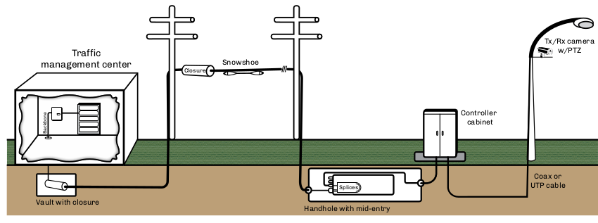

This technique involved having a splice closure in a localized handhole and a multifiber preterminated Trafficrouted management pigtail and splicedcenter into the closure. The other end is routed into the cabinet to a wall mount panel (preferred) or to the specific devices to be connected (less flexibility for future adds,Handhole drops and changes). This Underground requires a larger wall mount distribution (splice/patch) panel. PoliMod connector panels with preterminated Splice fiber optic Splice vault  closure cable stubs lowers installed cost.

.Transport System Two.
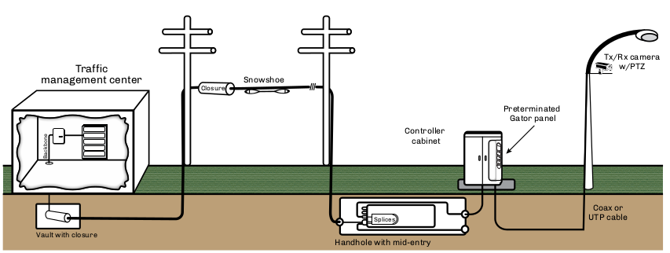

== Vaults and Handholes

Vaults can either be above ground or below ground. They can be powered and conditioned for electronics, or have nothing in them except for mounting splice closures and storing cable slack. Vaults can be as complicated with their organization so as to accommodate multiple types of cable entry or egress, or they can provide minimal slack storage depending on the need. Controlled environmental vaults (CEV) can also
house electronic equipment.

Vaults can be large and made from either concrete for maximum protection or plastic for underground  burial with minimal exposure. Vaults represent security for the fiber optic installation and have become one the essential housings for FTTx systems.

Handholes are always located underground and require space to hold slack cable and splice closures.

Always make sure that the cable is within the its bend radius specifications to prevent damage and macrobend losses during storage.

Splitter locations need to accommodate splice closures, drop cable, slack storage from all locations and distribution cable slack.

.Handhole.
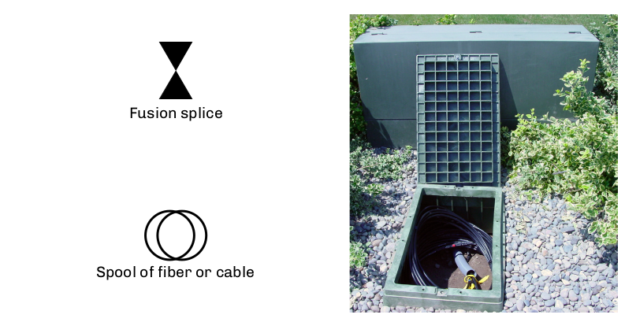

Features: +

* Holds cable slack at controlled bend radius. +
* Can house splice closures. +
* Load bearing options. +
* Protects access to ducts and innerducts.

== Panel and Closure Considerations
[grid="rows", frame="ends"]
[cols=3,options="header"]
|===
||*Topic* |*Things to Consider*
|*Type and
mounting style*
a|
*  Distribution
*  Patch
*  Splice
*  Closure
a|
*  Choose wall mount or rack mount.
*  Choose sizes and splice/patch density to plan for future growth.
|*Fiber Count*
a|
*  Inbound
*  Outbound
*  Cross-connect
a|
** Plan backbone fiber counts and drops for
current and future needs. More fiber is a
fairly low-cost addition when done in the
initial order/build.
|
*Connectors*
a|
*  Adapter plates
*  Connector type
*  Attenuators
a|
** Choose for performance as well as density
needs.
|
*Splitters*
a|
** Various split ratios.
a|
** Consider form factor and how to connect
into the network.
|
*Splices*
a|
*  Trays
*  Splice type
a|
*   Are these separate or combined enclosures?
|
*Mechanical*
a|
*  Strain relief
*  Bend radius
*  Knock outs
*  Growth
*  Environmental sealing
*  Re-entry
a|
*  Good cabinets and enclosures are designed
to accommodate mechanical needs.
*  To prevent microbends, use Velcro® tie
wraps to secure patchcords, pigtails and
buffer tubes.
|
*Identification*
a|
*  Fibers
*  Cables
*  Ports
*  Jumpers
*  Labels and mounting
a|
*  Use the premade labels and cards when
available.
*  Proper labelling during installation will
save time later.
|===