:doctype: book
:title-page-background-image: image:CongruexLogo.png[]

= Chapter 9 *_Installation_*

== Optical Cable Installation

ndoor cables (NEC), outdoor cables for aerial and underground applications (NESC), and cables for specialty applications (e.g., oceanic, mining, tactical). In each case, it is vital that the cable’s jacketing is designed specifically for the application and its environment. Planners should always check that the mechanical, environmental, and performance specifications for the cable meet the requirements of its application. The cable’s material and structure can also affect which technique is used for the installation. For example, it is difficult if not impossible to blow in armored cable using high air speed blown (HASB) technology.

|===
^|*Where* | *How* |*Cable Structure*
.2+^|Premises|*Innerduct*|Indoor/outdoor +
OFNR/OFNP cable +
Unarmored
|*Cable trays* + 
Flexduct|OFNR/OFNP cable +
Unarmored +
Interlocking armor
.4+^|Underground|*Buried* +
Direct buried +
Plow con|Loose Tube +
Armored|*Pressurized* +
High air speed blown (HASB)|Loose Tube +
Unarmored|*Air blown fiber (ABF)*
|Tight Buffered +
Unarmored|*Ducted* +
|Unarmored
^|Aerial|Self Supporting +
Lashed|ADSS +
Armored/unarmored +
Loose tube|
|===

== Cable Handling

[TIP]
The objective is easy installation of fiber optic cable by observing the limitations of its light weight, flexibility, and small size.

Manufacturers specify the bend radius allowed for the specific cable type and structure. Always observe the cable manufacturer’s bend radius specifications. Failure to do so may result in high attenuation (macrobending) or possible damage to the cable and fiber. If the bend radius is unknown, use 20X the cable diameter, which is the industry standard.

.Cable Handling
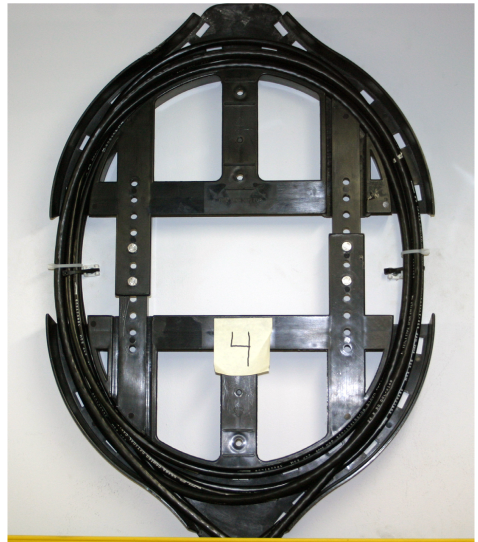

During installation, the cable is constantly being pulled around corners while under tension. Understanding tension is key for proper installation and prevention of cable and fiber damage. The TIA-568 standard states that outside plant cables shall support a bend radius of 10X the cable O.D. when not subject to tensile load, and 20X the cable O.D. when subject to tensile loading, up to the cable’s rated limit.

When reviewing tensile loads, the installer may see different terminology used. “Loaded,” “dynamic,” and “short term” define the tensile rating during the installation. “Unloaded,” “static,” and “long term” define the maximum tensile load rating recommended by the manufacturer for post installations.

For designers and planners, look for locations where bend radius must be addressed. This is often important in inside building applications due to the physical limitations of the available cable chasers, risers, and horizontal routes. Bend-insensitive fiber should be used for these applications where needed.

== General Guidelines for Fiber Optic Cable Installation

=== For all installation methods:

* Prior to installation, confirm fiber count.
* Always follow code(s).
* Maintain recommended cable bend radius.*
* Monitor tension.**
* Always follow engineering and construction placement and route plans.
* Protect exposed cables from vehicular and public traffic.
* Maintain good communications.
* Block all loose tube cables to prevent gel migration into splice trays.
* Leave appropriate slack amounts.
* Keep documentation current and up-to-date (i.e., fiber and sequential markings).
* Use warning and identification labels.

=== Underground:

* Identify optical cables with markers.
* Center pull long cables.
* Install innerducts or Maxcell to maximize flexibility or future expansion options.
* Plug and seal ducts.
* Follow national installation codes and recommendations.

=== Buried:

* Identify cable locations with surface markers.
* Plan splice points.
* Anticipate obstructions.
* Follow national installation codes and recommendations.

=== Aerial:

* Use proper hardware matching cable, span, and tension requirements.
* Use correct cable jacket.
* Follow national installation codes and recommendations.
* Plan slack locations and storage methods.

=== In-building:

[grid='none', frame='none']
|===
a|
* Use cable ties carefully.
* Label cables per documentation requirements.
* Tie off every two floors (as available).
* Work from top down when possible. a|
* Maintain minimum bend radius.
* Ensure cable jackets meet code requirements.
|===

== Standards, Regulations, and Codes

=== National Electrical Safety Code (NESC)

The NESC is issued every five years by the IEEE (standards.ieee.org/nesc) and applies to electric (power) supply and communications utilities that include, but are not limited to, telephone and broadband cable. It is the final authority on electrical and telephone construction for OSP aerial and underground applications.

It covers line equipment, work practices, construction disciplines, and standards for areas such as environmental conditions including wind, ice, lightning, corrosion and temperature. It applies to the initial design, construction, and operation including maintenance of the life of the installation. The NESC code book is not intended as a design guide. Values given are meant to be minimum values for safety reasons.

For the NESC to become a legal requirement, a state authority that has jurisdiction over utilities typically adopts it. To determine the specific legal status, the authority with jurisdiction should be contacted.

=== National Electrical Code (NEC)

The NEC is issued every three years by the National Fire Protection Association (www.nfpa.org) and is primarily used by the electrical building industry. While it is recognized by most cities, states, and countries as a requirement, it is, in fact, a recommendation that becomes code when specified. Local jurisdictions may supersede the NEC and therefore should be consulted to applicable specifications. Optical fibers are included in section 770.

[cols=2*,options="header"]
|===
^|NESC ^|NEC|
Published by the IEEE
|Published by the NFPA
|The electrical code book for utilities
|The electrical code book for the building industry
|OSP focus
|ISP focus
|Used by engineers and utility linemen
|Used by engineers and electricians
|Administrative authority is typically the state public service commission
|Administrative authority is typically a state, city, or
local inspector
|===

[NOTE]
Both the NEC and NESC require metallic elements in optical cables to be bonded to ground.

=== TIA-590

TheTIA-590 “Physical Location and Protection of Below-ground Fiber Optic Cable Plant” standard specifi es depths, separation of conductors, protective measures, and recommendations and procedures for damage prevention activities on the part of excavators and facility owners.

=== TIA-758

The TIA-758 “Customer-Owned Outside Plant Telecommunications Cabling” standard provides requirements for the design of telecommunication pathways and spaces and the cabling installed between buildings or points in a customer owned campus environment (schools, business parks, hospitals, etc.)

=== Telcordia SR-1421

The Telcordia S R-1421 “ Blue Book of Construction Practices” special report addresses aerial and underground installations.

== Air Blown Fiber

Air blown fiber is a cabling installation technique developed by British Telecom Research Labs in 1982, and now licensed by multiple manufacturers. It relies on a flow of compressed air passing over the entire length of the fiber unit or mini-cable to create a fluid drag that gently carries the cable down the tube. In addition, it is also common to have a set of rollers simultaneously push the cable into the tube.

Because the cable can be installed strain free, the amount of reinforcement once necessary to protect the cable during installation is no longer required. This allowed manufacturers to develop lower-cost cables with smaller diameters. Microduct cables are available with 96 fibers and an outside diameter of 1/4”.

This reduction in cable diameter has led to a similar reduction in the diameter of the tubes into which these cables are installed. For example, a 1/4”-cable can be installed inside a conduit with a 1/2” outside diameter over distances of 6000’ (1.828 meters) in a single blowing operation. These small diameter conduits can be conveniently grouped into tube bundles, which offers an economical way to install multiple conduits in the ground, compared with the traditional method of installing multiple large-diameter innerducts.

.Air Blown Fiber & Fiber unit with 18 fibers.
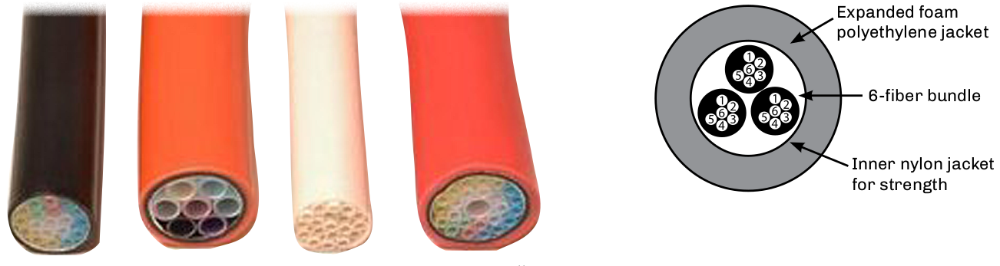

The tube bundles are suitable for installing relatively high *fiber count cables in conduit, direct buried, riser, and plenum applications. A tube bundle with 24 tubes is just 1” outside diameter. Tube bundles are also available from 1/8” through 1/2” in diameter, providing the ability to quickly and economically deploy fiber optic cables.

The fiber bundles are installed into the tube bundle using compressed air. The fiber bundle consists of a number of 250-µm *fibers (SMF, 50/125, 62.5/125) jacketed with a polyethylene sheath. Thesheath has a rough outer wall that provides a resistance to the air propelling the *fiber unit through the tube bundle. Like innerduct, the tube bundle must be in place prior to the installation of the fiber unit.

As easily as the fibers can be installed, they can also be ejected from the system for quick replacement. By simply blowing in the opposite direction, the fiber bundles exit the tube bundle. Th is allows for “fiber on demand” installations.

Junctions are handled through branching (distribution) boxes where the tube bundles are interconnected
through the use of push-fit connectors. This technique eliminates the need for additional optical splices and
connectors.

== Elements of an ABF Network

.ABF Network Elements.
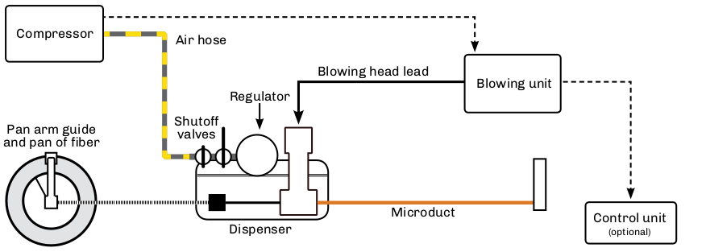

=== ABF Benefits

* `Ease of installation` —  Simple techniques and equipment for the fiber unit installation. However, the pipe cable must be pre-installed by conventional techniques.
* `No tension on optical fibers` —  Air pressure installation carrying the fiber units.
* `Deferred investment` —  Fiber units can be added on demand to variable locations easily. Pipe cable units can be left empty until fiber units are needed.
* `Flexibility` —  Fiber units can be of various fiber types (single-mode and/or multimode) and counts. Branching units with push-fit connectors allows for quick changes in network topology.
* `Cost savings` —  Fewer splice and connection points are required.
* `Simple restoration` —  In case of fiber damage, the fiber unit can be blown out and a new fiber unit installed quickly.

== Cabling Buildings in a Star Topology

In a star topology, the cables are installed from a main cross-connect (MC) located in a telecommunications closet (TC); the TC provides access to the transmission equipment and from service providers.

In this example, a series of 12-fiber cables are installed from the TC to a wall mounted 24-fiber patch panel at a horizontal cross-connect (HC) on each floor. From this location, drop cables or jumpers can be installed to link different users. Due to the amount of cable involved, the lower floors are more congested.

[grid="none", frame='none']
|===
|Benefits|Impacts
|• Simple point-to-point cable installation +
• Simple cable management.|• Lower floors may be congested +
• No route redundancy
|===

.Star Topology Cabling
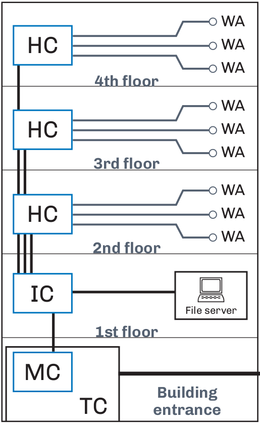

* All cables installed from a main cross-connect located in a telecommunications closet.
* TC is used to access all transmission equipment and access from service providers.
* HC located on each floor.
* Drop cables or jumpers to link different users.

== Cabling Buildings in a Ring Topology

Designing and performing mid-entries into cable structures provides alternate routing for building and campus networks, plus lowers attenuation and installation costs.

.Ring Technology
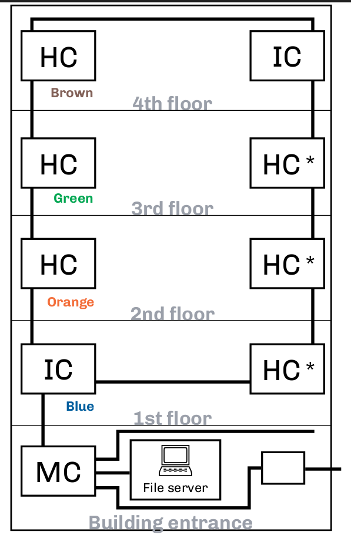

This example shows a mid-entry in a building. Two 48-fiber tight-buffered indoor distribution cables with four 12-fiber color-coded subunits are installed, forming a ring topology with the 12-fiber subunits terminated on each floor. The first cable is routed clockwise and the second counterclockwise. Both terminate at the intermediate cross-connect (IC) on the fourth floor. To accomplish this, the following would be required:

Install 24 port patch panels (HC) on each floor. On the first floor, only the blue buffer tube would be
accessed and terminated at the IC on the fourth floor.
Twelve fibers would terminate the fibers in the inbound blue buffer tube.
The additional twelve ports would be used to terminate the 12 outbound blue buffer tube.

A mid-entry would be performed on each floor with only the buffer tube being accessed being opened.
The orange, green and brown buffer tubes would only be accessed on the applicable floor.

The outbound blue tube provides another protect link from the MC from the alternate route as well as options for future growth.

[grid='none',frame='none']
|===
a|
Benefits

* 100% flexibility for growth.
* Route diversity and protection.
* Lower installation costs.
* Less riser space used.
* Brown a|
Impacts

* Higher cable costs.
* Double the terminations (12 versus 24).
* Slightly larger patch panels.
|===

=== Questions

. Could this approach be used inside the building?
. What is required at the patch panels?
. What would be the impact?
. What connectorization or splicing technique would be used?
. What type of slack would be required?
. What could be done to minimize bend radius concerns in the panels?
. Would this save space in the risers?

== Cable Trays and Cable Duct Benefits

=== Why Use Cable Trays and Ducts?

The main purpose of a tray system is to route cables inside buildings to their destinations and to provide support and protection. Protecting the cables helps ensure the reliability of the system. All cables have bend radius limits and the use of a cable tray system ensures that proper radius is maintained. With cable trays, it is also easier to add or remove more cables at a later date. They can also decrease installation costs with preterminated patch panels. The preterminated cable pigtail can be routed to a wall-mounted entrance splice panel. Cable tray systems offer:

* Greater reliability for fiber optic systems.

* Better protection for the cables.

* Proper support and elevation.

* Good cable management.

=== Where Are They Used?

Cable trays are used widely in commercial offices, warehouses, and especially at industrial sites. They are typically found overhead in the ceiling space, or running in or along hallways. They can also be installed under the floor in large computer rooms where a raised floor system is employed.

Cable duct systems offer the same benefits as tray systems, but are typically made from a yellow plastic material and are more popular in equipment rooms and central office (CO) locations.

Specific types of cable trays include ladder, spine, and mesh styles.

.CAn optical cable storage inside a cable tray.
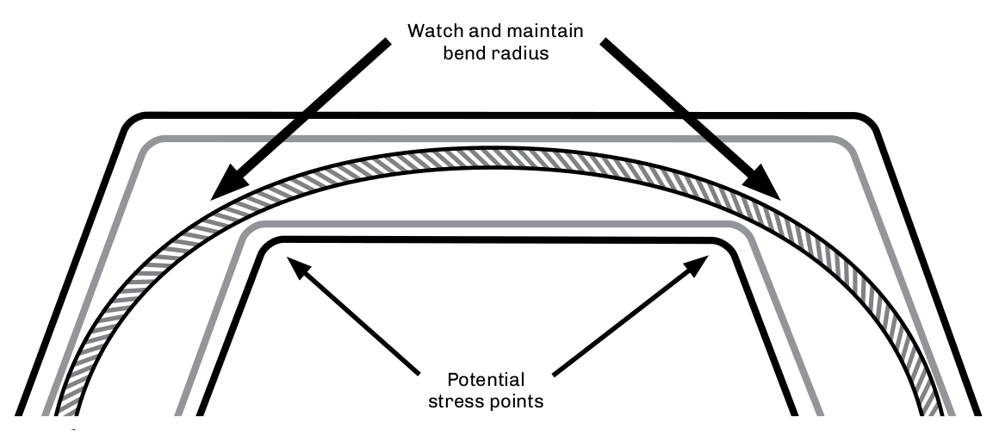

== Cable Tray Types

Cable trays located above racks and cabinets are often installed into buildings to assist with the routing and protection of communication cables. Additional protection often uses interlocking armor cable, innerduct, or Maxcell. Common types of trays include ladder, spine, and mesh trays.

Always plan transitions, elevation changes, and corners early. The process of installing or using small sections of innerduct will provide cable protection at intersections, transition points, and elevation points.

When pulling fiber optic cable through innerduct, be sure that the duct is securely fastened to the tray and the cables secured at corners. Observe proper cable bend radius. Make sure cable ties are fastened loosely to prevent microbends in the cable.

It is important to ensure that both the fiber optic cable and the innerduct meet applicable building codes.

.Ladder & Spine type tray.
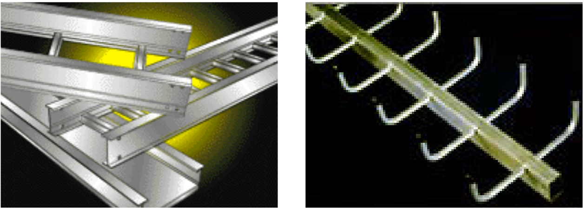
.Mesh type trays.
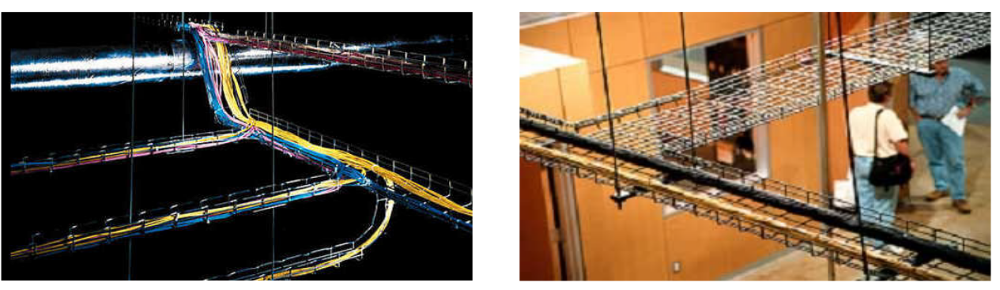

== Cable Installation Products

A variety of equipment and tools are necessary when installing cable for duct or aerial applications. Some tools —  such as pulling eyes and swivels —  are used for both applications. Other tools and equipment may be manufactured for a specific type of installations, i.e., OPGW for utilities. The following commonhardware elements are for fiber optic cable installation in aerial and ducted networks.

`Air flow spoiler`: Used to reduce galloping, thereby protecting cables and hardware.

`Blowers`: Several types exist, including those used for strictly air blown (HASB, ABF), tractor feed assisted, and pull assisted.

`Clevis`: A clevis is a U-shaped adapter that allows a swivel, pulling eye, or other apparatus to be attached via a lever, pin, or hook. Many variations exist for ducted and aerial installations, including permanent attachments, such as a Clevis thimble for pole attachments.

`Dart blowers`: Designed for blowing in darts up to 2,000 feet (610 meters) using compressed air at various pressures. A variety of accessories are available depending upon the application and need. Foam carriers are designed for short runs with multiple bends. Inflatable versions are made of nylon, and can expand or contract depending on the duct's inside diameter. Duct projectiles are made of rubber and used in long runs. Can be pulled back.

`Dead end assembly`: Secures the conductor at the pole or tower location. Size is dependent on cable O.D.

.Dead End Assembly.
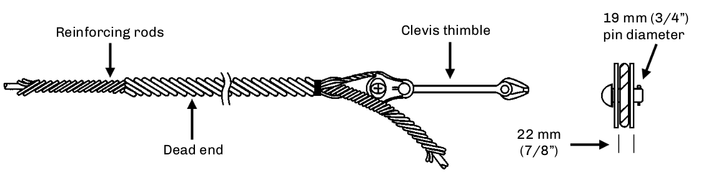

`Download cushion`: This device is mounted on poles and used to bring cable to splice locations.

`Duct plugs`: Designed to seal unused or occupied ducts from contamination, rodents, and flooding. Types available include single cable, multiple cable, single, and multiple duct. Most use compression techniques for sealing and are reusable.

`Duct rodders`: Ducts should be proofed prior to installation to ensure that the cables or innerducts can be successfully installed. Duct rodders are designed for strength, flexibility, fatigue resistance, and durability. Most come with attachments (e.g., harness, swivel, tapered head) and accessories (e.g., shackle head, roller guide), depending upon the application.

`Duct swabs`: Used for cleaning ducts and for spreading pulling lubricants inside ducts.

`Dynamometer`: A device mounted onto the pulling line allowing the operator to visually monitor the actual pulling line tension. Should the cable break, the instrument should show at what tension level the break occurred. The dynamometer should have two mechanisms for measurements. One should show the actual tension being monitored, and the second should show the highest tension monitored on the pull.

== Cable Installation Products - _continued_

`Innerduct couplings`: Designed to attach and seal two innerducts together. Available in internal and external versions.

.Kellems Grip.
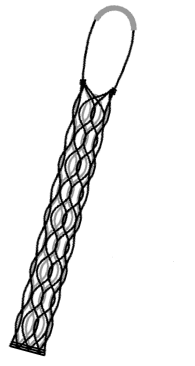

`Kellems grips`: These are made of a wire, aramid or synthetic mesh that is placed around the cable to be installed. The grip is used to connect to the cable to be pulled into place, often in conjunction with pulling eyes, clevis, and swivels. The grip should provide a
double mesh weave for positive pulling power. Also known as pulling grips.

`Lashing machine`: A machine that can helically wrap a lashing wire around the Kellems grips messenger wire and optical cable. The lashing machine can be manual or remote controlled. The cable can be mounted onto the machine or along the path of the aerial route. The lashing machine should have a friction clutch to avoid overspin in the case of sudden stops or slowdowns. The machine should be light enough to be able to be routed around obstacles easily. Remote controlled tugs may be used where access is impossible with standard methods.
Water crossings, mountainous or wooded terrain would apply.

`Lashing wire`: The technique of lashing a cable requires a messenger 5/16” or 3/8” galvanized steel (non-electrolysis), used for supporting the cable by the use of 0.045 stainless steel lashing wire or the use of nonconductive multi-strand (70 lb. Aramid filament or monofilament) types. These types are generally much lighter and stronger than the metallic types; however, problems with clamping, stability and unraveling
have occurred with their use.

`Messenger wire`: Used for mounting the cable to be lashed onto, the messenger gives the mechanical strength for the new cable. The messenger cable usually consists of a galvanized wire ranging from 1/4” to 9/16”. Unusual loading conditions may require the use of larger messenger wires.

`Phase-to-ground transition hardware`: At tower or pole locations high voltage phase conductors must pass from phase to ground potential. To accomplish this, hardware designed for this may be required. This equipment should be nontracking conduit. A grounding strap and wire should be attached.

`Poly line`: Used to attach for blowing in projectiles and then pulling back ropes.

`Pulling eyes (PVC and PE)`: onsisting of a pulling eye and eye sleeves, these devices are designed to screw into ducts and innerducts to assist with pulling. The eye sleeves are placed on the outside of the duct/innerduct, versus inside for the pulling eye. Variations include with swivel or clevis; also available in crimp-on style.

`Pulling harnesses`: Designed to attach to clevis attachments and pulling eyes, the harnesses are available at various counts and with staggered lengths to prevent the units from bunching.

`Pulling rope`: Made of polypropylene, a general-purpose rope designed for pulling in cables by hand. Used in the pulling process with lashing machines and innerduct installations. The rope or pulling tape used should exceed the maximum strength of the cable.

`Pulling tape`: A flat woven alternative to pulling rope for use with hand or machine pulling. There are versions made of polyester that are designed for pulling in optical cables and also feature sequential markings to assist in distance measurements. Also known as measuring tape.

`Rollers`: Hung periodically along the messenger wire to allow the cable to be routed properly. 

== Cable Installation Products - _continued_

`Slug`: Designed for spreading pulling lubricants in tight radius turns.

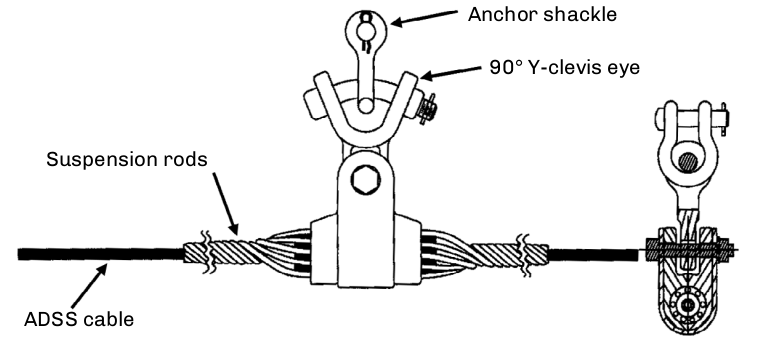

`Suspension clamp`: Used for support and protection of overhead cables. It is designed to reduce static and dynamic stresses at the support point. The cable is clamped in an elastomeric insert and then clamped to the cable.

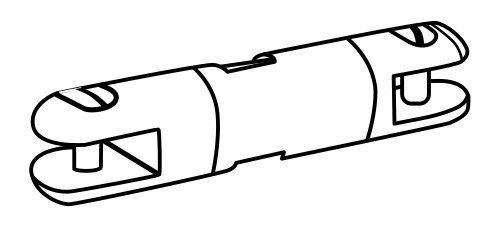

`Swivels`: Eliminate winding and tangling of cables during installations. Breakaway swivels are designed to break when the tension strength exceeds the rating. The breakaway is actually a replaceable pin. These swivels are available with different breaking tensions. Match to the cable manufacturer’s “under load” tension rating. Breakaway swivels are not used in aerial plant.Swivel

`Tug`: Used for pulling the lashing machine along the cable or messenger wire. Remote controlled tugs are available for use in inaccessible areas such as gorges, wooded terrain, mountainous and water crossings.

`Vibration suppressors`: Because of the light weight of the optical cable, vibration suppressors may be required to dampen the wind, ice or snow induced effects. Can be dependent on terrain.

`Winch line blowers`: Designed for blowing winch line up to 1600 feet (500 meters) into a duct, eliminating the step of blowing in a pull string and backpulling in a line. Using compressed air, the blowers also have a variety of accessories to accommodate various duct sizes and applications.