:doctype: book
:title-page-background-image: image:CongruexLogo.png[]

= Chapter 9 - *_OSP Installation_*

== Underground Installation Techniques

.Underground installation.
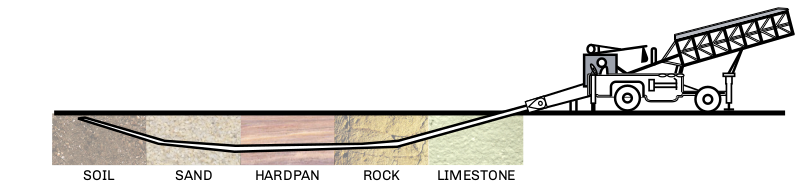
[grid='none',frame='none']
|===
|*Trenching* |*Plowing* 
a|
* Concrete encase*ment +
* Duct/innerduct.
a|
* Pressurized cable installation +
.. High air speed blown +
* Duct/innerduct. +
* Plowcon.
|*Boring*
|
a|
* Duct/innerduct.|
|===

=== Above-ground Markers

Permanent above-ground markers should be placed at line-of-sight intervals to make the cable route clearly visible. Each marker should be visible from each adjacent marker but separated by no more than 300 meters (1,000 feet). Markers are usually placed at right-of-way boundaries and at locations of public access to the cable right-of-way such as utility or vehicular crossings.

[TIP]
Remember! Call to locate underground utilities. 

=== Damage Prevention Laws 

Most states have damage prevention laws intended to promote safe work conditions and reduce the possibility of cable damage. These laws include the responsibilities of excavators and the facility owners.

In 2005, the FCC approved 811 as a national _call before you dig_ hotline. Calling the number will connect you with one of 62 national call centers, which will request the location of your intended work site and direct that information to affected local utility companies. Within a few days, a locator from the utility will visit your job site and mark the location of any underground utility lines, free of charge. For more information, visit www.call811.com or www.commongroundalliance.com.

== Proper Route Planning and Engineering

Provided by the outside plant engineer and construction supervisor, the route survey involves the planning and preparation required for a smooth installation.

=== Route Survey

. What are the environmental issues?
. Designate points of access for right-of-ways (ROW).
. Identify all conflicts and obstructions.
. Identify power requirements for repeaters.
. Identify installation location and method.
. Identify repeater locations.
. Are seasonal considerations involved?
. Will sub-surface investigation be necessary?
. Designate construction methods suitable for soil conditions.
. Designate the depth of burial.
. Identify cable structure (use of Plowcon or direct buried with armored cable).
. Identify splice locations.
. Develop a placement plan for cable reels.
. Plan for future locations.

.Dig Location.
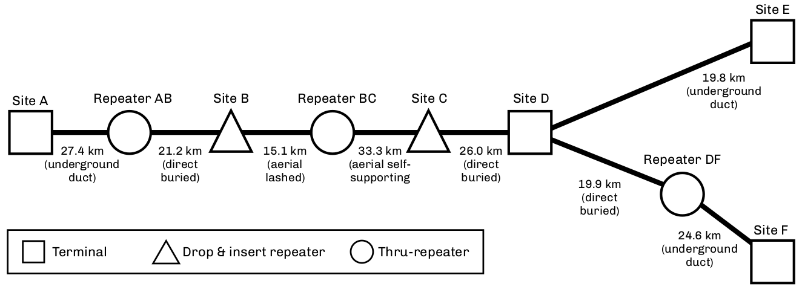

Key long term requirements when planning an installation:

* Environmental impact statements and permits will require months to years and must be addressed earlyin the design and planning stages.

* Right of ways (R.O.W.) and physical access for the installation and future maintenance should beconsidered along with any land purchase or easements.

* Scheduling the installation can also be determined by weather conditions and special regional events that will effect traffic conditions.

== Cable Trenching

.Cable Trenching (left) & Encasement example (right).
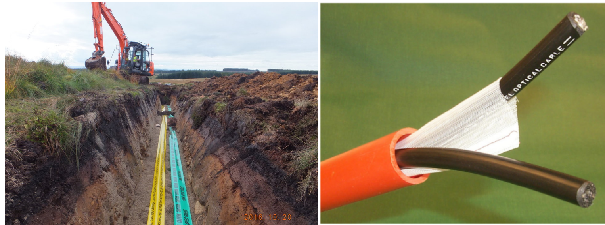

One method to to install fiber optic cable underground is through trenching. Trenches can be dug either manually or with a machine. While trenching is slower than plowing, it allows for a more controlled cable installation, during which the possibility of damage to the cables is minimized.

When dug, the trenches should be kept as straight as possible and the bottoms should remain level. Backfill can
be used to even out the cable load. However, rocks should be removed prior to backfilling. Where the ground has little soil,
a select fill should be added to protect the cable from large or sharp rocks. The use of plowable conduit adds additional
protection.

=== Encasement

Another method to install and protect fiber optic cable in trenches is by encasing armored cable or cable duct inside concrete. The cement is laid into the bottom of the trench and the cable is placed on top and  then covered again with cement. This method offers extra physical protection from backhoes and augurs,but is more expensive than conventional cable placing techniques.

.Encasement diagram.
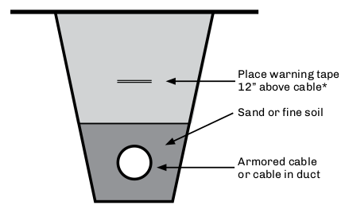

=== Duct, Innerduct, and Maxcell

Underground fiber installations often are accomplished using ducts, innerducts or microducts. Not only do these protect the cable and simplify future expansions, their interiors are usually corrugated to ease pulling tension on the cable. They can be purchased with pulling tape or lubricant already inside, which can significantly decrease installation time. Maxcell is a multicell flexible innerduct that can increase utilization of innerduct space. Just as with fiber, there is a minimum bend radius that must be observed during installation.

[Warning] 
Tape should not deviate more than ±18 inches (450 mm) from the center line of the optical cable (TIA/EIA-590). Tape should be orange and at least 2_ wide.

== Direct Buried

The successful installation of direct buried fiber optic cable depends upon the attention to details of planning and engineering the route properly. The ability of construction crews to compensate in the field for faulty engineering or inadequate preparation is severely limited. With proper time and organization, the installation of fiber optic cables should be uneventful.

TIA-590 _Standard for Physical Location and Protection of Below-ground Fiber Optic Cable Plant_ recommends permanent above-ground markers every 305 meters (1,000 feet) and/or warning tape 12" above the cable.

.Below ground construction and installation.
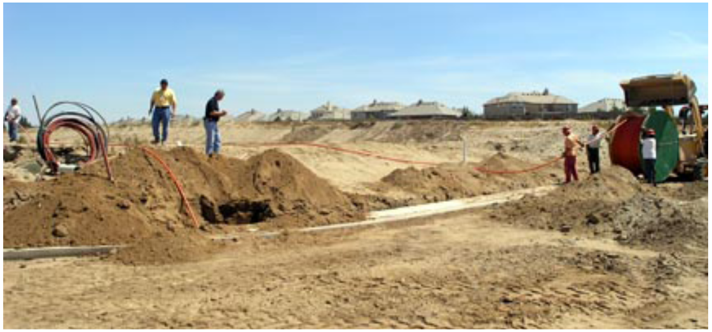

.Depth Burial 
|===
^|*Facility* ^|*Minimum cover*
^|Toll, trunk cable ^|750 mm (30”)
^|Feeder, distribution cable ^|600 mm (24”)
^|Service/drop lines ^|450 mm (18”)
^|Underground conduit* ^|750 mm (30”)
|===

*Separations from Foreign Structures* **

* Electric light, power, or other conduits:
.. 75 mm (3”) of concrete.
.. 100 mm (4”) of masonry.
.. 300 mm (12”) of earth.

* Other foreign services: gas, water, oil, etc.:
.. 300 mm (12”) from transmission pipelines
.. 150 mm (6”) from local distribution pipelines

== Plowing

.Charles Machine.
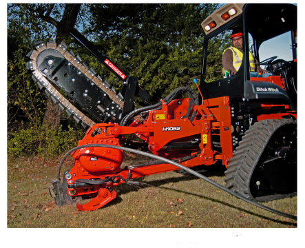

Direct plowing is a trenchless installation method in which tractors (or plows) are used to rip the ground and install a duct in which fiber cable can be installed. The duct may have the fiber optic cable pre- installed, or the cable may be installed at a later time using standard pulling or high air speed blown (HASB) technologies. In some cases, an armored optical cable is directly plowed into the ground with warning tape placed above it.

While direct plowing is fast, easy, and requires a minimum of post-installation work such as backfilling, cable tension is a concern and there is greater potential for cable damage. As the cable and its underground placement cannot be seen during the installation process, it is advised that conduit be used in order increase the chances of success.

As with all underground installations, utility lines or other installations must be located beforehand and the cable must be routed around these points. Installation also is limited to areas that are free of miscellaneous objects such as rocks or debris. Pre-ripping is recommended as this technique breaks up the soil and can also identify obstructions prior to installation of the cable or duct.

In the case of PlowCon, the cable is slit open and installed simultaneously.

* Trenchless.
* Duct is installed underground.
* The fiber cable can be installed during plowing, or at a later time.
* Fast and easy, with little post-installation work.
* High potential for cable damage.
* Use conduit to protect cable.

=== Vibratory Plowing

Vibratory plowing is very similar to direct plowing, except that cable from the payout reel is fed into a chute attached to a vibrating plow. The plow can be either isolated from the blade, reducing the amount of vibrations on the cable, or fixed, in which both the plow and chute vibrate.

== Directional Boring

.Boring.
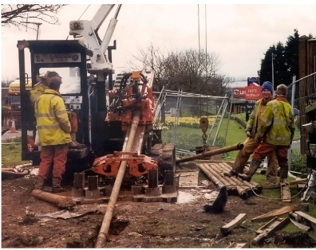

Boring, or horizontal directional drilling (HDD), is a trenchless method in which the installation is performed through a combination of tunneling, drilling, or ramming with a minimal amount of excavation, environmental disruption and minimal repair to roads and driveways. This method is commonly used in areas where other installation methods would be cost-inhibitive, such as near road crossings, railroad tracks,
or waterways.

After determining length, depth, and diameter, the process requires that bore pits be dug at the start of end of installation. It is critical to do accurate locates for bore pit, as these sites are normally where underground utilities are located. The size of the bore pit depends on the depth of burial and the amount of equipment needed. Shallow boring, used for FTTH installations, only requires that the cable be installed
at 18” depth (per the NEC and NESC), whereas most underground installations are 36 inches or greater.

During the boring process, a pilot hole is drilled to the desired location. Locating equipment is used to guide the drill head to the required location and to monitor the depth. The pilot hole is enlarged using a reamer until it reaches the desired size. The reamer is attached to the pipe and the final duct or pipe is attached and installed, as well as any necessary vaults or hand holes. The assembly is then pulled back toward the starting bore pit and the cable is installed.

* Trenchless method.
* Installation performed through a combination of tunneling, drilling, or ramming.
.. Minimal excavation.
* Commonly used where other methods would be cost-inhibitive.
.. Near road crossings, railroad tracks, or waterways.
* Bore pits required at both ends.
.. Bore pits are a cause of cable cuts.
* The bore can be guided or steered.

=== Common Boring Methods

* Pressurized water-assisted drilling heads.
* Replacement of older installations by pipe ramming, using pneumatics to ram newer pipe through,
bursting the old pipe in the process.
* HDD uses lightweight, steerable equipment to perform near-horizontal utility installations.
* Stitch boring uses pneumatic piercing tools that are propelled forward with compressed air to create
a small tunnel.

== Equipment Requirements

. Standard plowing equipment is generally suitable. However, modifications may be required to conform to the cable manufacturer’s bend radius specifications.

. The equipment used must be large enough to perform the job.
. A dynamometer should be used for measuring cable tension.
. Cable feed systems —  typically consisting of a reel carrier, rollers, or guide tubes, and a cable chute — must allow the cable to be placed while following the cable manufacturer’s product specifications for tension and minimum bend radius. The cable chute should have a removable gate to allow the cable to be inserted or removed at intermediate points.
. The reel carrier should accommodate one or more reels of adequate size and should insure easy and safe loading and unloading.
. Vibratory plows can also be used. It is best to use a configuration that isolates the feed chute from the vibration of the plow share.
. The maximum tension developed in a cable is directly proportional to the reel weight and occurs in situations that cause the reel to accelerate rapidly. These situations usually occur during startup speed changes, grade changes, and unexpected obstacles.
. When starting or finishing, a pit should be dug at each splice location. Sufficient cable (10+ meters) should be available to allow the splicers to work in splicing vehicles or tents. The excess cable should be coiled, secured, and buried with the spliced closure.
. An alternative is to have the splices in a surface closure or cross-connect box. In this method splices are easily accessible. A surplus length of cable is still recommended for working in splicing vehicles.

.Equipment.
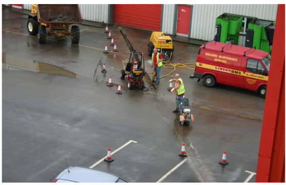

== Conduit and Duct Installation

=== Cable Duct Installation Procedures

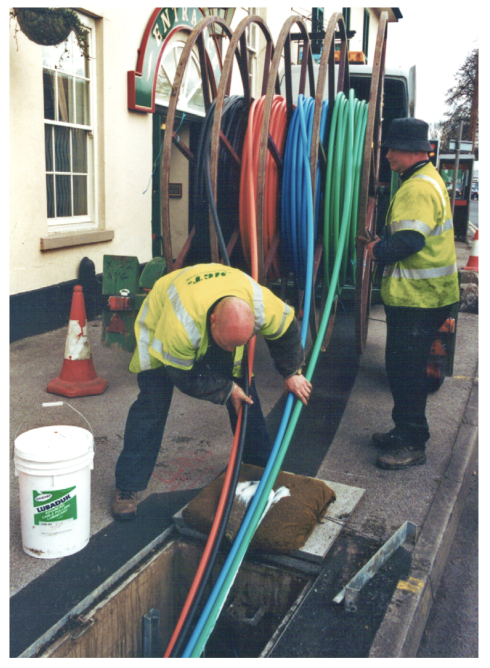

Fiber optic cables are usually pulled into 1” to 1-1/4” innerducts that have been placed into a 3” or 4” duct underground. The innerducts can be placed in lengths of up to 2 km and continue unbroken through several manholes or vaults. Long pulling lengths are desirable to eliminate the added attenuation caused by splicing. Longer pulling lengths are made possible by the small size and lighter weight of optical cables.

`Microducts` are small HDPE ducts that are designed to be placed in new or existing 3/4”– 2” ducts to be utilized by microcables. Duct sizes vary from 2.1 mm to 16 mm inside diameter and come with low-friction lining. They can be installed via jetting/blowing or pulling. The microcables can be installed using the same methods. Micro ducts come in a wide range of configurations, such as grouped, self-supporting, or locatable.

`Maxcell` is a flexible textile innerduct that ranges from 1 to 4 inches in diameter with an interior comprised of 1-3 distinct cells. The Maxcell conforms to the shape of the cable being pulled, allowing multiple cables to be placed into a single duct to maximize available space. It is prelubricated, easy to place, and can increase usable conduit space by 300%. A 5,300’ Maxcell reel weighing 250 pounds is equivalent to three separate innerduct reels weighing 3,000 pounds. Maxcell is offered in a variety of widths and reel put-ups
and is available as nondetectable or detectable, as well as in plenum or riser versions for inside buildings.

=== Planning:

* Calculate pulling tensions (expected pounds versus maximum cable rating).
.. Length of continuous pull.
.. Lubricant usage.
.. Cable sheath material.
.. Duct size.
.. Determine whether innerduct, micro duct, or Maxcell will be installed.
* For long lengths, use center pull methods.
.. Long pulls are desirable.
* Minimize pulls through elbows. A 90° elbow is equivalent to 200 meters (656 feet) of straight pulling.
* Don’t force cable around sharp corners.
* Don’t wrap cable around hands or wrist during handling.

[NOTE] 
====
* The NEC specifies a maximum fill ratio of 53%.

* Seal all ducts with duct plugs.

* Order ducts and innerducts with pulling line pre-installed.

* Innerduct stretches under tension.
====

== Microducts for Fiber Optic Cables

Microducts are small HDPE ducts, up to 16 mm in diameter, that can be installed into empty or partially-occupied ducts. They feature sequential markings on the outside and can be armored to provide greater rodent protection and ruggedness. They are available in stranded and unitube designs to offer flexibility to planners and users. They are designed to accommodate single microduct cables containing up to 432 optical fibers. The cable can be blown into the microduct or pulled in using conventional techniques.

Microducts are used in both the inside and outside plant portions of the network. There are locatable versions for direct buried installations such as FTTx, and plenum and riser styles for multiple dwelling unit installations. An aerial drop version that features a built-in messenger is also available.
A wide variety of accessories are available for use with microducts:

* Microduct couplers for splicing sections together.
* End caps for sealing used microducts.
* Pulling lines and harnesses.
* Mounting hardware.
* Sealing kits.
* Installation and preparation tools (straight and round cutters).
* Branching units and reduction couplers.
* Innerduct eyes, which increase efficiency during pulling installation.
* Shuttles are available in different configurations for the installation of pulling tapes and ropes.

Typically, a microduct’s bend radius is 20 times outside diameter (OD) during installation and 10 times
OD during operation. Tensile ratings vary, from 300 pounds and upwards depending on the size, structure,
and manufacturer.

.Microducts.
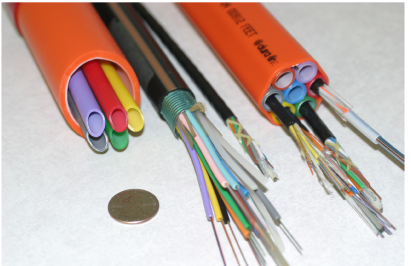

* Small ducts that can be installed inside empty or partially-occupied ducts.
* Can contain up to 432 optical fibers.
* Can be armored for greater rodent protection and ruggedness.
* Stranded and unitube microduct cable designs.
* 300-pound maximum installation tension.

== Cable Pulling Methods

.Center Pulling for Long Distance.
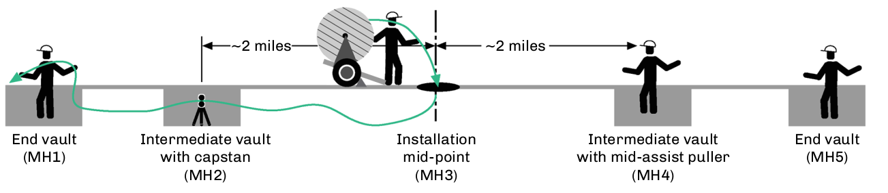

. Pull longest section (4,000 feet) into assigned duct from MH3 to MH1. For long pulls, use a mid-point (MH3), if needed, to evenly distribute the pulling length and tension.

. Remove remainder of cable from shipping reel and lay into Figure 8 loops (at MH3). Be sure that loops are laid carefully one upon another and are protected from vehicular and personnel traffic. This cable now can be pulled back into the opposite duct to MH4 and MH5.

. Feed the cable end into the conduit and continue pulling. Good communication among the installers is necessary to ensure that no damage occurs.

. For extremely long pulls, remove the cable at a manhole further down the route, and Figure 8 or zigzag it while pulling equipment is moved to the next manhole site.

.Install End.
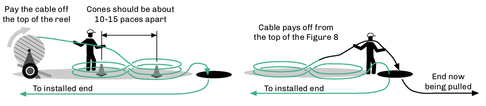

[NOTE]
====
* For long lengths, use center pull methods.
* Long pulls are desirable.
* Minimize pulls through elbows. A 90° elbow is equivalent to 200 meters (656 feet) of straight pulling.
* Do not force cable around sharp corners.
* Do not force or tug the cable during manual installations.
* Do not wrap cable around hands or wrist during handling.
* Seal all ducts with duct plugs.
* Order ducts and innerducts with pulling line pre-installed.
* Innerduct stretches under tension.
====

== Cable Pulling Lubricants

In ducted installations, lubricants are used to reduce the friction between the wall of the innerduct and the cable’s jacket. Fiber optic lubricants are designed for maximum tension reduction and reduce friction better than conventional lubricants. For most long or high-friction installations, pulling lubrication will be needed. These lubricants are usually water-based materials with soluble high polymers that make them slippery.

Some contain silicone oils or microspheres that act like tiny ball bearings to reduce friction. For long pulls, it is important that the lubricant completely coats the cable jacket and stays on the cable throughout the length of the run.

When choosing a lubricant, remember that it must be compatible with the cable jacket, duct materials, and installation method, and must be rated for the ambient temperature during installation. Some cable manufacturers maintain lists of appropriate lubricants for use with their cable’s jacket. Lubricant manufacturers provide application equipment ranging from hand pumps, T-style applicators, and various styles of lubrication saddles to make the job clean, easy, and efficient for the installer.

.Lubricants.
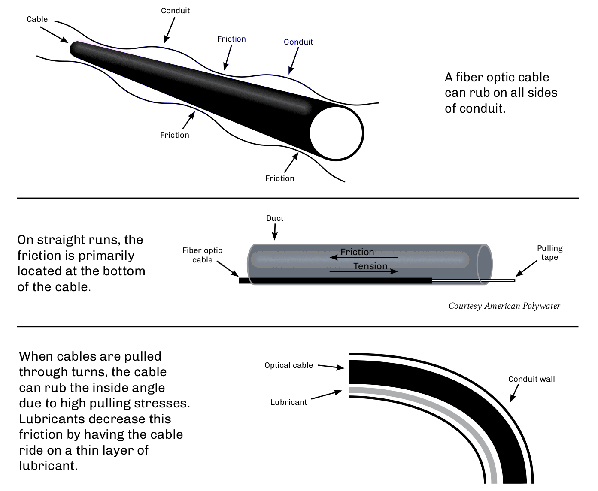

== Tension Monitoring

When mechanical pulling equipment is used, the risk of exceeding the manufacturer’s maximum rated tension levels is increased. It is recommended that all cables be monitored to prevent exceeding the manufacturer’s tension rating in order to minimize potential damage to the fiber optic cable and its internal fibers. Most outdoor cables are rated with a maximum tension level of 600 pounds. Microduct and FTTx
drop cables are rated at 300 pounds. All-dielectric self-supporting (ADSS) cables are designed for long spans and can have tension levels of thousands of pounds.

=== Equipment

* Dynamometer.
* Strain gauge.
* Tensiometer.

These devices are placed at the pulling end of the installation to allow continual monitoring of the pulling tension by the operator.

During the engineering study, a calculated tension number may be assigned for each section to be installed. The use of a monitoring device can provide on-site comparisons with the projected tension levels.

The dynamometer is the most predominant of the strain measurement devices. This device should have two indicators: A black indicator to measure the tension as it occurs, and a red indicator to maintain the maximum tension obtained during the pull.

The dynamometer should be compatible with the various types of pull ropes, tapes, aramid, etc., that are used for the installations.

Occasional calibration may be required as a dynamometer is a precision instrument.

.Dynamometer.
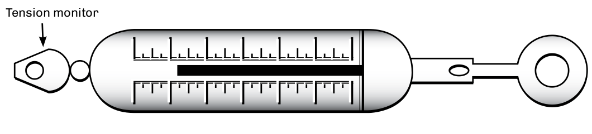

Even with proper tension during an installation, it is recommended that the first three meters of cable be discarded due to possible damage.

* Most outdoor cables are rated with a maximum tension of 600 pounds.
* Microduct and FTTx drop cables are rated at 300 pounds.
* Tension devices allow continual monitoring of the pulling tension.
* To prevent damage, do not exceed the manufacturer’s tension rating.

== High Air Speed Blown

The high air speed blown (HASB) installation technique was invented in 1986 by the Dutch PTT. This cable installation method differs from others in that it exclusively uses a low-strain pushing force combined with the high speed of compressed air flowing over the cable’s outer jacket in a duct or pipe to move the cable without the use of an air-capturing device at the cable-end. This dramatically reduces friction between the cable and duct, reducing the installation tensions.

The basis for the invention was the need to install small outside plant fiber optic cables in underground ducts. It has become the method of choice for both urban and long-haul installations when job parameters will allow for its use.

To install an optical cable using HASB technology, a large capacity air compressor is set up at the blowing head location. The fiber optic cable passes through a set of hydraulic powered tracks that pushes the cable into the blowing head and into the duct system. High-pressure air enters the blowing head and is directed  coaxially along the cable into the duct, creating a high-velocity air stream that drags the cable through the duct. The drag forces are distributed along the entire length of the cable, eliminating the tensile forces concentrated at one end of the cable during conventional pulls. The distributed force on the cable is high enough to overcome friction and is so small that the cable can easily be stopped by holding it in one hand.

A hydraulic pusher is required to overcome the local resistance of the blowing head and its internal seals and does not push the cable through the duct. It also acts as the controlling device for starting, stopping, and regulating cable speed.

.High Air.
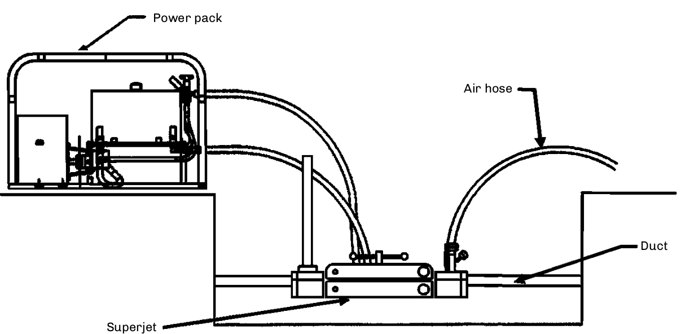

* Low-strain pushing force combined with high-speed compressed air.
* Reduces friction between cable and duct.
* Method of choice for urban and long-haul installations.
* Cables are installed virtually stress-free.
* 40% cost savings are common.

== Aerial Placement

Aerial placement of fiber optic cable is dependent upon the terrain, the application, and the benefits it offers. The immunity of fiber optics to electromagnetic interference (EMI) combined with its lighter weight and smaller size make optical cables an attractive alternative to use in aerial installations. With its lighter weight, optical cable can be used for longer spans and much greater lengths between splices.

Often, it is the most cost effective due to existing rights of way (ROW). For most telephony installations, concerns about ROW and high-voltage power lines do not necessarily apply. For utility applications, more detail is required because of the surrounding effects created by high-voltage power lines. Installation options include overlashing or self-supporting cable.

[NOTE]
====
Check with all construction, utility, and safety codes that may specify methods, practices, and requirements for the design, installation, and safety for aerial applications. The National Electric Safety Code (NESC), issued by ANSI, contains most of the requirements for aerial and underground installations.
====

.Aerial Placement.
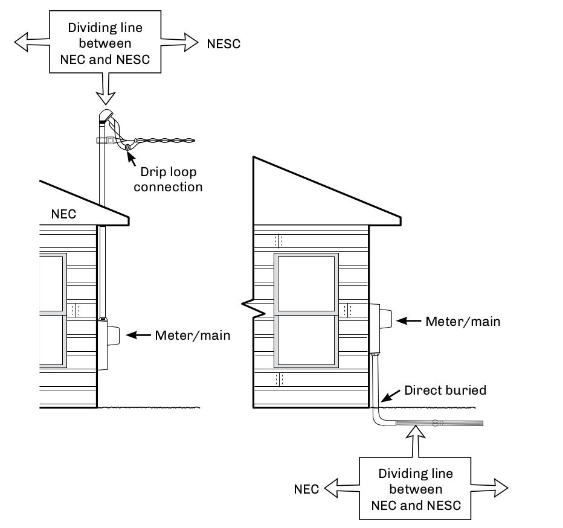

== Aerial Cable Types

[cols=2]
|===
|Loose tube | Cable overlashed to messenger | 
Figure 8 | With built-in messenger | 
ADSS | All-dielectric self-supporting | 
OPGW | Optical ground wire | 
Wrapped | Dielectric cable wrapped around existing neutral or phone conductors | 
|===

Aerial cables must be specifically designed to handle the environment over their life span. Wind and ice loading, pollution, UV radiation, thermal cycling, stress, and aging are a few considerations that must be addressed when selecting aerial cable. Several styles are available, varying based on intended placement, application, and environment.

.Loose Tube Overlashed to Messenger.
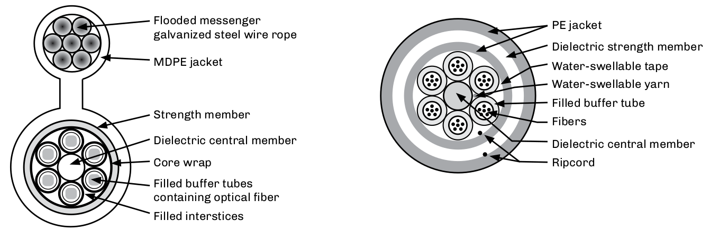

.All-dielectric Self-supporting (ADSS) (left) & Optical Ground Wire (OPGW) (right)
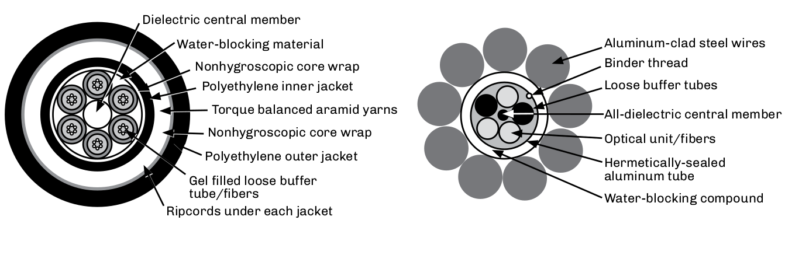

== Typical Pole Placement

.Pole Placement.
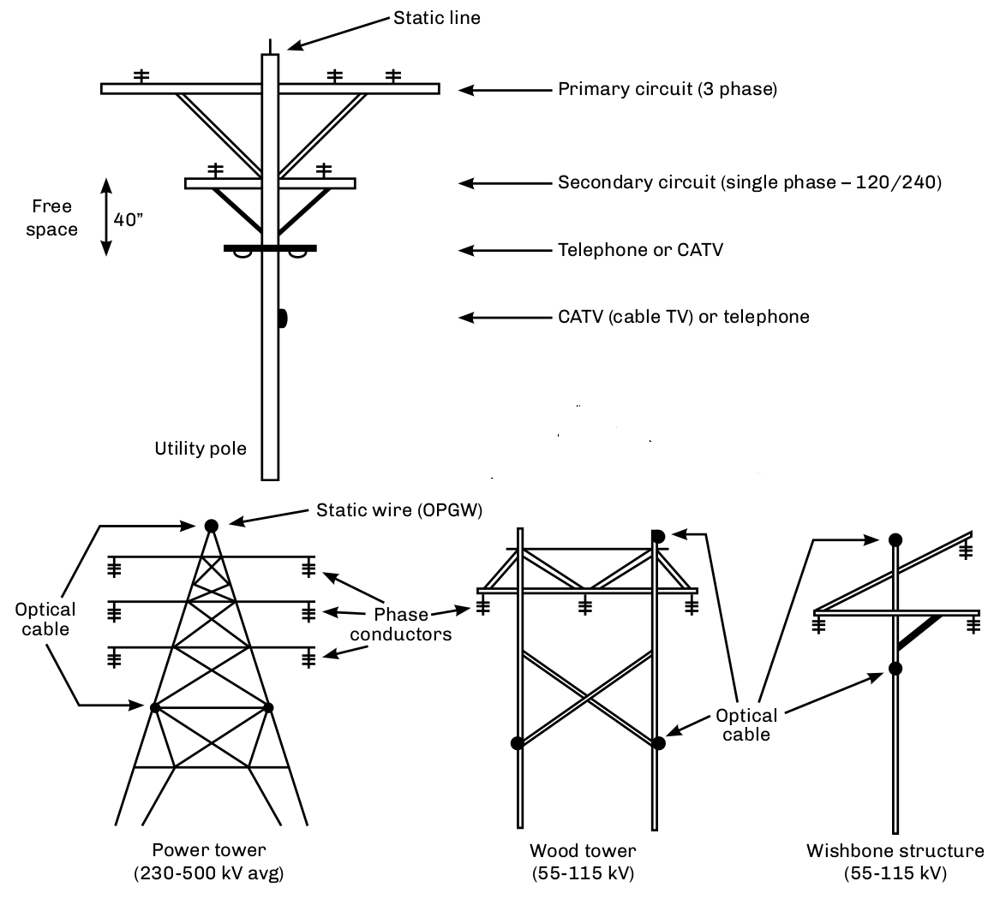

[NOTE]
Clearance from ground, water, roads, railroads and or other mediums must be considered. Check the ruling regulations for proper heights, clearances and other concerns.

=== Clearances

Section 23 of the National Electric Safety Code (NESC) describes vertical clearances over the ground, between conductors carried on diff erent supporting structures and required separation distance of the cable from bridges, buildings, and other structures. Local electrical codes and utility representatives may determine the actual amount of clearance between the broadband cable and power cabling.

The basic clearance rules are specifi ed at an air temperature of 60℉ (15.5℃ ). Th e typical clearance of the lowest cable over streets and roads carrying truck traffi c is 18’. In residential areas, the required clearance over driveways is 16’. Th e typical vertical clearance at a pole between power secondary conductors and the broadband cable is 40”. If such a placement leaves less than 30” clearance in the middle of the span, increase the pole clearance to provide the midspan clearance.

== Aerial Installation

.Aerial Installation.
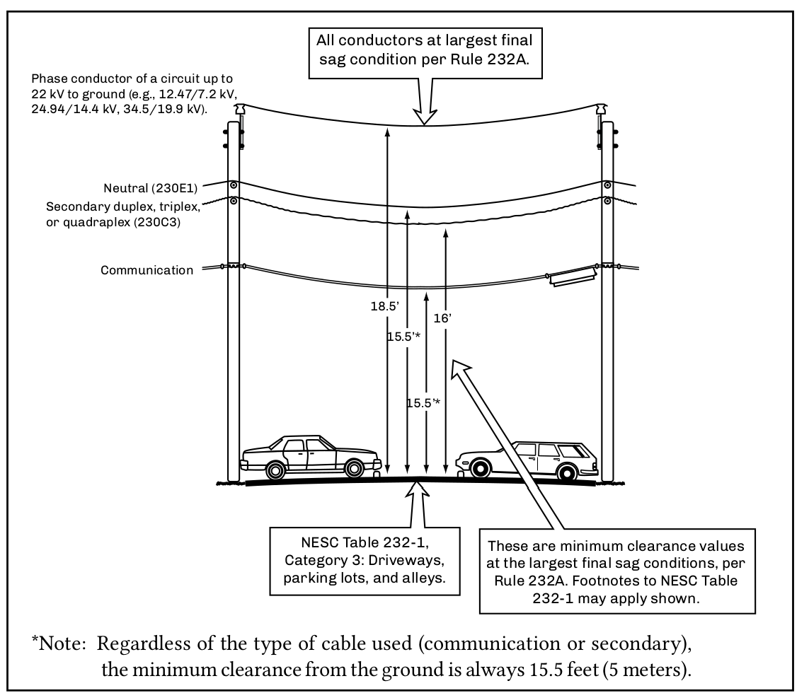

* Span length, tension and sag are directly related.
* You cannot change one without affecting the other.
* You must follow the NESC or any state or local requirements.
* Design and build for worst case scenarios.
* Restorations must match sag per the NESC.

== Proper Aerial Route Planning and Engineering

Provided by the outside plant engineer and construction supervisor, the route survey involves the planning and preparation required for a smooth installation.

=== Route Survey

. Identify splice locations. Assure that access is available to these points.
. Determine what environmental problems need to be addressed.
. Determine what wind and ice loading conditions will be present.
. Determine aerial installation method and location with regard to aerial poles and existing lines.
. Determine the maximum tension allowed for the poles or tower. By adjusting the sag, the load or tension on the towers can be increased or decreased.
. Determine whether any additional clearing will be required.
. Determine span distances and cable sag requirements. Check for ground clearance. Aesthetics within the cable configurations often require an equal sag for all conductors.
. Determine cable structure and fiber type. For areas that have hunting or squirrel problems, nondielectric cable may have to be specified.
. Identify any possible obstructions. Look for areas accessible to vehicles, tools, and test equipment. Clear pole space, easy entrance and exit, and public areas should be considered. Avoid intersections, trees,private property, and potential safety hazards.
. Determine whether cable will be lashed, strung, or self-supporting.
. Specify cable reel length and type requirements. Cable length shall coincide with the splice locations. Allow spare cable for splicing points. Excess cable can be coiled and lashed to the strand or placed in a storage cabinet or closure.
. Determine hardware requirements for placement method chosen. Check horizontal, vertical, or grade changes for appropriate hardware.
. Specify identification signs and warning markers.
. Plan for possible future expansions.
. Develop the route map from all of the above. The map should incorporate all deviations from vertical, horizontal, or grade changes, the locations of poles, splices, and storage areas for the optical cables, as well as grounding points and locations of areas not accessible by vehicles for installations. Cable distance information should also be included with measurements in both feet and meters.
. Review route survey and planning evaluation of total system design and requirements. This is to ensure item has been overlooked. Small mistakes can become major ones once the installation begins.

== Utility Applications of Fiber Optics

Two types of specialty fiber optic cables have been developed for use in rights-of-ways (ROW) and structures owned by utilities: optical power ground wire (OPGW), for the top of structures, and all-dielectric self-supporting (ADSS), for use at the lower positions on towers and poles.

.Utility Applications of Fiber Optics.
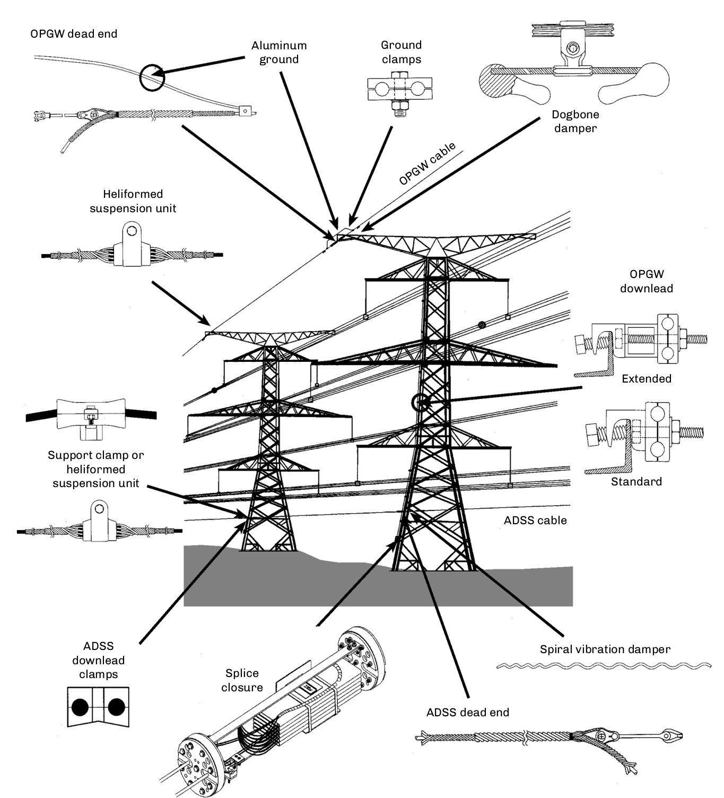

== Aerial Installation Methods

Self-supporting (Integral Messenger):

* Cost effective for new installations.
* Dielectric and nonconductive cable types.
* Long spans.
* ADSS, OPGW, Figure 8.

=== Lashing

* Cost effective for existing circuits.
* Dielectric and nondielectric lashing wire.
* Loose tube cables.

=== Wrapping

* Designed for wrapping around existing ground wire or phase conductors (up to 160 kV) of overhead power lines.
* Excellent option for retrofitting for existing installations.
* Easy to install using a radio-controlled spinning machine, which carries the reels of cable (up to 72 fibers). Double wrap technology allows for two cables to be installed.
* Jacket specially designed for utility use on aerial structures.

=== Aerial Ducts

* Adds additional mechanical protection.
* Used for short distances.
* Must be designed with proper UV-resistant materials.

[NOTE]

====
Aerial installations can be limited by:

* Sag limitations.
* Span length.
* Ground clearances.
* Visual impact.
====

== Comparison of Aerial Installation Techniques

|===
|*Lashed to Messenger* | *Self-supporting Cable*

|Similar to standard industry approved methods for 
installing normal hard wire system in aerial plant.
|Similar to standard industry approved methods for 
installing normal hard wire system in aerial plant.
a|
. *Framing of the poles*
.. Prepare the pole by hanging travelers,
drilling hardware holes, etc.
.. Install pulling lines over obstructions and
let the level required for final installation.
.. Set tension on all down-guys.
a|
. *Framing of the poles*.
.. Prepare the pole by hanging travelers,
drilling holes, hang hardware, etc.
.. Install pulling rope.
a|[start=2]
. *Install messenger wire*. +
a. Tension messenger cable for final sag. +
b. Reinstall pulling lines in travelers for next pull.
|
a|[start=3]
. *Install fiber optic cable*.
.. Pull in optical cable while following
manufacturer’s maximum tension and
minimum bend radius specifications.
.. When cable is soft sagged below the
messenger level, install dead-ends on
both ends leaving drip loops at points of
attachment on the poles.
.. Install optical cable to messenger using the
lashing method.
.. Install peanut clamps at points where
lashing must be terminated.
.. Remove travelers as lashing process is
performed.
a|[start=3]
. *Install fiber optic cable*.
.. Pull in the optical cable.
.. Dead-end one end (slack side) of the cable, tension to proper sag, recognizing that Kevlar^TM^ has a very minimal coefficient of change in sag tensions.
.. Allow drip loops in fiber at attachment points.
.. Remove travelers and attach cable to intermediate poles (clip-in).
a|[start=4]
. *Costs associated with installation*.
.. Labor dependent on area rates and
required crew size.
.. Messenger and typical hardware currently
$1,200 per mile.
a|[start=4]
. *Costs associated with installation*.
.. Labor dependent on area rates and
required crew size.
.. Hardware costs @ $300 per mile, or
considerably less than where separate
messengers are required.
a|

|===

[NOTE]
Generally labor rates for the installation of self-supporting cable will be 50% that of the messenger and lashing technique due to the fewer stages. Offsetting this savings is the higher cost (33%) of the self-supporting cable.

== Mid-span (Express) Entries

The need to enter a feeder or distribution cable at a mid-section creates a mechanical process that must be considered when designing and building fiber-based networks. Used extensively in metropolitan area networks, and ITS and FTTx installations, the use of the mid-entry site provides a physical add/drop location with great reliability while reducing costs.

=== Mid-span Entries in the Physical Plant

In many network designs, there are advantages to performing mid-entries to a cable to provide a cost- effective installation and future access. What would be required to perform this type of installation? What products and techniques would need to be specified?

.Mid Span.
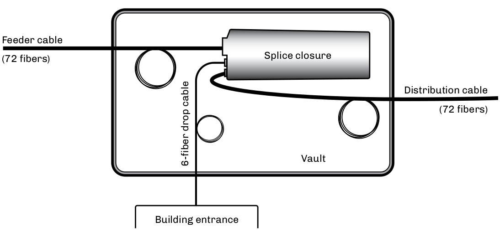

.Fiber and Buffer Color Codes (TIA-598 and IEC 60304).
image::media/tubeColor.png[500,500,align=center]

== Mid-span (Express) Entries - _continued_

=== Fiber Management in Mid-span Entries

A mid-span entry, also known as an express entry, is intended to minimize the amount of splices at the drop point. Using a cable with 72 fibers (six tubes of 12 fibers each), the cost of splicing all 72 fibers at each drop site would be cost prohibitive when only a few fibers are required. For this reason, only one tube needs to be entered and only the required fibers dropped to the desired location.

The technique of dropping only a few fibers from a cable structure allows the designer flexibility to minimize splices, minimize failures and reduce costs. In a ring architecture with self-healing capability, only four splices would be required instead of 72.

.Inline Splice Closure.
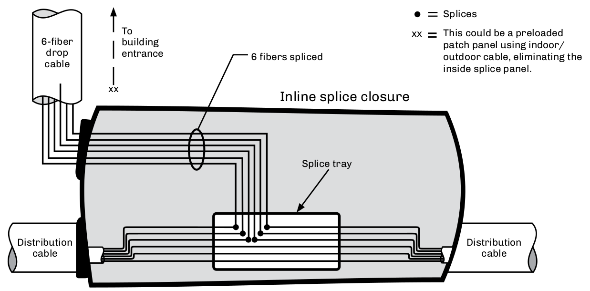

`Requirement`: Splice red tube/fibers (blue, orange, and green) to drop cable (outbound fibers blue, orange, and green) and splice (inbound fibers brown, slate, and white) from the drop cable to the red tube/fibers (blue, orange, and green) in the ring cable. Note that the slate and white fibers in the drop cables are dark (spare) for future use.

Proper and accurate fiber management is critical to network success. In this case, three fibers are accessed for a total of six splices of the 72 fi bers in the cable. Five of the tubes are still intact with little chance of damage if stored in the closure tray properly. In the opened red tube, only three fi bers are cut and the balance are stored in the splice tray.

[NOTE]
====
Cable slack (coils) should be documented in “as-built” drawings and documents. Attention should be paid to the splice closure to assure that a storage tray or basket is used for storing the excess buffer tubes.
====

== Slack Storage Methods

Designed for holding spare or excess cable, storage products allow for flexibility whether used inside building entrance sites or in OSP cable routes. Depending on the application, cable storage products can be aerial, below ground, or above ground. An average amount of slack to be stored is 50 feet, but this can vary depending on the application and space. In the advent of equipment relocation, spare cable can be pulled or stored in the cabinets or vaults. In restorations, retrievable slack can be pulled from storage panels and vaults. This provides time, labor and cost savings.

.Indoor Storage Cabinet.
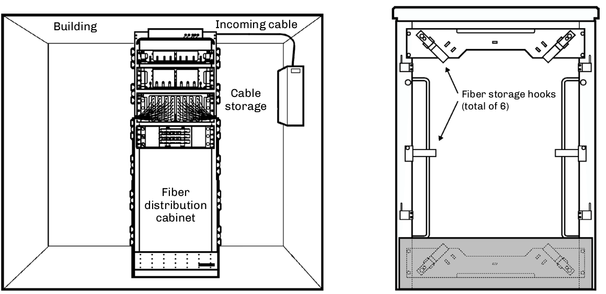

Cable storage allows users to address future adds, moves and changes by allocating spare cable. Common examples of cable storage include vaults, hand holes, below ground load-bearing pedestals, aerial snowshoes, and cable slack rings and cabinets for premises and entrance facilities. The amount of cable stored can depend on the application and the space available.

.Wall Mount Options.
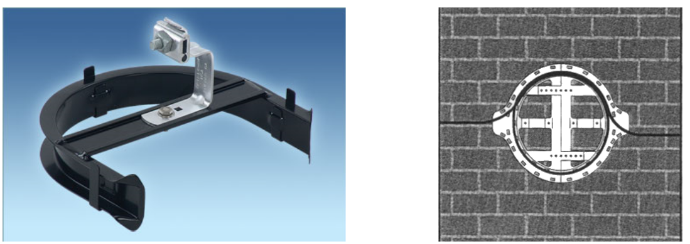

== Underground Cable Storage

The installer must maintain the minimum bend radius to ensure optimum integrity and performance of the optical cable. If the cable is conductive, the storage location may be used for bonding and grounding, as defined in applicable codes and standards. Cable labels should be used for quick identification. When storing slack cable the amount of slack should be noted on “as-built” documentation and sequential markings
identified for both inbound and outbound cables.

.Underground Pedastal.
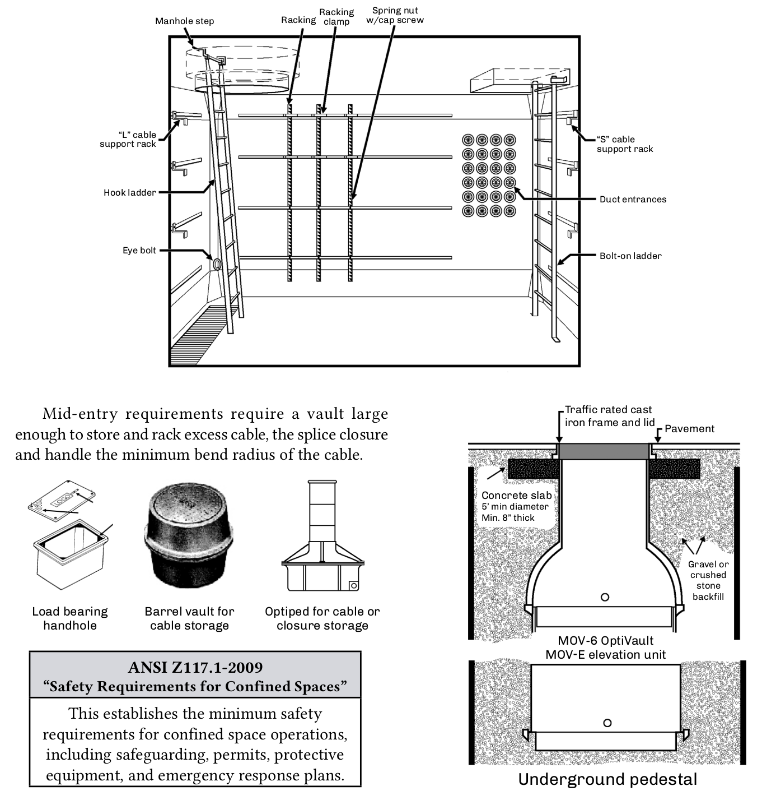

== Aerial Cable Storage Products

Snowshoes are a simple, low-cost, and aesthetic method for accessing and organizing retrievable cable slack. One snowshoe allows a 180-degree transition when using butt style splice closures. Two snowshoes allow for storing slack as needed. When located near poles, they also provide enough cable slack to allow splice closures, multiport service terminals, and CATV nodes to be lowered to splicing vehicles. They are
available in standard diameters of 16” and 24”, as well as a 7” mini version for FTTx drop cables to maintain the cable’s minimum bend radius. Pole and strand mount snowshoes are available in a split version for greater slack cable storage.

.Aerial Cable Storage.
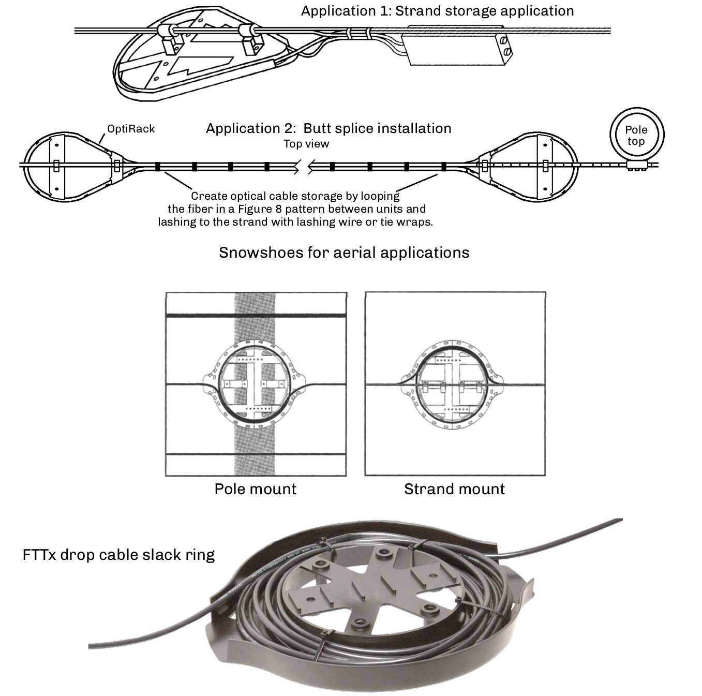

== Sequential Markings

The majority of cables have sequential markings in either footage or meters, which assist in the installation and maintenance of the cable. At slack and splice locations the sequential markings should be documented. This allows for “as-built” documentation to assist in actual cable lengths at fixed locations. At storage points both the incoming and outgoing markings always should be documented and at splice locations the inbound and outbound markings should be noted along with the markings at the inbound and outbound entrances to the storage location.

Complete and accurate system documentation including detailed drawings and troubleshooting procedures are absolutely essential to successful maintenance. Repair crews require route maps detailing actual footage markings of fiber cables to be able to quickly locate trouble spots. Using an OTDR to derive distance to a fiber break is pointless if the user cannot reconcile actual cable distance with geographical
distance and locations. Fiber slack within cables as well as cable slack stored in vaults for restoration must also be accounted for in system documentation.

To help manage the copious amounts of documentation required by even the simplest of fiber networks, specialized software packages have been developed to track of detailed maps, routing, splicing diagrams, reports and other maintenance information, including sequential markings. It can even interface with the network itself, monitoring system performance and locating faults. Even the documentation required for
multiple fiber routes from FTTH optical splitters and wavelength management in WDM systems can be performed to assist designers, as well as maintenance and restoration staff.

.Sequential Markings.
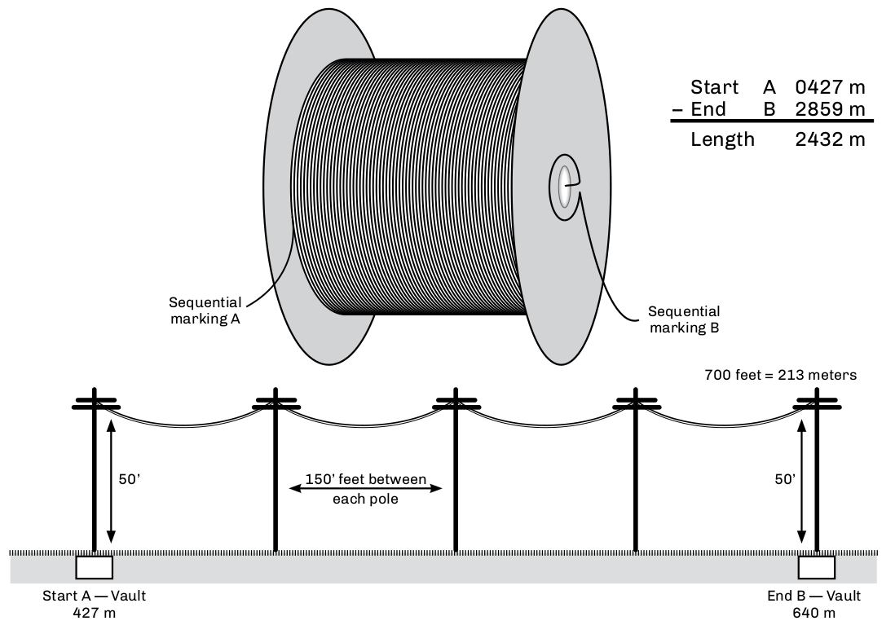